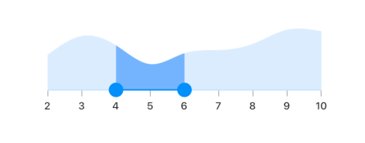
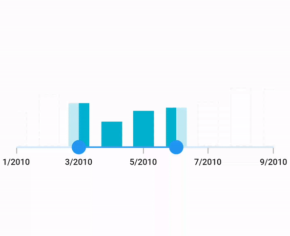
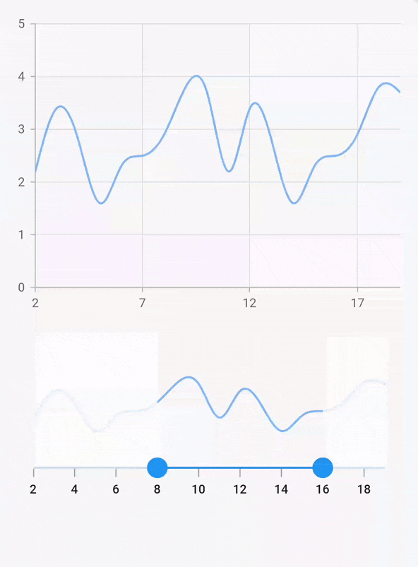
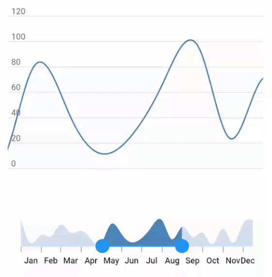

# Controller in Flutter Range Selector (SfRangeSelector)

You can use [`RangeController`](https://pub.dev/documentation/syncfusion_flutter_core/latest/core/RangeController-class.html) for setting and getting current selected values of range selector.

The `start` represents the currently selected start value of the range selector. The left thumb of the range selector was drawn corresponding to this value.

The `end` represents the currently selected end value of the range selector. The right thumb of the range selector was drawn corresponding to this value.

You can get previous values using `previousStart` and `previousEnd` properties.

The `start`, `end`, `previousStart`, `previousEnd` properties can be either `double` or `DateTime` based on whether it is date type [`SfRangeSelector`](https://help.syncfusion.com/flutter/range-selector/getting-started#set-date-range) or numeric [`SfRangeSelector`](https://help.syncfusion.com/flutter/range-selector/getting-started#set-numeric-range).

I> You need not to set the [`initialValues`](https://pub.dev/documentation/syncfusion_flutter_sliders/latest/sliders/SfRangeSelector/initialValues.html) property when using [`controller`](https://pub.dev/documentation/syncfusion_flutter_sliders/latest/sliders/SfRangeSelector/controller.html) property in the range selector.

N> You must import the [`Core`](https://pub.dev/packages/syncfusion_flutter_core) to use the range controller in the range selector.




final double _min = 2.0;
final double _max = 10.0;
SfRangeValues _values = SfRangeValues(4.0, 6.0);
RangeController _rangeController;

@override
void initState() {
   super.initState();
     _rangeController = RangeController(
     start: _values.start,
     end: _values.end);
}

@override
void dispose() {
   _rangeController.dispose();
   super.dispose();
}

final List<Data> chartData = <Data>[
    Data(x:2.0, y: 2.2),
    Data(x:3.0, y: 3.4),
    Data(x:4.0, y: 2.8),
    Data(x:5.0, y: 1.6),
    Data(x:6.0, y: 2.3),
    Data(x:7.0, y: 2.5),
    Data(x:8.0, y: 2.9),
    Data(x:9.0, y: 3.8),
    Data(x:10.0, y: 3.7),
];

@override
Widget build(BuildContext context) {
  return MaterialApp(
      home: Scaffold(
          body: Center(
              child: SfRangeSelector(
                    min: _min,
                    max: _max,
                    interval: 1,
                    showTicks: true,
                    showLabels: true,
                    controller: _rangeController,
                    child: Container(
                    height: 130,
                    child: SfCartesianChart(
                        margin: const EdgeInsets.all(0),
                        primaryXAxis: NumericAxis(minimum: _min,
                            maximum: _max,
                            isVisible: false),
                        primaryYAxis: NumericAxis(isVisible: false),
                        plotAreaBorderWidth: 0,
                        series: <SplineAreaSeries<Data, double>>[
                            SplineAreaSeries<Data, double>(
                                color: Color.fromARGB(255, 126, 184, 253),
                                dataSource: chartData,
                                    xValueMapper: (Data sales, int index) => sales.x,
                                    yValueMapper: (Data sales, int index) => sales.y)
                            ],
                        ),
                   ),
              ),
          )
      )
  );
}

class Data {
  Data({required this.x, required this.y});
  final double x;
  final double y;
}




## Selection with SfChart

We have provided built-in support for selecting the chart segments based on the selected range in range selector. To achieve this segment selection, you must set the `SelectionSettings.selectionController` property in the `SfCartesianChart.series` property.




SfRangeValues _values = SfRangeValues(DateTime(2010, 03, 01), DateTime(2010, 06, 01));
RangeController _rangeController;

@override
void initState() {
  super.initState();
    _rangeController = RangeController(
       start: _values.start,
       end: _values.end);
}

@override
void dispose() {
   _rangeController.dispose();
   super.dispose();
}

final List<Data> chartData = <Data>[
    Data(x: DateTime(2010, 01, 01), y: 2.2),
    Data(x: DateTime(2010, 02, 01), y: 3.4),
    Data(x: DateTime(2010, 03, 01), y: 2.8),
    Data(x: DateTime(2010, 04, 01), y: 1.6),
    Data(x: DateTime(2010, 05, 01), y: 2.3),
    Data(x: DateTime(2010, 06, 01), y: 2.5),
    Data(x: DateTime(2010, 07, 01), y: 2.9),
    Data(x: DateTime(2010, 08, 01), y: 3.8),
    Data(x: DateTime(2010, 09, 01), y: 3.7),
];

@override
Widget build(BuildContext context) {
  return Scaffold(
    body: Center(
      child: SfRangeSelector(
        min: DateTime(2010, 01, 01),
        max: DateTime(2010, 09, 01),
        interval: 2,
        dateIntervalType: DateIntervalType.months,
        dateFormat: DateFormat.yM(),
        showTicks: true,
        showLabels: true,
        controller: _rangeController,
        onChanged: (SfRangeValues values) {
          setState(() {});
        },
        child: SizedBox(
          height: 130,
          child: SfCartesianChart(
            margin: EdgeInsets.zero,
            primaryXAxis: DateTimeAxis(
              minimum: DateTime(2010, 01, 01),
              maximum: DateTime(2010, 09, 01),
              isVisible: false,
            ),
            primaryYAxis: const NumericAxis(isVisible: false),
            plotAreaBorderWidth: 0,
            plotAreaBackgroundColor: Colors.transparent,
            series: <ColumnSeries<Data, DateTime>>[
              ColumnSeries<Data, DateTime>(
                dataSource: chartData,
                selectionBehavior: SelectionBehavior(
                  selectionController: _rangeController,
                ),
                xValueMapper: (Data sales, int index) => sales.x,
                yValueMapper: (Data sales, int index) => sales.y,
                pointColorMapper: (Data sales, int index) {
                  if (sales.x.isAfter(_rangeController.start) &&
                      sales.x.isBefore(_rangeController.end)) {
                    return const Color.fromRGBO(0, 178, 206, 1);
                  }
                  return Colors.transparent;
                },
                color: const Color.fromRGBO(255, 255, 255, 0),
                dashArray: const <double>[5, 4],
                borderColor: const Color.fromRGBO(194, 194, 194, 1),
                animationDuration: 0,
                borderWidth: 1,
              ),
            ],
          ),
        ),
      ),
    ),
  );
}







class Data {
   Data({this.x, this.y});
   final DateTime x;
   final double y;
}




## Zooming with SfChart

We have provided built-in support for updating the visible range of the chart based on the selected range in range selector. To update the visible range, you must set the `primaryYAxis.rangeController` property in the [`SfCartesianChart`](https://pub.dev/documentation/syncfusion_flutter_charts/latest/charts/SfCartesianChart-class.html).




final double _min = 2.0;
final double _max = 19.0;
SfRangeValues _values = SfRangeValues(8.0, 16.0);
RangeController _rangeController;
SfCartesianChart splineChart;

@override
void initState() {
    super.initState();
    _rangeController = RangeController(start: _values.start, end: _values.end);
}

@override
void dispose() {
    _rangeController.dispose();
    super.dispose();
}

final List<Data> chartData = <Data>[
    Data(x: 2.0, y: 2.2),
    Data(x: 3.0, y: 3.4),
    Data(x: 4.0, y: 2.8),
    Data(x: 5.0, y: 1.6),
    Data(x: 6.0, y: 2.3),
    Data(x: 7.0, y: 2.5),
    Data(x: 8.0, y: 2.9),
    Data(x: 9.0, y: 3.8),
    Data(x: 10.0, y: 3.7),
    Data(x: 11.0, y: 2.2),
    Data(x: 12.0, y: 3.4),
    Data(x: 13.0, y: 2.8),
    Data(x: 14.0, y: 1.6),
    Data(x: 15.0, y: 2.3),
    Data(x: 16.0, y: 2.5),
    Data(x: 17.0, y: 2.9),
    Data(x: 18.0, y: 3.8),
    Data(x: 19.0, y: 3.7),
];

@override
Widget build(BuildContext context) {
    splineChart = SfCartesianChart(
      margin: const EdgeInsets.only(left: 10, right: 10, bottom: 20),
      primaryXAxis: NumericAxis(
          minimum: _min,
          maximum: _max,
          isVisible: true,
          rangeController: _rangeController),
      primaryYAxis: NumericAxis(isVisible: true),
      plotAreaBorderWidth: 0,
      series: <SplineSeries<Data, double>>[
        SplineSeries<Data, double>(
            color: Color.fromARGB(255, 126, 184, 253),
            dataSource: chartData,
            animationDuration: 0,
            xValueMapper: (Data sales, int index) => sales.x,
            yValueMapper: (Data sales, int index) => sales.y)
      ],
    );

    return Scaffold(
        body: Center(
          child: Padding(
            padding: EdgeInsets.only(left: 10, right: 10, top: 80),
            child: Column(
              children: <Widget>[
                Container(
                  child: splineChart,
                ),
                SfRangeSelector(
                  min: _min,
                  max: _max,
                  interval: 2,
                  showTicks: true,
                  showLabels: true,
                  controller: _rangeController,
                  child: Container(
                    height: 130,
                    child: SfCartesianChart(
                      margin: const EdgeInsets.all(0),
                      primaryXAxis: NumericAxis(
                          minimum: _min,
                          maximum: _max,
                          isVisible: false),
                      primaryYAxis: NumericAxis(isVisible: false),
                      plotAreaBorderWidth: 0,
                      series: <SplineSeries<Data, double>>[
                        SplineSeries<Data, double>(
                            color: Color.fromARGB(255, 126, 184, 253),
                            dataSource: chartData,
                            xValueMapper: (Data sales, int index) => sales.x,
                            yValueMapper: (Data sales, int index) => sales.y)
                      ],
                    ),
                  ),
                ),
              ],
            ),
          ),
       )
    );
}

class Data {
  Data({required this.x, required this.y});
  final double x;
  final double y;
}




## Deferred update

You can control when the dependent components are updated while thumbs are being dragged continuously. It can be achieved by setting the [`SfRangeSelector.enableDeferredUpdate`](https://pub.dev/documentation/syncfusion_flutter_sliders/latest/sliders/SfRangeSelector/enableDeferredUpdate.html) property and the delay in the update can be achieved by setting the [`SfRangeSelector.deferredUpdateDelay`](https://pub.dev/documentation/syncfusion_flutter_sliders/latest/sliders/SfRangeSelector/deferredUpdateDelay.html) property. The default value of the [`deferredUpdateDelay`](https://pub.dev/documentation/syncfusion_flutter_sliders/latest/sliders/SfRangeSelector/deferredUpdateDelay.html) property is `500 milliseconds`.

It updates the [`controller`](https://pub.dev/documentation/syncfusion_flutter_sliders/latest/sliders/SfRangeSelector/controller.html) start and end values and invoke the [`onChanged`](https://pub.dev/documentation/syncfusion_flutter_sliders/latest/sliders/SfRangeSelector/onChanged.html) callback when the thumb is dragged and held for the duration specified in the [`deferredUpdateDelay`](https://pub.dev/documentation/syncfusion_flutter_sliders/latest/sliders/SfRangeSelector/deferredUpdateDelay.html). However, range values are immediately updated in touch up action.




final DateTime min = DateTime(2000, 01, 01, 0), max = DateTime(2000, 12, 15);
RangeController rangeController;
SfCartesianChart splineAreaChart, splineChart;
List<Data> data;

@override
void initState() {
    super.initState();
    rangeController = RangeController(
      start: DateTime(2000, 04, 15),
      end: DateTime(2000, 07, 15),
    );

    data = <Data>[
      Data(x: DateTime(2000, 01, 01, 0), y: 100),
      Data(x: DateTime(2000, 01, 15), y: 10),
      Data(x: DateTime(2000, 02, 01), y: 40),
      Data(x: DateTime(2000, 02, 15), y: 34),
      Data(x: DateTime(2000, 03, 01), y: 80),
      Data(x: DateTime(2000, 03, 15), y: 49),
      Data(x: DateTime(2000, 04, 01), y: 56),
      Data(x: DateTime(2000, 04, 15), y: 26),
      Data(x: DateTime(2000, 05, 01), y: 8),
      Data(x: DateTime(2000, 05, 15), y: 80),
      Data(x: DateTime(2000, 06, 01), y: 42),
      Data(x: DateTime(2000, 06, 15), y: 12),
      Data(x: DateTime(2000, 07, 01), y: 28),
      Data(x: DateTime(2000, 07, 15), y: 68),
      Data(x: DateTime(2000, 08, 01), y: 94),
      Data(x: DateTime(2000, 08, 15), y: 24),
      Data(x: DateTime(2000, 09, 01), y: 72),
      Data(x: DateTime(2000, 09, 15), y: 32),
      Data(x: DateTime(2000, 10, 01), y: 48),
      Data(x: DateTime(2000, 10, 15), y: 4),
      Data(x: DateTime(2000, 11, 01), y: 64),
      Data(x: DateTime(2000, 11, 15), y: 10),
      Data(x: DateTime(2000, 12, 01), y: 85),
      Data(x: DateTime(2000, 12, 15), y: 96),
    ];

    splineAreaChart = SfCartesianChart(
      margin: const EdgeInsets.all(0),
      primaryXAxis: DateTimeAxis(isVisible: false, maximum: max),
      primaryYAxis: NumericAxis(isVisible: false),
      plotAreaBorderWidth: 0,
      series: <SplineAreaSeries<Data, DateTime>>[
        SplineAreaSeries<Data, DateTime>(
          dataSource: data,
          xValueMapper: (Data sales, int index) => sales.x,
          yValueMapper: (Data sales, int index) => sales.y,
        )
      ],
   );
}

@override
Widget build(BuildContext context) {
    splineChart = SfCartesianChart(
      plotAreaBorderWidth: 0,
      primaryXAxis: DateTimeAxis(
          isVisible: false,
          minimum: min,
          maximum: max,
          rangeController: rangeController),
      primaryYAxis: NumericAxis(
        labelPosition: ChartDataLabelPosition.inside,
        labelAlignment: LabelAlignment.end,
        majorTickLines: MajorTickLines(size: 0),
        axisLine: AxisLine(color: Colors.transparent),
      ),
      series: <SplineSeries<Data, DateTime>>[
        SplineSeries<Data, DateTime>(
          dataSource: data,
          animationDuration: 0,
          xValueMapper: (Data sales, int index) => sales.x,
          yValueMapper: (Data sales, int index) => sales.y,
        )
      ],
    );
    final Widget page = Container(
        margin: const EdgeInsets.all(0),
        padding: const EdgeInsets.all(0),
        child: Center(
          child: Column(
            children: <Widget>[
              Expanded(
                child: Container(
                    padding: const EdgeInsets.fromLTRB(5, 20, 15, 25),
                    child: splineChart),
              ),
              Container(
                margin: const EdgeInsets.all(0),
                padding: const EdgeInsets.all(0),
                child: Center(
                  child: Padding(
                    padding: const EdgeInsets.fromLTRB(14, 0, 15, 15),
                    child: SfRangeSelector(
                      min: min,
                      max: max,
                      interval: 1,
                      enableDeferredUpdate: true,
                      deferredUpdateDelay: 500,
                      labelPlacement: LabelPlacement.betweenTicks,
                      dateIntervalType: DateIntervalType.months,
                      controller: rangeController,
                      showTicks: true,
                      showLabels: true,
                      dragMode: SliderDragMode.both,
                      labelFormatterCallback:
                          (dynamic actualLabel, String formattedText) {
                        String label = DateFormat.MMM().format(actualLabel);
                        label = label;
                        return label;
                      },
                      onChanged: (SfRangeValues values) {},
                      child: Container(
                        child: splineAreaChart,
                        height: 75,
                        padding: const EdgeInsets.all(0),
                        margin: const EdgeInsets.all(0),
                      ),
                    ),
                  ),
                ),
              ),
            ],
          ),
        )
     );
    return Scaffold(
      body: Center(
        child: Container(height: 400, child: page),
      )
   );
}




