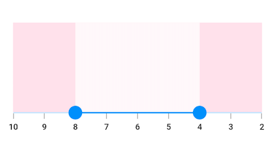

# Right to Left (RTL) in Flutter Range Selector (SfRangeSelector)

## RTL rendering ways

Right to left rendering can be achieved in the following ways:

### Wrapping the SfRangeSelector with Directionality widget

The range selector can be wrapped inside the [`Directionality`](https://api.flutter.dev/flutter/widgets/Directionality-class.html) widget and you can set the [`textDirection`](https://api.flutter.dev/flutter/widgets/Directionality/textDirection.html) property to `rtl`.




SfRangeValues _initialValues = SfRangeValues(4.0, 8.0);

@override
Widget build(BuildContext context) {
  return MaterialApp(
      home: Scaffold(
          body: Directionality(
            textDirection: TextDirection.rtl,
            child: Center(
              child: SfRangeSelector(
                min: 2.0,
                max: 10.0,
                interval: 1,
                showLabels: true,
                showTicks: true,
                initialValues: _initialValues,
                child: Container(
                    color: Colors.pink[200],
                    height: 150,
                 ),
              ),
            )
         ),
      )
  );
}




### Changing the locale to RTL languages

The range selector will render in right to left direction if the locale belongs to RTL languages such as Arabic, Persian, Hebrew, Pashto, and Urdu. This can be achieved by specifying the MaterialApp properties such as `localizationsDelegates`, `supportedLocales`, `locale` and adding the flutter_localizations package to your pubspec.yaml file.




dependencies:
  flutter_localizations:
    sdk: flutter







SfRangeValues _initialValues = SfRangeValues(4.0, 8.0);

@override
Widget build(BuildContext context) {
  return MaterialApp(
    localizationsDelegates: [
      GlobalMaterialLocalizations.delegate,
      GlobalWidgetsLocalizations.delegate,
    ],
    supportedLocales: [
      Locale("fa", "IR"),
    ],
    locale: Locale("fa", "IR"),
    home: Scaffold(
      backgroundColor: Colors.white,
      body: SfRangeSelector(
        min: 2.0,
        max: 10.0,
        interval: 1,
        showLabels: true,
        showTicks: true,
        initialValues: _initialValues,
        child: Container(
          color: Colors.pink[200],
          height: 150,
        ),
      ),
    ),
  );
}




