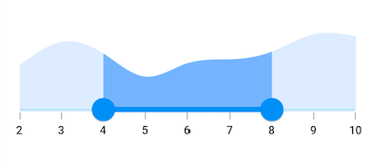
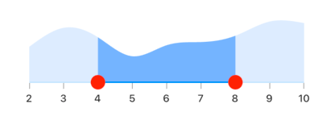
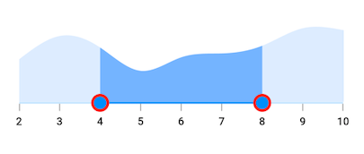
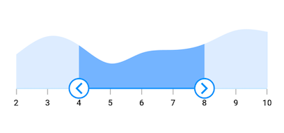
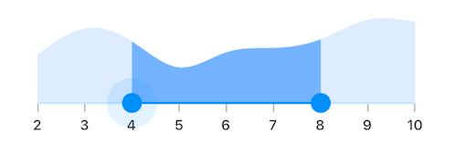
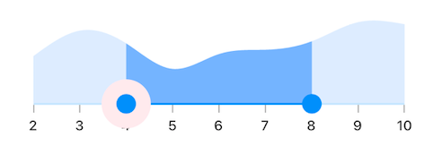
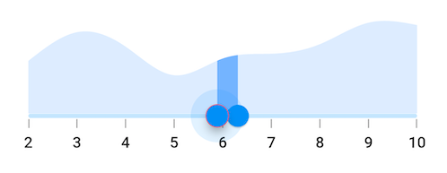

# Thumb and thumb overlay in Flutter Range Selector (SfRangeSelector)

This section helps to learn about how to customize the thumb and thumb overlay in the range selector.

* **Thumb** - It is one of the elements of range selector which can be used to drag and change the selected values of the range selector.
* **Thumb overlay** - It is rendered around the thumb while interacting with them.

## Thumb size

You can change the size of the thumb in the range selector using the [`thumbRadius`](https://pub.dev/documentation/syncfusion_flutter_core/latest/theme/SfRangeSelectorThemeData/thumbRadius.html) property.

N> You must import the `theme.dart` library from the [`Core`](https://pub.dev/packages/syncfusion_flutter_core) package to use [`SfRangeSelectorTheme`](https://pub.dev/documentation/syncfusion_flutter_core/latest/theme/SfRangeSelectorTheme-class.html).




final double _min = 2.0;
final double _max = 10.0;
SfRangeValues _values = SfRangeValues(4.0, 8.0);

final List<Data> chartData = <Data>[
    Data(x:2.0, y: 2.2),
    Data(x:3.0, y: 3.4),
    Data(x:4.0, y: 2.8),
    Data(x:5.0, y: 1.6),
    Data(x:6.0, y: 2.3),
    Data(x:7.0, y: 2.5),
    Data(x:8.0, y: 2.9),
    Data(x:9.0, y: 3.8),
    Data(x:10.0, y: 3.7),
];

@override
Widget build(BuildContext context) {
  return MaterialApp(
      home: Scaffold(
          body: Center(
              child: SfRangeSelectorTheme(
                    data: SfRangeSelectorThemeData(
                        thumbRadius: 13,
                    ),
                    child:  SfRangeSelector(
                        min: _min,
                        max: _max,
                        interval: 1,
                        showTicks: true,
                        showLabels: true,
                        initialValues: _values,
                        child: Container(
                        height: 130,
                        child: SfCartesianChart(
                            margin: const EdgeInsets.all(0),
                            primaryXAxis: NumericAxis(minimum: _min,
                                maximum: _max,
                                isVisible: false),
                            primaryYAxis: NumericAxis(isVisible: false),
                            plotAreaBorderWidth: 0,
                            series: <SplineAreaSeries<Data, double>>[
                                SplineAreaSeries<Data, double>(
                                    color: Color.fromARGB(255, 126, 184, 253),
                                        dataSource: chartData,
                                            xValueMapper: (Data sales, int index) => sales.x,
                                            yValueMapper: (Data sales, int index) => sales.y)
                                ],
                            ),
                        ),
                   ),
              ),
          )
      )
  );
}

class Data {
  Data({required this.x, required this.y});
  final double x;
  final double y;
}




## Thumb color

You can change the color of the thumb in the range selector using the [`thumbColor`](https://pub.dev/documentation/syncfusion_flutter_core/latest/theme/SfRangeSelectorThemeData/thumbColor.html) property.

N> You must import the `theme.dart` library from the [`Core`](https://pub.dev/packages/syncfusion_flutter_core) package to use [`SfRangeSelectorTheme`](https://pub.dev/documentation/syncfusion_flutter_core/latest/theme/SfRangeSelectorTheme-class.html).




final double _min = 2.0;
final double _max = 10.0;
SfRangeValues _values = SfRangeValues(4.0, 8.0);

final List<Data> chartData = <Data>[
    Data(x:2.0, y: 2.2),
    Data(x:3.0, y: 3.4),
    Data(x:4.0, y: 2.8),
    Data(x:5.0, y: 1.6),
    Data(x:6.0, y: 2.3),
    Data(x:7.0, y: 2.5),
    Data(x:8.0, y: 2.9),
    Data(x:9.0, y: 3.8),
    Data(x:10.0, y: 3.7),
];

@override
Widget build(BuildContext context) {
  return MaterialApp(
      home: Scaffold(
          body: Center(
              child: SfRangeSelectorTheme(
                    data: SfRangeSelectorThemeData(
                        thumbColor: Colors.red,
                    ),
                    child:  SfRangeSelector(
                        min: _min,
                        max: _max,
                        interval: 1,
                        showTicks: true,
                        showLabels: true,
                        initialValues: _values,
                        child: Container(
                        height: 130,
                        child: SfCartesianChart(
                            margin: const EdgeInsets.all(0),
                            primaryXAxis: NumericAxis(minimum: _min,
                                maximum: _max,
                                isVisible: false),
                            primaryYAxis: NumericAxis(isVisible: false),
                            plotAreaBorderWidth: 0,
                            series: <SplineAreaSeries<Data, double>>[
                                SplineAreaSeries<Data, double>(
                                    color: Color.fromARGB(255, 126, 184, 253),
                                        dataSource: chartData,
                                            xValueMapper: (Data sales, int index) => sales.x,
                                            yValueMapper: (Data sales, int index) => sales.y)
                                ],
                            ),
                        ),
                   ),
              ),
          )
      )
  );
}

class Data {
  Data({required this.x, required this.y});
  final double x;
  final double y;
}




## Thumb stroke width and stroke color

You can change the thumb stroke width using the [`thumbStrokeWidth`](https://pub.dev/documentation/syncfusion_flutter_core/latest/theme/SfRangeSelectorThemeData/thumbStrokeWidth.html) property and thumb stroke color using the [`thumbStrokeColor`](https://pub.dev/documentation/syncfusion_flutter_core/latest/theme/SfRangeSelectorThemeData/thumbStrokeColor.html) property.

N> You must import the `theme.dart` library from the [`Core`](https://pub.dev/packages/syncfusion_flutter_core) package to use [`SfRangeSelectorTheme`](https://pub.dev/documentation/syncfusion_flutter_core/latest/theme/SfRangeSelectorTheme-class.html).




final double _min = 2.0;
final double _max = 10.0;
SfRangeValues _values = SfRangeValues(4.0, 8.0);

final List<Data> chartData = <Data>[
  Data(x:2.0, y: 2.2),
  Data(x:3.0, y: 3.4),
  Data(x:4.0, y: 2.8),
  Data(x:5.0, y: 1.6),
  Data(x:6.0, y: 2.3),
  Data(x:7.0, y: 2.5),
  Data(x:8.0, y: 2.9),
  Data(x:9.0, y: 3.8),
  Data(x:10.0, y: 3.7),
];

@override
Widget build(BuildContext context) {
  return MaterialApp(
      home: Scaffold(
        body: Center(
            child: SfRangeSelectorTheme(
              data: SfRangeSelectorThemeData(
                thumbStrokeWidth: 3,
                thumbStrokeColor: Colors.red,
              ),
              child: SfRangeSelector(
                min: _min,
                max: _max,
                interval: 1,
                showTicks: true,
                showLabels: true,
                initialValues: _values,
                child: Container(
                  height: 130,
                  child: SfCartesianChart(
                    margin: const EdgeInsets.all(0),
                    primaryXAxis: NumericAxis(minimum: _min,
                        maximum: _max,
                        isVisible: false),
                    primaryYAxis: NumericAxis(isVisible: false),
                    plotAreaBorderWidth: 0,
                    series: <SplineAreaSeries<Data, double>>[
                      SplineAreaSeries<Data, double>(
                          color: Color.fromARGB(255, 126, 184, 253),
                          dataSource: chartData,
                          xValueMapper: (Data sales, int index) => sales.x,
                          yValueMapper: (Data sales, int index) => sales.y)
                    ],
                  ),
                ),
              ),
            ),
          )
      )
  );
}

class Data {
  Data({required this.x, required this.y});
  final double x;
  final double y;
}




## Thumb icon

You can show the custom widgets like icon or text inside the thumbs using the [`startThumbIcon`](https://pub.dev/documentation/syncfusion_flutter_sliders/latest/sliders/SfRangeSelector/startThumbIcon.html) and the [`endThumbIcon`](https://pub.dev/documentation/syncfusion_flutter_sliders/latest/sliders/SfRangeSelector/endThumbIcon.html) properties.




final double _min = 2.0;
final double _max = 10.0;
SfRangeValues _values = SfRangeValues(4.0, 8.0);

final List<Data> chartData = <Data>[
  Data(x:2.0, y: 2.2),
  Data(x:3.0, y: 3.4),
  Data(x:4.0, y: 2.8),
  Data(x:5.0, y: 1.6),
  Data(x:6.0, y: 2.3),
  Data(x:7.0, y: 2.5),
  Data(x:8.0, y: 2.9),
  Data(x:9.0, y: 3.8),
  Data(x:10.0, y: 3.7),
];

@override
Widget build(BuildContext context) {
  return MaterialApp(
      home: Scaffold(
          body: Center(
            child: SfRangeSelectorTheme(
              data: SfRangeSelectorThemeData(
                  thumbColor: Colors.white,
                  thumbRadius: 15,
                  thumbStrokeWidth: 2,
                  thumbStrokeColor: Colors.blue
              ),
              child: SfRangeSelector(
                min: _min,
                max: _max,
                interval: 1,
                showTicks: true,
                showLabels: true,
                initialValues: _values,
                startThumbIcon: Icon(
                    Icons.arrow_back_ios,
                    color: Colors.blue,
                    size: 20.0),
                endThumbIcon: Icon(
                    Icons.arrow_forward_ios,
                    color: Colors.blue,
                    size: 20.0),
                child: Container(
                  height: 130,
                  child: SfCartesianChart(
                    margin: const EdgeInsets.all(0),
                    primaryXAxis: NumericAxis(minimum: _min,
                        maximum: _max,
                        isVisible: false),
                    primaryYAxis: NumericAxis(isVisible: false),
                    plotAreaBorderWidth: 0,
                    series: <SplineAreaSeries<Data, double>>[
                      SplineAreaSeries<Data, double>(
                          color: Color.fromARGB(255, 126, 184, 253),
                          dataSource: chartData,
                          xValueMapper: (Data sales, int index) => sales.x,
                          yValueMapper: (Data sales, int index) => sales.y)
                    ],
                  ),
                ),
              ),
            ),
          )
      )
  );
}

class Data {
  Data({required this.x, required this.y});
  final double x;
  final double y;
}




## Thumb overlay size

You can change the size of the thumb overlay in the range selector using the [`overlayRadius`](https://pub.dev/documentation/syncfusion_flutter_core/latest/theme/SfRangeSelectorThemeData/overlayRadius.html) property.

N> You must import the `theme.dart` library from the [`Core`](https://pub.dev/packages/syncfusion_flutter_core) package to use [`SfRangeSelectorTheme`](https://pub.dev/documentation/syncfusion_flutter_core/latest/theme/SfRangeSelectorTheme-class.html).




final double _min = 2.0;
final double _max = 10.0;
SfRangeValues _values = SfRangeValues(4.0, 8.0);

final List<Data> chartData = <Data>[
    Data(x:2.0, y: 2.2),
    Data(x:3.0, y: 3.4),
    Data(x:4.0, y: 2.8),
    Data(x:5.0, y: 1.6),
    Data(x:6.0, y: 2.3),
    Data(x:7.0, y: 2.5),
    Data(x:8.0, y: 2.9),
    Data(x:9.0, y: 3.8),
    Data(x:10.0, y: 3.7),
];

@override
Widget build(BuildContext context) {
  return MaterialApp(
      home: Scaffold(
          body: Center(
              child: SfRangeSelectorTheme(
                    data: SfRangeSelectorThemeData(
                        overlayRadius: 25,
                    ),
                    child:  SfRangeSelector(
                        min: _min,
                        max: _max,
                        interval: 1,
                        showTicks: true,
                        showLabels: true,
                        initialValues: _values,
                        child: Container(
                        height: 130,
                        child: SfCartesianChart(
                            margin: const EdgeInsets.all(0),
                            primaryXAxis: NumericAxis(minimum: _min,
                                maximum: _max,
                                isVisible: false),
                            primaryYAxis: NumericAxis(isVisible: false),
                            plotAreaBorderWidth: 0,
                            series: <SplineAreaSeries<Data, double>>[
                                SplineAreaSeries<Data, double>(
                                    color: Color.fromARGB(255, 126, 184, 253),
                                        dataSource: chartData,
                                            xValueMapper: (Data sales, int index) => sales.x,
                                            yValueMapper: (Data sales, int index) => sales.y)
                                ],
                            ),
                        ),
                   ),
              ),
          )
      )
  );
}

class Data {
  Data({required this.x, required this.y});
  final double x;
  final double y;
}




## Thumb overlay color

You can change the color of the thumb overlay in the range selector using the [`overlayColor`](https://pub.dev/documentation/syncfusion_flutter_core/latest/theme/SfRangeSelectorThemeData/overlayColor.html) property.

N> You must import the `theme.dart` library from the [`Core`](https://pub.dev/packages/syncfusion_flutter_core) package to use [`SfRangeSelectorTheme`](https://pub.dev/documentation/syncfusion_flutter_core/latest/theme/SfRangeSelectorTheme-class.html).




final double _min = 2.0;
final double _max = 10.0;
SfRangeValues _values = SfRangeValues(4.0, 8.0);

final List<Data> chartData = <Data>[
    Data(x:2.0, y: 2.2),
    Data(x:3.0, y: 3.4),
    Data(x:4.0, y: 2.8),
    Data(x:5.0, y: 1.6),
    Data(x:6.0, y: 2.3),
    Data(x:7.0, y: 2.5),
    Data(x:8.0, y: 2.9),
    Data(x:9.0, y: 3.8),
    Data(x:10.0, y: 3.7),
];

@override
Widget build(BuildContext context) {
  return MaterialApp(
      home: Scaffold(
          body: Center(
              child: SfRangeSelectorTheme(
                    data: SfRangeSelectorThemeData(
                        overlayColor: Colors.red[50],
                    ),
                    child:  SfRangeSelector(
                        min: _min,
                        max: _max,
                        interval: 1,
                        showTicks: true,
                        showLabels: true,
                        initialValues: _values,
                        child: Container(
                        height: 130,
                        child: SfCartesianChart(
                            margin: const EdgeInsets.all(0),
                            primaryXAxis: NumericAxis(minimum: _min,
                                maximum: _max,
                                isVisible: false),
                            primaryYAxis: NumericAxis(isVisible: false),
                            plotAreaBorderWidth: 0,
                            series: <SplineAreaSeries<Data, double>>[
                                SplineAreaSeries<Data, double>(
                                    color: Color.fromARGB(255, 126, 184, 253),
                                        dataSource: chartData,
                                            xValueMapper: (Data sales, int index) => sales.x,
                                            yValueMapper: (Data sales, int index) => sales.y)
                                ],
                            ),
                        ),
                   ),
              ),
          )
      )
  );
}

class Data {
  Data({required this.x, required this.y});
  final double x;
  final double y;
}




## Thumb overlap stroke color

You can change the overlap stroke color of the thumb in the range selector using the [`overlappingThumbStrokeColor`](https://pub.dev/documentation/syncfusion_flutter_core/latest/theme/SfRangeSliderThemeData/overlappingThumbStrokeColor.html) property.

N> You must import the `theme.dart` library from the [`Core`](https://pub.dev/packages/syncfusion_flutter_core) package to use [`SfRangeSelectorTheme`](https://pub.dev/documentation/syncfusion_flutter_core/latest/theme/SfRangeSelectorTheme-class.html).




final double _min = 2.0;
final double _max = 10.0;
SfRangeValues _values = SfRangeValues(4.0, 8.0);

final List<Data> chartData = <Data>[
    Data(x:2.0, y: 2.2),
    Data(x:3.0, y: 3.4),
    Data(x:4.0, y: 2.8),
    Data(x:5.0, y: 1.6),
    Data(x:6.0, y: 2.3),
    Data(x:7.0, y: 2.5),
    Data(x:8.0, y: 2.9),
    Data(x:9.0, y: 3.8),
    Data(x:10.0, y: 3.7),
];

@override
Widget build(BuildContext context) {
  return MaterialApp(
      home: Scaffold(
          body: Center(
              child: SfRangeSelectorTheme(
                    data: SfRangeSelectorThemeData(
                        overlappingThumbStrokeColor: Colors.red,
                    ),
                    child:  SfRangeSelector(
                        min: _min,
                        max: _max,
                        interval: 1,
                        showTicks: true,
                        showLabels: true,
                        initialValues: _values,
                        child: Container(
                        height: 130,
                        child: SfCartesianChart(
                            margin: const EdgeInsets.all(0),
                            primaryXAxis: NumericAxis(minimum: _min,
                                maximum: _max,
                                isVisible: false),
                            primaryYAxis: NumericAxis(isVisible: false),
                            plotAreaBorderWidth: 0,
                            series: <SplineAreaSeries<Data, double>>[
                                SplineAreaSeries<Data, double>(
                                    color: Color.fromARGB(255, 126, 184, 253),
                                        dataSource: chartData,
                                            xValueMapper: (Data sales, int index) => sales.x,
                                            yValueMapper: (Data sales, int index) => sales.y)
                                ],
                            ),
                        ),
                   ),
              ),
          )
      )
  );
}

class Data {
  Data({required this.x, required this.y});
  final double x;
  final double y;
}




