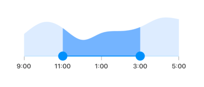
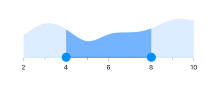
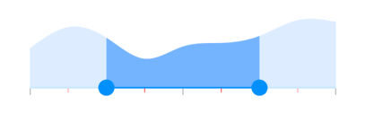
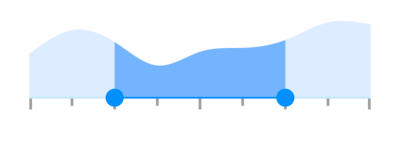
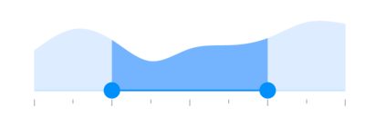

# Ticks in Flutter Range Selector (SfRangeSelector)

This section helps to learn about how to add major and minor ticks in the range selector.

## Show major ticks

You can enable the major ticks on the track. It is a shape which is used to represent the major interval points of the track. The default value of [`showTicks`](https://pub.dev/documentation/syncfusion_flutter_sliders/latest/sliders/SfRangeSelector/showTicks.html) property is `false`.

For example, if [`min`](https://pub.dev/documentation/syncfusion_flutter_sliders/latest/sliders/SfRangeSelector/min.html) is 0.0 and [`max`](https://pub.dev/documentation/syncfusion_flutter_sliders/latest/sliders/SfRangeSelector/max.html) is 10.0 and [`interval`](https://pub.dev/documentation/syncfusion_flutter_sliders/latest/sliders/SfRangeSelector/interval.html) is 2.0, the range selector will render the major ticks at 0.0, 2.0, 4.0 and so on.




final DateTime _min = DateTime(2002, 01, 01, 09, 00, 00);
final DateTime _max = DateTime(2002, 01, 01, 17, 00, 00);
SfRangeValues _values = SfRangeValues(DateTime(2002, 01, 01, 11, 00, 00), DateTime(2002, 01, 01, 15, 00, 00));

final List<Data> chartData = <Data>[
    Data(x: DateTime(2002, 01, 01, 09, 00, 00), y: 2.2),
    Data(x: DateTime(2002, 01, 01, 10, 00, 00), y: 3.4),
    Data(x: DateTime(2002, 01, 01, 11, 00, 00), y: 2.8),
    Data(x: DateTime(2002, 01, 01, 12, 00, 00), y: 1.6),
    Data(x: DateTime(2002, 01, 01, 13, 00, 00), y: 2.3),
    Data(x: DateTime(2002, 01, 01, 14, 00, 00), y: 2.5),
    Data(x: DateTime(2002, 01, 01, 15, 00, 00), y: 2.9),
    Data(x: DateTime(2002, 01, 01, 16, 00, 00), y: 3.8),
    Data(x: DateTime(2002, 01, 01, 17, 00, 00), y: 3.7),
];

@override
Widget build(BuildContext context) {
  return MaterialApp(
      home: Scaffold(
          body: Center(
              child: SfRangeSelector(
                    min: _min,
                    max: _max,
                    showLabels: true,
                    showTicks: true,
                    interval: 2,
                    dateFormat: DateFormat('h:mm'),
                    dateIntervalType: DateIntervalType.hours,
                    initialValues: _values,
                    child: Container(
                    height: 130,
                    child: SfCartesianChart(
                        margin: const EdgeInsets.all(0),
                        primaryXAxis: DateTimeAxis(
                            minimum: _min,
                            maximum: _max,
                            isVisible: false,),
                        primaryYAxis: NumericAxis(isVisible: false),
                        plotAreaBorderWidth: 0,
                        series: <SplineAreaSeries<Data, DateTime>>[
                            SplineAreaSeries<Data, DateTime>(
                                color: Color.fromARGB(255, 126, 184, 253),
                                dataSource: chartData,
                                xValueMapper: (Data sales, int index) => sales.x,
                                yValueMapper: (Data sales, int index) => sales.y)
                            ],
                        ),
                   ),
              ),
          )
      )
  );
}

class Data {
  Data({required this.x, required this.y});
  final DateTime x;
  final double y;
}




N> Refer the [`tickShape`](https://pub.dev/documentation/syncfusion_flutter_sliders/latest/sliders/SfRangeSelector/tickShape.html) and [`SfRangeSelectorThemeData`](https://pub.dev/documentation/syncfusion_flutter_core/latest/theme/SfRangeSelectorThemeData-class.html) for customizing the major tick's visual appearance.

## Show minor ticks

It represents the number of smaller ticks between two major ticks. For example, if [`min`](https://pub.dev/documentation/syncfusion_flutter_sliders/latest/sliders/SfRangeSelector/min.html) is 0.0 and [`max`](https://pub.dev/documentation/syncfusion_flutter_sliders/latest/sliders/SfRangeSelector/max.html) is 10.0 and [`interval`](https://pub.dev/documentation/syncfusion_flutter_sliders/latest/sliders/SfRangeSelector/interval.html) is 2.0, the range selector will render the major ticks at 0.0, 2.0, 4.0 and so on. If [`minorTicksPerInterval`](https://pub.dev/documentation/syncfusion_flutter_sliders/latest/sliders/SfRangeSelector/minorTicksPerInterval.html) is 1, then smaller ticks will be rendered on 1.0 and 3.0 and so on.

I> The default value of [`minorTicksPerInterval`](https://pub.dev/documentation/syncfusion_flutter_sliders/latest/sliders/SfRangeSelector/minorTicksPerInterval.html) property is `null` and it must be greater than 0.




final double _min = 2.0;
final double _max = 10.0;
SfRangeValues _values = SfRangeValues(4.0, 8.0);

final List<Data> chartData = <Data>[
    Data(x:2.0, y: 2.2),
    Data(x:3.0, y: 3.4),
    Data(x:4.0, y: 2.8),
    Data(x:5.0, y: 1.6),
    Data(x:6.0, y: 2.3),
    Data(x:7.0, y: 2.5),
    Data(x:8.0, y: 2.9),
    Data(x:9.0, y: 3.8),
    Data(x:10.0, y: 3.7),
];

@override
Widget build(BuildContext context) {
  return MaterialApp(
      home: Scaffold(
          body: Center(
              child: SfRangeSelector(
                    min: _min,
                    max: _max,
                    interval: 2,
                    showLabels: true,
                    showTicks: true,
                    minorTicksPerInterval: 1,
                    initialValues: _values,
                    child: Container(
                    height: 130,
                    child: SfCartesianChart(
                        margin: const EdgeInsets.all(0),
                        primaryXAxis: NumericAxis(minimum: _min,
                            maximum: _max,
                            isVisible: false,),
                        primaryYAxis: NumericAxis(isVisible: false),
                        plotAreaBorderWidth: 0,
                        series: <SplineAreaSeries<Data, double>>[
                            SplineAreaSeries<Data, double>(
                                color: Color.fromARGB(255, 126, 184, 253),
                                dataSource: chartData,
                                    xValueMapper: (Data sales, int index) => sales.x,
                                    yValueMapper: (Data sales, int index) => sales.y)
                            ],
                        ),
                   ),
              ),
          )
      )
  );
}

class Data {
  Data({required this.x, required this.y});
  final double x;
  final double y;
}




N>
* Refer the [`showTicks`](https://pub.dev/documentation/syncfusion_flutter_sliders/latest/sliders/SfRangeSelector/showTicks.html) to know about the rendering of major ticks at given interval.
* Refer the [`minorTickShape`](https://pub.dev/documentation/syncfusion_flutter_sliders/latest/sliders/SfRangeSelector/minorTickShape.html) and [`SfRangeSelectorThemeData`](https://pub.dev/documentation/syncfusion_flutter_core/latest/theme/SfRangeSelectorThemeData-class.html) for customizing the minor tick's visual appearance.

## Major ticks color

You can change the active and inactive major ticks color of the range selector using the [`activeTickColor`](https://pub.dev/documentation/syncfusion_flutter_core/latest/theme/SfRangeSelectorThemeData/activeTickColor.html) and [`inactiveTickColor`](https://pub.dev/documentation/syncfusion_flutter_core/latest/theme/SfRangeSelectorThemeData/inactiveTickColor.html) properties respectively.

The active side of the [`SfRangeSelector`](https://pub.dev/documentation/syncfusion_flutter_sliders/latest/sliders/SfRangeSelector-class.html) is between start and end thumbs.

The inactive side of the [`SfRangeSelector`](https://pub.dev/documentation/syncfusion_flutter_sliders/latest/sliders/SfRangeSelector-class.html) is between the [`min`](https://pub.dev/documentation/syncfusion_flutter_sliders/latest/sliders/SfRangeSelector/min.html) value and the left thumb, and the right thumb and the [`max`](https://pub.dev/documentation/syncfusion_flutter_sliders/latest/sliders/SfRangeSelector/max.html) value.

For RTL, the inactive side is between the [`max`](https://pub.dev/documentation/syncfusion_flutter_sliders/latest/sliders/SfRangeSelector/max.html) value and the left thumb, and the right thumb and the [`min`](https://pub.dev/documentation/syncfusion_flutter_sliders/latest/sliders/SfRangeSelector/min.html) value.

N> You must import the `theme.dart` library from the [`Core`](https://pub.dev/packages/syncfusion_flutter_core) package to use [`SfRangeSelectorTheme`](https://pub.dev/documentation/syncfusion_flutter_core/latest/theme/SfRangeSelectorTheme-class.html).




final double _min = 2.0;
final double _max = 10.0;
SfRangeValues _values = SfRangeValues(4.0, 8.0);

final List<Data> chartData = <Data>[
    Data(x:2.0, y: 2.2),
    Data(x:3.0, y: 3.4),
    Data(x:4.0, y: 2.8),
    Data(x:5.0, y: 1.6),
    Data(x:6.0, y: 2.3),
    Data(x:7.0, y: 2.5),
    Data(x:8.0, y: 2.9),
    Data(x:9.0, y: 3.8),
    Data(x:10.0, y: 3.7),
];

@override
Widget build(BuildContext context) {
  return MaterialApp(
      home: Scaffold(
          body: Center(
              child: SfRangeSelectorTheme(
                    data: SfRangeSelectorThemeData(
                        activeTickColor: Colors.red,
                        inactiveTickColor: Colors.red[100],
                    ),
                    child:  SfRangeSelector(
                        min: _min,
                        max: _max,
                        interval: 1,
                        showTicks: true,
                        initialValues: _values,
                        child: Container(
                        height: 130,
                        child: SfCartesianChart(
                            margin: const EdgeInsets.all(0),
                            primaryXAxis: NumericAxis(minimum: _min,
                                maximum: _max,
                                isVisible: false),
                            primaryYAxis: NumericAxis(isVisible: false),
                            plotAreaBorderWidth: 0,
                            series: <SplineAreaSeries<Data, double>>[
                                SplineAreaSeries<Data, double>(
                                    color: Color.fromARGB(255, 126, 184, 253),
                                        dataSource: chartData,
                                            xValueMapper: (Data sales, int index) => sales.x,
                                            yValueMapper: (Data sales, int index) => sales.y)
                                ],
                            ),
                        ),
                   ),
              ),
          )
      )
  );
}

class Data {
  Data({required this.x, required this.y});
  final double x;
  final double y;
}




## Minor ticks color

You can change the active and inactive minor ticks color of the range selector using the [`activeMinorTickColor`](https://pub.dev/documentation/syncfusion_flutter_core/latest/theme/SfRangeSelectorThemeData/activeMinorTickColor.html) and [`inactiveMinorTickColor`](https://pub.dev/documentation/syncfusion_flutter_core/latest/theme/SfRangeSelectorThemeData/inactiveMinorTickColor.html) properties respectively.

The active side of the [`SfRangeSelector`](https://pub.dev/documentation/syncfusion_flutter_sliders/latest/sliders/SfRangeSelector-class.html) is between start and end thumbs.

The inactive side of the [`SfRangeSelector`](https://pub.dev/documentation/syncfusion_flutter_sliders/latest/sliders/SfRangeSelector-class.html) is between the [`min`](https://pub.dev/documentation/syncfusion_flutter_sliders/latest/sliders/SfRangeSelector/min.html) value and the left thumb, and the right thumb and the [`max`](https://pub.dev/documentation/syncfusion_flutter_sliders/latest/sliders/SfRangeSelector/max.html) value.

For RTL, the inactive side is between the [`max`](https://pub.dev/documentation/syncfusion_flutter_sliders/latest/sliders/SfRangeSelector/max.html) value and the left thumb, and the right thumb and the [`min`](https://pub.dev/documentation/syncfusion_flutter_sliders/latest/sliders/SfRangeSelector/min.html) value.

N> You must import the `theme.dart` library from the [`Core`](https://pub.dev/packages/syncfusion_flutter_core) package to use [`SfRangeSelectorTheme`](https://pub.dev/documentation/syncfusion_flutter_core/latest/theme/SfRangeSelectorTheme-class.html).




final double _min = 2.0;
final double _max = 10.0;
SfRangeValues _values = SfRangeValues(4.0, 8.0);

final List<Data> chartData = <Data>[
    Data(x:2.0, y: 2.2),
    Data(x:3.0, y: 3.4),
    Data(x:4.0, y: 2.8),
    Data(x:5.0, y: 1.6),
    Data(x:6.0, y: 2.3),
    Data(x:7.0, y: 2.5),
    Data(x:8.0, y: 2.9),
    Data(x:9.0, y: 3.8),
    Data(x:10.0, y: 3.7),
];

@override
Widget build(BuildContext context) {
  return MaterialApp(
      home: Scaffold(
          body: Center(
              child: SfRangeSelectorTheme(
                    data: SfRangeSelectorThemeData(
                        activeMinorTickColor: Colors.red,
                        inactiveMinorTickColor: Colors.red[200],
                    ),
                    child:  SfRangeSelector(
                        min: _min,
                        max: _max,
                        interval: 2,
                        minorTicksPerInterval: 1,
                        showTicks: true,
                        initialValues: _values,
                        child: Container(
                        height: 130,
                        child: SfCartesianChart(
                            margin: const EdgeInsets.all(0),
                            primaryXAxis: NumericAxis(minimum: _min,
                                maximum: _max,
                                isVisible: false),
                            primaryYAxis: NumericAxis(isVisible: false),
                            plotAreaBorderWidth: 0,
                            series: <SplineAreaSeries<Data, double>>[
                                SplineAreaSeries<Data, double>(
                                    color: Color.fromARGB(255, 126, 184, 253),
                                        dataSource: chartData,
                                            xValueMapper: (Data sales, int index) => sales.x,
                                            yValueMapper: (Data sales, int index) => sales.y)
                                ],
                            ),
                        ),
                   ),
              ),
          )
      )
  );
}

class Data {
  Data({required this.x, required this.y});
  final double x;
  final double y;
}




## Ticks size

You can change the major and minor ticks size of the range selector using the [`tickSize`](https://pub.dev/documentation/syncfusion_flutter_core/latest/theme/SfRangeSelectorThemeData/tickSize.html) and [`minorTickSize`](https://pub.dev/documentation/syncfusion_flutter_core/latest/theme/SfRangeSelectorThemeData/minorTickSize.html) properties respectively. The default value of the [`tickSize`](https://pub.dev/documentation/syncfusion_flutter_core/latest/theme/SfRangeSelectorThemeData/tickSize.html) property is `Size(1.0, 8.0)` and [`minorTickSize`](https://pub.dev/documentation/syncfusion_flutter_core/latest/theme/SfRangeSelectorThemeData/minorTickSize.html) property is `Size(1.0, 5.0)`.

N> You must import the `theme.dart` library from the [`Core`](https://pub.dev/packages/syncfusion_flutter_core) package to use [`SfRangeSelectorTheme`](https://pub.dev/documentation/syncfusion_flutter_core/latest/theme/SfRangeSelectorTheme-class.html).




final double _min = 2.0;
final double _max = 10.0;
SfRangeValues _values = SfRangeValues(4.0, 8.0);

final List<Data> chartData = <Data>[
    Data(x:2.0, y: 2.2),
    Data(x:3.0, y: 3.4),
    Data(x:4.0, y: 2.8),
    Data(x:5.0, y: 1.6),
    Data(x:6.0, y: 2.3),
    Data(x:7.0, y: 2.5),
    Data(x:8.0, y: 2.9),
    Data(x:9.0, y: 3.8),
    Data(x:10.0, y: 3.7),
];

@override
Widget build(BuildContext context) {
  return MaterialApp(
      home: Scaffold(
          body: Center(
              child: SfRangeSelectorTheme(
                    data: SfRangeSelectorThemeData(
                        tickSize: Size(3.0, 12.0),
                        minorTickSize: Size(3.0, 8.0),
                    ),
                    child:  SfRangeSelector(
                        min: _min,
                        max: _max,
                        interval: 2,
                        minorTicksPerInterval: 1,
                        showTicks: true,
                        initialValues: _values,
                        child: Container(
                        height: 130,
                        child: SfCartesianChart(
                            margin: const EdgeInsets.all(0),
                            primaryXAxis: NumericAxis(minimum: _min,
                                maximum: _max,
                                isVisible: false),
                            primaryYAxis: NumericAxis(isVisible: false),
                            plotAreaBorderWidth: 0,
                            series: <SplineAreaSeries<Data, double>>[
                                SplineAreaSeries<Data, double>(
                                    color: Color.fromARGB(255, 126, 184, 253),
                                        dataSource: chartData,
                                            xValueMapper: (Data sales, int index) => sales.x,
                                            yValueMapper: (Data sales, int index) => sales.y)
                                ],
                            ),
                        ),
                   ),
              ),
          )
      )
  );
}

class Data {
  Data({required this.x, required this.y});
  final double x;
  final double y;
}




## Ticks offset

You can adjust the space between track and ticks of the range selector using the [`tickOffset`](https://pub.dev/documentation/syncfusion_flutter_core/latest/theme/SfRangeSelectorThemeData/tickOffset.html) property in the [`SfRangeSelectorThemeData`](https://pub.dev/documentation/syncfusion_flutter_core/latest/theme/SfRangeSelectorThemeData-class.html). The default value of the [`tickOffset`](https://pub.dev/documentation/syncfusion_flutter_core/latest/theme/SfRangeSelectorThemeData/tickOffset.html) property is `null`.

N> You must import the `theme.dart` library from the [`Core`](https://pub.dev/packages/syncfusion_flutter_core) package to use [`SfRangeSelectorTheme`](https://pub.dev/documentation/syncfusion_flutter_core/latest/theme/SfRangeSelectorTheme-class.html).




final double _min = 2.0;
final double _max = 10.0;
SfRangeValues _values = SfRangeValues(4.0, 8.0);

final List<Data> chartData = <Data>[
    Data(x:2.0, y: 2.2),
    Data(x:3.0, y: 3.4),
    Data(x:4.0, y: 2.8),
    Data(x:5.0, y: 1.6),
    Data(x:6.0, y: 2.3),
    Data(x:7.0, y: 2.5),
    Data(x:8.0, y: 2.9),
    Data(x:9.0, y: 3.8),
    Data(x:10.0, y: 3.7),
];

@override
Widget build(BuildContext context) {
  return MaterialApp(
      home: Scaffold(
          body: Center(
              child: SfRangeSelectorTheme(
                    data: SfRangeSelectorThemeData(
                        tickOffset: Offset(0.0, 10.0),
                    ),
                    child:  SfRangeSelector(
                        min: _min,
                        max: _max,
                        interval: 2,
                        minorTicksPerInterval: 1,
                        showTicks: true,
                        initialValues: _values,
                        child: Container(
                        height: 130,
                        child: SfCartesianChart(
                            margin: const EdgeInsets.all(0),
                            primaryXAxis: NumericAxis(minimum: _min,
                                maximum: _max,
                                isVisible: false),
                            primaryYAxis: NumericAxis(isVisible: false),
                            plotAreaBorderWidth: 0,
                            series: <SplineAreaSeries<Data, double>>[
                                SplineAreaSeries<Data, double>(
                                    color: Color.fromARGB(255, 126, 184, 253),
                                        dataSource: chartData,
                                            xValueMapper: (Data sales, int index) => sales.x,
                                            yValueMapper: (Data sales, int index) => sales.y)
                                ],
                            ),
                        ),
                   ),
              ),
          )
      )
  );
}

class Data {
  Data({required this.x, required this.y});
  final double x;
  final double y;
}




