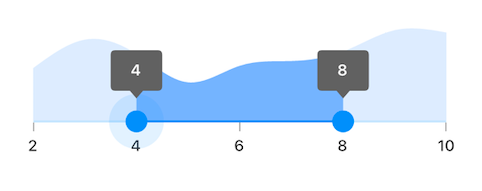
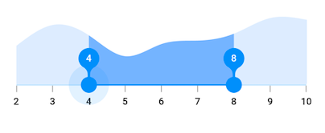
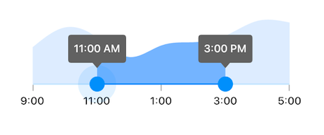
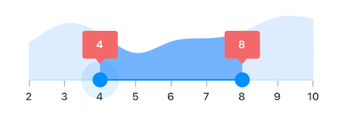
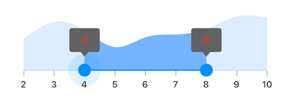
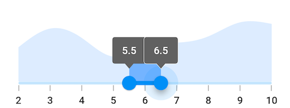

# Tooltip in Flutter Range Selector (SfRangeSelector)

This section helps to learn about how to add tooltip in the range selector.

## Enable tooltips

You can enable tooltips for both thumbs using the [`enableTooltip`](https://pub.dev/documentation/syncfusion_flutter_sliders/latest/sliders/SfRangeSelector/enableTooltip.html). It is used to clearly indicate the current selection of the ranges during interaction. By default, tooltip text is formatted with either [`numberFormat`](https://pub.dev/documentation/syncfusion_flutter_sliders/latest/sliders/SfRangeSelector/numberFormat.html) or [`dateFormat`](https://pub.dev/documentation/syncfusion_flutter_sliders/latest/sliders/SfRangeSelector/dateFormat.html).

I> By setting the value of `shouldAlwaysShowTooltip` to true, you can always show a tooltip without having to interact with the range selector thumb. The default value is `false` and it works independent of the `enableTooltip` behavior.




final double _min = 2.0;
final double _max = 10.0;
SfRangeValues _values = SfRangeValues(4.0, 8.0);

final List<Data> chartData = <Data>[
    Data(x:2.0, y: 2.2),
    Data(x:3.0, y: 3.4),
    Data(x:4.0, y: 2.8),
    Data(x:5.0, y: 1.6),
    Data(x:6.0, y: 2.3),
    Data(x:7.0, y: 2.5),
    Data(x:8.0, y: 2.9),
    Data(x:9.0, y: 3.8),
    Data(x:10.0, y: 3.7),
];

@override
Widget build(BuildContext context) {
  return MaterialApp(
      home: Scaffold(
          body: Center(
              child: SfRangeSelector(
                    min: _min,
                    max: _max,
                    interval: 2,
                    showLabels: true,
                    showTicks: true,
                    enableTooltip: true,
                    initialValues: _values,
                    child: Container(
                    height: 130,
                    child: SfCartesianChart(
                        margin: const EdgeInsets.all(0),
                        primaryXAxis: NumericAxis(minimum: _min,
                            maximum: _max,
                            isVisible: false,),
                        primaryYAxis: NumericAxis(isVisible: false),
                        plotAreaBorderWidth: 0,
                        series: <SplineAreaSeries<Data, double>>[
                            SplineAreaSeries<Data, double>(
                                color: Color.fromARGB(255, 126, 184, 253),
                                dataSource: chartData,
                                    xValueMapper: (Data sales, int index) => sales.x,
                                    yValueMapper: (Data sales, int index) => sales.y)
                            ],
                        ),
                   ),
              ),
          )
      )
  );
}

class Data {
  Data({required this.x, required this.y});
  final double x;
  final double y;
}




N>
* Refer the [`tooltipTextFormatterCallback`](https://pub.dev/documentation/syncfusion_flutter_sliders/latest/sliders/SfRangeSelector/tooltipTextFormatterCallback.html) for changing the default tooltip text.
* Refer the [`SfRangeSelectorThemeData`](https://pub.dev/documentation/syncfusion_flutter_core/latest/theme/SfRangeSelectorThemeData-class.html) for customizing the appearance of the tooltip text.

## Tooltip shape

You can show tooltip in rectangular or paddle shape using the [`tooltipShape`](https://pub.dev/documentation/syncfusion_flutter_sliders/latest/sliders/SfRangeSelector/tooltipShape.html) property. The default value of the [`tooltipShape`](https://pub.dev/documentation/syncfusion_flutter_sliders/latest/sliders/SfRangeSelector/tooltipShape.html) property is `SfRectangularTooltipShape`.




final double _min = 2.0;
final double _max = 10.0;
SfRangeValues _values = SfRangeValues(4.0, 8.0);

final List<Data> chartData = <Data>[
  Data(x: 2.0, y: 2.2),
  Data(x: 3.0, y: 3.4),
  Data(x: 4.0, y: 2.8),
  Data(x: 5.0, y: 1.6),
  Data(x: 6.0, y: 2.3),
  Data(x: 7.0, y: 2.5),
  Data(x: 8.0, y: 2.9),
  Data(x: 9.0, y: 3.8),
  Data(x: 10.0, y: 3.7),
];

@override
Widget build(BuildContext context) {
  return MaterialApp(
      home: Scaffold(
          body: Center(
            child: SfRangeSelector(
              min: _min,
              max: _max,
              interval: 1,
              showLabels: true,
              showTicks: true,
              enableTooltip: true,
              tooltipShape: SfPaddleTooltipShape(),
              initialValues: _values,
              child: Container(
                height: 130,
                child: SfCartesianChart(
                  margin: const EdgeInsets.all(0),
                  primaryXAxis: NumericAxis(minimum: _min,
                    maximum: _max,
                    isVisible: false,),
                  primaryYAxis: NumericAxis(isVisible: false),
                  plotAreaBorderWidth: 0,
                  series: <SplineAreaSeries<Data, double>>[
                    SplineAreaSeries<Data, double>(
                        color: Color.fromARGB(255, 126, 184, 253),
                        dataSource: chartData,
                        xValueMapper: (Data sales, int index) => sales.x,
                        yValueMapper: (Data sales, int index) => sales.y)
                  ],
                ),
              ),
            ),
          )
      )
  );
}

class Data {
  Data({required this.x, required this.y});
  final double x;
  final double y;
}




## Tooltip text format

By default it is formatted based on [`numberFormat`](https://pub.dev/documentation/syncfusion_flutter_sliders/latest/sliders/SfRangeSelector/numberFormat.html) property and [`dateFormat`](https://pub.dev/documentation/syncfusion_flutter_sliders/latest/sliders/SfRangeSelector/dateFormat.html) property based on whether it is date type [`SfRangeSelector`](https://help.syncfusion.com/flutter/range-selector/getting-started#set-date-range) or numeric [`SfRangeSelector`](https://help.syncfusion.com/flutter/range-selector/getting-started#set-numeric-range).

You can format or change the whole tooltip label text using the [`tooltipTextFormatterCallback`](https://pub.dev/documentation/syncfusion_flutter_sliders/latest/sliders/SfRangeSelector/tooltipTextFormatterCallback.html). Its arguments are,

* actualValue – either `DateTime` or `double` based on given [`initialValues`](https://pub.dev/documentation/syncfusion_flutter_sliders/latest/sliders/SfRangeSelector/initialValues.html).
* formattedText – If the actual value is `double`, it is formatted by [`numberFormat`](https://pub.dev/documentation/syncfusion_flutter_sliders/latest/sliders/SfRangeSelector/numberFormat.html) and if the actual value is `DateTime`, it is formatted by [`dateFormat`](https://pub.dev/documentation/syncfusion_flutter_sliders/latest/sliders/SfRangeSelector/dateFormat.html).




final DateTime _min = DateTime(2002, 01, 01, 09, 00, 00);
final DateTime _max = DateTime(2002, 01, 01, 17, 00, 00);
SfRangeValues _values = SfRangeValues(DateTime(2002, 01, 01, 11, 00, 00), DateTime(2002, 01, 01, 15, 00, 00));

final List<Data> chartData = <Data>[
    Data(x: DateTime(2002, 01, 01, 09, 00, 00), y: 2.2),
    Data(x: DateTime(2002, 01, 01, 10, 00, 00), y: 3.4),
    Data(x: DateTime(2002, 01, 01, 11, 00, 00), y: 2.8),
    Data(x: DateTime(2002, 01, 01, 12, 00, 00), y: 1.6),
    Data(x: DateTime(2002, 01, 01, 13, 00, 00), y: 2.3),
    Data(x: DateTime(2002, 01, 01, 14, 00, 00), y: 2.5),
    Data(x: DateTime(2002, 01, 01, 15, 00, 00), y: 2.9),
    Data(x: DateTime(2002, 01, 01, 16, 00, 00), y: 3.8),
    Data(x: DateTime(2002, 01, 01, 17, 00, 00), y: 3.7),
];

@override
Widget build(BuildContext context) {
  return MaterialApp(
      home: Scaffold(
          body: Center(
              child: SfRangeSelector(
                    min: _min,
                    max: _max,
                    showLabels: true,
                    showTicks: true,
                    interval: 2,
                    dateFormat: DateFormat('h:mm'),
                    dateIntervalType: DateIntervalType.hours,
                    enableTooltip: true,
                    tooltipTextFormatterCallback: (dynamic actualValue, String formattedText) {
                        return DateFormat('h:mm a').format(actualValue);
                    },
                    initialValues: _values,
                    child: Container(
                    height: 130,
                    child: SfCartesianChart(
                        margin: const EdgeInsets.all(0),
                        primaryXAxis: DateTimeAxis(
                            minimum: _min,
                            maximum: _max,
                            isVisible: false,),
                        primaryYAxis: NumericAxis(isVisible: false),
                        plotAreaBorderWidth: 0,
                        series: <SplineAreaSeries<Data, DateTime>>[
                            SplineAreaSeries<Data, DateTime>(
                                color: Color.fromARGB(255, 126, 184, 253),
                                dataSource: chartData,
                                xValueMapper: (Data sales, int index) => sales.x,
                                yValueMapper: (Data sales, int index) => sales.y)
                            ],
                        ),
                   ),
              ),
          )
      )
  );
}

class Data {
  Data({required this.x, required this.y});
  final DateTime x;
  final double y;
}




## Tooltip color

You can change the background color of the tooltip in the range selector using the [`tooltipBackgroundColor`](https://pub.dev/documentation/syncfusion_flutter_core/latest/theme/SfSliderThemeData/tooltipBackgroundColor.html) property.

N> You must import the `theme.dart` library from the [`Core`](https://pub.dev/packages/syncfusion_flutter_core) package to use [`SfRangeSelectorTheme`](https://pub.dev/documentation/syncfusion_flutter_core/latest/theme/SfRangeSelectorTheme-class.html).




final double _min = 2.0;
final double _max = 10.0;
SfRangeValues _values = SfRangeValues(4.0, 8.0);

final List<Data> chartData = <Data>[
    Data(x:2.0, y: 2.2),
    Data(x:3.0, y: 3.4),
    Data(x:4.0, y: 2.8),
    Data(x:5.0, y: 1.6),
    Data(x:6.0, y: 2.3),
    Data(x:7.0, y: 2.5),
    Data(x:8.0, y: 2.9),
    Data(x:9.0, y: 3.8),
    Data(x:10.0, y: 3.7),
];

@override
Widget build(BuildContext context) {
  return MaterialApp(
      home: Scaffold(
          body: Center(
              child: SfRangeSelectorTheme(
                    data: SfRangeSelectorThemeData(
                        tooltipBackgroundColor: Colors.red[300],
                    ),
                    child:  SfRangeSelector(
                        min: _min,
                        max: _max,
                        interval: 1,
                        enableTooltip: true,
                        showTicks: true,
                        showLabels: true,
                        initialValues: _values,
                        child: Container(
                        height: 130,
                        child: SfCartesianChart(
                            margin: const EdgeInsets.all(0),
                            primaryXAxis: NumericAxis(minimum: _min,
                                maximum: _max,
                                isVisible: false),
                            primaryYAxis: NumericAxis(isVisible: false),
                            plotAreaBorderWidth: 0,
                            series: <SplineAreaSeries<Data, double>>[
                                SplineAreaSeries<Data, double>(
                                    color: Color.fromARGB(255, 126, 184, 253),
                                        dataSource: chartData,
                                            xValueMapper: (Data sales, int index) => sales.x,
                                            yValueMapper: (Data sales, int index) => sales.y)
                                ],
                            ),
                        ),
                   ),
              ),
          )
      )
  );
}

class Data {
  Data({required this.x, required this.y});
  final double x;
  final double y;
}




## Tooltip label style

You can change the appearance of the tooltip text in the range selector using the [`tooltipTextStyle`](https://pub.dev/documentation/syncfusion_flutter_core/latest/theme/SfSliderThemeData/tooltipTextStyle.html) property.

N> You must import the `theme.dart` library from the [`Core`](https://pub.dev/packages/syncfusion_flutter_core) package to use [`SfRangeSelectorTheme`](https://pub.dev/documentation/syncfusion_flutter_core/latest/theme/SfRangeSelectorTheme-class.html).




final double _min = 2.0;
final double _max = 10.0;
SfRangeValues _values = SfRangeValues(4.0, 8.0);

final List<Data> chartData = <Data>[
    Data(x:2.0, y: 2.2),
    Data(x:3.0, y: 3.4),
    Data(x:4.0, y: 2.8),
    Data(x:5.0, y: 1.6),
    Data(x:6.0, y: 2.3),
    Data(x:7.0, y: 2.5),
    Data(x:8.0, y: 2.9),
    Data(x:9.0, y: 3.8),
    Data(x:10.0, y: 3.7),
];

@override
Widget build(BuildContext context) {
  return MaterialApp(
      home: Scaffold(
          body: Center(
              child: SfRangeSelectorTheme(
                    data: SfRangeSelectorThemeData(
                        tooltipTextStyle: TextStyle(color: Colors.red, fontSize: 16, fontStyle: FontStyle.italic),
                    ),
                    child:  SfRangeSelector(
                        min: _min,
                        max: _max,
                        interval: 1,
                        enableTooltip: true,
                        showTicks: true,
                        showLabels: true,
                        initialValues: _values,
                        child: Container(
                        height: 130,
                        child: SfCartesianChart(
                            margin: const EdgeInsets.all(0),
                            primaryXAxis: NumericAxis(minimum: _min,
                                maximum: _max,
                                isVisible: false),
                            primaryYAxis: NumericAxis(isVisible: false),
                            plotAreaBorderWidth: 0,
                            series: <SplineAreaSeries<Data, double>>[
                                SplineAreaSeries<Data, double>(
                                    color: Color.fromARGB(255, 126, 184, 253),
                                        dataSource: chartData,
                                            xValueMapper: (Data sales, int index) => sales.x,
                                            yValueMapper: (Data sales, int index) => sales.y)
                                ],
                            ),
                        ),
                   ),
              ),
          )
      )
  );
}

class Data {
  Data({required this.x, required this.y});
  final double x;
  final double y;
}




## Tooltip overlap stroke color

You can change the overlap stroke color of the tooltip in the range selector using the [`overlappingTooltipStrokeColor`](https://pub.dev/documentation/syncfusion_flutter_core/latest/theme/SfRangeSliderThemeData/overlappingTooltipStrokeColor.html) property.

N> You must import the `theme.dart` library from the [`Core`](https://pub.dev/packages/syncfusion_flutter_core) package to use [`SfRangeSelectorTheme`](https://pub.dev/documentation/syncfusion_flutter_core/latest/theme/SfRangeSelectorTheme-class.html).




final double _min = 2.0;
final double _max = 10.0;
SfRangeValues _values = SfRangeValues(4.0, 8.0);

final List<Data> chartData = <Data>[
    Data(x:2.0, y: 2.2),
    Data(x:3.0, y: 3.4),
    Data(x:4.0, y: 2.8),
    Data(x:5.0, y: 1.6),
    Data(x:6.0, y: 2.3),
    Data(x:7.0, y: 2.5),
    Data(x:8.0, y: 2.9),
    Data(x:9.0, y: 3.8),
    Data(x:10.0, y: 3.7),
];

@override
Widget build(BuildContext context) {
  return MaterialApp(
      home: Scaffold(
          body: Center(
              child: SfRangeSelectorTheme(
                    data: SfRangeSelectorThemeData(
                        overlappingTooltipStrokeColor: Colors.white,
                    ),
                    child:  SfRangeSelector(
                        min: _min,
                        max: _max,
                        interval: 1,
                        enableTooltip: true,
                        showTicks: true,
                        showLabels: true,
                        initialValues: _values,
                        child: Container(
                        height: 130,
                        child: SfCartesianChart(
                            margin: const EdgeInsets.all(0),
                            primaryXAxis: NumericAxis(minimum: _min,
                                maximum: _max,
                                isVisible: false),
                            primaryYAxis: NumericAxis(isVisible: false),
                            plotAreaBorderWidth: 0,
                            series: <SplineAreaSeries<Data, double>>[
                                SplineAreaSeries<Data, double>(
                                    color: Color.fromARGB(255, 126, 184, 253),
                                        dataSource: chartData,
                                            xValueMapper: (Data sales, int index) => sales.x,
                                            yValueMapper: (Data sales, int index) => sales.y)
                                ],
                            ),
                        ),
                   ),
              ),
          )
      )
  );
}

class Data {
  Data({required this.x, required this.y});
  final double x;
  final double y;
}




