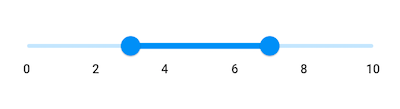
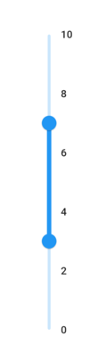
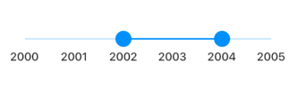
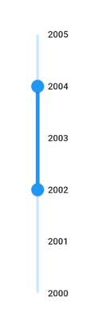
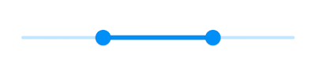
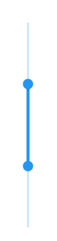
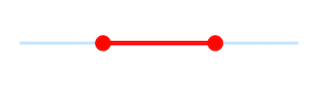
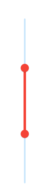
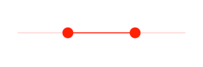
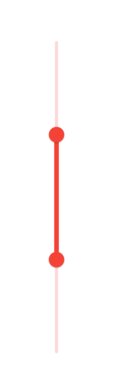

# Basic features in Flutter Range Slider (SfRangeSlider)
This section explains about how to add the numeric and date range slider.

## Minimum

The minimum value that the user can select. The default value of [`min`](https://pub.dev/documentation/syncfusion_flutter_sliders/latest/sliders/SfRangeSlider/min.html) property is 0.0 and it must be less than the [`max`](https://pub.dev/documentation/syncfusion_flutter_sliders/latest/sliders/SfRangeSlider/max.html) value.

## Maximum

The maximum value that the user can select. The default value of [`max`](https://pub.dev/documentation/syncfusion_flutter_sliders/latest/sliders/SfRangeSlider/max.html) property is 1.0 and it must be greater than the [`min`](https://pub.dev/documentation/syncfusion_flutter_sliders/latest/sliders/SfRangeSlider/min.html) value.

## Values

It represents the values currently selected in the range slider. The range slider's thumb is drawn corresponding to this value.

For date values, the range slider does not have auto interval support. So, it is mandatory to set [`interval`](https://pub.dev/documentation/syncfusion_flutter_sliders/latest/sliders/SfRangeSlider/interval.html), [`dateIntervalType`](https://pub.dev/documentation/syncfusion_flutter_sliders/latest/sliders/SfRangeSlider/dateIntervalType.html), and [`dateFormat`](https://pub.dev/documentation/syncfusion_flutter_sliders/latest/sliders/SfRangeSlider/dateFormat.html) for date values.

**Numeric range slider**

You can show numeric values in the range slider by setting `double` values to the [`min`](https://pub.dev/documentation/syncfusion_flutter_sliders/latest/sliders/SfRangeSlider/min.html), [`max`](https://pub.dev/documentation/syncfusion_flutter_sliders/latest/sliders/SfRangeSlider/max.html) and [`values`](https://pub.dev/documentation/syncfusion_flutter_sliders/latest/sliders/SfRangeSlider/values.html) properties.

### Horizontal




SfRangeValues _values = SfRangeValues(3.0, 7.0);

@override
Widget build(BuildContext context) {
  return MaterialApp(
      home: Scaffold(
          body: Center(
              child: SfRangeSlider(
                    min: 0.0,
                    max: 10.0,
                    values: _values,
                    interval: 2,
                    showLabels: true,
                    onChanged: (SfRangeValues newValues) {
                        setState(() {
                            _values = newValues;
                        });
                    },
              )
          )
      )
  );
}




### Vertical




SfRangeValues _values = SfRangeValues(3.0, 7.0);

@override
Widget build(BuildContext context) {
  return MaterialApp(
      home: Scaffold(
          body: Center(
              child: SfRangeSlider.vertical(
                    min: 0.0,
                    max: 10.0,
                    values: _values,
                    interval: 2,
                    showLabels: true,
                    onChanged: (SfRangeValues newValues) {
                        setState(() {
                            _values = newValues;
                        });
                    },
              )
          )
      )
  );
}




**Date range slider**

You can show date values in the range slider by setting `DateTime` values to the [`min`](https://pub.dev/documentation/syncfusion_flutter_sliders/latest/sliders/SfRangeSlider/min.html), [`max`](https://pub.dev/documentation/syncfusion_flutter_sliders/latest/sliders/SfRangeSlider/max.html) and [`values`](https://pub.dev/documentation/syncfusion_flutter_sliders/latest/sliders/SfRangeSlider/values.html) properties.

N> You must import [`intl`](https://pub.dev/packages/intl) package for formatting date range slider using the [`DateFormat`](https://pub.dev/documentation/intl/latest/intl/DateFormat-class.html) class.

### Horizontal




 SfRangeValues _values = SfRangeValues(DateTime(2002, 01, 01), DateTime(2004, 01, 01));

@override
Widget build(BuildContext context) {
  return MaterialApp(
      home: Scaffold(
          body: Center(
              child: SfRangeSlider(
                    min: DateTime(2000, 01, 01, 00),
                    max: DateTime(2004, 12, 31, 24),
                    values: _values,
                    interval: 1,
                    showLabels: true,
                    dateFormat: DateFormat.y(),
                    dateIntervalType: DateIntervalType.years,
                    onChanged: (SfRangeValues newValues) {
                          setState(() {
                                _values = newValues;
                          });
                    },
              )
          )
      )
  );
}




### Vertical




 SfRangeValues _values = SfRangeValues(DateTime(2002, 01, 01), DateTime(2004, 01, 01));

@override
Widget build(BuildContext context) {
  return MaterialApp(
      home: Scaffold(
          body: Center(
              child: SfRangeSlider.vertical(
                    min: DateTime(2000, 01, 01, 00),
                    max: DateTime(2004, 12, 31, 24),
                    values: _values,
                    interval: 1,
                    showLabels: true,
                    dateFormat: DateFormat.y(),
                    dateIntervalType: DateIntervalType.years,
                    onChanged: (SfRangeValues newValues) {
                          setState(() {
                                _values = newValues;
                          });
                    },
              )
          )
      )
  );
}




## Handle onChangeStart, onChanged, and onChangeEnd callbacks

**onChangeStart**

The `onChangeStart` callback is called when the user begins to interact with range slider using a tap or drag action. This callback is only used to notify the user that the interaction has started and it does not change the value of the range slider thumb.




SfRangeValues _values = SfRangeValues(4.0, 6.0);

@override
Widget build(BuildContext context) {
  return Scaffold(
    body: SfRangeSlider(
      min: 0.0,
      max: 10.0,
      values: _values,
      onChangeStart: (SfRangeValues startValues) {
        print('Interaction started');
      },
      onChanged: (SfRangeValues newValues) {
        setState(() {
          _values = newValues;
        });
      },
    ),
  );
}




**onChangeEnd**

The `onChangeEnd` callback is called when the user stops to interact with range slider using a tap or drag action. This callback is only used to notify the user that the interaction has ended and it does not change the value of the range slider thumb.




SfRangeValues _values = SfRangeValues(4.0, 6.0);

@override
Widget build(BuildContext context) {
  return Scaffold(
    body: SfRangeSlider(
      min: 0.0,
      max: 10.0,
      values: _values,
      onChangeEnd: (SfRangeValues endValues) {
        print('Interaction ended');
      },
      onChanged: (SfRangeValues newValues) {
        setState(() {
          _values = newValues;
        });
      },
    ),
  );
}




**onChanged**

The [`onChanged`](https://pub.dev/documentation/syncfusion_flutter_sliders/latest/sliders/SfRangeSlider/onChanged.html) callback is called when the user selects a value through interaction.

N> The range slider passes the new values to the callback but does not change its state until the parent widget rebuilds the range slider with new values.

N> If it is null, the range slider will be disabled.

### Horizontal




SfRangeValues _values = SfRangeValues(3.0, 7.0);

@override
Widget build(BuildContext context) {
  return MaterialApp(
      home: Scaffold(
          body: Center(
              child: SfRangeSlider(
                    min: 0.0,
                    max: 10.0,
                    values: _values,
                    onChanged: (SfRangeValues newValues) {
                       setState(() {
                           _values = newValues;
                        });
                   },
              )
          )
      )
  );
}




### Vertical




SfRangeValues _values = SfRangeValues(3.0, 7.0);

@override
Widget build(BuildContext context) {
  return MaterialApp(
      home: Scaffold(
          body: Center(
              child: SfRangeSlider.vertical(
                    min: 0.0,
                    max: 10.0,
                    values: _values,
                    onChanged: (SfRangeValues newValues) {
                       setState(() {
                           _values = newValues;
                        });
                   },
              )
          )
      )
  );
}




## Active color

It represents the color applied to the active track, thumb, overlay, and inactive dividers. The active side of the range slider is between the start and end thumbs.

### Horizontal




SfRangeValues _values = SfRangeValues(3.0, 7.0);

@override
Widget build(BuildContext context) {
  return MaterialApp(
      home: Scaffold(
          body: Center(
              child: SfRangeSlider(
                    min: 0.0,
                    max: 10.0,
                    values: _values,
                    activeColor: Colors.red,
                    showDividers: true,
                    onChanged: (SfRangeValues newValues) {
                        setState(() {
                            _values = newValues;
                        });
                    },
              )
          )
      )
  );
}




### Vertical




SfRangeValues _values = SfRangeValues(3.0, 7.0);

@override
Widget build(BuildContext context) {
  return MaterialApp(
      home: Scaffold(
          body: Center(
              child: SfRangeSlider.vertical(
                    min: 0.0,
                    max: 10.0,
                    values: _values,
                    activeColor: Colors.red,
                    showDividers: true,
                    onChanged: (SfRangeValues newValues) {
                        setState(() {
                            _values = newValues;
                        });
                    },
              )
          )
      )
  );
}




## Inactive color

It represents the color applied to the inactive track and active dividers.

The inactive side of the range slider is between the [`min`](https://pub.dev/documentation/syncfusion_flutter_sliders/latest/sliders/SfRangeSlider/min.html) value and the left thumb, and the right thumb and the [`max`](https://pub.dev/documentation/syncfusion_flutter_sliders/latest/sliders/SfRangeSlider/max.html) value.

For RTL, the inactive side is between the [`max`](https://pub.dev/documentation/syncfusion_flutter_sliders/latest/sliders/SfRangeSlider/max.html) value and the left thumb, and the right thumb and the [`min`](https://pub.dev/documentation/syncfusion_flutter_sliders/latest/sliders/SfRangeSlider/min.html) value.

### Horizontal




SfRangeValues _values = SfRangeValues(3.0, 7.0);

@override
Widget build(BuildContext context) {
  return MaterialApp(
      home: Scaffold(
          body: Center(
              child: SfRangeSlider(
                    min: 0.0,
                    max: 10.0,
                    values: _values,
                    activeColor: Colors.red,
                    inactiveColor: Colors.red.withOpacity(0.2),
                    showDividers: true,
                    onChanged: (SfRangeValues newValues) {
                        setState(() {
                            _values = newValues;
                        });
                    },
              )
          )
      )
  );
}




### Vertical




SfRangeValues _values = SfRangeValues(3.0, 7.0);

@override
Widget build(BuildContext context) {
  return MaterialApp(
      home: Scaffold(
          body: Center(
              child: SfRangeSlider.vertical(
                    min: 0.0,
                    max: 10.0,
                    values: _values,
                    activeColor: Colors.red,
                    inactiveColor: Colors.red.withOpacity(0.2),
                    showDividers: true,
                    onChanged: (SfRangeValues newValues) {
                        setState(() {
                            _values = newValues;
                        });
                    },
              )
          )
      )
  );
}




### For customizing individual items

* Track - [`Link`](https://help.syncfusion.com/flutter/range-slider/track)
* Ticks - [`Link`](https://help.syncfusion.com/flutter/range-slider/ticks)
* Labels and dividers - [`Link`](https://help.syncfusion.com/flutter/range-slider/labels-and-divider)
* Tooltips - [`Link`](https://help.syncfusion.com/flutter/range-slider/tooltip)
* Thumb and overlay - [`Link`](https://help.syncfusion.com/flutter/range-slider/thumb-and-overlay)
