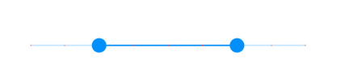
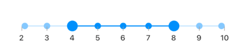
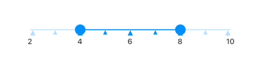

# Customization of range slider
This section explains about how to customize the range slider elements.

## Track customization

### Track color

You can change the active and inactive track color of the range slider using the `activeTrackColor` and `inactiveTrackColor` properties respectively.

N> You must import the `theme.dart' library from the [`Core`](https://pub.dev/packages/syncfusion_flutter_core) package to use [`SfRangeSliderTheme`](https://help.syncfusion.com/flutter/range-slider/customization).




final double _min = 2.0;
final double _max = 10.0;
SfRangeValues _values = SfRangeValues(4.0, 7.0);

@override
Widget build(BuildContext context) {
  return MaterialApp(
      home: Scaffold(
          body: Center(
              child: SfRangeSliderTheme(
                    data: SfRangeSliderThemeData(
                        activeTrackColor: Colors.red,
                        inactiveTrackColor: Colors.red[100],
                    ),
                    child:  SfRangeSlider(
                        min: _min,
                        max: _max,
                        values: _values,
                        onChanged: (dynamic newValue){
                            setState(() {
                                _values = newValue;
                            });
                        },
                    ),
              )
          )
      )
  );
}




### Track height

You can change the track height of the range slider using the `trackHeight` property. The default value of the `trackHeight` property is `2.0`

N> You must import the `theme.dart' library from the [`Core`](https://pub.dev/packages/syncfusion_flutter_core) package to use [`SfRangeSliderTheme`](https://help.syncfusion.com/flutter/range-slider/customization).




final double _min = 2.0;
final double _max = 10.0;
SfRangeValues _values = SfRangeValues(4.0, 7.0);

@override
Widget build(BuildContext context) {
  return MaterialApp(
      home: Scaffold(
          body: Center(
              child: SfRangeSliderTheme(
                    data: SfRangeSliderThemeData(
                        trackHeight: 8,
                    ),
                    child:  SfRangeSlider(
                        min: _min,
                        max: _max,
                        values: _values,
                        onChanged: (dynamic newValue){
                            setState(() {
                                _values = newValue;
                            });
                        },
                    ),
              )
          )
      )
  );
}




### Track corner radius

You can change the corner of the track to be round in the range slider using the `trackCornerRadius` property. The default value of the `trackCornerRadius` property is `1.0`

N> You must import the `theme.dart' library from the [`Core`](https://pub.dev/packages/syncfusion_flutter_core) package to use [`SfRangeSliderTheme`](https://help.syncfusion.com/flutter/range-slider/customization).




final double _min = 2.0;
final double _max = 10.0;
SfRangeValues _values = SfRangeValues(4.0, 7.0);

@override
Widget build(BuildContext context) {
  return MaterialApp(
      home: Scaffold(
          body: Center(
              child: SfRangeSliderTheme(
                    data: SfRangeSliderThemeData(
                        trackHeight: 10,
                        trackCornerRadius: 5,
                    ),
                    child:  SfRangeSlider(
                        min: _min,
                        max: _max,
                        values: _values,
                        onChanged: (dynamic newValue){
                            setState(() {
                                _values = newValue;
                            });
                        },
                    ),
              )
          )
      )
  );
}




## Ticks customization

### Ticks color

**Major ticks color**

You can change the active and inactive major ticks color of the range slider using the `activeTickColor` and `inactiveTickColor` properties respectively.

N> You must import the `theme.dart' library from the [`Core`](https://pub.dev/packages/syncfusion_flutter_core) package to use [`SfRangeSliderTheme`](https://help.syncfusion.com/flutter/range-slider/customization).




final double _min = 2.0;
final double _max = 10.0;
SfRangeValues _values = SfRangeValues(4.0, 8.0);

@override
Widget build(BuildContext context) {
  return MaterialApp(
      home: Scaffold(
          body: Center(
              child: SfRangeSliderTheme(
                    data: SfRangeSliderThemeData(
                        activeTickColor: Colors.red,
                        inactiveTickColor: Colors.red[100],
                    ),
                    child:  SfRangeSlider(
                        min: _min,
                        max: _max,
                        values: _values,
                        interval: 1,
                        showTicks: true,
                        onChanged: (dynamic newValue){
                            setState(() {
                                _values = newValue;
                            });
                        },
                    ),
              )
          )
      )
  );
}




**Minor ticks color**

You can change the active and inactive minor ticks color of the range slider using the `activeMinorTickColor` and `inactiveMinorTickColor` properties respectively.

N> You must import the `theme.dart' library from the [`Core`](https://pub.dev/packages/syncfusion_flutter_core) package to use [`SfRangeSliderTheme`](https://help.syncfusion.com/flutter/range-slider/customization).




final double _min = 2.0;
final double _max = 10.0;
SfRangeValues _values = SfRangeValues(4.0, 8.0);

@override
Widget build(BuildContext context) {
  return MaterialApp(
      home: Scaffold(
          body: Center(
              child: SfRangeSliderTheme(
                    data: SfRangeSliderThemeData(
                        activeMinorTickColor: Colors.red,
                        inactiveMinorTickColor: Colors.red[200],
                    ),
                    child:  SfRangeSlider(
                        min: _min,
                        max: _max,
                        values: _values,
                        interval: 2,
                        minorTicksPerInterval: 1,
                        showTicks: true,
                        onChanged: (dynamic newValue){
                            setState(() {
                                _values = newValue;
                            });
                        },
                    ),
              )
          )
      )
  );
}




### Ticks size

You can change the major and minor ticks size of the range slider using the `tickSize` and `minorTickSize` properties respectively. The default value of the `tickSize` property is `Size(1.0, 8.0)` and `minorTickSize` property is `Size(1.0, 5.0)`.

N> You must import the `theme.dart' library from the [`Core`](https://pub.dev/packages/syncfusion_flutter_core) package to use [`SfRangeSliderTheme`](https://help.syncfusion.com/flutter/range-slider/customization).




final double _min = 2.0;
final double _max = 10.0;
SfRangeValues _values = SfRangeValues(4.0, 8.0);

@override
Widget build(BuildContext context) {
  return MaterialApp(
      home: Scaffold(
          body: Center(
              child: SfRangeSliderTheme(
                    data: SfRangeSliderThemeData(
                         tickSize: Size(3.0, 12.0),
                         minorTickSize: Size(3.0, 8.0),
                    ),
                    child:  SfRangeSlider(
                         min: _min,
                         max: _max,
                         interval: 2,
                         minorTicksPerInterval: 1,
                         showTicks: true,
                         values: _values,
                        onChanged: (dynamic newValue){
                            setState(() {
                                _values = newValue;
                            });
                        },
                    ),
              )
          )
      )
  );
}




### Ticks offset

You can provide the empty space between the track and ticks of the range slider using the `tickOffset` property in the `SfRangeSliderThemeData`. The default value of the `tickOffset` is `null`.

N> You must import the `theme.dart' library from the [`Core`](https://pub.dev/packages/syncfusion_flutter_core) package to use [`SfRangeSliderTheme`](https://help.syncfusion.com/flutter/range-slider/customization).




final double _min = 2.0;
final double _max = 10.0;
SfRangeValues _values = SfRangeValues(4.0, 8.0);

@override
Widget build(BuildContext context) {
  return MaterialApp(
      home: Scaffold(
          body: Center(
              child: SfRangeSliderTheme(
                    data: SfRangeSliderThemeData(
                        tickOffset: Offset(0.0, 10.0),
                    ),
                    child:  SfRangeSlider(
                         min: _min,
                         max: _max,
                         interval: 2,
                         minorTicksPerInterval: 1,
                         showTicks: true,
                         values: _values,
                        onChanged: (dynamic newValue){
                            setState(() {
                                _values = newValue;
                            });
                        },
                    ),
              )
          )
      )
  );
}




## Labels customization

### Labels color

You can change the active and inactive label appearance of the range slider using the `activeLabelStyle` and `inactiveLabelStyle` properties respectively.

N> You must import the `theme.dart' library from the [`Core`](https://pub.dev/packages/syncfusion_flutter_core) package to use [`SfRangeSliderTheme`](https://help.syncfusion.com/flutter/range-slider/customization).




final double _min = 2.0;
final double _max = 10.0;
SfRangeValues _values = SfRangeValues(4.0, 8.0);

@override
Widget build(BuildContext context) {
  return MaterialApp(
      home: Scaffold(
          body: Center(
              child: SfRangeSliderTheme(
                    data: SfRangeSliderThemeData(
                         activeLabelStyle: TextStyle(color: Colors.red, fontSize: 12, fontStyle: FontStyle.italic),
                         inactiveLabelStyle: TextStyle(color: Colors.red[200], fontSize: 12, fontStyle: FontStyle.italic),
                    ),
                    child:  SfRangeSlider(
                       min: _min,
                       max: _max,
                       values: _values,
                       interval: 1,
                       showLabels: true,
                       showTicks: true,
                       onChanged: (dynamic newValue){
                            setState(() {
                                _values = newValue;
                            });
                        },
                    ),
              )
          )
      )
  );
}




### Labels offset

You can provide the empty space between the ticks and labels of the range slider using the `labelOffset` property.

The default value of `labelOffset` property is `Offset(0.0, 13.0)` if the `showTicks` property is `false`.
The default value of `labelOffset` property is `Offset(0.0, 5.0)` if the `showTicks` property is `true`.

N> You must import the `theme.dart' library from the [`Core`](https://pub.dev/packages/syncfusion_flutter_core) package to use [`SfRangeSliderTheme`](https://help.syncfusion.com/flutter/range-slider/customization).




final double _min = 2.0;
final double _max = 10.0;
SfRangeValues _values = SfRangeValues(4.0, 8.0);

@override
Widget build(BuildContext context) {
  return MaterialApp(
      home: Scaffold(
          body: Center(
              child: SfRangeSliderTheme(
                    data: SfRangeSliderThemeData(
                        labelOffset: Offset(0.0, 10.0),
                    ),
                    child:  SfRangeSlider(
                       min: _min,
                       max: _max,
                       interval: 2,
                       showTicks: true,
                       showLabels: true,
                       onChanged: (dynamic newValue){
                            setState(() {
                                _values = newValue;
                            });
                        },
                    ),
              )
          )
      )
  );
}




## Divisor customization

### Divisor color

You can change the active and inactive divisor color of the range slider using the `activeDivisorColor` and `inactiveDivisorColor` properties respectively.

N> You must import the `theme.dart' library from the [`Core`](https://pub.dev/packages/syncfusion_flutter_core) package to use [`SfRangeSliderTheme`](https://help.syncfusion.com/flutter/range-slider/customization).




final double _min = 2.0;
final double _max = 10.0;
SfRangeValues _values = SfRangeValues(4.0, 8.0);

@override
Widget build(BuildContext context) {
  return MaterialApp(
      home: Scaffold(
          body: Center(
              child: SfRangeSliderTheme(
                    data: SfRangeSliderThemeData(
                         activeDivisorColor: Colors.red,
                         inactiveDivisorColor: Colors.red[200],
                    ),
                    child:  SfRangeSlider(
                      min: _min,
                      max: _max,
                      interval: 1,
                      showDivisors: true,
                      values: _values,
                      onChanged: (dynamic newValue){
                            setState(() {
                                _values = newValue;
                            });
                        },
                    ),
              )
          )
      )
  );
}




## Tooltip customization

### Tooltip color

You can change the background color of the tooltip in the range slider using the `tooltipBackgroundColor` property.

N> You must import the `theme.dart' library from the [`Core`](https://pub.dev/packages/syncfusion_flutter_core) package to use [`SfRangeSliderTheme`](https://help.syncfusion.com/flutter/range-slider/customization).




final double _min = 2.0;
final double _max = 10.0;
SfRangeValues _values = SfRangeValues(4.0, 8.0);

@override
Widget build(BuildContext context) {
  return MaterialApp(
      home: Scaffold(
          body: Center(
              child: SfRangeSliderTheme(
                    data: SfRangeSliderThemeData(
                        tooltipBackgroundColor: Colors.red[300],
                    ),
                    child:  SfRangeSlider(
                     min: _min,
                     max: _max,
                     interval: 1,
                     showTicks: true,
                     showLabels: true,
                     showTooltip: true,
                     values: _values,
                     onChanged: (dynamic newValue){
                            setState(() {
                                _values = newValue;
                            });
                        },
                    ),
              )
          )
      )
  );
}




### Tooltip label style

You can change the text color, font size, font style of the tooltip in the range slider using the `tooltipTextStyle` property.

N> You must import the `theme.dart' library from the [`Core`](https://pub.dev/packages/syncfusion_flutter_core) package to use [`SfRangeSliderTheme`](https://help.syncfusion.com/flutter/range-slider/customization).




final double _min = 2.0;
final double _max = 10.0;
SfRangeValues _values = SfRangeValues(4.0, 8.0);

@override
Widget build(BuildContext context) {
  return MaterialApp(
      home: Scaffold(
          body: Center(
              child: SfRangeSliderTheme(
                    data: SfRangeSliderThemeData(
                        tooltipTextStyle: TextStyle(color: Colors.red, fontSize: 16, fontStyle: FontStyle.italic),
                    ),
                    child:  SfRangeSlider(
                     min: _min,
                     max: _max,
                     interval: 1,
                     showTicks: true,
                     showLabels: true,
                     showTooltip: true,
                     values: _values,
                     onChanged: (dynamic newValue){
                            setState(() {
                                _values = newValue;
                            });
                        },
                    ),
              )
          )
      )
  );
}




## Thumb customization

### Thumb size

You can change the size of the thumb in the range slider using the `thumbRadius` property.

N> You must import the `theme.dart' library from the [`Core`](https://pub.dev/packages/syncfusion_flutter_core) package to use [`SfRangeSliderTheme`](https://help.syncfusion.com/flutter/range-slider/customization).




final double _min = 2.0;
final double _max = 10.0;
SfRangeValues _values = SfRangeValues(4.0, 8.0);

@override
Widget build(BuildContext context) {
  return MaterialApp(
      home: Scaffold(
          body: Center(
              child: SfRangeSliderTheme(
                    data: SfRangeSliderThemeData(
                        thumbRadius: 13,
                    ),
                    child:  SfRangeSlider(
                     min: _min,
                     max: _max,
                     interval: 1,
                     showTicks: true,
                     showLabels: true,
                     values: _values,
                     onChanged: (dynamic newValue){
                            setState(() {
                                _values = newValue;
                            });
                        },
                    ),
              )
          )
      )
  );
}




### Thumb color

You can change the color of the thumb in the range slider using the `thumbColor` property.

N> You must import the `theme.dart' library from the [`Core`](https://pub.dev/packages/syncfusion_flutter_core) package to use [`SfRangeSliderTheme`](https://help.syncfusion.com/flutter/range-slider/customization).




final double _min = 2.0;
final double _max = 10.0;
SfRangeValues _values = SfRangeValues(4.0, 8.0);

@override
Widget build(BuildContext context) {
  return MaterialApp(
      home: Scaffold(
          body: Center(
              child: SfRangeSliderTheme(
                    data: SfRangeSliderThemeData(
                        thumbColor: Colors.red,
                    ),
                    child:  SfRangeSlider(
                     min: _min,
                     max: _max,
                     interval: 1,
                     showTicks: true,
                     showLabels: true,
                     values: _values,
                     onChanged: (dynamic newValue){
                            setState(() {
                                _values = newValue;
                            });
                        },
                    ),
              )
          )
      )
  );
}




## Overlay customization

### Overlay size

You can change the size of the overlay in the range slider using the `overlayRadius` property.

N> You must import the `theme.dart' library from the [`Core`](https://pub.dev/packages/syncfusion_flutter_core) package to use [`SfRangeSliderTheme`](https://help.syncfusion.com/flutter/range-slider/customization).




final double _min = 2.0;
final double _max = 10.0;
SfRangeValues _values = SfRangeValues(4.0, 8.0);

@override
Widget build(BuildContext context) {
  return MaterialApp(
      home: Scaffold(
          body: Center(
              child: SfRangeSliderTheme(
                    data: SfRangeSliderThemeData(
                        overlayRadius: 22,
                    ),
                    child:  SfRangeSlider(
                     min: _min,
                     max: _max,
                     interval: 1,
                     showTicks: true,
                     showLabels: true,
                     values: _values,
                     onChanged: (dynamic newValue){
                            setState(() {
                                _values = newValue;
                            });
                        },
                    ),
              )
          )
      )
  );
}




### Overlay color

You can change the color of the overlay in the range slider using the `overlayColor` property.

N> You must import the `theme.dart' library from the [`Core`](https://pub.dev/packages/syncfusion_flutter_core) package to use [`SfRangeSliderTheme`](https://help.syncfusion.com/flutter/range-slider/customization).




final double _min = 2.0;
final double _max = 10.0;
SfRangeValues _values = SfRangeValues(4.0, 8.0);

@override
Widget build(BuildContext context) {
  return MaterialApp(
      home: Scaffold(
          body: Center(
              child: SfRangeSliderTheme(
                    data: SfRangeSliderThemeData(
                        overlayColor: Colors.red[50],
                    ),
                    child:  SfRangeSlider(
                     min: _min,
                     max: _max,
                     interval: 1,
                     showTicks: true,
                     showLabels: true,
                     values: _values,
                     onChanged: (dynamic newValue){
                            setState(() {
                                _values = newValue;
                            });
                        },
                    ),
              )
          )
      )
  );
}




## Disabled color

You can change the disable state color of the active and inactive track using the `disabledActiveTrackColor` and `disabledInactiveTrackColor` properties, color of the disabled active and inactive major ticks using the `disabledActiveTickColor` and `disabledInactiveTickColor`properties, color of the disabled active and inactive minor ticks using the `disabledActiveMinorTickColor` and `disabledInactiveMinorTickColor` properties, color of the active and inactive divisors using the `disabledActiveDivisorColor` and `disabledInactiveDivisorColor` properties, color of the disabled thumb color using the `disabledThumbColor` property.

N> You must import the `theme.dart' library from the [`Core`](https://pub.dev/packages/syncfusion_flutter_core) package to use [`SfRangeSliderTheme`](https://help.syncfusion.com/flutter/range-slider/customization).




final double _min = 2.0;
final double _max = 10.0;
SfRangeValues _values = SfRangeValues(4.0, 8.0);

@override
Widget build(BuildContext context) {
  return MaterialApp(
      home: Scaffold(
          body: Center(
              child: SfRangeSliderTheme(
                    data: SfRangeSliderThemeData(
                        disabledActiveTrackColor: Colors.orange,
                        disabledInactiveTrackColor: Colors.orange[200],
                        disabledActiveTickColor: Colors.orange,
                        disabledInactiveTickColor: Colors.orange[200],
                        disabledActiveMinorTickColor: Colors.orange,
                        disabledInactiveMinorTickColor: Colors.orange[200],
                        disabledActiveDivisorColor: Colors.purple,
                        disabledInactiveDivisorColor: Colors.purple[200],
                        disabledThumbColor: Colors.orange,
                    ),
                    child:  SfRangeSlider(
                     min: _min,
                     max: _max,
                     interval: 2,
                     showTicks: true,
                     minorTicksPerInterval: 1,
                     showDivisors: true,
                     values: _values,
                  ),
              )
          )
      )
  );
}




## Common

### Active color

Represents the color applied to the active track, thumb, overlay, and inactive divisors. The `active` side of the range slider is between the left and right thumbs.




SfRangeValues _values = SfRangeValues(3.0, 7.0);

@override
Widget build(BuildContext context) {
  return MaterialApp(
      home: Scaffold(
          body: Center(
              child: SfRangeSlider(
                    min: 0.0,
                    max: 10.0,
                    values: _values,
                    activeColor: Colors.red,
                    showDivisors: true,
                    onChanged: (SfRangeValues newValues) {
                        setState(() {
                            _values = newValues;
                        });
                    },
              )
          )
      )
  );
}




N> Refer the `SfRangeSliderThemeData` to know about updating the individual active range slider element’s visual.

### Inactive color

Represents the color applied to the inactive track and active divisors. The "inactive" side of the range slider is between the `min` value and the left thumb, and the right thumb and the `max` value.




SfRangeValues _values = SfRangeValues(3.0, 7.0);

@override
Widget build(BuildContext context) {
  return MaterialApp(
      home: Scaffold(
          body: Center(
              child: SfRangeSlider(
                    min: 0.0,
                    max: 10.0,
                    values: _values,
                    activeColor: Colors .red,
                    inactiveColor: Colors.red.withOpacity(0.2),
                    showDivisors: true,
                    onChanged: (SfRangeValues newValues) {
                        setState(() {
                            _values = newValues;
                        });
                    },
              )
          )
      )
  );
}




N> Refer the `SfRangeSliderThemeData` to know about updating the individual inactive range slider element’s visual.

## Shape customization

### Thumb shape

You can customize the thumb position and shape using the `thumbShape` property in the range slider.

For that, you must declare the class for thumb customization by extending from SfThumbShape and override `paint` method for custom drawing.




final double _min = 2.0;
final double _max = 10.0;
SfRangeValues _values = SfRangeValues(4.0, 8.0);

@override
Widget build(BuildContext context) {
  return MaterialApp(
      home: Scaffold(
          body: Center(
              child: SfRangeSlider(
                    min: _min,
                    max: _max,
                    interval: 1,
                    showTicks: true,
                    showLabels: true,
                    values: _values,
                    thumbShape: _SfThumbShape(),
                    onChanged: (SfRangeValues newValues) {
                        setState(() {
                            _values = newValues;
                        });
                    },
              )
          )
      )
  );
}







class _SfThumbShape extends SfThumbShape{
  @override
  void paint(PaintingContext context, Offset center,
      {bool isEnabled,
        RenderProxyBox parentBox,
        SfRangeSliderThemeData themeData,
        Animation<double> animation,
        TextDirection textDirection,
        SfThumb thumb}) {

    super.paint(context, center,
    isEnabled: isEnabled,
    parentBox: parentBox,
    themeData: themeData,
    animation: animation,
    textDirection: textDirection,
    thumb: thumb);

    context.canvas.drawCircle(
        center,
        getPreferredSize(themeData, isEnabled).width / 2,
        Paint()
          ..isAntiAlias = true
          ..strokeWidth = 3
          ..style = PaintingStyle.stroke
          ..color = Colors.white);
  }
}




### Divisor shape

You can customize the divisor position and shape using the `divisorShape` property in the range slider.

For that, you must declare the class for divisor customization by extending from SfDivisorShape and override the `paint` method for custom drawing.




final double _min = 2.0;
final double _max = 10.0;
SfRangeValues _values = SfRangeValues(4.0, 8.0);

@override
Widget build(BuildContext context) {
  return MaterialApp(
      home: Scaffold(
          body: Center(
              child: SfRangeSlider(
                    min: _min,
                    max: _max,
                    interval: 1,
                    showDivisors: true,
                    showTicks: true,
                    showLabels: true,
                    values: _values,
                    divisorShape: _SfDivisorShape(),
                    onChanged: (SfRangeValues newValues) {
                        setState(() {
                            _values = newValues;
                        });
                    },
              )
          )
      )
  );
}







class _SfDivisorShape extends SfDivisorShape {
  Size getPreferredSize(SfRangeSliderThemeData themeData, bool isEnabled) {
    return const Size.fromRadius(6);
  }
}




### Ticks shape

You can customize the major and minor ticks position and shape using the `tickShape` and `minorTickShape` property in the range slider.

For that, you must declare the class for major ticks customization by extending from SfTickShape and override the `paint` method for custom drawing.

You must declare the class for minor ticks customization by extending from SfMinorTickShape and override the `paint` method for custom drawing.




final double _min = 2.0;
final double _max = 10.0;
SfRangeValues _values = SfRangeValues(4.0, 8.0);

@override
Widget build(BuildContext context) {
  return MaterialApp(
      home: Scaffold(
          body: Center(
              child: SfRangeSlider(
                    min: _min,
                    max: _max,
                    interval: 2,
                    minorTicksPerInterval: 1,
                    showTicks: true,
                    showLabels: true,
                    tickShape: _TickShape(),
                    minorTickShape: _MinorTickShape(),
                    onChanged: (SfRangeValues newValues) {
                        setState(() {
                            _values = newValues;
                        });
                    },
              )
          )
      )
  );
}







class _TickShape extends SfTickShape {
  @override
  Size getPreferredSize(SfRangeSliderThemeData themeData, bool isEnabled) {
    return const Size(10, 10);
  }

  @override
  void paint(PaintingContext context, Offset center, Offset thumbCenter,
      Offset endThumbCenter,
      {bool isEnabled,
        RenderProxyBox parentBox,
        SfRangeSliderThemeData themeData,
        Animation<double> animation,
        TextDirection textDirection}) {
    final Size tickSize = getPreferredSize(themeData, isEnabled);
    final bool isTickRightOfThumb = endThumbCenter == null
        ? center.dx > thumbCenter.dx
        : center.dx < thumbCenter.dx || center.dx > endThumbCenter.dx;
    final Color begin = isTickRightOfThumb
        ? themeData.disabledInactiveTickColor
        : themeData.disabledActiveTickColor;
    final Color end = isTickRightOfThumb
        ? Colors.blue[100]
        : Colors.blue;
    final Paint paint = Paint()
      ..isAntiAlias = true
      ..strokeWidth = tickSize.width
      ..color = ColorTween(begin: begin, end: end).evaluate(animation);

    final Path path = Path();
    path.moveTo(center.dx, center.dy);
    path.lineTo(center.dx - (tickSize.width / 2), center.dy + tickSize.height);
    path.lineTo(center.dx + (tickSize.width / 2), center.dy + tickSize.height);
    context.canvas.drawPath(path, paint);
  }
}

class _MinorTickShape extends SfMinorTickShape {

  @override
  Size getPreferredSize(SfRangeSliderThemeData themeData, bool isEnabled) {
    return const Size(8, 8);
  }

  @override
  void paint(PaintingContext context, Offset offset, Offset startThumbCenter,
      Offset endThumbCenter,
      {bool isEnabled,
        RenderProxyBox parentBox,
        SfRangeSliderThemeData themeData,
        Animation<double> animation,
        TextDirection textDirection}) {
    final Size minorTickSize = getPreferredSize(themeData, isEnabled);
    final bool isMinorTickRightOfThumb = endThumbCenter == null
        ? offset.dx > startThumbCenter.dx
        : offset.dx < startThumbCenter.dx || offset.dx > endThumbCenter.dx;

    final Color begin = isMinorTickRightOfThumb
        ? themeData.disabledInactiveMinorTickColor
        : themeData.disabledActiveMinorTickColor;
    final Color end = isMinorTickRightOfThumb
        ?  Colors.blue[100]
        : Colors.blue;

    final Paint paint = Paint()
      ..isAntiAlias = true
      ..strokeWidth = minorTickSize.width
      ..color = ColorTween(begin: begin, end: end).evaluate(animation);

    final Path path = Path();
    path.moveTo(offset.dx, offset.dy);
    path.lineTo(offset.dx - (minorTickSize.width / 2), offset.dy + minorTickSize.height);
    path.lineTo(offset.dx + (minorTickSize.width / 2), offset.dy + minorTickSize.height);
    context.canvas.drawPath(path, paint);
  }
}




