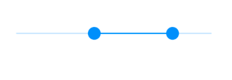
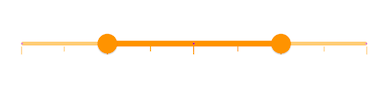

# Enabled and disabled state in range slider

This section helps to learn about the enabled and disabled state in the Flutter range slider.

## Enabled state

The range slider will be in enabled state if [`onChanged`](https://pub.dev/documentation/syncfusion_flutter_sliders/latest/sliders/SfRangeSlider/onChanged.html) is set.




SfRangeValues _values = SfRangeValues(3.0, 7.0);

@override
Widget build(BuildContext context) {
  return MaterialApp(
      home: Scaffold(
          body: Center(
              child: SfRangeSlider(
                    min: 0.0,
                    max: 10.0,
                    values: _values,
                    onChanged: (SfRangeValues newValues) {
                       setState(() {
                           _values = newValues;
                        });
                   },
              )
          )
      )
  );
}




## Disabled state

The range slider will be in disabled state if [`onChanged`](https://pub.dev/documentation/syncfusion_flutter_sliders/latest/sliders/SfRangeSlider/onChanged.html) is `null`.




SfRangeValues _values = SfRangeValues(3.0, 7.0);

@override
Widget build(BuildContext context) {
  return MaterialApp(
      home: Scaffold(
          body: Center(
              child: SfRangeSlider(
                    min: 0.0,
                    max: 10.0,
                    values: _values,
              )
          )
      )
  );
}




## Disabled color

You can change,

* The color of the active and inactive track in disabled state using the [`disabledActiveTrackColor`](https://pub.dev/documentation/syncfusion_flutter_core/latest/theme/SfRangeSliderThemeData/disabledActiveTrackColor.html) and [`disabledInactiveTrackColor`](https://pub.dev/documentation/syncfusion_flutter_core/latest/theme/SfRangeSliderThemeData/disabledInactiveTrackColor.html) properties.
* The color of the active and inactive major ticks in disabled state using the [`disabledActiveTickColor`](https://pub.dev/documentation/syncfusion_flutter_core/latest/theme/SfRangeSliderThemeData/disabledActiveTickColor.html) and [`disabledInactiveTickColor`](https://pub.dev/documentation/syncfusion_flutter_core/latest/theme/SfRangeSliderThemeData/disabledInactiveTickColor.html) properties.
* The color of the active and inactive minor ticks in disabled state using the [`disabledActiveMinorTickColor`](https://pub.dev/documentation/syncfusion_flutter_core/latest/theme/SfRangeSliderThemeData/disabledActiveMinorTickColor.html) and [`disabledInactiveMinorTickColor`](https://pub.dev/documentation/syncfusion_flutter_core/latest/theme/SfRangeSliderThemeData/disabledInactiveMinorTickColor.html) properties.
* The color of the active and inactive divisors in disabled state using the [`disabledActiveDivisorColor`](https://pub.dev/documentation/syncfusion_flutter_core/latest/theme/SfRangeSliderThemeData/disabledActiveDivisorColor.html) and [`disabledInactiveDivisorColor`](https://pub.dev/documentation/syncfusion_flutter_core/latest/theme/SfRangeSliderThemeData/disabledInactiveDivisorColor.html) properties.
* The color of the thumb in disabled state using the [`disabledThumbColor`](https://pub.dev/documentation/syncfusion_flutter_core/latest/theme/SfRangeSliderThemeData/disabledThumbColor.html) property.

N> You must import the `theme.dart` library from the [`Core`](https://pub.dev/packages/syncfusion_flutter_core) package to use [`SfRangeSliderTheme`](https://pub.dev/documentation/syncfusion_flutter_core/latest/theme/SfRangeSliderTheme-class.html).




SfRangeValues _values = SfRangeValues(4.0, 8.0);

@override
Widget build(BuildContext context) {
  return MaterialApp(
      home: Scaffold(
          body: Center(
              child: SfRangeSliderTheme(
                    data: SfRangeSliderThemeData(
                        disabledActiveTrackColor: Colors.orange,
                        disabledInactiveTrackColor: Colors.orange[200],
                        disabledActiveTickColor: Colors.orange,
                        disabledInactiveTickColor: Colors.orange[200],
                        disabledActiveMinorTickColor: Colors.orange,
                        disabledInactiveMinorTickColor: Colors.orange[200],
                        disabledActiveDivisorColor: Colors.purple,
                        disabledInactiveDivisorColor: Colors.purple[200],
                        disabledThumbColor: Colors.orange,
                    ),
                    child:  SfRangeSlider(
                     min: 2.0,
                     max: 10.0,
                     interval: 2,
                     showTicks: true,
                     minorTicksPerInterval: 1,
                     showDivisors: true,
                     values: _values,
                  ),
              )
          )
      )
  );
}




