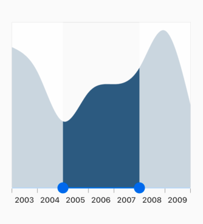

# Getting Started
This section explains the steps required to add the range slider widget and its elements such as thumb, overlay, tick, numeric and date time labels. This section covers only basic features needed to get started with Syncfusion range slider widget.

## Add flutter range slider to an application
Create a simple project using the instructions given in the [Getting Started with your first Flutter app](https://flutter.dev/docs/get-started/test-drive?tab=vscode#create-app) documentation.

**Add dependency**

Add the Syncfusion flutter range slider dependency to your pubspec.yaml file.



dependencies:

syncfusion_flutter_sliders: ^18.1.36-beta



**Get packages** 

Run the following command to get the required packages.



$ flutter pub get



**Import package**

Import the following package in your Dart code.




import 'package:syncfusion_flutter_sliders/sliders.dart';




## Initialize range slider

After importing the package, initialize the range slider widget as a child of any widget. Here, the range slider widget is added as a child of the Container widget.




@override
Widget build(BuildContext context) {
  return MaterialApp(
      home: Scaffold(
          body: Center(
              child: Container(
                  child: SfRangeSlider(
                    values: _values,
                    onChanged: (dynamic values){
                      setState(() {
                        _values = values;
                      });
                    },
                  )
              )
          )
      )
  );
}
	



## Add numeric labels

Add range slider with ticks, numeric labels and minimum and maximum values to restrict slider range.




@override
Widget build(BuildContext context) {
  return Scaffold(
    body: Center(
      child: Container(
        child: SfRangeSlider(
          min: _min,
          max: _max,
          values: _values,
          interval: 20,
          showTicks: true,
          showLabels: true,
          minorTicksPerInterval: 1,
          onChanged: (SfRangeValues value) {
            setState(() {
              _values = value;
            });
          },
        ),
      ),
    ),
  );
}




## Add date time labels

Add range slider with tick and date time labels.




@override
  Widget build(BuildContext context) {
    return Scaffold(
      body: Center(
        child: Container(
          child: SfRangeSlider(
            min: _min,
            max: _max,
            values: _values,
            interval: 2,
            showTicks: true,
            showLabels: true,
            minorTicksPerInterval: 1,
            dateIntervalType: DateIntervalType.years,
            dateFormat: DateFormat.y(),
            onChanged: (SfRangeValues value) {
              setState(() {
                _values = value;
              });
            },
          ),
        ),
      ),
    );
  }




## Initialize the range selector

You can add any kind of widget as a child of range selector. Here, chart widget is added as a child.




@override
Widget build(BuildContext context) {
  final ThemeData themeData = Theme.of(context);
  final dynamic device = MediaQuery.of(context);
  return Container(
      margin: const EdgeInsets.all(0),
      padding: const EdgeInsets.all(0),
      child: Stack(
        children: <Widget>[
          Padding(
            padding: const EdgeInsets.only(top: 10),
            child: Center(
              child: SfRangeSelector(
                min: dateTimeMin,
                max: dateTimeMax,
                initialValues: _dateTimeValues,
                labelPlacement: LabelPlacement.betweenTicks,
                interval: 1,
                dateFormat: DateFormat.y(),
                showTicks: true,
                showLabels: true,
                showTooltip: true,
                tooltipTextFormatterCallback: (dynamic actual,
                    String formatted) {
                  return DateFormat.yMMMd().format(actual).toString();
                },
                onChanged: (SfRangeValues values) {},
                child: Container(
                  child: SfCartesianChart(
                    margin: const EdgeInsets.all(0),
                    primaryXAxis: DateTimeAxis(minimum: dateTimeMin,
                      maximum: dateTimeMax,
                      isVisible: false,),
                    primaryYAxis: NumericAxis(isVisible: false, maximum: 4),
                    series: <SplineAreaSeries<Data, DateTime>>[
                      SplineAreaSeries<Data, DateTime>(
                          dataSource: chartData,
                          xValueMapper: (Data sales, _) => sales.x,
                          yValueMapper: (Data sales, _) => sales.y)
                    ],
                  ),
                  height: device.orientation == Orientation.portrait
                      ? device.size.height * 0.45
                      : device.size.height * 0.4,
                ),
              ),
            ),
          ),
        ],
      ));
}







class Data {
  Data({this.x, this.y});
  final DateTime x;
  final double y;
}




