# Getting started with Flutter Range Slider (SfRangeSlider)
This section explains the steps required to add the range slider widget and its elements such as numeric and date values, ticks, labels and tooltips. This section covers only basic features needed to know to get started with Syncfusion range slider.

To get start quickly with our Flutter Range Slider widget, you can check on this video.

<iframe id='FlutterRangeSliderVideoTutorial' src='https://www.youtube.com/embed/ndF9XToq4rI'></iframe>

## Add Flutter range slider to an application
Create a simple project using the instructions given in the [Getting Started with your first Flutter app](https://flutter.dev/docs/get-started/test-drive?tab=vscode#create-app) documentation.

**Add dependency**

Add the Syncfusion Flutter range slider dependency to your pubspec.yaml file.



dependencies:

syncfusion_flutter_sliders: ^xx.x.xx



N> Here **xx.x.xx** denotes the current version of [`Syncfusion Flutter Sliders`](https://pub.dev/packages/syncfusion_flutter_sliders/versions) package.

**Get packages** 

Run the following command to get the required packages.



$ flutter pub get



**Import package**

Import the following package in your Dart code.




import 'package:syncfusion_flutter_sliders/sliders.dart';




## Initialize range slider

After importing the package, initialize the range slider widget as a child of any widget. Here, the range slider widget is added as a child of the Container widget. The default value of the [`min`](https://pub.dev/documentation/syncfusion_flutter_sliders/latest/sliders/SfRangeSlider/min.html) and [`max`](https://pub.dev/documentation/syncfusion_flutter_sliders/latest/sliders/SfRangeSlider/max.html) properties of the [`SfRangeSlider`](https://pub.dev/documentation/syncfusion_flutter_sliders/latest/sliders/SfRangeSlider-class.html) is 0.0 and 1.0 respectively. So, the [`values`](https://pub.dev/documentation/syncfusion_flutter_sliders/latest/sliders/SfRangeSlider/values.html) property must be given within the range.

N> The range slider passes the new values to the [`onChanged`](https://pub.dev/documentation/syncfusion_flutter_sliders/latest/sliders/SfRangeSlider/onChanged.html) callback but does not change its state until the parent widget rebuilds the range slider with new values.

### Horizontal




SfRangeValues _values = const SfRangeValues(0.3, 0.7);

@override
Widget build(BuildContext context) {
  return MaterialApp(
      home: Scaffold(
          body: Center(
              child: Container(
                  child: SfRangeSlider(
                    values: _values,
                    onChanged: (dynamic values){
                      setState(() {
                        _values = values;
                      });
                    },
                  )
              )
          )
      )
  );
}
	



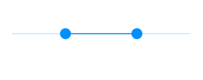

### Vertical




SfRangeValues _values = const SfRangeValues(0.3, 0.7);

@override
Widget build(BuildContext context) {
  return MaterialApp(
      home: Scaffold(
          body: Center(
              child: Container(
                  child: SfRangeSlider.vertical(
                    values: _values,
                    onChanged: (dynamic values){
                      setState(() {
                        _values = values;
                      });
                    },
                  )
              )
          )
      )
  );
}




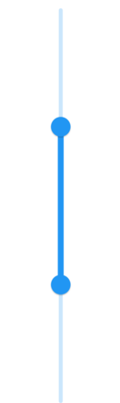

## Handle range change

The [`onChanged`](https://pub.dev/documentation/syncfusion_flutter_sliders/latest/sliders/SfRangeSlider/onChanged.html) callback is used to get the current value of the range slider when the user selects a value through interaction.

N> The range slider passes the new values to the callback but does not change its state until the parent widget rebuilds the range slider with new values.

### Horizontal




SfRangeValues _values = SfRangeValues(3.0, 7.0);

@override
Widget build(BuildContext context) {
  return MaterialApp(
      home: Scaffold(
          body: Center(
              child: SfRangeSlider(
                    min: 0.0,
                    max: 10.0,
                    values: _values,
                    onChanged: (SfRangeValues newValues) {
                       setState(() {
                           _values = newValues;
                        });
                   },
              )
          )
      )
  );
}




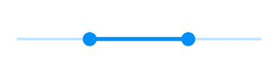

### Vertical




SfRangeValues _values = SfRangeValues(3.0, 7.0);

@override
Widget build(BuildContext context) {
  return MaterialApp(
      home: Scaffold(
          body: Center(
              child: SfRangeSlider.vertical(
                    min: 0.0,
                    max: 10.0,
                    values: _values,
                    onChanged: (SfRangeValues newValues) {
                       setState(() {
                           _values = newValues;
                        });
                   },
              )
          )
      )
  );
}




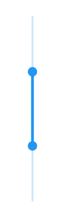

## Set numeric range

You can show numeric values in the range slider by setting `double` values to the [`min`](https://pub.dev/documentation/syncfusion_flutter_sliders/latest/sliders/SfRangeSlider/min.html), [`max`](https://pub.dev/documentation/syncfusion_flutter_sliders/latest/sliders/SfRangeSlider/max.html) and [`values`](https://pub.dev/documentation/syncfusion_flutter_sliders/latest/sliders/SfRangeSlider/values.html) properties.

### Horizontal




final double _min = 0;
final double _max = 100;
SfRangeValues _values = const SfRangeValues(40.0, 60.0);

@override
Widget build(BuildContext context) {
  return Scaffold(
    body: Center(
      child: Container(
        child: SfRangeSlider(
          min: _min,
          max: _max,
          values: _values,
          interval: 20,
          showLabels: true,
          onChanged: (SfRangeValues value) {
            setState(() {
              _values = value;
            });
          },
        ),
      ),
    ),
  );
}




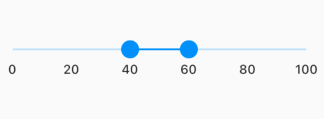

### Vertical




final double _min = 0;
final double _max = 100;
SfRangeValues _values = const SfRangeValues(40.0, 60.0);

@override
Widget build(BuildContext context) {
  return Scaffold(
    body: Center(
      child: Container(
       child: SfRangeSlider.vertical(
                 min: _min,
                 max: _max,
                 values: _values,
                 interval: 20,
                 showLabels: true,
                 onChanged: (SfRangeValues value) {
                   setState(() {
                     _values = value;
                   });
          },
        ),
      ),
    ),
  );
}




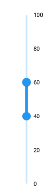

## Set date range

You can show date values in the range slider by setting `DateTime` values to the [`min`](https://pub.dev/documentation/syncfusion_flutter_sliders/latest/sliders/SfRangeSlider/min.html), [`max`](https://pub.dev/documentation/syncfusion_flutter_sliders/latest/sliders/SfRangeSlider/max.html) and [`values`](https://pub.dev/documentation/syncfusion_flutter_sliders/latest/sliders/SfRangeSlider/values.html) properties.

N> You must import [`intl`](https://pub.dev/packages/intl) package for formatting date range slider using the [`DateFormat`](https://pub.dev/documentation/intl/latest/intl/DateFormat-class.html) class.

### Horizontal




DateTime _min = DateTime(2008, 01, 01);
DateTime _max = DateTime(2018, 01, 01);
SfRangeValues _values = SfRangeValues(DateTime(2012, 01, 01), DateTime(2014, 01, 01));

@override
Widget build(BuildContext context) {
  return Scaffold(
    body: Center(
      child: Container(
        child: SfRangeSlider(
          min: _min,
          max: _max,
          values: _values,
          interval: 2,
          showLabels: true,
          dateIntervalType: DateIntervalType.years,
          dateFormat: DateFormat.y(),
          onChanged: (SfRangeValues value) {
            setState(() {
              _values = value;
            });
          },
        ),
      ),
    ),
  );
}




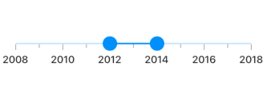

### Vertical




DateTime _min = DateTime(2008, 01, 01);
DateTime _max = DateTime(2018, 01, 01);
SfRangeValues _values = SfRangeValues(DateTime(2012, 01, 01), DateTime(2014, 01, 01));

@override
Widget build(BuildContext context) {
  return Scaffold(
    body: Center(
      child: Container(
        child: SfRangeSlider.vertical(
          min: _min,
          max: _max,
          values: _values,
          interval: 2,
          showLabels: true,
          dateIntervalType: DateIntervalType.years,
          dateFormat: DateFormat.y(),
          onChanged: (SfRangeValues value) {
            setState(() {
              _values = value;
            });
          },
        ),
      ),
    ),
  );
}




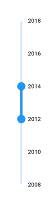

## Enable ticks

You can enable ticks in the range slider using the [`showTicks`](https://pub.dev/documentation/syncfusion_flutter_sliders/latest/sliders/SfRangeSlider/showTicks.html) property.

### Horizontal




final double _min = 0;
final double _max = 100;
SfRangeValues _values = const SfRangeValues(40.0, 60.0);

@override
Widget build(BuildContext context) {
  return Scaffold(
    body: Center(
      child: Container(
        child: SfRangeSlider(
          min: _min,
          max: _max,
          values: _values,
          interval: 20,
          showTicks: true,
          showLabels: true,
          onChanged: (SfRangeValues value) {
            setState(() {
              _values = value;
            });
          },
        ),
      ),
    ),
  );
}




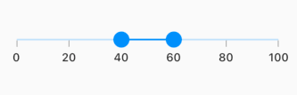

### Vertical




final double _min = 0;
final double _max = 100;
SfRangeValues _values = const SfRangeValues(40.0, 60.0);

@override
Widget build(BuildContext context) {
  return Scaffold(
    body: Center(
      child: Container(
        child: SfRangeSlider.vertical(
          min: _min,
          max: _max,
          values: _values,
          interval: 20,
          showTicks: true,
          showLabels: true,
          onChanged: (SfRangeValues value) {
            setState(() {
              _values = value;
            });
          },
        ),
      ),
    ),
  );
}




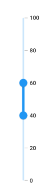

## Inverse the horizontal range slider

You can invert the horizontal range slider by wrapping the range slider to the [`Directionality`](https://api.flutter.dev/flutter/widgets/Directionality-class.html) widget by setting [`textDirection`](https://api.flutter.dev/flutter/widgets/Directionality/textDirection.html) property to `TextDirection.rtl`.




SfRangeValues _values = SfRangeValues(20.0, 60.0);

@override
Widget build(BuildContext context) {
  return Scaffold(
    body:  Directionality(
      textDirection: TextDirection.rtl,
      child: SfRangeSlider(
        min: 0,
        max: 100,
        values: _values,
        interval: 20,
        showTicks: true,
        showLabels: true,
        onChanged: (SfRangeValues newValues) {
          setState(() {
            _values = newValues;
          });
        },
      ),
    ),
  );
}




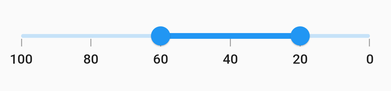

## Inverse the vertical range slider

You can invert the vertical range slider using the `isInversed` property. The default value of the `isInversed` property is `false`.




SfRangeValues _values = SfRangeValues(20.0, 60.0);

@override
Widget build(BuildContext context) {
  return Scaffold(
    body:  SfRangeSlider.vertical(
      min: 0,
      max: 100,
      values: _values,
      interval: 20,
      isInversed: true,
      showTicks: true,
      showLabels: true,
      onChanged: (SfRangeValues newValues) {
        setState(() {
          _values = newValues;
        });
      },
    ),
  );
}




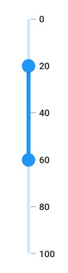

## Add prefix/suffix to labels

You can add prefix or suffix to the labels using the [`numberFormat`](https://pub.dev/documentation/syncfusion_flutter_sliders/latest/sliders/SfRangeSlider/numberFormat.html) or [`dateFormat`](https://pub.dev/documentation/syncfusion_flutter_sliders/latest/sliders/SfRangeSlider/dateFormat.html) properties.

N> The format type (numeric or date) of the range slider is determined based on the values specified in [`min`](https://pub.dev/documentation/syncfusion_flutter_sliders/latest/sliders/SfRangeSlider/min.html), [`max`](https://pub.dev/documentation/syncfusion_flutter_sliders/latest/sliders/SfRangeSlider/max.html) and [`values`](https://pub.dev/documentation/syncfusion_flutter_sliders/latest/sliders/SfRangeSlider/values.html) properties.

I> You must import [`intl`](https://pub.dev/packages/intl) package for formatting date range slider using the [`DateFormat`](https://pub.dev/documentation/intl/latest/intl/DateFormat-class.html) class and for formatting numeric range slider using the [`NumberFormat`](https://pub.dev/documentation/intl/latest/intl/NumberFormat-class.html) class.

### Horizontal




final double _min = 0;
final double _max = 100;
SfRangeValues _values = const SfRangeValues(40.0, 60.0);

@override
Widget build(BuildContext context) {
  return Scaffold(
    body: Center(
      child: Container(
        child: SfRangeSlider(
          min: _min,
          max: _max,
          values: _values,
          interval: 20,
          showTicks: true,
          showLabels: true,
          numberFormat: NumberFormat("\$"),
          onChanged: (SfRangeValues value) {
            setState(() {
              _values = value;
            });
          },
        ),
      ),
    ),
  );
}




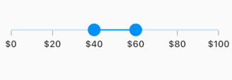

### Vertical




final double _min = 0;
final double _max = 100;
SfRangeValues _values = const SfRangeValues(40.0, 60.0);

@override
Widget build(BuildContext context) {
  return Scaffold(
    body: Center(
      child: Container(
        child: SfRangeSlider.vertical(
          min: _min,
          max: _max,
          values: _values,
          interval: 20,
          showTicks: true,
          showLabels: true,
          numberFormat: NumberFormat("\$"),
          onChanged: (SfRangeValues value) {
            setState(() {
              _values = value;
            });
          },
        ),
      ),
    ),
  );
}




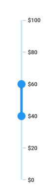