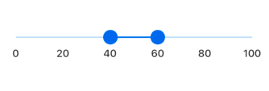
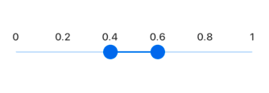

# Label Customization

The SfRangeSlider provides an option to show or hide the label and color customization.

## Show label

This property is used to display labels for the ticks. When it sets to true, it displays the label for all the ticks. The default value of the `showLabels` property is `false`.




SfRangeSlider sliderWithLabel() {
   return
     SfRangeSlider(
        interval: 0.2,
        showLabels: true,
        values: _values,
        onChanged: (dynamic values) {
          setState(() {
            _values = values;
          });
       }
   );
}




## Label offset

This property is used to position the label based on the offset value from the track position. The default value of the `labelOffset` property is `Offset(0.0, 13.0)`.




SfRangeSliderTheme sliderWithLabel() {
   return SfRangeSliderTheme(
     data: SfRangeSliderThemeData(
         labelOffset: Offset(0, -30),
     ),
     child: SfRangeSlider(
         interval: 0.2,
         showLabels: true,
         values: _values,
         onChanged: (dynamic values) {
           setState(() {
             _values = values;
           });
         }),
   );
}




