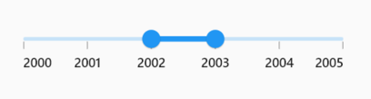
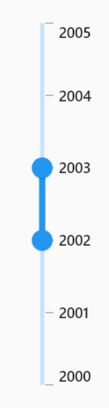
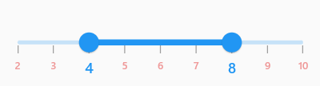
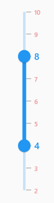

# Labels in Flutter Range Slider (SfRangeSlider)
This section explains about how to add the labels and dividers in the range slider.

## Show labels

The [`showLabels`](https://pub.dev/documentation/syncfusion_flutter_sliders/latest/sliders/SfRangeSlider/showLabels.html) property is used to render the labels at given interval. The default value of [`showLabels`](https://pub.dev/documentation/syncfusion_flutter_sliders/latest/sliders/SfRangeSlider/showLabels.html) property is `false`.

### Horizontal




SfRangeValues _values = SfRangeValues(4.0, 6.0);

@override
Widget build(BuildContext context) {
  return MaterialApp(
      home: Scaffold(
          body: Center(
              child: SfRangeSlider(
                    min: 0.0,
                    max: 10.0,
                    interval: 2,
                    showLabels: true,
                    showTicks: true,
                    values: _values,
                    onChanged: (SfRangeValues newValues) {
                        setState(() {
                            _values = newValues;
                        });
                   },
              ),
          )
      )
  );
}




### Vertical



SfRangeValues _values = SfRangeValues(4.0, 6.0);

@override
Widget build(BuildContext context) {
  return MaterialApp(
      home: Scaffold(
          body: Center(
              child: SfRangeSlider.vertical(
                    min: 0.0,
                    max: 10.0,
                    interval: 2,
                    showLabels: true,
                    showTicks: true,
                    values: _values,
                    onChanged: (SfRangeValues newValues) {
                        setState(() {
                            _values = newValues;
                        });
                   },
              ),
          )
      )
  );
}




N>
* Refer the [`numberFormat`](https://pub.dev/documentation/syncfusion_flutter_sliders/latest/sliders/SfRangeSlider/numberFormat.html) and [`dateFormat`](https://pub.dev/documentation/syncfusion_flutter_sliders/latest/sliders/SfRangeSlider/dateFormat.html) for formatting the numeric and date labels respectively.
* Refer the [`SfRangeSliderThemeData`](https://pub.dev/documentation/syncfusion_flutter_core/latest/theme/SfRangeSliderThemeData-class.html) for customizing the appearance of the labels.

## Number format

The [`numberFormat`](https://pub.dev/documentation/syncfusion_flutter_sliders/latest/sliders/SfRangeSlider/numberFormat.html) property is used to format the numeric labels. The default value of [`numberFormat`](https://pub.dev/documentation/syncfusion_flutter_sliders/latest/sliders/SfRangeSlider/numberFormat.html) property is `null`.

N> You must import [`intl`](https://pub.dev/packages/intl) package for formatting numeric range slider using the [`NumberFormat`](https://pub.dev/documentation/intl/latest/intl/NumberFormat-class.html) class.

### Horizontal




SfRangeValues _values = SfRangeValues(4.0, 6.0);

@override
Widget build(BuildContext context) {
  return MaterialApp(
      home: Scaffold(
          body: Center(
              child: SfRangeSlider(
                     min: 0.0,
                     max: 10.0,
                     values: _values,
                     interval: 2,
                     showTicks: true,
                     showLabels: true,
                     numberFormat: NumberFormat("\$"),
                     onChanged: (SfRangeValues newValues) {
                        setState(() {
                            _values = newValues;
                        });
                   },
              ),
          )
      )
  );
}




### Vertical




SfRangeValues _values = SfRangeValues(4.0, 6.0);

@override
Widget build(BuildContext context) {
  return MaterialApp(
      home: Scaffold(
          body: Center(
              child: SfRangeSlider.vertical(
                     min: 0.0,
                     max: 10.0,
                     values: _values,
                     interval: 2,
                     showTicks: true,
                     showLabels: true,
                     numberFormat: NumberFormat("\$"),
                     onChanged: (SfRangeValues newValues) {
                        setState(() {
                            _values = newValues;
                        });
                   },
              ),
          )
      )
  );
}




## Date format

The [`dateFormat`](https://pub.dev/documentation/syncfusion_flutter_sliders/latest/sliders/SfRangeSlider/dateFormat.html) property is used to format the date labels. It is mandatory for date [`SfRangeSlider`](https://pub.dev/documentation/syncfusion_flutter_sliders/latest/sliders/SfRangeSlider-class.html). For date values, the range slider does not have auto interval support. So, it is mandatory to set [`interval`](https://pub.dev/documentation/syncfusion_flutter_sliders/latest/sliders/SfRangeSlider/interval.html), [`dateIntervalType`](https://pub.dev/documentation/syncfusion_flutter_sliders/latest/sliders/SfRangeSlider/dateIntervalType.html), and [`dateFormat`](https://pub.dev/documentation/syncfusion_flutter_sliders/latest/sliders/SfRangeSlider/dateFormat.html) for date values. The default value of [`dateFormat`](https://pub.dev/documentation/syncfusion_flutter_sliders/latest/sliders/SfRangeSlider/dateFormat.html) property is `null`.

N> You must import [`intl`](https://pub.dev/packages/intl) package for formatting date range slider using the [`DateFormat`](https://pub.dev/documentation/intl/latest/intl/DateFormat-class.html) class.

### Year format

#### Horizontal




SfRangeValues _values = SfRangeValues(DateTime(2002, 01, 01), DateTime(2003, 01, 01));

@override
Widget build(BuildContext context) {
  return MaterialApp(
      home: Scaffold(
          body: Center(
              child: SfRangeSlider.vertical(
                    min: DateTime(2000, 01, 01, 00),
                    max: DateTime(2004, 12, 31, 24),
                    values: _values,
                    interval: 1,
                    showLabels: true,
                    showTicks: true,
                    dateFormat: DateFormat.y(),
                    dateIntervalType: DateIntervalType.years,
                    onChanged: (SfRangeValues newValues) {
                        setState(() {
                            _values = newValues;
                        });
                   },
              ),
          )
      )
  );
}




#### Vertical




SfRangeValues _values = SfRangeValues(DateTime(2002, 01, 01), DateTime(2003, 01, 01));

@override
Widget build(BuildContext context) {
  return MaterialApp(
      home: Scaffold(
          body: Center(
              child: SfRangeSlider.vertical(
                    min: DateTime(2000, 01, 01, 00),
                    max: DateTime(2004, 12, 31, 24),
                    values: _values,
                    interval: 1,
                    showLabels: true,
                    showTicks: true,
                    dateFormat: DateFormat.y(),
                    dateIntervalType: DateIntervalType.years,
                    onChanged: (SfRangeValues newValues) {
                        setState(() {
                            _values = newValues;
                        });
                   },
              ),
          )
      )
  );
}




### Month format

#### Horizontal




SfRangeValues _values = SfRangeValues(DateTime(2000, 03, 01), DateTime(2000, 07, 01));

@override
Widget build(BuildContext context) {
  return MaterialApp(
      home: Scaffold(
          body: Center(
              child: SfRangeSlider(
                    min: DateTime(2000, 01, 01, 00),
                    max: DateTime(2000, 09, 01, 24),
                    values: _values,
                    interval: 2,
                    showLabels: true,
                    showTicks: true,
                    dateFormat: DateFormat.yM(),
                    dateIntervalType: DateIntervalType.months,
                    onChanged: (SfRangeValues newValues) {
                        setState(() {
                            _values = newValues;
                        });
                    },
              ),
          )
      )
  );
}




#### Vertical




SfRangeValues _values = SfRangeValues(DateTime(2000, 03, 01), DateTime(2000, 07, 01));

@override
Widget build(BuildContext context) {
  return MaterialApp(
      home: Scaffold(
          body: Center(
              child: SfRangeSlider.vertical(
                    min: DateTime(2000, 01, 01, 00),
                    max: DateTime(2000, 09, 01, 24),
                    values: _values,
                    interval: 2,
                    showLabels: true,
                    showTicks: true,
                    dateFormat: DateFormat.yM(),
                    dateIntervalType: DateIntervalType.months,
                    onChanged: (SfRangeValues newValues) {
                        setState(() {
                            _values = newValues;
                        });
                    },
              ),
          )
      )
  );
}




### Hour format

#### Horizontal




SfRangeValues _values = SfRangeValues(DateTime(2000, 01, 01, 07, 00, 00), DateTime(2000, 01, 01, 17, 00, 00));

@override
Widget build(BuildContext context) {
  return MaterialApp(
      home: Scaffold(
          body: Center(
              child: SfRangeSlider(
                  min: DateTime(2000, 01, 01, 02, 00, 00),
                  max: DateTime(2000, 01, 01, 22, 00, 00),
                  values: _values,
                  interval: 5,
                  showLabels: true,
                  showTicks: true,
                  dateFormat: DateFormat('h:mm a'),
                  dateIntervalType: DateIntervalType.hours,
                  onChanged: (SfRangeValues newValues) {
                       setState(() {
                            _values = newValues;
                       });
                  },
              ),
          )
      )
  );
}




#### Vertical




SfRangeValues _values = SfRangeValues(DateTime(2000, 01, 01, 07, 00, 00), DateTime(2000, 01, 01, 17, 00, 00));

@override
Widget build(BuildContext context) {
  return MaterialApp(
      home: Scaffold(
          body: Center(
              child: SfRangeSlider.vertical(
                  min: DateTime(2000, 01, 01, 02, 00, 00),
                  max: DateTime(2000, 01, 01, 22, 00, 00),
                  values: _values,
                  interval: 5,
                  showLabels: true,
                  showTicks: true,
                  dateFormat: DateFormat('h:mm a'),
                  dateIntervalType: DateIntervalType.hours,
                  onChanged: (SfRangeValues newValues) {
                       setState(() {
                            _values = newValues;
                       });
                  },
              ),
          )
      )
  );
}




N> Refer the [`DateFormat`](https://pub.dev/documentation/intl/latest/intl/DateFormat-class.html) class for other date format.

## Label placement

The [`labelPlacement`](https://pub.dev/documentation/syncfusion_flutter_sliders/latest/sliders/SfRangeSlider/labelPlacement.html) property is used to place the labels either between the major ticks or on the major ticks. The default value of [`labelPlacement`](https://pub.dev/documentation/syncfusion_flutter_sliders/latest/sliders/SfRangeSlider/labelPlacement.html) property is `LabelPlacement.onTicks`.

### Horizontal




SfRangeValues _values = SfRangeValues(DateTime(2002, 01, 01), DateTime(2003, 01, 01));

@override
Widget build(BuildContext context) {
  return MaterialApp(
      home: Scaffold(
          body: Center(
              child: SfRangeSlider(
                    min: DateTime(2000, 01, 01, 00),
                    max: DateTime(2004, 12, 31, 24),
                    values: _values,
                    interval: 1,
                    showLabels: true,
                    showTicks: true,
                    labelPlacement: LabelPlacement.betweenTicks,
                    dateFormat: DateFormat.y(),
                    dateIntervalType: DateIntervalType.years,
                    onChanged: (SfRangeValues newValues) {
                        setState(() {
                            _values = newValues;
                        });
                   },
              ),
          )
      )
  );
}




### Vertical




SfRangeValues _values = SfRangeValues(DateTime(2002, 01, 01), DateTime(2003, 01, 01));

@override
Widget build(BuildContext context) {
  return MaterialApp(
      home: Scaffold(
          body: Center(
              child: SfRangeSlider.vertical(
                    min: DateTime(2000, 01, 01, 00),
                    max: DateTime(2004, 12, 31, 24),
                    values: _values,
                    interval: 1,
                    showLabels: true,
                    showTicks: true,
                    labelPlacement: LabelPlacement.betweenTicks,
                    dateFormat: DateFormat.y(),
                    dateIntervalType: DateIntervalType.years,
                    onChanged: (SfRangeValues newValues) {
                        setState(() {
                            _values = newValues;
                        });
                   },
              ),
          )
      )
  );
}




## Edge label placement

The [`edgeLabelPlacement`](https://pub.dev/documentation/syncfusion_flutter_sliders/latest/sliders/SfRangeSlider/edgeLabelPlacement.html) property determines how the edge (first and last) labels are positioned on the range slider. This property allows the edge labels to be placed either inside the major ticks or directly on the major ticks.

The default value of [`edgeLabelPlacement`](https://pub.dev/documentation/syncfusion_flutter_sliders/latest/sliders/SfRangeSlider/edgeLabelPlacement.html) property is `EdgeLabelPlacement.auto`.

### Horizontal




SfRangeValues _values = SfRangeValues(DateTime(2002, 01, 01), DateTime(2003, 01, 01));

@override
Widget build(BuildContext context) {
  return MaterialApp(
      home: Scaffold(
          body: Center(
              child: SfRangeSlider(
                    min: DateTime(2000, 01, 01, 00),
                    max: DateTime(2004, 12, 31, 24),
                    values: _values,
                    interval: 1,
                    showLabels: true,
                    showTicks: true,
                    edgeLabelPlacement: EdgeLabelPlacement.inside,
                    dateFormat: DateFormat.y(),
                    dateIntervalType: DateIntervalType.years,
                    onChanged: (SfRangeValues newValues) {
                        setState(() {
                            _values = newValues;
                        });
                   },
              ),
          )
      )
  );
}




### Vertical




SfRangeValues _values = SfRangeValues(DateTime(2002), DateTime(2003));

@override
Widget build(BuildContext context) {
  return MaterialApp(
      home: Scaffold(
          body: Center(
              child: SfRangeSlider.vertical(
                    min: DateTime(2000, 01, 01, 00),
                    max: DateTime(2004, 12, 31, 24),
                    values: _values,
                    interval: 1,
                    showLabels: true,
                    showTicks: true,
                    edgeLabelPlacement: EdgeLabelPlacement.inside,
                    dateFormat: DateFormat.y(),
                    dateIntervalType: DateIntervalType.years,
                    onChanged: (SfRangeValues newValues) {
                        setState(() {
                            _values = newValues;
                        });
                   },
              ),
          )
      )
  );
}




## Customize label text

You can format or change the whole numeric or date label text using the [`labelFormatterCallback`](https://pub.dev/documentation/syncfusion_flutter_sliders/latest/sliders/SfRangeSlider/labelFormatterCallback.html). Its arguments are,

* actualValue – either `DateTime` or `double` based on given [`values`](https://pub.dev/documentation/syncfusion_flutter_sliders/latest/sliders/SfRangeSlider/values.html).
* formattedText – If the actual value is `double`, it is formatted by [`numberFormat`](https://pub.dev/documentation/syncfusion_flutter_sliders/latest/sliders/SfRangeSlider/numberFormat.html) and if the actual value is `DateTime`, it is formatted by [`dateFormat`](https://pub.dev/documentation/syncfusion_flutter_sliders/latest/sliders/SfRangeSlider/dateFormat.html).

>**NOTE**
* [`labelFormatterCallback`](https://pub.dev/documentation/syncfusion_flutter_sliders/latest/sliders/SfSlider/labelFormatterCallback.html) has been deprecated, you can use [`onLabelCreated`](https://pub.dev/documentation/syncfusion_flutter_sliders/latest/sliders/SfRangeSlider/onLabelCreated.html) callback to customize both the text and text style of the label.

### Horizontal




SfRangeValues _values = SfRangeValues(100.0, 9900.0);

@override
Widget build(BuildContext context) {
  return MaterialApp(
      home: Scaffold(
          body: Center(
              child: SfRangeSlider(
                    min: 100.0,
                    max: 10000.0,
                    values: _values,
                    showLabels: true,
                    interval: 9900,
                    labelFormatterCallback: (dynamic actualValue, String formattedText) {
                        return actualValue == 10000 ? '\$ $formattedText+' : '\$ $formattedText';
                    },
                    onChanged: (SfRangeValues newValues) {
                        setState(() {
                            _values = newValues;
                        });
                   },
              ),
          )
      )
  );
}




### Vertical




SfRangeValues _values = SfRangeValues(100.0, 9900.0);

@override
Widget build(BuildContext context) {
  return MaterialApp(
      home: Scaffold(
          body: Center(
              child: SfRangeSlider.vertical(
                    min: 100.0,
                    max: 10000.0,
                    values: _values,
                    showLabels: true,
                    interval: 9900,
                    labelFormatterCallback: (dynamic actualValue, String formattedText) {
                        return actualValue == 10000 ? '\$ $formattedText+' : '\$ $formattedText';
                    },
                    onChanged: (SfRangeValues newValues) {
                        setState(() {
                            _values = newValues;
                        });
                   },
              ),
          )
      )
  );
}




## Label style

You can change the active and inactive label appearance of the range slider using the [`activeLabelStyle`](https://pub.dev/documentation/syncfusion_flutter_core/latest/theme/SfSliderThemeData/activeLabelStyle.html) and [`inactiveLabelStyle`](https://pub.dev/documentation/syncfusion_flutter_core/latest/theme/SfSliderThemeData/inactiveLabelStyle.html) properties respectively.

The active side of the range slider is between start and end thumbs.

The inactive side of the range slider is between the [`min`](https://pub.dev/documentation/syncfusion_flutter_sliders/latest/sliders/SfRangeSlider/min.html) value and the left thumb, and the right thumb and the [`max`](https://pub.dev/documentation/syncfusion_flutter_sliders/latest/sliders/SfRangeSlider/max.html) value.

For RTL, the inactive side is between the [`max`](https://pub.dev/documentation/syncfusion_flutter_sliders/latest/sliders/SfRangeSlider/max.html) value and the left thumb, and the right thumb and the [`min`](https://pub.dev/documentation/syncfusion_flutter_sliders/latest/sliders/SfRangeSlider/min.html) value.

N> You must import the `theme.dart` library from the [`Core`](https://pub.dev/packages/syncfusion_flutter_core) package to use [`SfRangeSliderTheme`](https://pub.dev/documentation/syncfusion_flutter_core/latest/theme/SfRangeSliderTheme-class.html).

### Horizontal




SfRangeValues _values = SfRangeValues(4.0, 8.0);

@override
Widget build(BuildContext context) {
  return MaterialApp(
      home: Scaffold(
          body: Center(
              child: SfRangeSliderTheme(
                    data: SfRangeSliderThemeData(
                         activeLabelStyle: TextStyle(color: Colors.red, fontSize: 12, fontStyle: FontStyle.italic),
                         inactiveLabelStyle: TextStyle(color: Colors.red[200], fontSize: 12, fontStyle: FontStyle.italic),
                    ),
                    child:  SfRangeSlider(
                       min: 2.0,
                       max: 10.0,
                       values: _values,
                       interval: 1,
                       showLabels: true,
                       showTicks: true,
                       onChanged: (SfRangeValues newValues){
                            setState(() {
                                _values = newValues;
                            });
                        },
                    ),
              )
          )
      )
  );
}




### Vertical




SfRangeValues _values = SfRangeValues(4.0, 8.0);

@override
Widget build(BuildContext context) {
  return MaterialApp(
      home: Scaffold(
          body: Center(
              child: SfRangeSliderTheme(
                    data: SfRangeSliderThemeData(
                         activeLabelStyle: TextStyle(color: Colors.red, fontSize: 12, fontStyle: FontStyle.italic),
                         inactiveLabelStyle: TextStyle(color: Colors.red[200], fontSize: 12, fontStyle: FontStyle.italic),
                    ),
                    child:  SfRangeSlider.vertical(
                       min: 2.0,
                       max: 10.0,
                       values: _values,
                       interval: 1,
                       showLabels: true,
                       showTicks: true,
                       onChanged: (SfRangeValues newValues){
                            setState(() {
                                _values = newValues;
                            });
                        },
                    ),
              )
          )
      )
  );
}




## Individual label style

You can now customize the appearance of each label on the [`SfRangeSlider`](https://pub.dev/documentation/syncfusion_flutter_sliders/latest/sliders/SfRangeSlider-class.html) individually by using the [`onLabelCreated`](https://pub.dev/documentation/syncfusion_flutter_sliders/latest/sliders/SfRangeSlider/onLabelCreated.html) callback. This callback allows you to have complete control over the text and text style for each label.

## Horizontal




  SfRangeValues _values = const SfRangeValues(4.0, 8.0);

  @override
  Widget build(BuildContext context) {
    return Scaffold(
      body: Center(
        child: SfRangeSlider(
          min: 2.0,
          max: 10.0,
          values: _values,
          interval: 1,
          showLabels: true,
          showTicks: true,
          onChanged: (SfRangeValues newValues) {
            setState(() {
              _values = newValues;
            });
          },
          onLabelCreated: (
            dynamic actualValue,
            String text,
            TextStyle labelTextStyle,
          ) {
            final int value = actualValue.toInt();
            final int start = _values.start.toInt();
            final int end = _values.end.toInt();
            return RangeSliderLabel(
              text: text,
              textStyle:
                  (value == start || value == end)
                      ? const TextStyle(
                        color: Colors.blue,
                        fontSize: 14,
                      )
                      : TextStyle(
                        color: Colors.red[200],
                        fontSize: 10,
                      ),
            );
          },
        ),
      ),
    );
  }




## Vertical




  SfRangeValues _values = const SfRangeValues(4.0, 8.0);

  @override
  Widget build(BuildContext context) {
    return Scaffold(
      body: Center(
        child: SfRangeSlider.vertical(
          min: 2.0,
          max: 10.0,
          values: _values,
          interval: 1,
          showLabels: true,
          showTicks: true,
          onChanged: (SfRangeValues newValues) {
            setState(() {
              _values = newValues;
            });
          },
          onLabelCreated: (
            dynamic actualValue,
            String text,
            TextStyle labelTextStyle,
          ) {
            final int value = actualValue.toInt();
            final int start = _values.start.toInt();
            final int end = _values.end.toInt();
            return RangeSliderLabel(
              text: text,
              textStyle:
                  (value == start || value == end)
                      ? const TextStyle(
                        color: Colors.blue,
                        fontSize: 14,
                      )
                      : TextStyle(
                        color: Colors.red[200],
                        fontSize: 10,
                      ),
            );
          },
        ),
      ),
    );
  }




## Label offset

You can adjust the space between ticks and labels of the range slider using the [`labelOffset`](https://pub.dev/documentation/syncfusion_flutter_core/latest/theme/SfSliderThemeData/labelOffset.html) property.

N> You must import the `theme.dart` library from the [`Core`](https://pub.dev/packages/syncfusion_flutter_core) package to use [`SfRangeSliderTheme`](https://pub.dev/documentation/syncfusion_flutter_core/latest/theme/SfRangeSliderTheme-class.html).

### Horizontal

The default value of [`labelOffset`](https://pub.dev/documentation/syncfusion_flutter_core/latest/theme/SfSliderThemeData/labelOffset.html) property is `Offset(0.0, 13.0)` if the [`showTicks`](https://pub.dev/documentation/syncfusion_flutter_sliders/latest/sliders/SfRangeSlider/showTicks.html) property is `false`.
The default value of [`labelOffset`](https://pub.dev/documentation/syncfusion_flutter_core/latest/theme/SfSliderThemeData/labelOffset.html) property is `Offset(0.0, 5.0)` if the [`showTicks`](https://pub.dev/documentation/syncfusion_flutter_sliders/latest/sliders/SfRangeSlider/showTicks.html) property is `true`.




SfRangeValues _values = SfRangeValues(4.0, 8.0);

@override
Widget build(BuildContext context) {
  return MaterialApp(
      home: Scaffold(
          body: Center(
              child: SfRangeSliderTheme(
                    data: SfRangeSliderThemeData(
                        labelOffset: Offset(0.0, 10.0),
                    ),
                    child:  SfRangeSlider(
                       min: 2.0,
                       max: 10.0,
                       values: _values,
                       interval: 2,
                       showTicks: true,
                       showLabels: true,
                       onChanged: (SfRangeValues newValues){
                            setState(() {
                                _values = newValues;
                            });
                        },
                    ),
              )
          )
      )
  );
}




### Vertical

The default value of [`labelOffset`](https://pub.dev/documentation/syncfusion_flutter_core/latest/theme/SfSliderThemeData/labelOffset.html) property is `Offset(13.0, 0.0)` if the [`showTicks`](https://pub.dev/documentation/syncfusion_flutter_sliders/latest/sliders/SfRangeSlider/showTicks.html) property is `false`.
The default value of [`labelOffset`](https://pub.dev/documentation/syncfusion_flutter_core/latest/theme/SfSliderThemeData/labelOffset.html) property is `Offset(5.0, 0.0)` if the [`showTicks`](https://pub.dev/documentation/syncfusion_flutter_sliders/latest/sliders/SfRangeSlider/showTicks.html) property is `true`.




SfRangeValues _values = SfRangeValues(4.0, 8.0);

@override
Widget build(BuildContext context) {
  return MaterialApp(
      home: Scaffold(
          body: Center(
              child: SfRangeSliderTheme(
                    data: SfRangeSliderThemeData(
                        labelOffset: Offset(10.0, 0.0),
                    ),
                    child:  SfRangeSlider.vertical(
                       min: 2.0,
                       max: 10.0,
                       values: _values,
                       interval: 2,
                       showTicks: true,
                       showLabels: true,
                       onChanged: (SfRangeValues newValues){
                            setState(() {
                                _values = newValues;
                            });
                        },
                    ),
              )
          )
      )
  );
}




## Show dividers

The [`showDividers`](https://pub.dev/documentation/syncfusion_flutter_sliders/latest/sliders/SfRangeSlider/showDividers.html) property is used to render the dividers on the track. The default value of [`showDividers`](https://pub.dev/documentation/syncfusion_flutter_sliders/latest/sliders/SfRangeSlider/showDividers.html) property is `false`. It is a shape which is used to represent the major interval points of the track.

For example, if [`min`](https://pub.dev/documentation/syncfusion_flutter_sliders/latest/sliders/SfRangeSlider/min.html) is 0.0 and [`max`](https://pub.dev/documentation/syncfusion_flutter_sliders/latest/sliders/SfRangeSlider/max.html) is 10.0 and [`interval`](https://pub.dev/documentation/syncfusion_flutter_sliders/latest/sliders/SfRangeSlider/interval.html) is 2.0, the range slider will render the dividers at 0.0, 2.0, 4.0 and so on.

### Horizontal




SfRangeValues _values = SfRangeValues(4.0, 6.0);

@override
Widget build(BuildContext context) {
  return MaterialApp(
      home: Scaffold(
          body: Center(
              child: SfRangeSliderTheme(
                 data: SfRangeSliderThemeData(
                    activeTrackHeight: 5,
                    inactiveTrackHeight: 5,
                 ),
                 child: SfRangeSlider(
                    min: 0.0,
                    max: 10.0,
                    interval: 2,
                    showDividers: true,
                    values: _values,
                    onChanged: (SfRangeValues newValues) {
                        setState(() {
                           _values = newValues;
                        });
                    },
                 ),
              ),
          )
      )
  );
}




### Vertical




SfRangeValues _values = SfRangeValues(4.0, 6.0);

@override
Widget build(BuildContext context) {
  return MaterialApp(
      home: Scaffold(
          body: Center(
              child: SfRangeSliderTheme(
                 data: SfRangeSliderThemeData(
                    activeTrackHeight: 5,
                    inactiveTrackHeight: 5,
                 ),
                 child: SfRangeSlider.vertical(
                    min: 0.0,
                    max: 10.0,
                    interval: 2,
                    showDividers: true,
                    values: _values,
                    onChanged: (SfRangeValues newValues) {
                        setState(() {
                           _values = newValues;
                        });
                    },
                 ),
              ),
          )
      )
  );
}




## Divider radius

You can change the active and inactive divider radius of the range slider using the [`activeDividerRadius`](https://pub.dev/documentation/syncfusion_flutter_core/latest/theme/SfSliderThemeData/activeDividerRadius.html) and the [`inactiveDividerRadius`](https://pub.dev/documentation/syncfusion_flutter_core/latest/theme/SfSliderThemeData/inactiveDividerRadius.html) properties respectively.

N> You must import the `theme.dart` library from the [`Core`](https://pub.dev/packages/syncfusion_flutter_core) package to use [`SfRangeSliderTheme`](https://pub.dev/documentation/syncfusion_flutter_core/latest/theme/SfRangeSliderTheme-class.html).

### Horizontal




SfRangeValues _values = SfRangeValues(3.0, 7.0);

@override
Widget build(BuildContext context) {
  return MaterialApp(
      home: Scaffold(
          body: Center(
              child: SfRangeSliderTheme(
                 data: SfRangeSliderThemeData(
                    activeTrackHeight: 10,
                    inactiveTrackHeight: 10,
                    activeDividerRadius: 5,
                    inactiveDividerRadius: 5
                 ),
                 child: SfRangeSlider(
                    min: 0.0,
                    max: 10.0,
                    interval: 1,
                    showDividers: true,
                    values: _values,
                    onChanged: (SfRangeValues newValues) {
                        setState(() {
                           _values = newValues;
                        });
                    },
                 ),
              ),
          )
      )
  );
}




### Vertical




SfRangeValues _values = SfRangeValues(3.0, 7.0);

@override
Widget build(BuildContext context) {
  return MaterialApp(
      home: Scaffold(
          body: Center(
              child: SfRangeSliderTheme(
                 data: SfRangeSliderThemeData(
                    activeTrackHeight: 10,
                    inactiveTrackHeight: 10,
                    activeDividerRadius: 5,
                    inactiveDividerRadius: 5
                 ),
                 child: SfRangeSlider.vertical(
                    min: 0.0,
                    max: 10.0,
                    interval: 1,
                    showDividers: true,
                    values: _values,
                    onChanged: (SfRangeValues newValues) {
                        setState(() {
                           _values = newValues;
                        });
                    },
                 ),
              ),
          )
      )
  );
}




## Divider stroke width and stroke color

You can change the active and inactive divider stroke width of the range slider using the [`activeDividerStrokeWidth`](https://pub.dev/documentation/syncfusion_flutter_core/latest/theme/SfSliderThemeData/activeDividerStrokeWidth.html) and the [`inactiveDividerStrokeWidth`](https://pub.dev/documentation/syncfusion_flutter_core/latest/theme/SfSliderThemeData/inactiveDividerStrokeWidth.html) properties respectively.

Also, you can change the active and inactive divider stroke color of the range slider using the [`activeDividerStrokeColor`](https://pub.dev/documentation/syncfusion_flutter_core/latest/theme/SfSliderThemeData/activeDividerStrokeColor.html) and the [`inactiveDividerStrokeColor`](https://pub.dev/documentation/syncfusion_flutter_core/latest/theme/SfSliderThemeData/inactiveDividerStrokeColor.html) properties respectively.

N> You must import the `theme.dart` library from the [`Core`](https://pub.dev/packages/syncfusion_flutter_core) package to use [`SfRangeSliderTheme`](https://pub.dev/documentation/syncfusion_flutter_core/latest/theme/SfRangeSliderTheme-class.html).

### Horizontal




SfRangeValues _values = SfRangeValues(3.0, 7.0);

@override
Widget build(BuildContext context) {
  return MaterialApp(
      home: Scaffold(
          body: Center(
              child: SfRangeSliderTheme(
                 data: SfRangeSliderThemeData(
                     activeTrackHeight: 10,
                     inactiveTrackHeight: 10,
                     activeDividerRadius:4 ,
                     inactiveDividerRadius: 4,
                     activeDividerStrokeColor: Colors.red,
                     activeDividerStrokeWidth: 2,
                     inactiveDividerStrokeWidth: 2,
                     inactiveDividerStrokeColor: Colors.red,
                 ),
                 child: SfRangeSlider(
                    min: 0.0,
                    max: 10.0,
                    interval: 1,
                    showDividers: true,
                    values: _values,
                    onChanged: (SfRangeValues newValues) {
                        setState(() {
                           _values = newValues;
                        });
                    },
                 ),
              ),
          )
      )
  );
}




### Vertical




SfRangeValues _values = SfRangeValues(3.0, 7.0);

@override
Widget build(BuildContext context) {
  return MaterialApp(
      home: Scaffold(
          body: Center(
              child: SfRangeSliderTheme(
                 data: SfRangeSliderThemeData(
                     activeTrackHeight: 10,
                     inactiveTrackHeight: 10,
                     activeDividerRadius:4 ,
                     inactiveDividerRadius: 4,
                     activeDividerStrokeColor: Colors.red,
                     activeDividerStrokeWidth: 2,
                     inactiveDividerStrokeWidth: 2,
                     inactiveDividerStrokeColor: Colors.red,
                 ),
                 child: SfRangeSlider.vertical(
                    min: 0.0,
                    max: 10.0,
                    interval: 1,
                    showDividers: true,
                    values: _values,
                    onChanged: (SfRangeValues newValues) {
                        setState(() {
                           _values = newValues;
                        });
                    },
                 ),
              ),
          )
      )
  );
}




## Divider color

You can change the active and inactive divider color of the range slider using the [`activeDividerColor`](https://pub.dev/documentation/syncfusion_flutter_core/latest/theme/SfSliderThemeData/activeDividerColor.html) and [`inactiveDividerColor`](https://pub.dev/documentation/syncfusion_flutter_core/latest/theme/SfSliderThemeData/inactiveDividerColor.html) properties respectively.

N> You must import the `theme.dart` library from the [`Core`](https://pub.dev/packages/syncfusion_flutter_core) package to use [`SfRangeSliderTheme`](https://pub.dev/documentation/syncfusion_flutter_core/latest/theme/SfRangeSliderTheme-class.html).

### Horizontal




SfRangeValues _values = SfRangeValues(2.0, 8.0);

@override
Widget build(BuildContext context) {
  return MaterialApp(
      home: Scaffold(
          body: Center(
              child: SfRangeSliderTheme(
                    data: SfRangeSliderThemeData(
                         activeTrackHeight: 5,
                         inactiveTrackHeight: 5,
                         activeDividerColor: Colors.red,
                         inactiveDividerColor: Colors.red[200],
                    ),
                    child:  SfRangeSlider(
                      min: 0.0,
                      max: 10.0,
                      interval: 1,
                      showDividers: true,
                      values: _values,
                      onChanged: (SfRangeValues newValues){
                            setState(() {
                                _values = newValues;
                            });
                        },
                    )
              )
          )
      )
  );
}




### Vertical




SfRangeValues _values = SfRangeValues(2.0, 8.0);

@override
Widget build(BuildContext context) {
  return MaterialApp(
      home: Scaffold(
          body: Center(
              child: SfRangeSliderTheme(
                    data: SfRangeSliderThemeData(
                         activeTrackHeight: 5,
                         inactiveTrackHeight: 5,
                         activeDividerColor: Colors.red,
                         inactiveDividerColor: Colors.red[200],
                    ),
                    child:  SfRangeSlider.vertical(
                      min: 0.0,
                      max: 10.0,
                      interval: 1,
                      showDividers: true,
                      values: _values,
                      onChanged: (SfRangeValues newValues){
                            setState(() {
                                _values = newValues;
                            });
                        },
                    )
              )
          )
      )
  );
}




