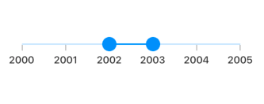

# Labels and divisors in range slider
This section explains about how to add the labels and divisors in the range slider.

## Show labels

Option to render the labels on given interval. The default value of `showLabels` property is `false`.




SfRangeValues _values = SfRangeValues(4.0, 6.0);

@override
Widget build(BuildContext context) {
  return MaterialApp(
      home: Scaffold(
          body: Center(
              child: SfRangeSlider(
                    min: 0.0,
                    max: 10.0,
                    interval: 2,
                    showLabels: true,
                    showTicks: true,
                    values: _values,
                    onChanged: (SfRangeValues newValues) {
                        setState(() {
                            _values = newValues;
                        });
                   },
              ),
          )
      )
  );
}




N>
* Refer the `numberFormat` and `dateFormat` for formatting the numeric and date labels respectively.
* Refer the `SfRangeSliderThemeData` for customizing the appearance of the labels.

## Number format

Formats the numeric labels. The default value of `numberFormat` property is `null`.

N> You must import the [`intl`](https://pub.dev/packages/intl) package for using number format in the range slider.




SfRangeValues _values = SfRangeValues(4.0, 6.0);

@override
Widget build(BuildContext context) {
  return MaterialApp(
      home: Scaffold(
          body: Center(
              child: SfRangeSlider(
                     min: 0.0,
                     max: 10.0,
                     values: _values,
                     interval: 2,
                     showTicks: true,
                     showLabels: true,
                     numberFormat: NumberFormat("\$"),
                     onChanged: (SfRangeValues newValues) {
                        setState(() {
                            _values = newValues;
                        });
                   },
              ),
          )
      )
  );
}




## Date format

Formats the date labels. It is mandatory for date `SfRangeSlider`. For date values, the range slider does not have auto interval support. So, it is mandatory to set `interval`, `dateIntervalType`, and `dateFormat` for date values. The default of `dateFormat` property is `null`.

N> You must import the [`intl`](https://pub.dev/packages/intl) package for using date format in the range slider.




SfRangeValues _values = SfRangeValues(DateTime(2002, 01, 01), DateTime(2003, 01, 01));

@override
Widget build(BuildContext context) {
  return MaterialApp(
      home: Scaffold(
          body: Center(
              child: SfRangeSlider(
                    min: DateTime(2000, 01, 01, 00),
                    max: DateTime(2004, 12, 31, 24),
                    values: _values,
                    interval: 1,
                    showLabels: true,
                    showTicks: true,
                    dateFormat: DateFormat.y(),
                    dateIntervalType: DateIntervalType.years,
                    onChanged: (SfRangeValues newValues) {
                        setState(() {
                            _values = newValues;
                        });
                   },
              ),
          )
      )
  );
}




## Label placement

Option to place the labels either between the major ticks or on the major ticks. The default value of `labelPlacement` property is `LabelPlacement.onTicks`.




SfRangeValues _values = SfRangeValues(DateTime(2002, 01, 01), DateTime(2003, 01, 01));

@override
Widget build(BuildContext context) {
  return MaterialApp(
      home: Scaffold(
          body: Center(
              child: SfRangeSlider(
                    min: DateTime(2000, 01, 01, 00),
                    max: DateTime(2004, 12, 31, 24),
                    values: _values,
                    interval: 1,
                    showLabels: true,
                    showTicks: true,
                    labelPlacement: LabelPlacement.betweenTicks,
                    dateFormat: DateFormat.y(),
                    dateIntervalType: DateIntervalType.years,
                    onChanged: (SfRangeValues newValues) {
                        setState(() {
                            _values = newValues;
                        });
                   },
              ),
          )
      )
  );
}




## Label formatter callback

You can format or change the whole numeric or date label text. Its arguments contains the following parameters:

* actualValue – either `DateTime` or `double` based on given `values`.
* formattedText – If the actual value is `double`, it is formatted by `numberFormat` and if the actual value is `DateTime`, it is formatted by `dateFormat`.




SfRangeValues _values = SfRangeValues(100.0, 9900.0);

@override
Widget build(BuildContext context) {
  return MaterialApp(
      home: Scaffold(
          body: Center(
              child: SfRangeSlider(
                    min: 100.0,
                    max: 10000.0,
                    values: _values,
                    showLabels: true,
                    interval: 9900,
                    labelFormatterCallback: (dynamic actualValue, String formattedText) {
                        return actualValue == 10000 ? '\$ $formattedText+' : '\$ $formattedText';
                    },
                    onChanged: (SfRangeValues newValues) {
                        setState(() {
                            _values = newValues;
                        });
                   },
              ),
          )
      )
  );
}




## Label style

You can change the active and inactive label appearance of the range slider using the `activeLabelStyle` and `inactiveLabelStyle` properties respectively.

N> You must import the `theme.dart' library from the [`Core`](https://pub.dev/packages/syncfusion_flutter_core) package to use [`SfRangeSliderTheme`](https://help.syncfusion.com/flutter/range-slider/customization).




SfRangeValues _values = SfRangeValues(4.0, 8.0);

@override
Widget build(BuildContext context) {
  return MaterialApp(
      home: Scaffold(
          body: Center(
              child: SfRangeSliderTheme(
                    data: SfRangeSliderThemeData(
                         activeLabelStyle: TextStyle(color: Colors.red, fontSize: 12, fontStyle: FontStyle.italic),
                         inactiveLabelStyle: TextStyle(color: Colors.red[200], fontSize: 12, fontStyle: FontStyle.italic),
                    ),
                    child:  SfRangeSlider(
                       min: 2.0,
                       max: 10.0,
                       values: _values,
                       interval: 1,
                       showLabels: true,
                       showTicks: true,
                       onChanged: (SfRangeValues newValues){
                            setState(() {
                                _values = newValues;
                            });
                        },
                    ),
              )
          )
      )
  );
}




## Label offset

You can adjust the space between ticks and labels of the range slider using the `labelOffset` property.

The default value of `labelOffset` property is `Offset(0.0, 13.0)` if the `showTicks` property is `false`.
The default value of `labelOffset` property is `Offset(0.0, 5.0)` if the `showTicks` property is `true`.

N> You must import the `theme.dart' library from the [`Core`](https://pub.dev/packages/syncfusion_flutter_core) package to use [`SfRangeSliderTheme`](https://help.syncfusion.com/flutter/range-slider/customization).




SfRangeValues _values = SfRangeValues(4.0, 8.0);

@override
Widget build(BuildContext context) {
  return MaterialApp(
      home: Scaffold(
          body: Center(
              child: SfRangeSliderTheme(
                    data: SfRangeSliderThemeData(
                        labelOffset: Offset(0.0, 10.0),
                    ),
                    child:  SfRangeSlider(
                       min: 2.0,
                       max: 10.0,
                       values: _values,
                       interval: 2,
                       showTicks: true,
                       showLabels: true,
                       onChanged: (SfRangeValues newValues){
                            setState(() {
                                _values = newValues;
                            });
                        },
                    ),
              )
          )
      )
  );
}




## Show divisors

Option to render the divisors on the track. The default value of `showDivisors` property is `false`. It is a shape which is used to represent the major interval points of the track.

For example, if `min` is 0.0 and `max` is 10.0 and `interval` is 2.0, the range slider will render the divisors at 0.0, 2.0, 4.0 and so on.




SfRangeValues _values = SfRangeValues(4.0, 6.0);

@override
Widget build(BuildContext context) {
  return MaterialApp(
      home: Scaffold(
          body: Center(
              child: SfRangeSlider(
                    min: 0.0,
                    max: 10.0,
                    interval: 2,
                    showDivisors: true,
                    values: _values,
                    onChanged: (SfRangeValues newValues) {
                        setState(() {
                            _values = newValues;
                        });
                   },
              ),
          )
      )
  );
}




## Divisor color

You can change the active and inactive divisor color of the range slider using the `activeDivisorColor` and `inactiveDivisorColor` properties respectively.

N> You must import the `theme.dart' library from the [`Core`](https://pub.dev/packages/syncfusion_flutter_core) package to use [`SfRangeSliderTheme`](https://help.syncfusion.com/flutter/range-slider/customization).




SfRangeValues _values = SfRangeValues(4.0, 8.0);

@override
Widget build(BuildContext context) {
  return MaterialApp(
      home: Scaffold(
          body: Center(
              child: SfRangeSliderTheme(
                    data: SfRangeSliderThemeData(
                         activeDivisorColor: Colors.red,
                         inactiveDivisorColor: Colors.red[200],
                    ),
                    child:  SfRangeSlider(
                      min: 2.0,
                      max: 10.0,
                      interval: 1,
                      showDivisors: true,
                      values: _values,
                      onChanged: (SfRangeValues newValues){
                            setState(() {
                                _values = newValues;
                            });
                        },
                    )
              )
          )
      )
  );
}




