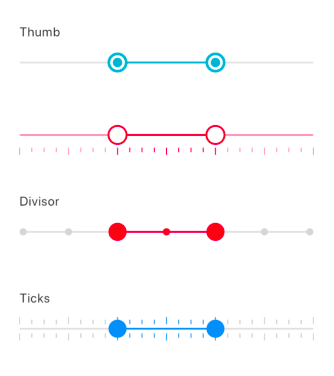

# Flutter Range Slider (SfRangeSlider) Overview

[Syncfusion&reg; Flutter Range Slider](https://pub.dev/packages/syncfusion_flutter_sliders/versions) is a highly interactive UI widget that allows users to select a smaller range from a larger data set. It provides rich features such as numeric and date values, labels, ticks, dividers, and tooltips.

## Features

* **Numeric and date support** - Provides functionality for selecting numeric and date ranges. For date ranges, support is provided up to the seconds interval.
* **Labels** - Renders labels for date and numeric ranges with options to customize their format based on your requirements.
* **Ticks and dividers** - Provides options to show ticks and dividers based on intervals. Also enables minor ticks to indicate values between each interval. These features present the selected range in a more intuitive way for end users.
* **Highly customizable** - In addition to the rich set of built-in features, the control can be fully customized in a simple way using the wide range of provided options.
* **Tooltips** - Renders tooltips to clearly show the selected range. It is also possible to customize the format of text shown in tooltips.
* **Orientation** - Supports both horizontal and vertical orientations.