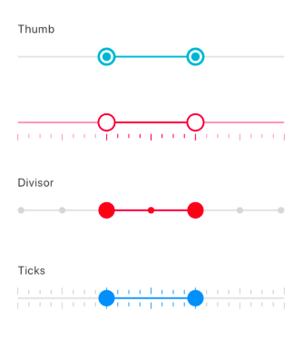

# Flutter Range Slider (SfRangeSlider) Overview

Syncfusion&reg; Flutter Range Slider is a highly interactive UI widget that allows users to select a smaller range from a larger data set. It provides rich features such as numeric and date values, labels, ticks, dividers, and tooltips.

## Features

* **Numeric and date support** - Provides functionality for selecting numeric and date ranges. For date ranges, support is provided up to the seconds interval. For more details, refer to the [Set numeric range](./getting-started.md#set-numeric-range) and [Set date range](./getting-started.md#set-date-range) sections.
* **Labels** - Renders labels for date and numeric ranges with options to customize their format based on your requirements. For more details, refer to the [Labels](./labels.md) documentation.
* **Ticks and dividers** - Provides options to show ticks and dividers based on intervals. Also enables minor ticks to indicate values between each interval. These features present the selected range in a more intuitive way for end users. For more details, refer to the [Ticks and dividers](./ticks.md) documentation.
* **Highly customizable** - In addition to the rich set of built-in features, the control is fully customizable through its wide range of options.
* **Tooltips** - Renders tooltips to clearly show the selected range. It is also possible to customize the format of text shown in tooltips. For more details, refer to the [Tooltips](./tooltip.md) documentation.
* **Orientation** - Supports both horizontal and vertical orientations. For more details, refer to the [Horizontal](./getting-started.md#horizontal) and [Vertical](./getting-started.md#vertical) sections.
* **Thumb icon support** - Accepts custom widgets like icons or text inside the thumbs. For more details, refer to the [Thumb icon support](./thumb-customization.md) documentation.