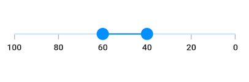

# Right to Left (RTL) in Flutter Range Slider (SfRangeSlider)

## RTL rendering ways

Right to left rendering can be achieved in the following ways:

### Wrapping the SfRangeSlider with Directionality widget

The range slider can be wrapped inside the [`Directionality`](https://api.flutter.dev/flutter/widgets/Directionality-class.html) widget and you can set the [`textDirection`](https://api.flutter.dev/flutter/widgets/Directionality/textDirection.html) property to `rtl`.




SfRangeValues _values = SfRangeValues(40.0, 60.0);

@override
Widget build(BuildContext context) {
    return MaterialApp(
        home: Scaffold(
            body: Directionality(
              textDirection: TextDirection.rtl,
              child: Center(
                child: SfRangeSlider(
                  min: 0.0,
                  max: 100.0,
                  values: _values,
                  interval: 20,
                  showTicks: true,
                  showLabels: true,
                  onChanged: (SfRangeValues newValues){
                    setState(() {
                      _values = newValues;
                    });
                  },
                ),
              )
            ),
        )
    );
}




### Changing the locale to RTL languages

The range slider will render in right to left direction if the locale belongs to RTL languages such as Arabic, Persian, Hebrew, Pashto, and Urdu. This can be achieved by specifying the MaterialApp properties such as `localizationsDelegates`, `supportedLocales`, `locale` and adding the flutter_localizations package to your pubspec.yaml file.




dependencies:
  flutter_localizations:
    sdk: flutter







SfRangeValues _values = SfRangeValues(40.0, 60.0);

@override
Widget build(BuildContext context) {
  return MaterialApp(
    localizationsDelegates: [
      GlobalMaterialLocalizations.delegate,
      GlobalWidgetsLocalizations.delegate,
    ],
    supportedLocales: [
      Locale("fa", "IR"),
    ],
    locale: Locale("fa", "IR"),
    home: Scaffold(
      backgroundColor: Colors.white,
      body: SfRangeSlider(
        min: 0.0,
        max: 100.0,
        values: _values,
        interval: 20.0,
        showLabels: true,
        showTicks: true,
        onChanged: (SfRangeValues newValues) {
          setState(() {
            _values = newValues;
          });
        },
      ),
    ),
  );
}




N> This RTL support is not applicable for the vertical orientation of the range slider.

