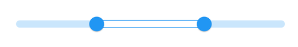
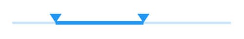
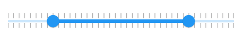

# Shapes in Flutter Range Slider (SfRangeSlider)

This section helps to learn about how to customize the shapes of the range slider elements.

## Track shape

You can change the size and shape of the track using the [`trackShape`](https://pub.dev/documentation/syncfusion_flutter_sliders/latest/sliders/SfRangeSlider/trackShape.html) property in the `SfRangeSlider`.

* getPreferredSize() - Returns the size based on the values passed to it.
* paint() - Used to change the track shape.

N>
* You must use the `thumbCenter` and `currentValue` parameters of paint override method for customizing slider track.
* You must use the `startThumbCenter`, `endThumbCenter`, and `currentValues` parameters of paint override method for customizing range slider and range selector track.




SfRangeValues _values = SfRangeValues(3.0, 7.0);

@override
Widget build(BuildContext context) {
  return Scaffold(
     body: SfRangeSliderTheme(
        data: SfRangeSliderThemeData(
          activeTrackHeight: 10,
          inactiveTrackHeight: 10,
        ),
        child: SfRangeSlider(
          min: 0.0,
          max: 10.0,
          values: _values,
          trackShape: _TrackShape(),
          onChanged: (SfRangeValues newValues) {
            setState(() {
              _values = newValues;
            });
          },
        ),
      ),
   );
}

class _TrackShape extends SfTrackShape {
  void paint(PaintingContext context, Offset offset, Offset? thumbCenter,
      Offset? startThumbCenter, Offset? endThumbCenter,
      {required RenderBox parentBox,
      required SfSliderThemeData themeData,
      SfRangeValues? currentValues,
      dynamic currentValue,
      required Animation<double> enableAnimation,
      required Paint? inactivePaint,
      required Paint? activePaint,
      required TextDirection textDirection}) {
    Paint paint = Paint()
      ..color = themeData.activeTrackColor!
      ..style = PaintingStyle.stroke
      ..strokeWidth = 1;
    super.paint(context, offset, thumbCenter, startThumbCenter, endThumbCenter,
        parentBox: parentBox,
        themeData: themeData,
        enableAnimation: enableAnimation,
        inactivePaint: inactivePaint,
        activePaint: paint,
        textDirection: textDirection);
  }
}




## Thumb shape

You can change the size and shape of the thumb using the [`thumbShape`](https://pub.dev/documentation/syncfusion_flutter_sliders/latest/sliders/SfRangeSlider/thumbShape.html) property in the `SfRangeSlider`.

* getPreferredSize() - Returns the size based on the values passed to it.
* paint() - Used to change the thumb shape.

N>
* You must use the `currentValue` parameter of paint override method for customizing slider thumb.
* You must use the `currentValues` parameter of paint override method for customizing range slider and range selector thumbs.




double _min = 0.0;
double _max = 10.0;
SfRangeValues _values = SfRangeValues(2.0, 6.0);

@override
Widget build(BuildContext context) {
  return Scaffold(
     body: SfRangeSlider(
        min: _min,
        max: _max,
        values: _values,
        thumbShape: _SfThumbShape(),
        onChanged: (SfRangeValues newValues) {
          setState(() {
            _values = newValues;
          });
        },
      ),
   );
}

class _SfThumbShape extends SfThumbShape {
  @override
  void paint(PaintingContext context, Offset center,
      {required RenderBox parentBox,
      required RenderBox? child,
      required SfSliderThemeData themeData,
      SfRangeValues? currentValues,
      dynamic currentValue,
      required Paint? paint,
      required Animation<double> enableAnimation,
      required TextDirection textDirection,
      required SfThumb? thumb}) {
    final Path path = Path();

    path.moveTo(center.dx, center.dy);
    path.lineTo(center.dx + 10, center.dy - 15);
    path.lineTo(center.dx - 10, center.dy - 15);
    path.close();
    context.canvas.drawPath(
        path,
        Paint()
          ..color = themeData.activeTrackColor!
          ..style = PaintingStyle.fill
          ..strokeWidth = 2);
  }
}




## Divider shape

You can change the size and shape of the divider using the [`dividerShape`](https://pub.dev/documentation/syncfusion_flutter_sliders/latest/sliders/SfRangeSlider/dividerShape.html) property in the `SfRangeSlider`.

* getPreferredSize() - Returns the size based on the values passed to it.
* paint() - Used to change the divider shape.

N>
* You must use the `thumbCenter` and `currentValue` parameters of paint override method for customizing slider divider.
* You must use the `startThumbCenter`, `endThumbCenter`, and `currentValues` parameters of paint override method for customizing range slider and range selector divider.




SfRangeValues _values = SfRangeValues(2.0, 6.0);

@override
Widget build(BuildContext context) {
  return Scaffold(
     body: SfRangeSlider(
        min: 0.0,
        max: 10.0,
        values: _values,
        interval: 1,
        showDividers: true,
        dividerShape: _DividerShape(),
        onChanged: (SfRangeValues newValues) {
          setState(() {
            _values = newValues;
          });
        },
      ),
   );
}

class _DividerShape extends SfDividerShape {
   @override
   void paint(PaintingContext context, Offset center, Offset? thumbCenter,
        Offset? startThumbCenter, Offset? endThumbCenter,
        {required RenderBox parentBox,
        required SfSliderThemeData themeData,
        SfRangeValues? currentValues,
        dynamic currentValue,
        required Paint? paint,
        required Animation<double> enableAnimation,
        required TextDirection textDirection}) {
      final bool isActive =
          center.dx >= startThumbCenter!.dx && center.dx <= endThumbCenter!.dx;
      context.canvas.drawRect(
          Rect.fromCenter(center: center, width: 5.0, height: 10.0),
          Paint()
            ..isAntiAlias = true
            ..style = PaintingStyle.fill
            ..color = isActive ? themeData.activeTrackColor! : Colors.white);
   }
}




## Major and minor ticks shapes

You can change the size and shape of the major and minor ticks using the [`tickShape`](https://pub.dev/documentation/syncfusion_flutter_sliders/latest/sliders/SfRangeSlider/tickShape.html) and [`minorTickShape`](https://pub.dev/documentation/syncfusion_flutter_sliders/latest/sliders/SfRangeSlider/minorTickShape.html) properties in the `SfRangeSlider`.

* getPreferredSize() - Returns the size based on the values passed to it.
* paint() - Used to change the ticks shape.

N>
* You must use the `thumbCenter` and `currentValue` parameters of paint override method for customizing slider ticks.
* You must use the `startThumbCenter`, `endThumbCenter`, and `currentValues` parameters of paint override method for customizing range slider and range selector ticks.




SfRangeValues _values = SfRangeValues(2.0, 6.0);

@override
Widget build(BuildContext context) {
  return Scaffold(
     body: SfRangeSlider(
        min: 0.0,
        max: 10.0,
        values: _values,
        interval: 1,
        showTicks: true,
        minorTicksPerInterval: 3,
        tickShape: _TickShape(),
        minorTickShape: _MinorTickShape(),
        onChanged: (SfRangeValues newValues) {
          setState(() {
            _values = newValues;
          });
        },
      ),
   );
}

class _TickShape extends SfTickShape {
  @override
  void paint(PaintingContext context, Offset offset, Offset? thumbCenter,
      Offset? startThumbCenter, Offset? endThumbCenter,
      {required RenderBox parentBox,
      required SfSliderThemeData themeData,
      SfRangeValues? currentValues,
      dynamic currentValue,
      required Animation<double> enableAnimation,
      required TextDirection textDirection}) {
    final Size tickSize = getPreferredSize(themeData);
    final bool isTickRightOfThumb = endThumbCenter == null
        ? offset.dx > thumbCenter!.dx
        : offset.dx < startThumbCenter!.dx || offset.dx > endThumbCenter.dx;
    final Color begin = isTickRightOfThumb
        ? themeData.disabledInactiveTickColor
        : themeData.disabledActiveTickColor;
    final Color end = isTickRightOfThumb
        ? themeData.inactiveTickColor
        : themeData.activeTickColor;
    final Paint paint = Paint()
      ..isAntiAlias = true
      ..strokeWidth = tickSize.width
      ..color = ColorTween(begin: begin, end: end).evaluate(enableAnimation)!;
    context.canvas.drawLine(
        offset, Offset(offset.dx, offset.dy + tickSize.height), paint);
    context.canvas.drawLine(
        Offset(
            offset.dx,
            offset.dy -
                2 -
                math.max(themeData.activeTrackHeight,
                    themeData.inactiveTrackHeight)),
        Offset(
            offset.dx,
            offset.dy -
                2 -
                math.max(themeData.activeTrackHeight,
                    themeData.inactiveTrackHeight) -
                tickSize.height),
        paint);
  }
}

class _MinorTickShape extends SfTickShape {
  @override
  void paint(PaintingContext context, Offset offset, Offset? thumbCenter,
      Offset? startThumbCenter, Offset? endThumbCenter,
      {required RenderBox parentBox,
      required SfSliderThemeData themeData,
      SfRangeValues? currentValues,
      dynamic currentValue,
      required Animation<double> enableAnimation,
      required TextDirection textDirection}) {
    final Size minorTickSize = getPreferredSize(themeData);
    final bool isMinorTickRightOfThumb = endThumbCenter == null
        ? offset.dx > thumbCenter!.dx
        : offset.dx < startThumbCenter!.dx || offset.dx > endThumbCenter.dx;

    final Color begin = isMinorTickRightOfThumb
        ? themeData.disabledInactiveMinorTickColor
        : themeData.disabledActiveMinorTickColor;
    final Color end = isMinorTickRightOfThumb
        ? themeData.inactiveMinorTickColor
        : themeData.activeMinorTickColor;
    final Paint paint = Paint()
      ..isAntiAlias = true
      ..strokeWidth = minorTickSize.width
      ..color = ColorTween(begin: begin, end: end).evaluate(enableAnimation)!;
    context.canvas.drawLine(
        offset, Offset(offset.dx, offset.dy + minorTickSize.height), paint);
    context.canvas.drawLine(
        Offset(
            offset.dx,
            offset.dy -
                2 -
                math.max(themeData.activeTrackHeight,
                    themeData.inactiveTrackHeight)),
        Offset(
            offset.dx,
            offset.dy -
                2 -
                math.max(themeData.activeTrackHeight,
                    themeData.inactiveTrackHeight) -
                minorTickSize.height),
        paint);
  }
}




