# Thumb and Thumb overlay in Flutter Range Slider (SfRangeSlider)

This section helps to learn about how to customize the thumb and thumb overlay in the range slider.

* Thumb - It is one of the elements of range slider which can be used to drag and change the selected values of the range slider.
* Thumb overlay - It is rendered around the thumb while interacting with them.

## Thumb size

You can change the size of the thumb in the range slider using the [`thumbRadius`](https://pub.dev/documentation/syncfusion_flutter_core/latest/theme/SfRangeSliderThemeData/thumbRadius.html) property.

N> You must import the `theme.dart` library from the [`Core`](https://pub.dev/packages/syncfusion_flutter_core) package to use [`SfRangeSliderTheme`](https://pub.dev/documentation/syncfusion_flutter_core/latest/theme/SfRangeSliderTheme-class.html).

### Horizontal




SfRangeValues _values = SfRangeValues(4.0, 8.0);

@override
Widget build(BuildContext context) {
  return MaterialApp(
      home: Scaffold(
          body: Center(
              child: SfRangeSliderTheme(
                    data: SfRangeSliderThemeData(
                        thumbRadius: 13,
                    ),
                    child:  SfRangeSlider(
                     min: 2.0,
                     max: 10.0,
                     interval: 1,
                     showTicks: true,
                     showLabels: true,
                     values: _values,
                     onChanged: (SfRangeValues newValues){
                            setState(() {
                                _values = newValues;
                            });
                        },
                    ),
              )
          )
      )
  );
}




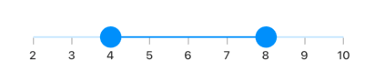

### Vertical




SfRangeValues _values = SfRangeValues(4.0, 8.0);

@override
Widget build(BuildContext context) {
  return MaterialApp(
      home: Scaffold(
          body: Center(
              child: SfRangeSliderTheme(
                    data: SfRangeSliderThemeData(
                        thumbRadius: 13,
                    ),
                    child:  SfRangeSlider.vertical(
                     min: 2.0,
                     max: 10.0,
                     interval: 1,
                     showTicks: true,
                     showLabels: true,
                     values: _values,
                     onChanged: (SfRangeValues newValues){
                            setState(() {
                                _values = newValues;
                            });
                        },
                    ),
              )
          )
      )
  );
}




## Thumb color

You can change the color of the thumb in the range slider using the [`thumbColor`](https://pub.dev/documentation/syncfusion_flutter_core/latest/theme/SfRangeSliderThemeData/thumbColor.html) property.

N> You must import the `theme.dart` library from the [`Core`](https://pub.dev/packages/syncfusion_flutter_core) package to use [`SfRangeSliderTheme`](https://pub.dev/documentation/syncfusion_flutter_core/latest/theme/SfRangeSliderTheme-class.html).

### Horizontal




SfRangeValues _values = SfRangeValues(4.0, 8.0);

@override
Widget build(BuildContext context) {
  return MaterialApp(
      home: Scaffold(
          body: Center(
              child: SfRangeSliderTheme(
                    data: SfRangeSliderThemeData(
                        thumbColor: Colors.red,
                    ),
                    child:  SfRangeSlider(
                     min: 2.0,
                     max: 10.0,
                     interval: 1,
                     showTicks: true,
                     showLabels: true,
                     values: _values,
                     onChanged: (SfRangeValues newValues){
                            setState(() {
                                _values = newValues;
                            });
                        },
                    ),
              )
          )
      )
  );
}




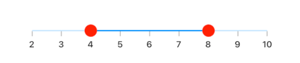

### Vertical




SfRangeValues _values = SfRangeValues(4.0, 8.0);

@override
Widget build(BuildContext context) {
  return MaterialApp(
      home: Scaffold(
          body: Center(
              child: SfRangeSliderTheme(
                    data: SfRangeSliderThemeData(
                        thumbColor: Colors.red,
                    ),
                    child:  SfRangeSlider.vertical(
                     min: 2.0,
                     max: 10.0,
                     interval: 1,
                     showTicks: true,
                     showLabels: true,
                     values: _values,
                     onChanged: (SfRangeValues newValues){
                            setState(() {
                                _values = newValues;
                            });
                        },
                    ),
              )
          )
      )
  );
}




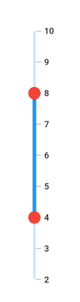

## Thumb stroke width and stroke color

You can change the thumb stroke width using the [`thumbStrokeWidth`](https://pub.dev/documentation/syncfusion_flutter_core/latest/theme/SfRangeSliderThemeData/thumbStrokeWidth.html) property and thumb stroke color using the [`thumbStrokeColor`](https://pub.dev/documentation/syncfusion_flutter_core/latest/theme/SfRangeSliderThemeData/thumbStrokeColor.html) property.

N> You must import the `theme.dart` library from the [`Core`](https://pub.dev/packages/syncfusion_flutter_core) package to use [`SfRangeSliderTheme`](https://pub.dev/documentation/syncfusion_flutter_core/latest/theme/SfRangeSliderTheme-class.html).

### Horizontal




SfRangeValues _values = SfRangeValues(4.0, 8.0);

@override
Widget build(BuildContext context) {
  return MaterialApp(
      home: Scaffold(
          body: Center(
              child: SfRangeSliderTheme(
                data: SfRangeSliderThemeData(
                  thumbStrokeWidth: 3,
                  thumbStrokeColor: Colors.red,
                ),
                child: SfRangeSlider(
                  min: 2.0,
                  max: 10.0,
                  interval: 1,
                  showTicks: true,
                  showLabels: true,
                  values: _values,
                  onChanged: (SfRangeValues newValues){
                    setState(() {
                      _values = newValues;
                    });
                  },
                ),
              )
          )
      )
  );
}




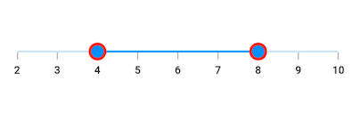

### Vertical




SfRangeValues _values = SfRangeValues(4.0, 8.0);

@override
Widget build(BuildContext context) {
  return MaterialApp(
      home: Scaffold(
          body: Center(
              child: SfRangeSliderTheme(
                data: SfRangeSliderThemeData(
                  thumbStrokeWidth: 3,
                  thumbStrokeColor: Colors.red,
                ),
                child: SfRangeSlider.vertical(
                  min: 2.0,
                  max: 10.0,
                  interval: 1,
                  showTicks: true,
                  showLabels: true,
                  values: _values,
                  onChanged: (SfRangeValues newValues){
                    setState(() {
                      _values = newValues;
                    });
                  },
                ),
              )
          )
      )
  );
}




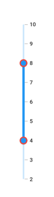

## Thumb icon

You can show the custom widgets like icon or text inside the thumbs using the [`startThumbIcon`](https://pub.dev/documentation/syncfusion_flutter_sliders/latest/sliders/SfRangeSlider/startThumbIcon.html) and the [`endThumbIcon`](https://pub.dev/documentation/syncfusion_flutter_sliders/latest/sliders/SfRangeSlider/endThumbIcon.html) properties.

### Horizontal




SfRangeValues _values = SfRangeValues(5.0, 8.0);

@override
Widget build(BuildContext context) {
  return MaterialApp(
      home: Scaffold(
          body: Center(
              child: SfRangeSliderTheme(
                data: SfRangeSliderThemeData(
                    thumbColor: Colors.white,
                    thumbRadius: 15,
                    thumbStrokeWidth: 2,
                    thumbStrokeColor: Colors.blue
                ),
                child: SfRangeSlider(
                  min: 2.0,
                  max: 10.0,
                  interval: 1,
                  showTicks: true,
                  showLabels: true,
                  values: _values,
                  startThumbIcon: Icon(
                      Icons.arrow_back_ios,
                      color: Colors.blue,
                      size: 20.0),
                  endThumbIcon: Icon(
                      Icons.arrow_forward_ios,
                      color: Colors.blue,
                      size: 20.0),
                  onChanged: (SfRangeValues newValues){
                    setState(() {
                      _values = newValues;
                    });
                  },
                ),
              )
          )
      )
  );
}




### Vertical




SfRangeValues _values = SfRangeValues(5.0, 8.0);

@override
Widget build(BuildContext context) {
  return MaterialApp(
      home: Scaffold(
          body: Center(
              child: SfRangeSliderTheme(
                data: SfRangeSliderThemeData(
                    thumbColor: Colors.white,
                    thumbRadius: 15,
                    thumbStrokeWidth: 2,
                    thumbStrokeColor: Colors.blue
                ),
                child: SfRangeSlider.vertical(
                  min: 2.0,
                  max: 10.0,
                  interval: 1,
                  showTicks: true,
                  showLabels: true,
                  values: _values,
                  startThumbIcon: Icon(
                      Icons.keyboard_arrow_down_outlined,
                      color: Colors.blue,
                      size: 20.0),
                  endThumbIcon: Icon(
                      Icons.keyboard_arrow_up_outlined,
                      color: Colors.blue,
                      size: 20.0),
                  onChanged: (SfRangeValues newValues){
                    setState(() {
                      _values = newValues;
                    });
                  },
                ),
              )
          )
      )
  );
}




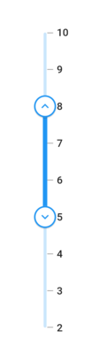

## Thumb overlay size

You can change the size of the thumb overlay in the range slider using the [`overlayRadius`](https://pub.dev/documentation/syncfusion_flutter_core/latest/theme/SfRangeSliderThemeData/overlayRadius.html) property.

N> You must import the `theme.dart` library from the [`Core`](https://pub.dev/packages/syncfusion_flutter_core) package to use [`SfRangeSliderTheme`](https://pub.dev/documentation/syncfusion_flutter_core/latest/theme/SfRangeSliderTheme-class.html).

### Horizontal




SfRangeValues _values = SfRangeValues(4.0, 8.0);

@override
Widget build(BuildContext context) {
  return MaterialApp(
      home: Scaffold(
          body: Center(
              child: SfRangeSliderTheme(
                    data: SfRangeSliderThemeData(
                        overlayRadius: 22,
                    ),
                    child:  SfRangeSlider(
                     min: 2.0,
                     max: 10.0,
                     interval: 1,
                     showTicks: true,
                     showLabels: true,
                     values: _values,
                     onChanged: (SfRangeValues newValues){
                            setState(() {
                                _values = newValues;
                            });
                        },
                    ),
              )
          )
      )
  );
}




### Vertical




SfRangeValues _values = SfRangeValues(4.0, 8.0);

@override
Widget build(BuildContext context) {
  return MaterialApp(
      home: Scaffold(
          body: Center(
              child: SfRangeSliderTheme(
                    data: SfRangeSliderThemeData(
                        overlayRadius: 22,
                    ),
                    child:  SfRangeSlider.vertical(
                     min: 2.0,
                     max: 10.0,
                     interval: 1,
                     showTicks: true,
                     showLabels: true,
                     values: _values,
                     onChanged: (SfRangeValues newValues){
                            setState(() {
                                _values = newValues;
                            });
                        },
                    ),
              )
          )
      )
  );
}




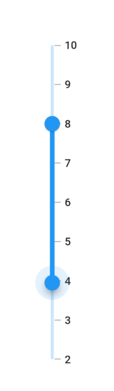

## Thumb overlay color

You can change the color of the thumb overlay in the range slider using the [`overlayColor`](https://pub.dev/documentation/syncfusion_flutter_core/latest/theme/SfRangeSliderThemeData/overlayColor.html) property.

N> You must import the `theme.dart` library from the [`Core`](https://pub.dev/packages/syncfusion_flutter_core) package to use [`SfRangeSliderTheme`](https://pub.dev/documentation/syncfusion_flutter_core/latest/theme/SfRangeSliderTheme-class.html).

### Horizontal




SfRangeValues _values = SfRangeValues(4.0, 8.0);

@override
Widget build(BuildContext context) {
  return MaterialApp(
      home: Scaffold(
          body: Center(
              child: SfRangeSliderTheme(
                    data: SfRangeSliderThemeData(
                        overlayColor: Colors.red[50],
                    ),
                    child:  SfRangeSlider(
                     min: 2.0,
                     max: 10.0,
                     interval: 1,
                     showTicks: true,
                     showLabels: true,
                     values: _values,
                     onChanged: (SfRangeValues newValues){
                            setState(() {
                                _values = newValues;
                            });
                        },
                    ),
              )
          )
      )
  );
}




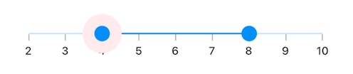

### Vertical




SfRangeValues _values = SfRangeValues(4.0, 8.0);

@override
Widget build(BuildContext context) {
  return MaterialApp(
      home: Scaffold(
          body: Center(
              child: SfRangeSliderTheme(
                    data: SfRangeSliderThemeData(
                        overlayColor: Colors.red[50],
                    ),
                    child:  SfRangeSlider.vertical(
                     min: 2.0,
                     max: 10.0,
                     interval: 1,
                     showTicks: true,
                     showLabels: true,
                     values: _values,
                     onChanged: (SfRangeValues newValues){
                            setState(() {
                                _values = newValues;
                            });
                        },
                    ),
              )
          )
      )
  );
}




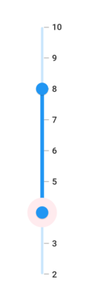

## Thumb overlap stroke color

You can change the overlap stroke color of the thumb in the range slider using the [`overlappingThumbStrokeColor`](https://pub.dev/documentation/syncfusion_flutter_core/latest/theme/SfRangeSliderThemeData/overlappingThumbStrokeColor.html) property.

N> You must import the `theme.dart` library from the [`Core`](https://pub.dev/packages/syncfusion_flutter_core) package to use [`SfRangeSliderTheme`](https://pub.dev/documentation/syncfusion_flutter_core/latest/theme/SfRangeSliderTheme-class.html).

### Horizontal




SfRangeValues _values = SfRangeValues(4.0, 8.0);

@override
Widget build(BuildContext context) {
  return MaterialApp(
      home: Scaffold(
          body: Center(
              child: SfRangeSliderTheme(
                    data: SfRangeSliderThemeData(
                        overlappingThumbStrokeColor: Colors.red,
                    ),
                    child:  SfRangeSlider(
                     min: 2.0,
                     max: 10.0,
                     interval: 1,
                     showTicks: true,
                     showLabels: true,
                     values: _values,
                     onChanged: (SfRangeValues newValues){
                            setState(() {
                                _values = newValues;
                            });
                        },
                    ),
              )
          )
      )
  );
}




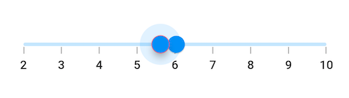

### Vertical




SfRangeValues _values = SfRangeValues(4.0, 8.0);

@override
Widget build(BuildContext context) {
  return MaterialApp(
      home: Scaffold(
          body: Center(
              child: SfRangeSliderTheme(
                    data: SfRangeSliderThemeData(
                        overlappingThumbStrokeColor: Colors.red,
                    ),
                    child:  SfRangeSlider.vertical(
                     min: 2.0,
                     max: 10.0,
                     interval: 1,
                     showTicks: true,
                     showLabels: true,
                     values: _values,
                     onChanged: (SfRangeValues newValues){
                            setState(() {
                                _values = newValues;
                            });
                        },
                    ),
              )
          )
      )
  );
}




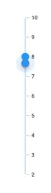