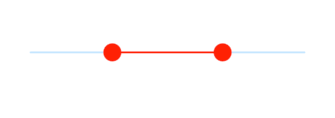

# Thumb and overlay features in range slider

This section helps to learn about how to customize the thumb and overlay in the range slider.

## Thumb size

You can change the size of the thumb in the range slider using the `thumbRadius` property.

N> You must import the `theme.dart` library from the [`Core`](https://pub.dev/packages/syncfusion_flutter_core) package to use [`SfRangeSliderTheme`](https://help.syncfusion.com/flutter/range-slider/customization).




SfRangeValues _values = SfRangeValues(4.0, 8.0);

@override
Widget build(BuildContext context) {
  return MaterialApp(
      home: Scaffold(
          body: Center(
              child: SfRangeSliderTheme(
                    data: SfRangeSliderThemeData(
                        thumbRadius: 13,
                    ),
                    child:  SfRangeSlider(
                     min: 2.0,
                     max: 10.0,
                     interval: 1,
                     showTicks: true,
                     showLabels: true,
                     values: _values,
                     onChanged: (SfRangeValues newValues){
                            setState(() {
                                _values = newValues;
                            });
                        },
                    ),
              )
          )
      )
  );
}




## Thumb color

You can change the color of the thumb in the range slider using the `thumbColor` property.

N> You must import the `theme.dart` library from the [`Core`](https://pub.dev/packages/syncfusion_flutter_core) package to use [`SfRangeSliderTheme`](https://help.syncfusion.com/flutter/range-slider/customization).




SfRangeValues _values = SfRangeValues(4.0, 8.0);

@override
Widget build(BuildContext context) {
  return MaterialApp(
      home: Scaffold(
          body: Center(
              child: SfRangeSliderTheme(
                    data: SfRangeSliderThemeData(
                        thumbColor: Colors.red,
                    ),
                    child:  SfRangeSlider(
                     min: 2.0,
                     max: 10.0,
                     interval: 1,
                     showTicks: true,
                     showLabels: true,
                     values: _values,
                     onChanged: (SfRangeValues newValues){
                            setState(() {
                                _values = newValues;
                            });
                        },
                    ),
              )
          )
      )
  );
}




## Overlay size

You can change the size of the overlay in the range slider using the `overlayRadius` property.

N> You must import the `theme.dart` library from the [`Core`](https://pub.dev/packages/syncfusion_flutter_core) package to use [`SfRangeSliderTheme`](https://help.syncfusion.com/flutter/range-slider/customization).




SfRangeValues _values = SfRangeValues(4.0, 8.0);

@override
Widget build(BuildContext context) {
  return MaterialApp(
      home: Scaffold(
          body: Center(
              child: SfRangeSliderTheme(
                    data: SfRangeSliderThemeData(
                        overlayRadius: 22,
                    ),
                    child:  SfRangeSlider(
                     min: 2.0,
                     max: 10.0,
                     interval: 1,
                     showTicks: true,
                     showLabels: true,
                     values: _values,
                     onChanged: (SfRangeValues newValues){
                            setState(() {
                                _values = newValues;
                            });
                        },
                    ),
              )
          )
      )
  );
}




## Overlay color

You can change the color of the overlay in the range slider using the `overlayColor` property.

N> You must import the `theme.dart` library from the [`Core`](https://pub.dev/packages/syncfusion_flutter_core) package to use [`SfRangeSliderTheme`](https://help.syncfusion.com/flutter/range-slider/customization).




SfRangeValues _values = SfRangeValues(4.0, 8.0);

@override
Widget build(BuildContext context) {
  return MaterialApp(
      home: Scaffold(
          body: Center(
              child: SfRangeSliderTheme(
                    data: SfRangeSliderThemeData(
                        overlayColor: Colors.red[50],
                    ),
                    child:  SfRangeSlider(
                     min: 2.0,
                     max: 10.0,
                     interval: 1,
                     showTicks: true,
                     showLabels: true,
                     values: _values,
                     onChanged: (SfRangeValues newValues){
                            setState(() {
                                _values = newValues;
                            });
                        },
                    ),
              )
          )
      )
  );
}




## Active color

Represents the color applied to the active track, thumb, overlay, and inactive divisors. The `active` side of the range slider is between the left and right thumbs.




SfRangeValues _values = SfRangeValues(3.0, 7.0);

@override
Widget build(BuildContext context) {
  return MaterialApp(
      home: Scaffold(
          body: Center(
              child: SfRangeSlider(
                    min: 0.0,
                    max: 10.0,
                    values: _values,
                    activeColor: Colors.red,
                    showDivisors: true,
                    onChanged: (SfRangeValues newValues) {
                        setState(() {
                            _values = newValues;
                        });
                    },
              )
          )
      )
  );
}




N> Refer the `SfRangeSliderThemeData` to know about updating the individual active range slider element’s visual.

### Inactive color

Represents the color applied to the inactive track and active divisors. The `inactive` side of the range slider is between the `min` value and the left thumb, and the right thumb and the `max` value.




SfRangeValues _values = SfRangeValues(3.0, 7.0);

@override
Widget build(BuildContext context) {
  return MaterialApp(
      home: Scaffold(
          body: Center(
              child: SfRangeSlider(
                    min: 0.0,
                    max: 10.0,
                    values: _values,
                    activeColor: Colors .red,
                    inactiveColor: Colors.red.withOpacity(0.2),
                    showDivisors: true,
                    onChanged: (SfRangeValues newValues) {
                        setState(() {
                            _values = newValues;
                        });
                    },
              )
          )
      )
  );
}




N> Refer the `SfRangeSliderThemeData` to know about updating the individual inactive range slider element’s visual.

## Disabled color

You can change the disable state color of the active and inactive track using the `disabledActiveTrackColor` and `disabledInactiveTrackColor` properties, color of the disabled active and inactive major ticks using the `disabledActiveTickColor` and `disabledInactiveTickColor`properties, color of the disabled active and inactive minor ticks using the `disabledActiveMinorTickColor` and `disabledInactiveMinorTickColor` properties, color of the active and inactive divisors using the `disabledActiveDivisorColor` and `disabledInactiveDivisorColor` properties, color of the disabled thumb color using the `disabledThumbColor` property.

N> You must import the `theme.dart` library from the [`Core`](https://pub.dev/packages/syncfusion_flutter_core) package to use [`SfRangeSliderTheme`](https://help.syncfusion.com/flutter/range-slider/customization).




SfRangeValues _values = SfRangeValues(4.0, 8.0);

@override
Widget build(BuildContext context) {
  return MaterialApp(
      home: Scaffold(
          body: Center(
              child: SfRangeSliderTheme(
                    data: SfRangeSliderThemeData(
                        disabledActiveTrackColor: Colors.orange,
                        disabledInactiveTrackColor: Colors.orange[200],
                        disabledActiveTickColor: Colors.orange,
                        disabledInactiveTickColor: Colors.orange[200],
                        disabledActiveMinorTickColor: Colors.orange,
                        disabledInactiveMinorTickColor: Colors.orange[200],
                        disabledActiveDivisorColor: Colors.purple,
                        disabledInactiveDivisorColor: Colors.purple[200],
                        disabledThumbColor: Colors.orange,
                    ),
                    child:  SfRangeSlider(
                     min: 2.0,
                     max: 10.0,
                     interval: 2,
                     showTicks: true,
                     minorTicksPerInterval: 1,
                     showDivisors: true,
                     values: _values,
                  ),
              )
          )
      )
  );
}




