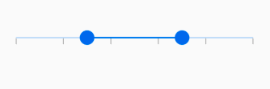
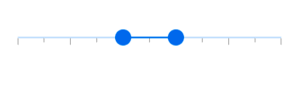
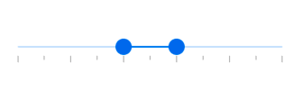
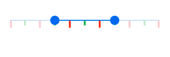

# Tick Customization

The SfRangeSlider provides an option to show or hide the tick, size and color customization.

## Show tick

This property is used to display tick for each interval. When it sets to true, it displays the ticks. The default value of the `showTicks` property is `false`.




SfRangeValues _values = const SfRangeValues(0.3, 0.7);

@override
Widget build(BuildContext context) {
  return Scaffold(
    body:Center(
      child: SfRangeSlider(
          interval: 0.2,
          showTicks: true,
          values: _values,
          onChanged: (dynamic values) {
            setState(() {
              _values = values;
            });
          }
      ),
    ),
  );
}




## Show minor tick

This property is used to show the number of ticks between two major ticks or labels. The default value of the `minorTicksPerInterval` property is `null`.




@override
Widget build(BuildContext context) {
  return Scaffold(
    body:Center(
      child: SfRangeSlider(
          interval: 0.2,
          minorTicksPerInterval: 1,
          showTicks: true,
          values: _values,
          onChanged: (dynamic values) {
            setState(() {
              _values = values;
            });
          }
      ),
    ),
  );
}




## Tick offset

This property is used to position the tick based on the offset value from the track position. The default value of the `tickOffset` property is `null`.




@override
Widget build(BuildContext context) {
  return Scaffold(
    body:Center(
      child: SfRangeSliderTheme(
        data: SfRangeSliderThemeData(
          tickOffset: Offset(0.0, 10.0),
        ),
        child: SfRangeSlider(
            interval: 0.2,
            showTicks: true,
            minorTicksPerInterval: 1,
            values: _values,
            onChanged: (dynamic values) {
              setState(() {
                _values = values;
              });
            }),
      ),
    ),
  );
}




## Tick size and color

The tick size can be customized using the `tickSize` and `minorTickSize` properties, major tick color can be customized using the `activeTickColor` and `inactiveTickColor` properties, minor tick color can be customized using the `activeMinorTickColor` and `inactiveMinorTickColor`.




SfRangeValues _values = const SfRangeValues(0.3, 0.7);

@override
Widget build(BuildContext context) {
  return Scaffold(
    body:Center(
      child: SfRangeSliderTheme(
        data: SfRangeSliderThemeData(
          tickSize: Size(4, 15),
          minorTickSize: Size(4, 10),
          activeTickColor: Colors.red,
          inactiveTickColor: Colors.red[100],
          activeMinorTickColor: Colors.green,
          inactiveMinorTickColor: Colors.green[100],
        ),
        child: SfRangeSlider(
            interval: 0.2,
            showTicks: true,
            minorTicksPerInterval: 1,
            values: _values,
            onChanged: (dynamic values) {
              setState(() {
                _values = values;
              });
            }),
      ),
    ),
  );
}




