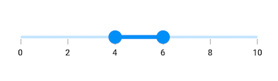
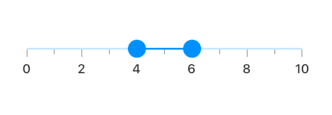
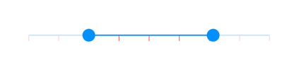
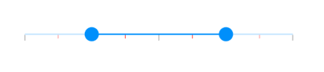
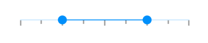
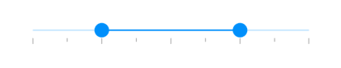

# Ticks features in range slider

This section helps to learn about how to add major and minor ticks in the range slider.

## Show major ticks

You can enable the major ticks on the track. It is a shape which is used to represent the major interval points of the track. The default value of [`showTicks`](https://pub.dev/documentation/syncfusion_flutter_sliders/latest/sliders/SfRangeSlider/showTicks.html) property is `false`.

For example, if [`min`](https://pub.dev/documentation/syncfusion_flutter_sliders/latest/sliders/SfRangeSlider/min.html) is 0.0 and [`max`](https://pub.dev/documentation/syncfusion_flutter_sliders/latest/sliders/SfRangeSlider/max.html) is 10.0 and [`interval`](https://pub.dev/documentation/syncfusion_flutter_sliders/latest/sliders/SfRangeSlider/interval.html) is 2.0, the range slider will render the major ticks at 0.0, 2.0, 4.0 and so on.




SfRangeValues _values = SfRangeValues(4.0, 6.0);

@override
Widget build(BuildContext context) {
  return MaterialApp(
      home: Scaffold(
          body: Center(
              child: SfRangeSlider(
                    min: 0.0,
                    max: 10.0,
                    interval: 2,
                    showTicks: true,
                    showLabels: true,
                    values: _values,
                    onChanged: (SfRangeValues newValues) {
                        setState(() {
                            _values = newValues;
                        });
                   },
               ),
          )
      )
  );
}




N> Refer the [`tickShape`](https://pub.dev/documentation/syncfusion_flutter_sliders/latest/sliders/SfRangeSlider/tickShape.html) and [`SfRangeSliderThemeData`](https://pub.dev/documentation/syncfusion_flutter_core/latest/theme/SfRangeSliderThemeData-class.html) for customizing the major tick’s visual appearance.

## Show minor ticks

It is used to represent the number of smaller ticks between two major ticks. For example, if [`min`](https://pub.dev/documentation/syncfusion_flutter_sliders/latest/sliders/SfRangeSlider/min.html) is 0.0 and [`max`](https://pub.dev/documentation/syncfusion_flutter_sliders/latest/sliders/SfRangeSlider/max.html) is 10.0 and [`interval`](https://pub.dev/documentation/syncfusion_flutter_sliders/latest/sliders/SfRangeSlider/interval.html) is 2.0, the range slider will render the major ticks at 0.0, 2.0, 4.0 and so on. If [`minorTicksPerInterval`](https://pub.dev/documentation/syncfusion_flutter_sliders/latest/sliders/SfRangeSlider/minorTicksPerInterval.html) is 1, then smaller ticks will be rendered on 1.0 and 3.0 and so on.

I> The default value of [`minorTicksPerInterval`](https://pub.dev/documentation/syncfusion_flutter_sliders/latest/sliders/SfRangeSlider/minorTicksPerInterval.html) property is null and it must be greater than 0.




SfRangeValues _values = SfRangeValues(4.0, 6.0);

@override
Widget build(BuildContext context) {
  return MaterialApp(
      home: Scaffold(
          body: Center(
              child: SfRangeSlider(
                    min: 0.0,
                    max: 10.0,
                    interval: 2,
                    showTicks: true,
                    minorTicksPerInterval: 1,
                    showLabels: true,
                    values: _values,
                    onChanged: (SfRangeValues newValues) {
                        setState(() {
                            _values = newValues;
                        });
                   },
               ),
          )
      )
  );
}




N>
* Refer the [`showTicks`](https://pub.dev/documentation/syncfusion_flutter_sliders/latest/sliders/SfRangeSlider/showTicks.html) to know about the rendering major ticks at given interval.
* Refer the [`minorTickShape`](https://pub.dev/documentation/syncfusion_flutter_sliders/latest/sliders/SfRangeSlider/minorTickShape.html) and [`SfRangeSliderThemeData`](https://pub.dev/documentation/syncfusion_flutter_core/latest/theme/SfRangeSliderThemeData-class.html) for customizing the minor tick’s visual appearance.

## Major ticks color

You can change the active and inactive major ticks color of the range slider using the [`activeTickColor`](https://pub.dev/documentation/syncfusion_flutter_core/latest/theme/SfRangeSliderThemeData/activeTickColor.html) and [`inactiveTickColor`](https://pub.dev/documentation/syncfusion_flutter_core/latest/theme/SfRangeSliderThemeData/inactiveTickColor.html) properties respectively.

The active side of the range slider is between start and end thumbs.

The inactive side of the range slider is between the [`min`](https://pub.dev/documentation/syncfusion_flutter_sliders/latest/sliders/SfRangeSlider/min.html) value and the left thumb, and the right thumb and the [`max`](https://pub.dev/documentation/syncfusion_flutter_sliders/latest/sliders/SfRangeSlider/max.html) value.

For RTL, the inactive side is between the [`max`](https://pub.dev/documentation/syncfusion_flutter_sliders/latest/sliders/SfRangeSlider/max.html) value and the left thumb, and the right thumb and the [`min`](https://pub.dev/documentation/syncfusion_flutter_sliders/latest/sliders/SfRangeSlider/min.html) value.

N> You must import the `theme.dart` library from the [`Core`](https://pub.dev/packages/syncfusion_flutter_core) package to use [`SfRangeSliderTheme`](https://pub.dev/documentation/syncfusion_flutter_core/latest/theme/SfRangeSliderTheme-class.html).




SfRangeValues _values = SfRangeValues(4.0, 8.0);

@override
Widget build(BuildContext context) {
  return MaterialApp(
      home: Scaffold(
          body: Center(
              child: SfRangeSliderTheme(
                    data: SfRangeSliderThemeData(
                        activeTickColor: Colors.red,
                        inactiveTickColor: Colors.red[100],
                    ),
                    child:  SfRangeSlider(
                        min: 2.0,
                        max: 10.0,
                        values: _values,
                        interval: 1,
                        showTicks: true,
                        onChanged: (SfRangeValues newValues){
                            setState(() {
                                _values = newValues;
                            });
                        },
                    ),
              )
          )
      )
  );
}




## Minor ticks color

You can change the active and inactive minor ticks color of the range slider using the [`activeMinorTickColor`](https://pub.dev/documentation/syncfusion_flutter_core/latest/theme/SfRangeSliderThemeData/activeMinorTickColor.html) and [`inactiveMinorTickColor`](https://pub.dev/documentation/syncfusion_flutter_core/latest/theme/SfRangeSliderThemeData/inactiveMinorTickColor.html) properties respectively.

The active side of the range slider is between start and end thumbs.

The inactive side of the range slider is between the [`min`](https://pub.dev/documentation/syncfusion_flutter_sliders/latest/sliders/SfRangeSlider/min.html) value and the left thumb, and the right thumb and the [`max`](https://pub.dev/documentation/syncfusion_flutter_sliders/latest/sliders/SfRangeSlider/max.html) value.

For RTL, the inactive side is between the [`max`](https://pub.dev/documentation/syncfusion_flutter_sliders/latest/sliders/SfRangeSlider/max.html) value and the left thumb, and the right thumb and the [`min`](https://pub.dev/documentation/syncfusion_flutter_sliders/latest/sliders/SfRangeSlider/min.html) value.

N> You must import the `theme.dart` library from the [`Core`](https://pub.dev/packages/syncfusion_flutter_core) package to use [`SfRangeSliderTheme`](https://pub.dev/documentation/syncfusion_flutter_core/latest/theme/SfRangeSliderTheme-class.html).




SfRangeValues _values = SfRangeValues(4.0, 8.0);

@override
Widget build(BuildContext context) {
  return MaterialApp(
      home: Scaffold(
          body: Center(
              child: SfRangeSliderTheme(
                    data: SfRangeSliderThemeData(
                        activeMinorTickColor: Colors.red,
                        inactiveMinorTickColor: Colors.red[200],
                    ),
                    child:  SfRangeSlider(
                        min: 2.0,
                        max: 10.0,
                        values: _values,
                        interval: 2,
                        minorTicksPerInterval: 1,
                        showTicks: true,
                        onChanged: (SfRangeValues newValues){
                            setState(() {
                                _values = newValues;
                            });
                        },
                    ),
              )
          )
      )
  );
}




## Ticks size

You can change the major and minor ticks size of the range slider using the [`tickSize`](https://pub.dev/documentation/syncfusion_flutter_core/latest/theme/SfRangeSliderThemeData/tickSize.html) and [`minorTickSize`](https://pub.dev/documentation/syncfusion_flutter_core/latest/theme/SfRangeSliderThemeData/minorTickSize.html) properties respectively. The default value of the [`tickSize`](https://pub.dev/documentation/syncfusion_flutter_core/latest/theme/SfRangeSliderThemeData/tickSize.html) property is `Size(1.0, 8.0)` and [`minorTickSize`](https://pub.dev/documentation/syncfusion_flutter_core/latest/theme/SfRangeSliderThemeData/minorTickSize.html) property is `Size(1.0, 5.0)`.

N> You must import the `theme.dart` library from the [`Core`](https://pub.dev/packages/syncfusion_flutter_core) package to use [`SfRangeSliderTheme`](https://pub.dev/documentation/syncfusion_flutter_core/latest/theme/SfRangeSliderTheme-class.html).




SfRangeValues _values = SfRangeValues(4.0, 8.0);

@override
Widget build(BuildContext context) {
  return MaterialApp(
      home: Scaffold(
          body: Center(
              child: SfRangeSliderTheme(
                    data: SfRangeSliderThemeData(
                         tickSize: Size(3.0, 12.0),
                         minorTickSize: Size(3.0, 8.0),
                    ),
                    child:  SfRangeSlider(
                         min: 2.0,
                         max: 10.0,
                         interval: 2,
                         minorTicksPerInterval: 1,
                         showTicks: true,
                         values: _values,
                        onChanged: (SfRangeValues newValues){
                            setState(() {
                                _values = newValues;
                            });
                        },
                    ),
              )
          )
      )
  );
}




## Ticks offset

You can adjust the space between track and ticks of the range slider using the [`tickOffset`](https://pub.dev/documentation/syncfusion_flutter_core/latest/theme/SfRangeSliderThemeData/tickOffset.html) property in the [`SfRangeSliderThemeData`](https://pub.dev/documentation/syncfusion_flutter_core/latest/theme/SfRangeSliderThemeData-class.html). The default value of the [`tickOffset`](https://pub.dev/documentation/syncfusion_flutter_core/latest/theme/SfRangeSliderThemeData/tickOffset.html) property is `null`.

N> You must import the `theme.dart` library from the [`Core`](https://pub.dev/packages/syncfusion_flutter_core) package to use [`SfRangeSliderTheme`](https://pub.dev/documentation/syncfusion_flutter_core/latest/theme/SfRangeSliderTheme-class.html).




SfRangeValues _values = SfRangeValues(4.0, 8.0);

@override
Widget build(BuildContext context) {
  return MaterialApp(
      home: Scaffold(
          body: Center(
              child: SfRangeSliderTheme(
                    data: SfRangeSliderThemeData(
                        tickOffset: Offset(0.0, 10.0),
                    ),
                    child: SfRangeSlider(
                         min: 2.0,
                         max: 10.0,
                         interval: 2,
                         minorTicksPerInterval: 1,
                         showTicks: true,
                         values: _values,
                        onChanged: (SfRangeValues newValues){
                            setState(() {
                                _values = newValues;
                            });
                        },
                    ),
              )
          )
      )
  );
}




