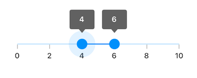
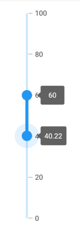
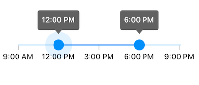
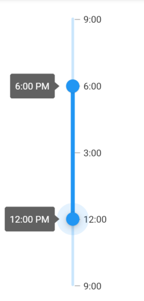
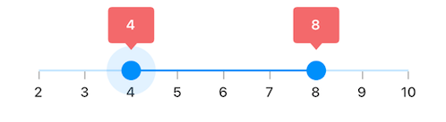
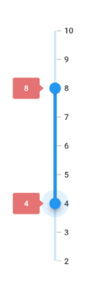
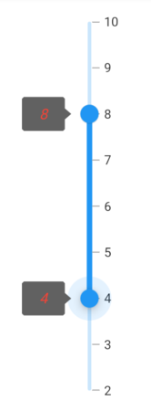
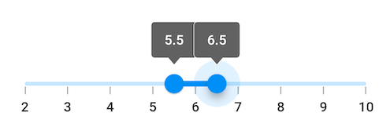
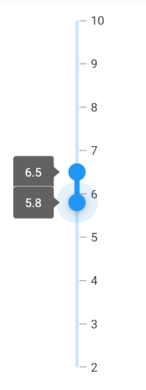

# Tooltip in Flutter Range Slider (SfRangeSlider)

This section helps to learn about how to add tooltip in the range slider.

## Enable tooltips

You can enable tooltips for both thumbs using the [`enableTooltip`](https://pub.dev/documentation/syncfusion_flutter_sliders/latest/sliders/SfRangeSlider/enableTooltip.html). It is used to clearly indicate the current selection of the ranges during interaction. By default, tooltip text is formatted with either [`numberFormat`](https://pub.dev/documentation/syncfusion_flutter_sliders/latest/sliders/SfRangeSlider/numberFormat.html) or [`dateFormat`](https://pub.dev/documentation/syncfusion_flutter_sliders/latest/sliders/SfRangeSlider/dateFormat.html).

I> By setting the value of `shouldAlwaysShowTooltip` to true, you can always show a tooltip without having to interact with the range slider thumb. The default value is `false` and it works independent of the `enableTooltip` behavior.

### Horizontal




SfRangeValues _values = SfRangeValues(4.0, 6.0);

@override
Widget build(BuildContext context) {
  return MaterialApp(
      home: Scaffold(
          body: Center(
              child: SfRangeSlider(
                    min: 0.0,
                    max: 10.0,
                    interval: 2,
                    showTicks: true,
                    showLabels: true,
                    enableTooltip: true,
                    values: _values,
                    onChanged: (SfRangeValues newValues) {
                        setState(() {
                            _values = newValues;
                        });
                   },
              ),
          )
      )
  );
}




### Vertical




SfRangeValues _values = SfRangeValues(4.0, 6.0);

@override
Widget build(BuildContext context) {
  return MaterialApp(
      home: Scaffold(
          body: Center(
              child: SfRangeSlider.vertical(
                    min: 0.0,
                    max: 10.0,
                    interval: 2,
                    showTicks: true,
                    showLabels: true,
                    enableTooltip: true,
                    values: _values,
                    onChanged: (SfRangeValues newValues) {
                        setState(() {
                            _values = newValues;
                        });
                   },
              ),
          )
      )
  );
}




N>
* Refer the [`tooltipTextFormatterCallback`](https://pub.dev/documentation/syncfusion_flutter_sliders/latest/sliders/SfRangeSlider/tooltipTextFormatterCallback.html) for changing the default tooltip text.
* Refer the [`SfRangeSliderThemeData`](https://pub.dev/documentation/syncfusion_flutter_core/latest/theme/SfRangeSliderThemeData-class.html) for customizing the appearance of the tooltip text.

## Tooltip shape

You can show tooltip in rectangular or paddle shape using the [`tooltipShape`](https://pub.dev/documentation/syncfusion_flutter_sliders/latest/sliders/SfRangeSlider/tooltipShape.html) property. The default value of the [`tooltipShape`](https://pub.dev/documentation/syncfusion_flutter_sliders/latest/sliders/SfRangeSlider/tooltipShape.html) property is `SfRectangularTooltipShape`.

N> The paddle tooltip shape is not applicable for vertical orientation of the range sliders.

### Horizontal




SfRangeValues _values = SfRangeValues(40.0, 60.0);

@override
Widget build(BuildContext context) {
  return MaterialApp(
      home: Scaffold(
          body: Center(
            child: SfRangeSlider(
              min: 0.0,
              max: 100.0,
              interval: 20,
              showTicks: true,
              showLabels: true,
              enableTooltip: true,
              tooltipShape: SfPaddleTooltipShape(),
              values: _values,
              onChanged: (SfRangeValues newValues) {
                setState(() {
                  _values = newValues;
                });
              },
            ),
          )
      )
  );
}




## Tooltip position

N> This is only applicable for vertical orientation of the range sliders.

You can show tooltip in left or right positions using the [`tooltipPosition`](https://pub.dev/documentation/syncfusion_flutter_sliders/latest/sliders/SfRangeSlider/tooltipPosition.html) property. The default value of the [`tooltipPosition`](https://pub.dev/documentation/syncfusion_flutter_sliders/latest/sliders/SfRangeSlider/tooltipPosition.html) property is `SliderTooltipPosition.left`.




SfRangeValues _values = SfRangeValues(40.0, 60.0);

@override
Widget build(BuildContext context) {
  return MaterialApp(
      home: Scaffold(
          body: Center(
            child: SfRangeSlider.vertical(
              min: 0.0,
              max: 100.0,
              interval: 20,
              showTicks: true,
              showLabels: true,
              enableTooltip: true,
              tooltipPosition:SliderTooltipPosition.right,
              values: _values,
              onChanged: (SfRangeValues newValues) {
                setState(() {
                  _values = newValues;
                });
              },
            ),
          )
      )
  );
}




## Tooltip text format

By default it is formatted based on [`numberFormat`](https://pub.dev/documentation/syncfusion_flutter_sliders/latest/sliders/SfRangeSlider/numberFormat.html) property and [`dateFormat`](https://pub.dev/documentation/syncfusion_flutter_sliders/latest/sliders/SfRangeSlider/dateFormat.html) property based on whether it is date type [`SfRangeSlider`](https://help.syncfusion.com/flutter/range-slider/getting-started#set-date-range) or numeric [`SfRangeSlider`](https://help.syncfusion.com/flutter/range-slider/getting-started#set-numeric-range).

You can format or change the whole tooltip label text using the [`tooltipTextFormatterCallback`](https://pub.dev/documentation/syncfusion_flutter_sliders/latest/sliders/SfRangeSlider/tooltipTextFormatterCallback.html). Its arguments are,

* actualValue – either `DateTime` or `double` based on given [`values`](https://pub.dev/documentation/syncfusion_flutter_sliders/latest/sliders/SfRangeSlider/values.html).
* formattedText – If the actual value is `double`, it is formatted by [`numberFormat`](https://pub.dev/documentation/syncfusion_flutter_sliders/latest/sliders/SfRangeSlider/numberFormat.html) and if the actual value is `DateTime`, it is formatted by [`dateFormat`](https://pub.dev/documentation/syncfusion_flutter_sliders/latest/sliders/SfRangeSlider/dateFormat.html).

### Horizontal




SfRangeValues _values = SfRangeValues(DateTime(2010, 01, 01, 12, 00, 00), DateTime(2010, 01, 01, 18, 00, 00));

@override
Widget build(BuildContext context) {
  return MaterialApp(
      home: Scaffold(
          body: Center(
              child: SfRangeSlider(
                    min: DateTime(2010, 01, 01, 9, 00, 00),
                    max: DateTime(2010, 01, 01, 21, 05, 00),
                    values: _values,
                    interval: 3,
                    showTicks: true,
                    showLabels: true,
                    enableTooltip: true,
                    dateFormat: DateFormat('h:mm'),
                    dateIntervalType: DateIntervalType.hours,
                    tooltipTextFormatterCallback: (dynamic actualValue, String formattedText) {
                        return DateFormat('h:mm a').format(actualValue);
                    },
                    onChanged: (SfRangeValues newValues) {
                        setState(() {
                            _values = newValues;
                        });
                    },
              ),
          )
      )
  );
}




### Vertical




SfRangeValues _values = SfRangeValues(DateTime(2010, 01, 01, 12, 00, 00), DateTime(2010, 01, 01, 18, 00, 00));

@override
Widget build(BuildContext context) {
  return MaterialApp(
      home: Scaffold(
          body: Center(
              child: SfRangeSlider.vertical(
                    min: DateTime(2010, 01, 01, 9, 00, 00),
                    max: DateTime(2010, 01, 01, 21, 05, 00),
                    values: _values,
                    interval: 3,
                    showTicks: true,
                    showLabels: true,
                    enableTooltip: true,
                    dateFormat: DateFormat('h:mm'),
                    dateIntervalType: DateIntervalType.hours,
                    tooltipTextFormatterCallback: (dynamic actualValue, String formattedText) {
                        return DateFormat('h:mm a').format(actualValue);
                    },
                    onChanged: (SfRangeValues newValues) {
                        setState(() {
                            _values = newValues;
                        });
                    },
              ),
          )
      )
  );
}




## Tooltip color

You can change the background color of the tooltip in the range slider using the [`tooltipBackgroundColor`](https://pub.dev/documentation/syncfusion_flutter_core/latest/theme/SfRangeSliderThemeData/tooltipBackgroundColor.html) property.

N> You must import the `theme.dart` library from the [`Core`](https://pub.dev/packages/syncfusion_flutter_core) package to use [`SfRangeSliderTheme`](https://pub.dev/documentation/syncfusion_flutter_core/latest/theme/SfRangeSliderTheme-class.html).

### Horizontal




SfRangeValues _values = SfRangeValues(4.0, 8.0);

@override
Widget build(BuildContext context) {
  return MaterialApp(
      home: Scaffold(
          body: Center(
              child: SfRangeSliderTheme(
                    data: SfRangeSliderThemeData(
                        tooltipBackgroundColor: Colors.red[300],
                    ),
                    child:  SfRangeSlider(
                        min: 2.0,
                        max: 10.0,
                        interval: 1,
                        showTicks: true,
                        showLabels: true,
                        enableTooltip: true,
                        values: _values,
                        onChanged: (SfRangeValues newValues){
                            setState(() {
                                _values = newValues;
                            });
                        },
                    ),
              )
          )
      )
  );
}




### Vertical




SfRangeValues _values = SfRangeValues(4.0, 8.0);

@override
Widget build(BuildContext context) {
  return MaterialApp(
      home: Scaffold(
          body: Center(
              child: SfRangeSliderTheme(
                    data: SfRangeSliderThemeData(
                        tooltipBackgroundColor: Colors.red[300],
                    ),
                    child:  SfRangeSlider.vertical(
                        min: 2.0,
                        max: 10.0,
                        interval: 1,
                        showTicks: true,
                        showLabels: true,
                        enableTooltip: true,
                        values: _values,
                        onChanged: (SfRangeValues newValues){
                            setState(() {
                                _values = newValues;
                            });
                        },
                    ),
              )
          )
      )
  );
}




## Tooltip label style

You can change the appearance of the tooltip text in the range slider using the [`tooltipTextStyle`](https://pub.dev/documentation/syncfusion_flutter_core/latest/theme/SfRangeSliderThemeData/tooltipTextStyle.html) property.

N> You must import the `theme.dart` library from the [`Core`](https://pub.dev/packages/syncfusion_flutter_core) package to use [`SfRangeSliderTheme`](https://pub.dev/documentation/syncfusion_flutter_core/latest/theme/SfRangeSliderTheme-class.html).

### Horizontal




SfRangeValues _values = SfRangeValues(4.0, 8.0);

@override
Widget build(BuildContext context) {
  return MaterialApp(
      home: Scaffold(
          body: Center(
              child: SfRangeSliderTheme(
                    data: SfRangeSliderThemeData(
                        tooltipTextStyle: TextStyle(color: Colors.red, fontSize: 16, fontStyle: FontStyle.italic),
                    ),
                    child:  SfRangeSlider(
                     min: 2.0,
                     max: 10.0,
                     interval: 1,
                     showTicks: true,
                     showLabels: true,
                     enableTooltip: true,
                     values: _values,
                     onChanged: (SfRangeValues newValues){
                            setState(() {
                                _values = newValues;
                            });
                        },
                    ),
              )
          )
      )
  );
}




### Vertical




SfRangeValues _values = SfRangeValues(4.0, 8.0);

@override
Widget build(BuildContext context) {
  return MaterialApp(
      home: Scaffold(
          body: Center(
              child: SfRangeSliderTheme(
                    data: SfRangeSliderThemeData(
                        tooltipTextStyle: TextStyle(color: Colors.red, fontSize: 16, fontStyle: FontStyle.italic),
                    ),
                    child:  SfRangeSlider.vertical(
                     min: 2.0,
                     max: 10.0,
                     interval: 1,
                     showTicks: true,
                     showLabels: true,
                     enableTooltip: true,
                     values: _values,
                     onChanged: (SfRangeValues newValues){
                            setState(() {
                                _values = newValues;
                            });
                        },
                    ),
              )
          )
      )
  );
}




## Tooltip overlap stroke color

You can change the overlap stroke color of the tooltip in the range slider using the [`overlappingTooltipStrokeColor`](https://pub.dev/documentation/syncfusion_flutter_core/latest/theme/SfRangeSliderThemeData/overlappingTooltipStrokeColor.html) property.

N> You must import the `theme.dart` library from the [`Core`](https://pub.dev/packages/syncfusion_flutter_core) package to use [`SfRangeSliderTheme`](https://pub.dev/documentation/syncfusion_flutter_core/latest/theme/SfRangeSliderTheme-class.html).

### Horizontal




SfRangeValues _values = SfRangeValues(4.0, 8.0);

@override
Widget build(BuildContext context) {
  return MaterialApp(
      home: Scaffold(
          body: Center(
              child: SfRangeSliderTheme(
                    data: SfRangeSliderThemeData(
                        overlappingTooltipStrokeColor: Colors.white,
                    ),
                    child:  SfRangeSlider(
                     min: 2.0,
                     max: 10.0,
                     interval: 1,
                     showTicks: true,
                     showLabels: true,
                     enableTooltip: true,
                     values: _values,
                     onChanged: (SfRangeValues newValues){
                            setState(() {
                                _values = newValues;
                            });
                        },
                    ),
              )
          )
      )
  );
}




### Vertical




SfRangeValues _values = SfRangeValues(4.0, 8.0);

@override
Widget build(BuildContext context) {
  return MaterialApp(
      home: Scaffold(
          body: Center(
              child: SfRangeSliderTheme(
                    data: SfRangeSliderThemeData(
                        overlappingTooltipStrokeColor: Colors.white,
                    ),
                    child:  SfRangeSlider.vertical(
                     min: 2.0,
                     max: 10.0,
                     interval: 1,
                     showTicks: true,
                     showLabels: true,
                     enableTooltip: true,
                     values: _values,
                     onChanged: (SfRangeValues newValues){
                            setState(() {
                                _values = newValues;
                            });
                        },
                    ),
              )
          )
      )
  );
}




