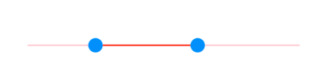
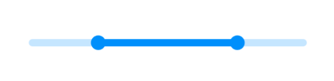

# Track features in range slider

This section helps to learn about how to customize the track in the range slider.

## Track color

You can change the active and inactive track color of the range slider using the [`activeTrackColor`](https://pub.dev/documentation/syncfusion_flutter_core/latest/theme/SfRangeSliderThemeData/activeTrackColor.html) and [`inactiveTrackColor`](https://pub.dev/documentation/syncfusion_flutter_core/latest/theme/SfRangeSliderThemeData/inactiveTrackColor.html) properties respectively.

The active side of the range slider is between start and end thumbs.

The inactive side of the range slider is between the [`min`](https://pub.dev/documentation/syncfusion_flutter_sliders/latest/sliders/SfRangeSlider/min.html) value and the left thumb, and the right thumb and the [`max`](https://pub.dev/documentation/syncfusion_flutter_sliders/latest/sliders/SfRangeSlider/max.html) value.

For RTL, the inactive side is between the [`max`](https://pub.dev/documentation/syncfusion_flutter_sliders/latest/sliders/SfRangeSlider/max.html) value and the left thumb, and the right thumb and the [`min`](https://pub.dev/documentation/syncfusion_flutter_sliders/latest/sliders/SfRangeSlider/min.html) value.

N> You must import the `theme.dart` library from the [`Core`](https://pub.dev/packages/syncfusion_flutter_core) package to use [`SfRangeSliderTheme`](https://pub.dev/documentation/syncfusion_flutter_core/latest/theme/SfRangeSliderTheme-class.html).




SfRangeValues _values = SfRangeValues(4.0, 7.0);

@override
Widget build(BuildContext context) {
  return MaterialApp(
      home: Scaffold(
          body: Center(
              child: SfRangeSliderTheme(
                    data: SfRangeSliderThemeData(
                        activeTrackColor: Colors.red,
                        inactiveTrackColor: Colors.red[100],
                    ),
                    child:  SfRangeSlider(
                        min: 2.0,
                        max: 10.0,
                        values: _values,
                        onChanged: (SfRangeValues newValues){
                            setState(() {
                                _values = newValues;
                            });
                        },
                    ),
              )
          )
      )
  );
}




## Track height

You can change the track height of the range slider using the [`activeTrackHeight`](https://pub.dev/documentation/syncfusion_flutter_core/latest/theme/SfRangeSliderThemeData/activeTrackHeight.html) and the [`inactiveTrackHeight`](https://pub.dev/documentation/syncfusion_flutter_core/latest/theme/SfRangeSliderThemeData/inactiveTrackHeight.html) properties. The default value of the [`activeTrackHeight`](https://pub.dev/documentation/syncfusion_flutter_core/latest/theme/SfRangeSliderThemeData/activeTrackHeight.html) and the [`inactiveTrackHeight`](https://pub.dev/documentation/syncfusion_flutter_core/latest/theme/SfRangeSliderThemeData/inactiveTrackHeight.html) properties are `6.0` and `4.0`.

N> You must import the `theme.dart` library from the [`Core`](https://pub.dev/packages/syncfusion_flutter_core) package to use [`SfRangeSliderTheme`](https://pub.dev/documentation/syncfusion_flutter_core/latest/theme/SfRangeSliderTheme-class.html).




SfRangeValues _values = SfRangeValues(4.0, 7.0);

@override
Widget build(BuildContext context) {
  return MaterialApp(
      home: Scaffold(
          body: Center(
              child: SfRangeSliderTheme(
                    data: SfRangeSliderThemeData(
                        activeTrackHeight: 8,
                        inactiveTrackHeight: 8,
                    ),
                    child:  SfRangeSlider(
                        min: 2.0,
                        max: 10.0,
                        values: _values,
                        onChanged: (SfRangeValues newValues){
                            setState(() {
                                _values = newValues;
                            });
                        },
                    ),
              )
          )
      )
  );
}




## Track corner radius

You can change the corner of the track to be round in the range slider using the [`trackCornerRadius`](https://pub.dev/documentation/syncfusion_flutter_core/latest/theme/SfRangeSliderThemeData/trackCornerRadius.html) property. The default value of the [`trackCornerRadius`](https://pub.dev/documentation/syncfusion_flutter_core/latest/theme/SfRangeSliderThemeData/trackCornerRadius.html) property is `1.0`.

N> You must import the `theme.dart` library from the [`Core`](https://pub.dev/packages/syncfusion_flutter_core) package to use [`SfRangeSliderTheme`](https://pub.dev/documentation/syncfusion_flutter_core/latest/theme/SfRangeSliderTheme-class.html).




SfRangeValues _values = SfRangeValues(4.0, 7.0);

@override
Widget build(BuildContext context) {
  return MaterialApp(
      home: Scaffold(
          body: Center(
              child: SfRangeSliderTheme(
                    data: SfRangeSliderThemeData(
                        activeTrackHeight: 10,
                        inactiveTrackHeight: 10,
                        trackCornerRadius: 5,
                    ),
                    child: SfRangeSlider(
                        min: 2.0,
                        max: 10.0,
                        values: _values,
                        onChanged: (SfRangeValues newValues){
                            setState(() {
                                _values = newValues;
                            });
                        },
                    ),
              )
          )
      )
  );
}




