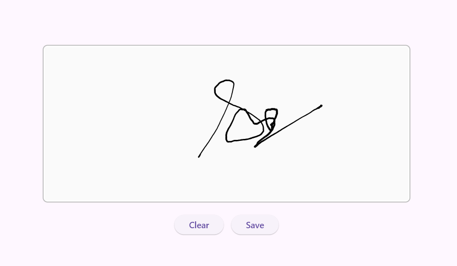

# Flutter Signature Pad (SfSignaturePad) Overview

The Signature Pad widget helps you capture smooth, realistic signatures. It lets you save signatures as images and use them across devices and documents that require signatures. You can use your finger, pen, or mouse on a tablet, touchscreen, or other input device to draw your own signature.

## Features

* **Signature stroke color customization** - The widget allows you to set the stroke color for the signatures.
* **Signature stroke width customization** - The widget allows you to set the minimum and maximum stroke widths for the signatures.
* **SignaturePad background color customization** - The widget allows you to set the background color for the SignaturePad.
* **Save as image** - The widget provides an option to save the drawn signature as an image. This converted image can be embedded in documents, PDFs, or any other medium that supports image-based signatures.
* **More realistic handwritten look and feel** - The unique stroke rendering algorithm draws a signature based on the speed of the drawn gestures along with minimum and maximum stroke thicknesses, which brings a more realistic, handwritten look and feel to the signature.

For step-by-step installation and setup instructions, see [Getting Started with Flutter Signature Pad](getting-started.md).
