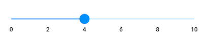
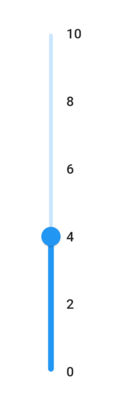
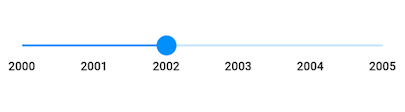
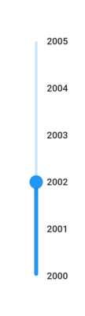
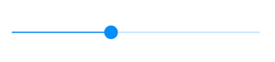
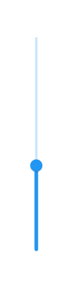
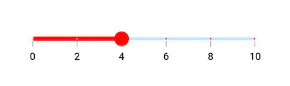
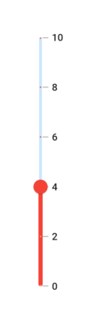
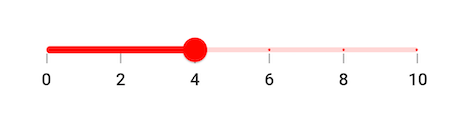
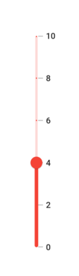

# Flutter Slider Basic Features (SfSlider)
This section explains how to add and configure numeric and date sliders, core properties, and callbacks.

## Minimum

The minimum value that the user can select. The default value of [`min`](https://pub.dev/documentation/syncfusion_flutter_sliders/latest/sliders/SfSlider/min.html) property is 0.0 and it must be less than the [`max`](https://pub.dev/documentation/syncfusion_flutter_sliders/latest/sliders/SfSlider/max.html) value.

## Maximum

The maximum value that the user can select. The default value of [`max`](https://pub.dev/documentation/syncfusion_flutter_sliders/latest/sliders/SfSlider/max.html) property is 1.0 and it must be greater than the [`min`](https://pub.dev/documentation/syncfusion_flutter_sliders/latest/sliders/SfSlider/min.html) value.

## Value

It represents the value currently selected in the slider. The slider's thumb is drawn corresponding to this value.

For date values, the slider does not have auto interval support. So, it is mandatory to set [`interval`](https://pub.dev/documentation/syncfusion_flutter_sliders/latest/sliders/SfSlider/interval.html), [`dateIntervalType`](https://pub.dev/documentation/syncfusion_flutter_sliders/latest/sliders/SfSlider/dateIntervalType.html), and [`dateFormat`](https://pub.dev/documentation/syncfusion_flutter_sliders/latest/sliders/SfSlider/dateFormat.html) for date values.

**Numeric slider**

You can show numeric values in the slider by setting `double` values to the [`min`](https://pub.dev/documentation/syncfusion_flutter_sliders/latest/sliders/SfSlider/min.html), [`max`](https://pub.dev/documentation/syncfusion_flutter_sliders/latest/sliders/SfSlider/max.html) and [`value`](https://pub.dev/documentation/syncfusion_flutter_sliders/latest/sliders/SfSlider/value.html) properties.

### Horizontal




import 'package:flutter/material.dart';
import 'package:syncfusion_flutter_sliders/sliders.dart';

class NumericSliderPage extends StatefulWidget {
  @override
  _NumericSliderPageState createState() => _NumericSliderPageState();
}

class _NumericSliderPageState extends State<NumericSliderPage> {
  double _value = 4.0;

  @override
  Widget build(BuildContext context) {
    return MaterialApp(
        home: Scaffold(
            body: Center(
                child: SfSlider(
                  min: 0.0,
                  max: 10.0,
                  value: _value,
                  interval: 2,
                  showLabels: true,
                  onChanged: (double newValue) {
                    setState(() {
                      _value = newValue;
                    });
                  },
                )
            )
        )
     );
  }
}




### Vertical




import 'package:flutter/material.dart';
import 'package:syncfusion_flutter_sliders/sliders.dart';

class VerticalNumericSliderPage extends StatefulWidget {
  @override
  _VerticalNumericSliderPageState createState() => _VerticalNumericSliderPageState();
}

class _VerticalNumericSliderPageState extends State<VerticalNumericSliderPage> {
  double _value = 4.0;

  @override
  Widget build(BuildContext context) {
    return MaterialApp(
        home: Scaffold(
            body: Center(
                child: SfSlider.vertical(
                  min: 0.0,
                  max: 10.0,
                  value: _value,
                  interval: 2,
                  showLabels: true,
                  onChanged: (double newValue) {
                    setState(() {
                      _value = newValue;
                    });
                  },
                )
            )
        )
     );
  }
}




**Date slider**

You can show date values in the slider by setting `DateTime` values to the [`min`](https://pub.dev/documentation/syncfusion_flutter_sliders/latest/sliders/SfSlider/min.html), [`max`](https://pub.dev/documentation/syncfusion_flutter_sliders/latest/sliders/SfSlider/max.html) and [`value`](https://pub.dev/documentation/syncfusion_flutter_sliders/latest/sliders/SfSlider/value.html) properties.

N> You must import [`intl`](https://pub.dev/packages/intl) package for formatting date slider using the [`DateFormat`](https://pub.dev/documentation/intl/latest/intl/DateFormat-class.html) class.

### Horizontal




import 'package:flutter/material.dart';
import 'package:intl/intl.dart';
import 'package:syncfusion_flutter_sliders/sliders.dart';

class DateSliderPage extends StatefulWidget {
  @override
  _DateSliderPageState createState() => _DateSliderPageState();
}

class _DateSliderPageState extends State<DateSliderPage> {
  DateTime _value = DateTime(2002, 01, 01);

  @override
  Widget build(BuildContext context) {
    return MaterialApp(
        home: Scaffold(
            body: Center(
                child: SfSlider(
                  min: DateTime(2000, 01, 01, 00),
                  max: DateTime(2004, 12, 31, 24),
                  value: _value,
                  interval: 1,
                  showLabels: true,
                  dateFormat: DateFormat.y(),
                  dateIntervalType: DateIntervalType.years,
                  onChanged: (DateTime newValue) {
                    setState(() {
                      _value = newValue;
                    });
                  },
                )
            )
        )
    );
  }
}




### Vertical




import 'package:flutter/material.dart';
import 'package:intl/intl.dart';
import 'package:syncfusion_flutter_sliders/sliders.dart';

class VerticalDateSliderPage extends StatefulWidget {
  @override
  _VerticalDateSliderPageState createState() => _VerticalDateSliderPageState();
}

class _VerticalDateSliderPageState extends State<VerticalDateSliderPage> {
  DateTime _value = DateTime(2002, 01, 01);

  @override
  Widget build(BuildContext context) {
    return MaterialApp(
        home: Scaffold(
            body: Center(
                child: SfSlider.vertical(
                  min: DateTime(2000, 01, 01, 00),
                  max: DateTime(2004, 12, 31, 24),
                  value: _value,
                  interval: 1,
                  showLabels: true,
                  dateFormat: DateFormat.y(),
                  dateIntervalType: DateIntervalType.years,
                  onChanged: (DateTime newValue) {
                    setState(() {
                      _value = newValue;
                    });
                  },
                )
            )
        )
    );
  }
}




## Handle onChangeStart, onChanged, and onChangeEnd callbacks

**onChangeStart**

The [`onChangeStart`](https://pub.dev/documentation/syncfusion_flutter_sliders/latest/sliders/SfSlider/onChangeStart.html) callback is called when the user begins to interact with the slider using a tap or drag action. This callback is only used to notify the user that the interaction has started and it does not change the value of the slider thumb.




import 'package:flutter/material.dart';
import 'package:syncfusion_flutter_sliders/sliders.dart';

class OnChangeStartPage extends StatefulWidget {
  @override
  _OnChangeStartPageState createState() => _OnChangeStartPageState();
}

class _OnChangeStartPageState extends State<OnChangeStartPage> {
  double _value = 4.0;

  @override
  Widget build(BuildContext context) {
    return Scaffold(
      body: SfSlider(
        min: 0.0,
        max: 10.0,
        value: _value,
        onChangeStart: (double startValue) {
          debugPrint('Interaction started');
        },
        onChanged: (double newValue) {
          setState(() {
            _value = newValue;
          });
        },
      ),
    );
  }
}




**onChangeEnd**

The [`onChangeEnd`](https://pub.dev/documentation/syncfusion_flutter_sliders/latest/sliders/SfSlider/onChangeEnd.html) callback is called when the user stops interacting with the slider using a tap or drag action. This callback is only used to notify the user that the interaction has ended and it does not change the value of the slider thumb.




import 'package:flutter/material.dart';
import 'package:syncfusion_flutter_sliders/sliders.dart';

class OnChangeEndPage extends StatefulWidget {
  @override
  _OnChangeEndPageState createState() => _OnChangeEndPageState();
}

class _OnChangeEndPageState extends State<OnChangeEndPage> {
  double _value = 4.0;

  @override
  Widget build(BuildContext context) {
    return Scaffold(
      body: SfSlider(
        min: 0.0,
        max: 10.0,
        value: _value,
        onChanged: (double newValue) {
          setState(() {
            _value = newValue;
          });
        },
        onChangeEnd: (double endValue) {
          debugPrint('Interaction ended');
        },
      ),
    );
  }
}




**onChanged**

The [`onChanged`](https://pub.dev/documentation/syncfusion_flutter_sliders/latest/sliders/SfSlider/onChanged.html) callback is called when the user selects a value through interaction.

N> The slider passes the new value to the callback but does not change its state until the parent widget rebuilds the slider with the new value.

N> If it is null, the slider will be disabled.

### Horizontal




import 'package:flutter/material.dart';
import 'package:syncfusion_flutter_sliders/sliders.dart';

class OnChangedPage extends StatefulWidget {
  @override
  _OnChangedPageState createState() => _OnChangedPageState();
}

class _OnChangedPageState extends State<OnChangedPage> {
  double _value = 4.0;

  @override
  Widget build(BuildContext context) {
    return MaterialApp(
        home: Scaffold(
             body: Center(
                child: SfSlider(
                  min: 0.0,
                  max: 10.0,
                  value: _value,
                  onChanged: (double newValue) {
                    setState(() {
                      _value = newValue;
                    });
                  },
                )
            )
        )
    );
  }
}




### Vertical




import 'package:flutter/material.dart';
import 'package:syncfusion_flutter_sliders/sliders.dart';

class VerticalOnChangedPage extends StatefulWidget {
  @override
  _VerticalOnChangedPageState createState() => _VerticalOnChangedPageState();
}

class _VerticalOnChangedPageState extends State<VerticalOnChangedPage> {
  double _value = 4.0;

  @override
  Widget build(BuildContext context) {
    return MaterialApp(
        home: Scaffold(
             body: Center(
                child: SfSlider.vertical(
                  min: 0.0,
                  max: 10.0,
                  value: _value,
                  onChanged: (double newValue) {
                    setState(() {
                      _value = newValue;
                    });
                  },
                )
            )
        )
    );
  }
}




## Active color

It represents the color applied to the active track, thumb, overlay, and inactive dividers. The active side of the slider is between the [`min`](https://pub.dev/documentation/syncfusion_flutter_sliders/latest/sliders/SfSlider/min.html) value and the thumb.

### Horizontal




import 'package:flutter/material.dart';
import 'package:syncfusion_flutter_sliders/sliders.dart';

class ActiveColorPage extends StatefulWidget {
  @override
  _ActiveColorPageState createState() => _ActiveColorPageState();
}

class _ActiveColorPageState extends State<ActiveColorPage> {
  double _value = 4.0;

  @override
  Widget build(BuildContext context) {
    return MaterialApp(
        home: Scaffold(
            body: Center(
                child: SfSlider(
                  min: 0.0,
                  max: 10.0,
                  value: _value,
                  interval: 2,
                  activeColor: Colors.red,
                  showDividers: true,
                  showTicks: true,
                  showLabels: true,
                  onChanged: (double newValue) {
                    setState(() {
                      _value = newValue;
                    });
                  },
                )
            )
        )
    );
  }
}




### Vertical




import 'package:flutter/material.dart';
import 'package:syncfusion_flutter_sliders/sliders.dart';

class VerticalActiveColorPage extends StatefulWidget {
  @override
  _VerticalActiveColorPageState createState() => _VerticalActiveColorPageState();
}

class _VerticalActiveColorPageState extends State<VerticalActiveColorPage> {
  double _value = 4.0;

  @override
  Widget build(BuildContext context) {
    return MaterialApp(
        home: Scaffold(
            body: Center(
                child: SfSlider.vertical(
                  min: 0.0,
                  max: 10.0,
                  value: _value,
                  interval: 2,
                  activeColor: Colors.red,
                  showDividers: true,
                  showTicks: true,
                  showLabels: true,
                  onChanged: (double newValue) {
                    setState(() {
                      _value = newValue;
                    });
                  },
                )
            )
        )
    );
  }
}




## Inactive color

It represents the color applied to the inactive track and active dividers.

The inactive side of the slider is between the thumb and the [`max`](https://pub.dev/documentation/syncfusion_flutter_sliders/latest/sliders/SfSlider/max.html) value.

### Horizontal




import 'package:flutter/material.dart';
import 'package:syncfusion_flutter_sliders/sliders.dart';

class InactiveColorPage extends StatefulWidget {
  @override
  _InactiveColorPageState createState() => _InactiveColorPageState();
}

class _InactiveColorPageState extends State<InactiveColorPage> {
  double _value = 4.0;

  @override
  Widget build(BuildContext context) {
    return MaterialApp(
        home: Scaffold(
            body: Center(
                child: SfSlider(
                  min: 0.0,
                  max: 10.0,
                  value: _value,
                  interval: 2,
                  activeColor: Colors.red,
                  inactiveColor: Colors.red.withValues(alpha: 0.2),
                  showDividers: true,
                  showTicks: true,
                  showLabels: true,
                  onChanged: (double newValue) {
                    setState(() {
                      _value = newValue;
                    });
                  },
                )
            )
        )
    );
  }
}




### Vertical




import 'package:flutter/material.dart';
import 'package:syncfusion_flutter_sliders/sliders.dart';

class VerticalInactiveColorPage extends StatefulWidget {
  @override
  _VerticalInactiveColorPageState createState() => _VerticalInactiveColorPageState();
}

class _VerticalInactiveColorPageState extends State<VerticalInactiveColorPage> {
  double _value = 4.0;

  @override
  Widget build(BuildContext context) {
    return MaterialApp(
        home: Scaffold(
            body: Center(
                child: SfSlider.vertical(
                  min: 0.0,
                  max: 10.0,
                  value: _value,
                  interval: 2,
                  activeColor: Colors.red,
                  inactiveColor: Colors.red.withValues(alpha: 0.2),
                  showDividers: true,
                  showTicks: true,
                  showLabels: true,
                  onChanged: (double newValue) {
                    setState(() {
                      _value = newValue;
                    });
                  },
                )
            )
        )
    );
  }
}




### For customizing individual items

* Track - [`Link`](https://help.syncfusion.com/flutter/slider/track)
* Ticks - [`Link`](https://help.syncfusion.com/flutter/slider/ticks)
* Labels and dividers - [`Link`](https://help.syncfusion.com/flutter/slider/labels-and-divider)
* Tooltip - [`Link`](https://help.syncfusion.com/flutter/slider/tooltip)
* Thumb and overlay - [`Link`](https://help.syncfusion.com/flutter/slider/thumb-and-overlay)

To know more about how to customize both thumb and divider in the Flutter Slider, you can watch this video.

<iframe id='FlutterSliderVideoTutorial' src='https://www.youtube.com/embed/IVRfO1qDom8'></iframe>