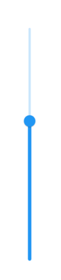
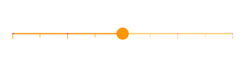
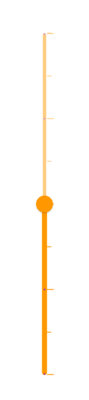

# Enabled and disabled states in Flutter Slider (SfSlider)

This section helps to learn about the enabled and disabled state in the Flutter slider.

## Enabled state

The slider will be in enabled state if [`onChanged`](https://pub.dev/documentation/syncfusion_flutter_sliders/latest/sliders/SfSlider/onChanged.html) is set.

### Horizontal




double _value = 5.0;

@override
Widget build(BuildContext context) {
  return MaterialApp(
      home: Scaffold(
          body: Center(
              child: SfSlider(
                min: 0.0,
                max: 10.0,
                value: _value,
                onChanged: (dynamic newValue) {
                  setState(() {
                    _value = newValue;
                  });
                },
              )
          )
      )
  );
}




### Vertical




double _value = 5.0;

@override
Widget build(BuildContext context) {
  return MaterialApp(
      home: Scaffold(
          body: Center(
              child: SfSlider.vertical(
                min: 0.0,
                max: 10.0,
                value: _value,
                onChanged: (dynamic newValue) {
                  setState(() {
                    _value = newValue;
                  });
                },
              )
          )
      )
  );
}




## Disabled state

The slider will be in disabled state if [`onChanged`](https://pub.dev/documentation/syncfusion_flutter_sliders/latest/sliders/SfSlider/onChanged.html) is `null`.

### Horizontal




@override
Widget build(BuildContext context) {
  return MaterialApp(
      home: Scaffold(
          body: Center(
              child: SfSlider(
                min: 0.0,
                max: 10.0,
                value: 5.0,
              )
          )
      )
  );
}




### Vertical




@override
Widget build(BuildContext context) {
  return MaterialApp(
      home: Scaffold(
          body: Center(
              child: SfSlider.vertical(
                min: 0.0,
                max: 10.0,
                value: 5.0,
              )
          )
      )
  );
}




## Disabled color

You can change,

* The color of the active and inactive track in disabled state using the [`disabledActiveTrackColor`](https://pub.dev/documentation/syncfusion_flutter_core/latest/theme/SfSliderThemeData/disabledActiveTrackColor.html) and [`disabledInactiveTrackColor`](https://pub.dev/documentation/syncfusion_flutter_core/latest/theme/SfSliderThemeData/disabledInactiveTrackColor.html) properties.
* The color of the active and inactive major ticks in disabled state using the [`disabledActiveTickColor`](https://pub.dev/documentation/syncfusion_flutter_core/latest/theme/SfSliderThemeData/disabledActiveTickColor.html) and [`disabledInactiveTickColor`](https://pub.dev/documentation/syncfusion_flutter_core/latest/theme/SfSliderThemeData/disabledInactiveTickColor.html) properties.
* The color of the active and inactive minor ticks in disabled state using the [`disabledActiveMinorTickColor`](https://pub.dev/documentation/syncfusion_flutter_core/latest/theme/SfSliderThemeData/disabledActiveMinorTickColor.html) and [`disabledInactiveMinorTickColor`](https://pub.dev/documentation/syncfusion_flutter_core/latest/theme/SfSliderThemeData/disabledInactiveMinorTickColor.html) properties.
* The color of the active and inactive dividers in disabled state using the [`disabledActiveDividerColor`](https://pub.dev/documentation/syncfusion_flutter_core/latest/theme/SfSliderThemeData/disabledActiveDividerColor.html) and [`disabledInactiveDividerColor`](https://pub.dev/documentation/syncfusion_flutter_core/latest/theme/SfSliderThemeData/disabledInactiveDividerColor.html) properties.
* The color of the thumb in disabled state using the [`disabledThumbColor`](https://pub.dev/documentation/syncfusion_flutter_core/latest/theme/SfSliderThemeData/disabledThumbColor.html) property.

N> You must import the `theme.dart` library from the [`Core`](https://pub.dev/packages/syncfusion_flutter_core) package to use [`SfSliderTheme`](https://pub.dev/documentation/syncfusion_flutter_core/latest/theme/SfSliderTheme-class.html).

### Horizontal




double _value = 6.0;

@override
Widget build(BuildContext context) {
  return MaterialApp(
      home: Scaffold(
          body: Center(
              child: SfSliderTheme(
                data: SfSliderThemeData(
                  disabledActiveTrackColor: Colors.orange,
                  disabledInactiveTrackColor: Colors.orange[200],
                  disabledActiveTickColor: Colors.orange,
                  disabledInactiveTickColor: Colors.orange[200],
                  disabledActiveMinorTickColor: Colors.orange,
                  disabledInactiveMinorTickColor: Colors.orange[200],
                  disabledActiveDividerColor: Colors.purple,
                  disabledInactiveDividerColor: Colors.purple[200],
                  disabledThumbColor: Colors.orange,
                ),
                child: SfSlider(
                  min: 2.0,
                  max: 10.0,
                  interval: 2,
                  showTicks: true,
                  minorTicksPerInterval: 1,
                  showDividers: true,
                  value: _value,
                ),
              )
          )
      )
  );
}




### Vertical




double _value = 6.0;

@override
Widget build(BuildContext context) {
  return MaterialApp(
      home: Scaffold(
          body: Center(
              child: SfSliderTheme(
                data: SfSliderThemeData(
                  disabledActiveTrackColor: Colors.orange,
                  disabledInactiveTrackColor: Colors.orange[200],
                  disabledActiveTickColor: Colors.orange,
                  disabledInactiveTickColor: Colors.orange[200],
                  disabledActiveMinorTickColor: Colors.orange,
                  disabledInactiveMinorTickColor: Colors.orange[200],
                  disabledActiveDividerColor: Colors.purple,
                  disabledInactiveDividerColor: Colors.purple[200],
                  disabledThumbColor: Colors.orange,
                ),
                child: SfSlider.vertical(
                  min: 2.0,
                  max: 10.0,
                  interval: 2,
                  showTicks: true,
                  minorTicksPerInterval: 1,
                  showDividers: true,
                  value: _value,
                ),
              )
          )
      )
  );
}




