# Getting started with Flutter Slider (Slider)
This section explains the steps required to add the slider widget and its elements such as numeric and date values, ticks, labels and tooltip. This section covers only basic features needed to know to get started with Syncfusion slider.

To get start quickly with our Flutter Slider widget, you can check on this video.

<iframe id='FlutterSliderVideoTutorial' src='https://www.youtube.com/embed/f2ws1N6lvqo'></iframe>

## Add Flutter slider to an application
Create a simple project using the instructions given in the [Getting Started with your first Flutter app](https://docs.flutter.dev/get-started/test-drive?tab=vscode#create-app) documentation.

**Add dependency**

Add the Syncfusion Flutter slider dependency to your pubspec.yaml file.



dependencies:

syncfusion_flutter_sliders: ^xx.x.xx



N> Here **xx.x.xx** denotes the current version of [`Syncfusion Flutter Sliders`](https://pub.dev/packages/syncfusion_flutter_sliders/versions) package.

**Get packages** 

Run the following command to get the required packages.



$ flutter pub get



**Import package**

Import the following package in your Dart code.




import 'package:syncfusion_flutter_sliders/sliders.dart';




## Initialize slider

After importing the package, initialize the slider widget as a child of any widget. Here, the slider widget is added as a child of the Center widget. The default value of the [`min`](https://pub.dev/documentation/syncfusion_flutter_sliders/latest/sliders/SfSlider/min.html) and [`max`](https://pub.dev/documentation/syncfusion_flutter_sliders/latest/sliders/SfSlider/max.html) properties of the [`SfSlider`](https://pub.dev/documentation/syncfusion_flutter_sliders/latest/sliders/SfSlider-class.html) is 0.0 and 1.0 respectively. So, the [`value`](https://pub.dev/documentation/syncfusion_flutter_sliders/latest/sliders/SfSlider/value.html) property must be given within the range.

N> The slider passes the new value to the [`onChanged`](https://pub.dev/documentation/syncfusion_flutter_sliders/latest/sliders/SfSlider/onChanged.html) callback but does not change its state until the parent widget rebuilds the slider with new value.

### Horizontal




double _value = 0.5;

@override
Widget build(BuildContext context) {
  return Scaffold(
    body: Center(
      child: SfSlider(
        value: _value,
        onChanged: (dynamic newValue){
          setState(() {
            _value = newValue;
          });
        },
      ),
    ),
  );
}
	



### Vertical




double _value = 0.5;

@override
Widget build(BuildContext context) {
  return Scaffold(
    body: Center(
      child: SfSlider.vertical(
        value: _value,
        onChanged: (dynamic newValue){
          setState(() {
            _value = newValue;
          });
        },
      ),
    ),
  );
}




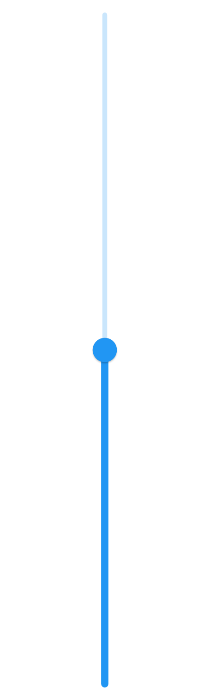

## Handle value change

The [`onChanged`](https://pub.dev/documentation/syncfusion_flutter_sliders/latest/sliders/SfSlider/onChanged.html) callback is used to get the current value of the slider when the user selects a value through interaction.

N> The slider passes the new value to the callback but does not change its state until the parent widget rebuilds the slider with new value.

### Horizontal




double _value = 5.0;

@override
Widget build(BuildContext context) {
  return MaterialApp(
      home: Scaffold(
          body: Center(
              child: SfSlider(
                min: 0.0,
                max: 10.0,
                value: _value,
                onChanged: (dynamic newValue) {
                  setState(() {
                    _value = newValue;
                  });
                },
              )
          )
      )
  );
}




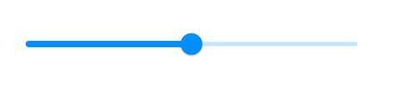

### Vertical




double _value = 5.0;

@override
Widget build(BuildContext context) {
  return MaterialApp(
      home: Scaffold(
          body: Center(
              child: SfSlider.vertical(
                min: 0.0,
                max: 10.0,
                value: _value,
                onChanged: (dynamic newValue) {
                  setState(() {
                    _value = newValue;
                  });
                },
              )
          )
      )
  );
}




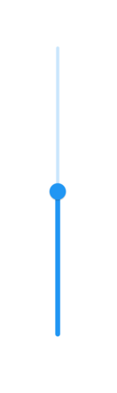

## Set numeric value

You can show numeric values in the slider by setting `double` values to the [`min`](https://pub.dev/documentation/syncfusion_flutter_sliders/latest/sliders/SfSlider/min.html), [`max`](https://pub.dev/documentation/syncfusion_flutter_sliders/latest/sliders/SfSlider/max.html) and [`value`](https://pub.dev/documentation/syncfusion_flutter_sliders/latest/sliders/SfSlider/value.html) properties.

### Horizontal




final double _min = 0;
final double _max = 100;
double _value = 40.0;

@override
Widget build(BuildContext context) {
  return MaterialApp(
      home: Scaffold(
          body: Center(
            child: SfSlider(
              min: _min,
              max: _max,
              value: _value,
              interval: 20,
              showLabels: true,
              onChanged: (dynamic newValue) {
                setState(() {
                  _value = newValue;
                });
              },
            ),
          )
      )
  );
}




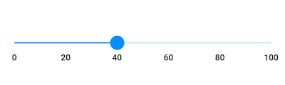

### Vertical




final double _min = 0;
final double _max = 100;
double _value = 40.0;

@override
Widget build(BuildContext context) {
  return MaterialApp(
      home: Scaffold(
          body: Center(
            child: SfSlider.vertical(
              min: _min,
              max: _max,
              value: _value,
              interval: 20,
              showLabels: true,
              onChanged: (dynamic newValue) {
                setState(() {
                  _value = newValue;
                });
              },
            ),
          )
      )
  );
}




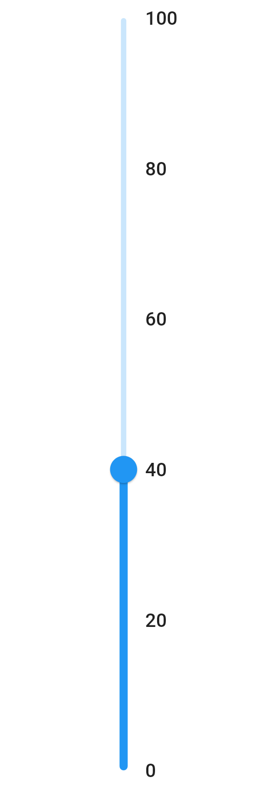

## Set date value

You can show date values in the slider by setting `DateTime` values to the [`min`](https://pub.dev/documentation/syncfusion_flutter_sliders/latest/sliders/SfSlider/min.html), [`max`](https://pub.dev/documentation/syncfusion_flutter_sliders/latest/sliders/SfSlider/max.html) and [`value`](https://pub.dev/documentation/syncfusion_flutter_sliders/latest/sliders/SfSlider/value.html) properties.

N> You must import [`intl`](https://pub.dev/packages/intl) package for formatting date slider using the [`DateFormat`](https://pub.dev/documentation/intl/latest/intl/DateFormat-class.html) class.

### Horizontal




DateTime _min = DateTime(2008, 01, 01);
DateTime _max = DateTime(2018, 01, 01);
DateTime _value = DateTime(2012, 01, 01);

@override
Widget build(BuildContext context) {
  return Scaffold(
    body: Center(
      child: SfSlider(
        min: _min,
        max: _max,
        value: _value,
        interval: 2,
        showLabels: true,
        dateIntervalType: DateIntervalType.years,
        dateFormat: DateFormat.y(),
        onChanged: (dynamic newValue) {
          setState(() {
            _value = newValue;
          });
        },
      ),
    ),
  );
}




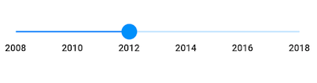

### Vertical




DateTime _min = DateTime(2008, 01, 01);
DateTime _max = DateTime(2018, 01, 01);
DateTime _value = DateTime(2012, 01, 01);

@override
Widget build(BuildContext context) {
  return Scaffold(
    body: Center(
      child: SfSlider.vertical(
        min: _min,
        max: _max,
        value: _value,
        interval: 2,
        showLabels: true,
        dateIntervalType: DateIntervalType.years,
        dateFormat: DateFormat.y(),
        onChanged: (dynamic newValue) {
          setState(() {
            _value = newValue;
          });
        },
      ),
    ),
  );
}




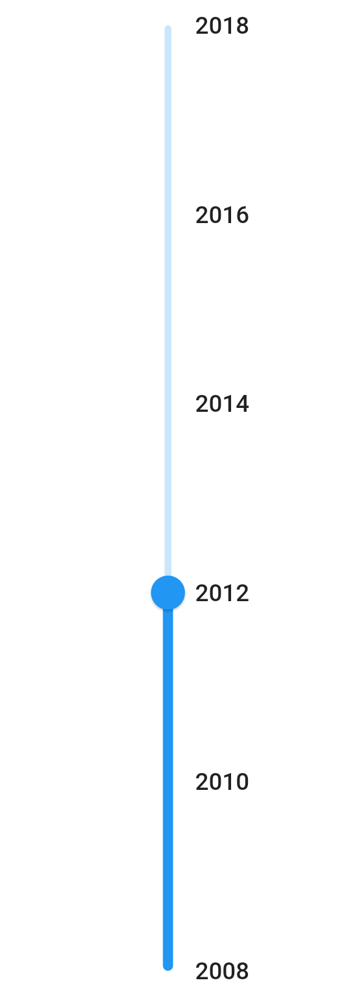

## Enable ticks

You can enable ticks in the slider using the [`showTicks`](https://pub.dev/documentation/syncfusion_flutter_sliders/latest/sliders/SfSlider/showTicks.html) property.

### Horizontal




final double _min = 0;
final double _max = 100;
double _value = 40.0;

@override
Widget build(BuildContext context) {
  return Scaffold(
    body: Center(
      child: SfSlider(
        min: _min,
        max: _max,
        value: _value,
        interval: 20,
        showTicks: true,
        showLabels: true,
        onChanged: (dynamic newValue) {
          setState(() {
            _value = newValue;
          });
        },
      ),
    ),
  );
}




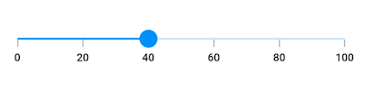

### Vertical




final double _min = 0;
final double _max = 100;
double _value = 40.0;

@override
Widget build(BuildContext context) {
  return Scaffold(
    body: Center(
      child: SfSlider.vertical(
        min: _min,
        max: _max,
        value: _value,
        interval: 20,
        showTicks: true,
        showLabels: true,
        onChanged: (dynamic newValue) {
          setState(() {
            _value = newValue;
          });
        },
      ),
    ),
  );
}




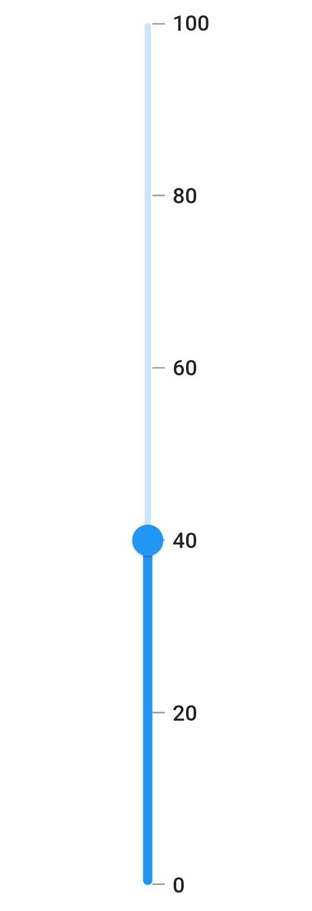

## Inverse the horizontal slider

You can invert the horizontal slider by wrapping the slider to the [`Directionality`](https://api.flutter.dev/flutter/widgets/Directionality-class.html) widget by setting [`textDirection`](https://api.flutter.dev/flutter/widgets/Directionality/textDirection.html) property to `TextDirection.rtl`.




double _value = 40.0;

@override
Widget build(BuildContext context) {
  return Scaffold(
    body: Directionality(
      textDirection: TextDirection.rtl,
      child: SfSlider(
        min: 0,
        max: 100,
        value: _value,
        interval: 20,
        showTicks: true,
        showLabels: true,
        onChanged: (dynamic newValue) {
          setState(() {
            _value = newValue;
          });
        },
      ),
    ),
  );
}




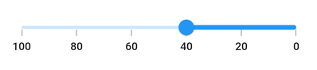

## Inverse the vertical slider

You can invert the vertical slider using the `isInversed` property. The default value of the `isInversed` property is `false`.




double _value = 40.0;

@override
Widget build(BuildContext context) {
  return Scaffold(
    body: SfSlider.vertical(
      min: 0,
      max: 100,
      value: _value,
      interval: 20,
      isInversed: true,
      showTicks: true,
      showLabels: true,
      onChanged: (dynamic newValue) {
        setState(() {
          _value = newValue;
        });
      },
    ),
  );
}




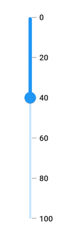

## Add prefix/suffix to labels

You can add prefix or suffix to the labels using the [`numberFormat`](https://pub.dev/documentation/syncfusion_flutter_sliders/latest/sliders/SfSlider/numberFormat.html) or [`dateFormat`](https://pub.dev/documentation/syncfusion_flutter_sliders/latest/sliders/SfSlider/dateFormat.html) properties.

N> The format type (numeric or date) of the slider is determined based on the values specified in [`min`](https://pub.dev/documentation/syncfusion_flutter_sliders/latest/sliders/SfSlider/min.html), [`max`](https://pub.dev/documentation/syncfusion_flutter_sliders/latest/sliders/SfSlider/max.html) and [`value`](https://pub.dev/documentation/syncfusion_flutter_sliders/latest/sliders/SfSlider/value.html) properties.

I> You must import [`intl`](https://pub.dev/packages/intl) package for formatting date slider using the [`DateFormat`](https://pub.dev/documentation/intl/latest/intl/DateFormat-class.html) class and for formatting numeric slider using the [`NumberFormat`](https://pub.dev/documentation/intl/latest/intl/NumberFormat-class.html) class.

### Horizontal




final double _min = 0;
final double _max = 100;
double _value = 40.0;

@override
Widget build(BuildContext context) {
  return Scaffold(
    body: Center(
      child: SfSlider(
        min: _min,
        max: _max,
        value: _value,
        interval: 20,
        showTicks: true,
        showLabels: true,
        numberFormat: NumberFormat("\$"),
        onChanged: (dynamic newValue) {
          setState(() {
            _value = newValue;
          });
        },
      ),
    ),
  );
}




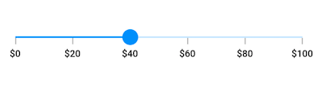

### Vertical




final double _min = 0;
final double _max = 100;
double _value = 40.0;

@override
Widget build(BuildContext context) {
  return Scaffold(
    body: Center(
      child: SfSlider.vertical(
        min: _min,
        max: _max,
        value: _value,
        interval: 20,
        showTicks: true,
        showLabels: true,
        numberFormat: NumberFormat("\$"),
        onChanged: (dynamic newValue) {
          setState(() {
            _value = newValue;
          });
        },
      ),
    ),
  );
}




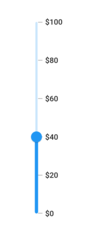
