# Flutter Slider Getting Started (SfSlider)
This section explains the steps required to add the slider widget and its elements such as numeric and date values, ticks, labels, and tooltip. This section covers only basic features needed to get started with Syncfusion&reg; slider.

To get started quickly with our Flutter Slider widget, check out this video.

<iframe id='FlutterSliderVideoTutorial' src='https://www.youtube.com/embed/f2ws1N6lvqo'></iframe>

## Add Flutter slider to an application
Create a simple project using the instructions given in the [Getting Started with your first Flutter app](https://docs.flutter.dev/get-started/test-drive#choose-your-ide) documentation.

**Add dependency**

Add the Syncfusion&reg; Flutter slider dependency to your pubspec.yaml file.




dependencies:

syncfusion_flutter_sliders: ^xx.x.xx




N> Here **xx.x.xx** denotes the current version of [`Syncfusion Flutter Sliders`](https://pub.dev/packages/syncfusion_flutter_sliders/versions) package.

**Get packages** 

Run the following command to get the required packages.




flutter pub get




**Import package**

Import the following package in your Dart code.




import 'package:syncfusion_flutter_sliders/sliders.dart';




## Initialize slider

After importing the package, initialize the slider widget as a child of any widget. Here, the slider widget is added as a child of the Center widget. The default value of the [`min`](https://pub.dev/documentation/syncfusion_flutter_sliders/latest/sliders/SfSlider/min.html) and [`max`](https://pub.dev/documentation/syncfusion_flutter_sliders/latest/sliders/SfSlider/max.html) properties of the [`SfSlider`](https://pub.dev/documentation/syncfusion_flutter_sliders/latest/sliders/SfSlider-class.html) are 0.0 and 1.0 respectively. So, the [`value`](https://pub.dev/documentation/syncfusion_flutter_sliders/latest/sliders/SfSlider/value.html) property must be given within the range.

N> The slider passes the new value to the [`onChanged`](https://pub.dev/documentation/syncfusion_flutter_sliders/latest/sliders/SfSlider/onChanged.html) callback but does not change its state until the parent widget rebuilds the slider with the new value.

### Horizontal




import 'package:flutter/material.dart';
import 'package:syncfusion_flutter_sliders/sliders.dart';

class HorizontalSliderPage extends StatefulWidget {
  @override
  _HorizontalSliderPageState createState() => _HorizontalSliderPageState();
}

class _HorizontalSliderPageState extends State<HorizontalSliderPage> {
  double _value = 0.5;

  @override
  Widget build(BuildContext context) {
    return Scaffold(
      body: Center(
        child: SfSlider(
          value: _value,
          onChanged: (double newValue){
            setState(() {
              _value = newValue;
            });
          },
        ),
      ),
    );
  }
}




### Vertical




import 'package:flutter/material.dart';
import 'package:syncfusion_flutter_sliders/sliders.dart';

class VerticalSliderPage extends StatefulWidget {
  @override
  _VerticalSliderPageState createState() => _VerticalSliderPageState();
}

class _VerticalSliderPageState extends State<VerticalSliderPage> {
  double _value = 0.5;

  @override
  Widget build(BuildContext context) {
    return Scaffold(
      body: Center(
        child: SfSlider.vertical(
          value: _value,
          onChanged: (double newValue){
            setState(() {
              _value = newValue;
            });
          },
        ),
      ),
    );
  }
}




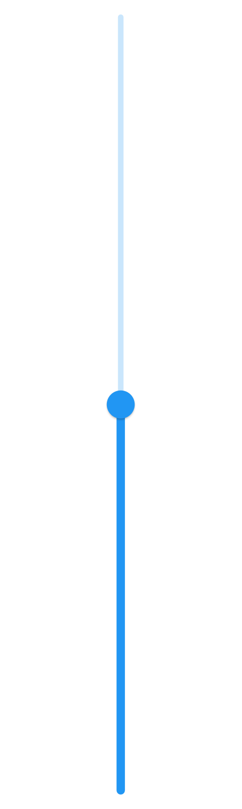

## Handle value change

The [`onChanged`](https://pub.dev/documentation/syncfusion_flutter_sliders/latest/sliders/SfSlider/onChanged.html) callback is used to get the current value of the slider when the user selects a value through interaction.

N> The slider passes the new value to the callback but does not change its state until the parent widget rebuilds the slider with the new value.

### Horizontal




import 'package:flutter/material.dart';
import 'package:syncfusion_flutter_sliders/sliders.dart';

class HorizontalHandleValuePage extends StatefulWidget {
  @override
  _HorizontalHandleValuePageState createState() => _HorizontalHandleValuePageState();
}

class _HorizontalHandleValuePageState extends State<HorizontalHandleValuePage> {
  double _value = 5.0;

  @override
  Widget build(BuildContext context) {
    return MaterialApp(
        home: Scaffold(
            body: Center(
                child: SfSlider(
                  min: 0.0,
                  max: 10.0,
                  value: _value,
                  onChanged: (double newValue) {
                    setState(() {
                      _value = newValue;
                    });
                  },
                )
            )
        )
    );
  }
}




### Vertical




import 'package:flutter/material.dart';
import 'package:syncfusion_flutter_sliders/sliders.dart';

class VerticalHandleValuePage extends StatefulWidget {
  @override
  _VerticalHandleValuePageState createState() => _VerticalHandleValuePageState();
}

class _VerticalHandleValuePageState extends State<VerticalHandleValuePage> {
  double _value = 5.0;

  @override
  Widget build(BuildContext context) {
    return MaterialApp(
        home: Scaffold(
            body: Center(
                child: SfSlider.vertical(
                  min: 0.0,
                  max: 10.0,
                  value: _value,
                  onChanged: (double newValue) {
                    setState(() {
                      _value = newValue;
                    });
                  },
                )
            )
        )
    );
  }
}




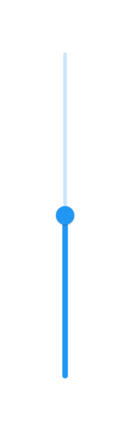

## Set numeric value

You can show numeric values in the slider by setting `double` values to the [`min`](https://pub.dev/documentation/syncfusion_flutter_sliders/latest/sliders/SfSlider/min.html), [`max`](https://pub.dev/documentation/syncfusion_flutter_sliders/latest/sliders/SfSlider/max.html) and [`value`](https://pub.dev/documentation/syncfusion_flutter_sliders/latest/sliders/SfSlider/value.html) properties.

### Horizontal




import 'package:flutter/material.dart';
import 'package:syncfusion_flutter_sliders/sliders.dart';

class NumericSliderPage extends StatefulWidget {
  @override
  _NumericSliderPageState createState() => _NumericSliderPageState();
}

class _NumericSliderPageState extends State<NumericSliderPage> {
  final double _min = 0;
  final double _max = 100;
  double _value = 40.0;

  @override
  Widget build(BuildContext context) {
    return MaterialApp(
        home: Scaffold(
            body: Center(
              child: SfSlider(
                min: _min,
                max: _max,
                value: _value,
                interval: 20,
                showLabels: true,
                onChanged: (double newValue) {
                  setState(() {
                    _value = newValue;
                  });
                },
              ),
            )
        )
    );
  }
}




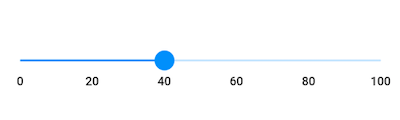

### Vertical




import 'package:flutter/material.dart';
import 'package:syncfusion_flutter_sliders/sliders.dart';

class VerticalNumericSliderPage extends StatefulWidget {
  @override
  _VerticalNumericSliderPageState createState() => _VerticalNumericSliderPageState();
}

class _VerticalNumericSliderPageState extends State<VerticalNumericSliderPage> {
  final double _min = 0;
  final double _max = 100;
  double _value = 40.0;

  @override
  Widget build(BuildContext context) {
    return MaterialApp(
        home: Scaffold(
            body: Center(
              child: SfSlider.vertical(
                min: _min,
                max: _max,
                value: _value,
                interval: 20,
                showLabels: true,
                onChanged: (double newValue) {
                  setState(() {
                    _value = newValue;
                  });
                },
              ),
            )
        )
    );
  }
}




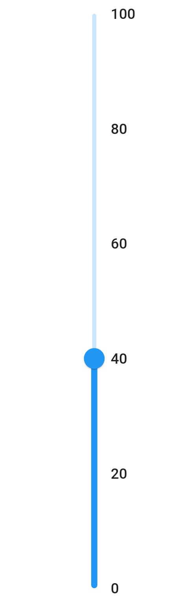

## Set date value

You can show date values in the slider by setting `DateTime` values to the [`min`](https://pub.dev/documentation/syncfusion_flutter_sliders/latest/sliders/SfSlider/min.html), [`max`](https://pub.dev/documentation/syncfusion_flutter_sliders/latest/sliders/SfSlider/max.html) and [`value`](https://pub.dev/documentation/syncfusion_flutter_sliders/latest/sliders/SfSlider/value.html) properties.

N> You must import [`intl`](https://pub.dev/packages/intl) package for formatting date slider using the [`DateFormat`](https://pub.dev/documentation/intl/latest/intl/DateFormat-class.html) class.

### Horizontal




import 'package:flutter/material.dart';
import 'package:intl/intl.dart';
import 'package:syncfusion_flutter_sliders/sliders.dart';

class DateSliderPage extends StatefulWidget {
  @override
  _DateSliderPageState createState() => _DateSliderPageState();
}

class _DateSliderPageState extends State<DateSliderPage> {
  DateTime _min = DateTime(2008, 01, 01);
  DateTime _max = DateTime(2018, 01, 01);
  DateTime _value = DateTime(2012, 01, 01);

  @override
  Widget build(BuildContext context) {
    return Scaffold(
      body: Center(
        child: SfSlider(
          min: _min,
          max: _max,
          value: _value,
          interval: 2,
          showLabels: true,
          dateIntervalType: DateIntervalType.years,
          dateFormat: DateFormat.y(),
          onChanged: (DateTime newValue) {
            setState(() {
              _value = newValue;
            });
          },
        ),
      ),
    );
  }
}




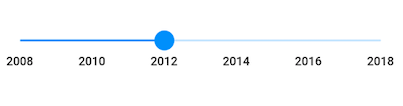

### Vertical




import 'package:flutter/material.dart';
import 'package:intl/intl.dart';
import 'package:syncfusion_flutter_sliders/sliders.dart';

class VerticalDateSliderPage extends StatefulWidget {
  @override
  _VerticalDateSliderPageState createState() => _VerticalDateSliderPageState();
}

class _VerticalDateSliderPageState extends State<VerticalDateSliderPage> {
  DateTime _min = DateTime(2008, 01, 01);
  DateTime _max = DateTime(2018, 01, 01);
  DateTime _value = DateTime(2012, 01, 01);

  @override
  Widget build(BuildContext context) {
    return Scaffold(
      body: Center(
        child: SfSlider.vertical(
          min: _min,
          max: _max,
          value: _value,
          interval: 2,
          showLabels: true,
          dateIntervalType: DateIntervalType.years,
          dateFormat: DateFormat.y(),
          onChanged: (DateTime newValue) {
            setState(() {
              _value = newValue;
            });
          },
        ),
      ),
    );
  }
}




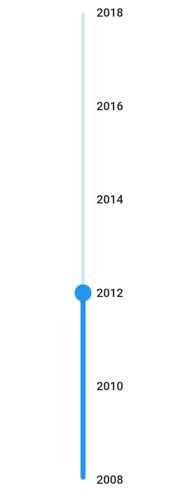

## Enable ticks

You can enable ticks in the slider using the [`showTicks`](https://pub.dev/documentation/syncfusion_flutter_sliders/latest/sliders/SfSlider/showTicks.html) property.

### Horizontal




import 'package:flutter/material.dart';
import 'package:syncfusion_flutter_sliders/sliders.dart';

class TicksSliderPage extends StatefulWidget {
  @override
  _TicksSliderPageState createState() => _TicksSliderPageState();
}

class _TicksSliderPageState extends State<TicksSliderPage> {
  final double _min = 0;
  final double _max = 100;
  double _value = 40.0;

  @override
  Widget build(BuildContext context) {
    return Scaffold(
      body: Center(
        child: SfSlider(
          min: _min,
          max: _max,
          value: _value,
          interval: 20,
          showTicks: true,
          showLabels: true,
          onChanged: (double newValue) {
            setState(() {
              _value = newValue;
            });
          },
        ),
      ),
    );
  }
}




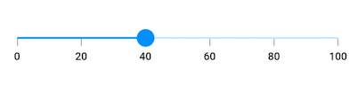

### Vertical




import 'package:flutter/material.dart';
import 'package:syncfusion_flutter_sliders/sliders.dart';

class VerticalTicksSliderPage extends StatefulWidget {
  @override
  _VerticalTicksSliderPageState createState() => _VerticalTicksSliderPageState();
}

class _VerticalTicksSliderPageState extends State<VerticalTicksSliderPage> {
  final double _min = 0;
  final double _max = 100;
  double _value = 40.0;

  @override
  Widget build(BuildContext context) {
    return Scaffold(
      body: Center(
        child: SfSlider.vertical(
          min: _min,
          max: _max,
          value: _value,
          interval: 20,
          showTicks: true,
          showLabels: true,
          onChanged: (double newValue) {
            setState(() {
              _value = newValue;
            });
          },
        ),
      ),
    );
  }
}




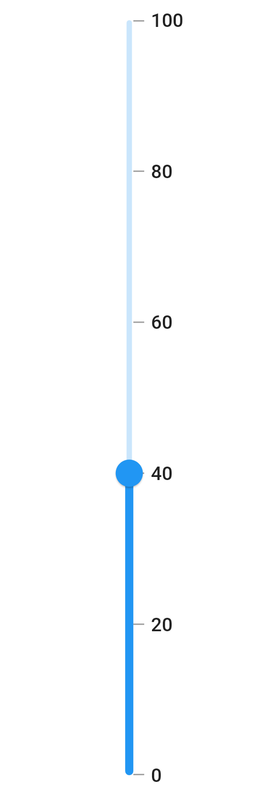

## Inverse the horizontal slider

You can invert the horizontal slider by wrapping the slider to the [`Directionality`](https://api.flutter.dev/flutter/widgets/Directionality-class.html) widget by setting [`textDirection`](https://api.flutter.dev/flutter/widgets/Directionality/textDirection.html) property to `TextDirection.rtl`.




import 'package:flutter/material.dart';
import 'package:syncfusion_flutter_sliders/sliders.dart';

class InversedHorizontalSliderPage extends StatefulWidget {
  @override
  _InversedHorizontalSliderPageState createState() => _InversedHorizontalSliderPageState();
}

class _InversedHorizontalSliderPageState extends State<InversedHorizontalSliderPage> {
  double _value = 40.0;

  @override
  Widget build(BuildContext context) {
    return Scaffold(
      body: Directionality(
        textDirection: TextDirection.rtl,
        child: SfSlider(
          min: 0,
          max: 100,
          value: _value,
          interval: 20,
          showTicks: true,
          showLabels: true,
          onChanged: (double newValue) {
            setState(() {
              _value = newValue;
            });
          },
        ),
      ),
    );
  }
}




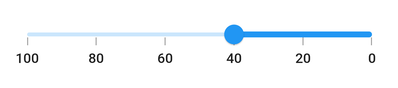

## Inverse the vertical slider

You can invert the vertical slider using the [`isInversed`](https://pub.dev/documentation/syncfusion_flutter_sliders/latest/sliders/SfSlider/isInversed.html) property. The default value of the [`isInversed`](https://pub.dev/documentation/syncfusion_flutter_sliders/latest/sliders/SfSlider/isInversed.html) property is `false`.




import 'package:flutter/material.dart';
import 'package:syncfusion_flutter_sliders/sliders.dart';

class InversedVerticalSliderPage extends StatefulWidget {
  @override
  _InversedVerticalSliderPageState createState() => _InversedVerticalSliderPageState();
}

class _InversedVerticalSliderPageState extends State<InversedVerticalSliderPage> {
  double _value = 40.0;

  @override
  Widget build(BuildContext context) {
    return Scaffold(
      body: SfSlider.vertical(
        min: 0,
        max: 100,
        value: _value,
        interval: 20,
        isInversed: true,
        showTicks: true,
        showLabels: true,
        onChanged: (double newValue) {
          setState(() {
            _value = newValue;
          });
        },
      ),
    );
  }
}




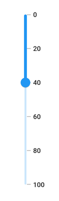

## Add prefix/suffix to labels

You can add prefix or suffix to the labels using the [`numberFormat`](https://pub.dev/documentation/syncfusion_flutter_sliders/latest/sliders/SfSlider/numberFormat.html) or [`dateFormat`](https://pub.dev/documentation/syncfusion_flutter_sliders/latest/sliders/SfSlider/dateFormat.html) properties.

N> The format type (numeric or date) of the slider is determined based on the values specified in [`min`](https://pub.dev/documentation/syncfusion_flutter_sliders/latest/sliders/SfSlider/min.html), [`max`](https://pub.dev/documentation/syncfusion_flutter_sliders/latest/sliders/SfSlider/max.html) and [`value`](https://pub.dev/documentation/syncfusion_flutter_sliders/latest/sliders/SfSlider/value.html) properties.

I> You must import [`intl`](https://pub.dev/packages/intl) package for formatting date slider using the [`DateFormat`](https://pub.dev/documentation/intl/latest/intl/DateFormat-class.html) class and for formatting numeric slider using the [`NumberFormat`](https://pub.dev/documentation/intl/latest/intl/NumberFormat-class.html) class.

### Horizontal




import 'package:flutter/material.dart';
import 'package:intl/intl.dart';
import 'package:syncfusion_flutter_sliders/sliders.dart';

class PrefixSuffixSliderPage extends StatefulWidget {
  @override
  _PrefixSuffixSliderPageState createState() => _PrefixSuffixSliderPageState();
}

class _PrefixSuffixSliderPageState extends State<PrefixSuffixSliderPage> {
  final double _min = 0;
  final double _max = 100;
  double _value = 40.0;

  @override
  Widget build(BuildContext context) {
    return Scaffold(
      body: Center(
        child: SfSlider(
          min: _min,
          max: _max,
          value: _value,
          interval: 20,
          showTicks: true,
          showLabels: true,
          numberFormat: NumberFormat("\$"),
          onChanged: (double newValue) {
            setState(() {
              _value = newValue;
            });
          },
        ),
      ),
    );
  }
}




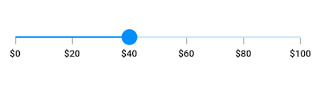

### Vertical




import 'package:flutter/material.dart';
import 'package:intl/intl.dart';
import 'package:syncfusion_flutter_sliders/sliders.dart';

class VerticalPrefixSuffixSliderPage extends StatefulWidget {
  @override
  _VerticalPrefixSuffixSliderPageState createState() => _VerticalPrefixSuffixSliderPageState();
}

class _VerticalPrefixSuffixSliderPageState extends State<VerticalPrefixSuffixSliderPage> {
  final double _min = 0;
  final double _max = 100;
  double _value = 40.0;

  @override
  Widget build(BuildContext context) {
    return Scaffold(
      body: Center(
        child: SfSlider.vertical(
          min: _min,
          max: _max,
          value: _value,
          interval: 20,
          showTicks: true,
          showLabels: true,
          numberFormat: NumberFormat("\$"),
          onChanged: (double newValue) {
            setState(() {
              _value = newValue;
            });
          },
        ),
      ),
    );
  }
}




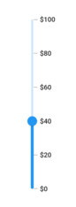
