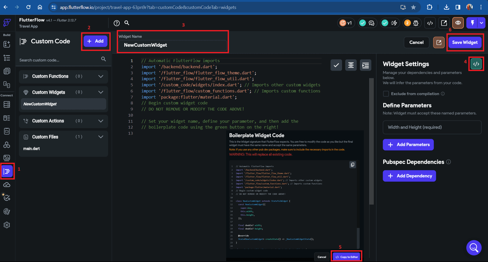

# How to add Syncfusion Flutter Slider Widget in FlutterFlow framework?

## Overview of FlutterFlow

[FlutterFlow](https://app.flutterflow.io/) is a visual programming tool designed to simplify the development process of Flutter applications, particularly for those who may not have extensive experience with traditional coding. It allows users to create Flutter apps through a drag-and-drop interface, reducing the need for manual coding and speeding up the development cycle.

### Steps for creating the custom widget:

Before proceeding with the steps, please visit [FlutterFlow](https://app.flutterflow.io/) and sign up or sign in. Once you are logged in, go to the start page of FlutterFlow and find the **+ Create New** button. Click on it to open a popup for creating a new project. Start by giving your project a name and then select **Create Blank** below the project name. Next, you can decide whether to **Skip** or **Enable Web** in the project page setup and click on **Next**. This will take you to the project's homepage. Follow the steps below to create a custom widget effectively.

## Step 1: Creating the custom widget

To create a custom widget, follow the steps below:

1. Navigate to [FlutterFlow](https://app.flutterflow.io/) and choose the **Custom Code** option from the left side of the navigation menu.
2. Click on the **+ Add** button and select **Widget** from the three options: Function, Widget, and Action.
3. Initially, the widget name starts as **NewCustomWidget**. Rename the widget name.
4. Go to widget settings on the right side and click on the **View Boilerplate Code** button, represented by this icon **[</>]**.
5. A popup will appear; scroll down to locate the button labeled **[</>] Copy to Editor**, and click on it.
6. Save the widget.

## Step 2: Requirements for including a dependency

To add dependencies to the custom widget, follow these steps:

1. Visit [pub.dev](https://pub.dev/) and search for the [Syncfusion Flutter Slider](https://pub.dev/packages/syncfusion_flutter_sliders) dependency using the search bar.

2. After finding the dependency, copy its name and version as shown in the snapshot.

3. To paste the dependency, click on the **+ Add Dependency** button on the right side of the navigation menu. Remember to save the process after adding it.

N> If you're using an older version, there's no need to use the **Caret Symbol (^)** before the version number. For the latest version, you would use **syncfusion_flutter_widget: ^xx.x.xx**, whereas for an older version, you would use **syncfusion_flutter_widget: xx.x.xx**.

## Step 3: Importing packages from the dependency

To import the package required by the dependency, follow these steps:

1. To find the package to copy, scroll down from the [installing](https://pub.dev/packages/syncfusion_flutter_sliders/install) tab on [pub.dev](https://pub.dev/) as shown in the snapshot.

2. Insert the header into the code editor as shown in the snapshot below, and then save the process.

## Step 4: Adding the widget code snippet in code editor

To insert the code snippet into the code editor, follow these steps:

1. Navigate to the **Syncfusion Slider Documentation** at [help.syncfusion.com](https://help.syncfusion.com/flutter/slider/getting-started) and scroll down to find the widget codes.

2. Instead of copying the entire code, select only the widget snippet, and copy it as illustrated in the picture below.

    
N> Do not copy the entire code; copy only the widget code.

3. Add the copied code snippet to the code editor, and save the process by following the steps below:

    1. Paste the copied code snippet into the selected portion as shown in the snapshot (Replace container() with copied code snippet).
    2. Format the code using the **Format Code** button in the code editor.
    3. Save the process.

## Step 5: Compiling code

To compile the code, follow the instructions:

1. To compile the code, click on the **Compile Code** button located on the right side, as demonstrated in the snapshot, and then save the process.

## Step 6: Utilizing the custom widget on a page

To use this custom widget on the page, follow these steps:

1. Click on the **Widget Palette** option in the left navigation menu.
2. You will see a **Diamond** symbol; click on that icon.
3. Once click on it, you will find the custom code widget with your widget file name listed below it.
4. To add it to the page, simply drag and drop it onto the page.
5. Adjust the width and height of the widget using the **Custom Widget Properties** available on the right side in [FlutterFlow](https://app.flutterflow.io/).

