# Flutter Slider Labels and Dividers (SfSlider)
This section explains how to add labels and dividers to the slider.

N> You must import the `theme.dart` library from the [`Core`](https://pub.dev/packages/syncfusion_flutter_core) package to use [`SfSliderTheme`](https://pub.dev/documentation/syncfusion_flutter_core/latest/theme/SfSliderTheme-class.html) for customizing label and divider appearance in the examples below. You must also import the [`intl`](https://pub.dev/packages/intl) package for formatting numeric and date labels.

## Show labels

The [`showLabels`](https://pub.dev/documentation/syncfusion_flutter_sliders/latest/sliders/SfSlider/showLabels.html) property is used to render the labels on given interval. The default value of [`showLabels`](https://pub.dev/documentation/syncfusion_flutter_sliders/latest/sliders/SfSlider/showLabels.html) property is `false`.

### Horizontal




import 'package:flutter/material.dart';
import 'package:syncfusion_flutter_sliders/sliders.dart';

class ShowLabelsPage extends StatefulWidget {
  @override
  _ShowLabelsPageState createState() => _ShowLabelsPageState();
}

class _ShowLabelsPageState extends State<ShowLabelsPage> {
  double _value = 6.0;

  @override
  Widget build(BuildContext context) {
    return MaterialApp(
        home: Scaffold(
            body: Center(
              child: SfSlider(
                min: 0.0,
                max: 10.0,
                interval: 2,
                showLabels: true,
                showTicks: true,
                value: _value,
                onChanged: (double newValue) {
                  setState(() {
                    _value = newValue;
                  });
                },
              ),
            )
        )
    );
  }
}




### Vertical




import 'package:flutter/material.dart';
import 'package:syncfusion_flutter_sliders/sliders.dart';

class VerticalShowLabelsPage extends StatefulWidget {
  @override
  _VerticalShowLabelsPageState createState() => _VerticalShowLabelsPageState();
}

class _VerticalShowLabelsPageState extends State<VerticalShowLabelsPage> {
  double _value = 6.0;

  @override
  Widget build(BuildContext context) {
    return MaterialApp(
        home: Scaffold(
            body: Center(
              child: SfSlider.vertical(
                min: 0.0,
                max: 10.0,
                interval: 2,
                showLabels: true,
                showTicks: true,
                value: _value,
                onChanged: (double newValue) {
                  setState(() {
                    _value = newValue;
                  });
                },
              ),
            )
        )
    );
  }
}




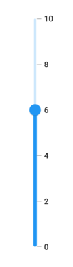

N>
* Refer the [`numberFormat`](https://pub.dev/documentation/syncfusion_flutter_sliders/latest/sliders/SfSlider/numberFormat.html) and [`dateFormat`](https://pub.dev/documentation/syncfusion_flutter_sliders/latest/sliders/SfSlider/dateFormat.html) for formatting the numeric and date labels respectively.
* Refer the [`SfSliderThemeData`](https://pub.dev/documentation/syncfusion_flutter_core/latest/theme/SfSliderThemeData-class.html) for customizing the appearance of the labels.

## Number format

The [`numberFormat`](https://pub.dev/documentation/syncfusion_flutter_sliders/latest/sliders/SfSlider/numberFormat.html) property is used to format the numeric labels. The default value of [`numberFormat`](https://pub.dev/documentation/syncfusion_flutter_sliders/latest/sliders/SfSlider/numberFormat.html) property is `null`.

### Horizontal




import 'package:flutter/material.dart';
import 'package:intl/intl.dart';
import 'package:syncfusion_flutter_sliders/sliders.dart';

class NumberFormatPage extends StatefulWidget {
  @override
  _NumberFormatPageState createState() => _NumberFormatPageState();
}

class _NumberFormatPageState extends State<NumberFormatPage> {
  double _value = 6.0;

  @override
  Widget build(BuildContext context) {
    return MaterialApp(
        home: Scaffold(
            body: Center(
              child: SfSlider(
                min: 0.0,
                max: 10.0,
                value: _value,
                interval: 2,
                showTicks: true,
                showLabels: true,
                numberFormat: NumberFormat('\$'),
                onChanged: (double newValue) {
                  setState(() {
                    _value = newValue;
                  });
                },
              ),
            )
        )
    );
  }
}




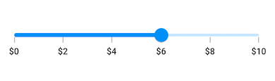

### Vertical




import 'package:flutter/material.dart';
import 'package:intl/intl.dart';
import 'package:syncfusion_flutter_sliders/sliders.dart';

class VerticalNumberFormatPage extends StatefulWidget {
  @override
  _VerticalNumberFormatPageState createState() => _VerticalNumberFormatPageState();
}

class _VerticalNumberFormatPageState extends State<VerticalNumberFormatPage> {
  double _value = 6.0;

  @override
  Widget build(BuildContext context) {
    return MaterialApp(
        home: Scaffold(
            body: Center(
              child: SfSlider.vertical(
                min: 0.0,
                max: 10.0,
                value: _value,
                interval: 2,
                showTicks: true,
                showLabels: true,
                numberFormat: NumberFormat('\$'),
                onChanged: (double newValue) {
                  setState(() {
                    _value = newValue;
                  });
                },
              ),
            )
        )
    );
  }
}




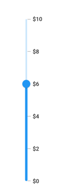

## Date format

The [`dateFormat`](https://pub.dev/documentation/syncfusion_flutter_sliders/latest/sliders/SfSlider/dateFormat.html) property is used to format the date labels. It is mandatory for the date [`SfSlider`](https://pub.dev/documentation/syncfusion_flutter_sliders/latest/sliders/SfSlider-class.html). For date values, the slider does not have auto interval support. So, it is mandatory to set [`interval`](https://pub.dev/documentation/syncfusion_flutter_sliders/latest/sliders/SfSlider/interval.html), [`dateIntervalType`](https://pub.dev/documentation/syncfusion_flutter_sliders/latest/sliders/SfSlider/dateIntervalType.html), and [`dateFormat`](https://pub.dev/documentation/syncfusion_flutter_sliders/latest/sliders/SfSlider/dateFormat.html) for date values. The default value of [`dateFormat`](https://pub.dev/documentation/syncfusion_flutter_sliders/latest/sliders/SfSlider/dateFormat.html) property is `null`.

### Year format
#### Horizontal




import 'package:flutter/material.dart';
import 'package:intl/intl.dart';
import 'package:syncfusion_flutter_sliders/sliders.dart';

class YearFormatPage extends StatefulWidget {
  @override
  _YearFormatPageState createState() => _YearFormatPageState();
}

class _YearFormatPageState extends State<YearFormatPage> {
  DateTime _value = DateTime(2002, 01, 01);

  @override
  Widget build(BuildContext context) {
    return MaterialApp(
        home: Scaffold(
            body: Center(
              child: SfSlider(
                min: DateTime(2000, 01, 01, 00),
                max: DateTime(2004, 12, 31, 24),
                value: _value,
                interval: 1,
                showLabels: true,
                showTicks: true,
                dateFormat: DateFormat.y(),
                dateIntervalType: DateIntervalType.years,
                onChanged: (DateTime newValue) {
                  setState(() {
                    _value = newValue;
                  });
                },
              ),
            )
        )
    );
  }
}




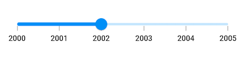

#### Vertical




import 'package:flutter/material.dart';
import 'package:intl/intl.dart';
import 'package:syncfusion_flutter_sliders/sliders.dart';

class VerticalYearFormatPage extends StatefulWidget {
  @override
  _VerticalYearFormatPageState createState() => _VerticalYearFormatPageState();
}

class _VerticalYearFormatPageState extends State<VerticalYearFormatPage> {
  DateTime _value = DateTime(2002, 01, 01);

  @override
  Widget build(BuildContext context) {
    return MaterialApp(
        home: Scaffold(
            body: Center(
              child: SfSlider.vertical(
                min: DateTime(2000, 01, 01, 00),
                max: DateTime(2004, 12, 31, 24),
                value: _value,
                interval: 1,
                showLabels: true,
                showTicks: true,
                dateFormat: DateFormat.y(),
                dateIntervalType: DateIntervalType.years,
                onChanged: (DateTime newValue) {
                  setState(() {
                    _value = newValue;
                  });
                },
              ),
            )
        )
    );
  }
}




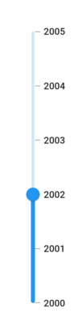

### Month format
#### Horizontal




import 'package:flutter/material.dart';
import 'package:intl/intl.dart';
import 'package:syncfusion_flutter_sliders/sliders.dart';

class MonthFormatPage extends StatefulWidget {
  @override
  _MonthFormatPageState createState() => _MonthFormatPageState();
}

class _MonthFormatPageState extends State<MonthFormatPage> {
  DateTime _value = DateTime(2000, 03, 01);

  @override
  Widget build(BuildContext context) {
    return MaterialApp(
        home: Scaffold(
            body: Center(
              child: SfSlider(
                min: DateTime(2000, 01, 01, 00),
                max: DateTime(2000, 09, 02, 00),
                value: _value,
                interval: 2,
                showLabels: true,
                showTicks: true,
                dateFormat: DateFormat.yM(),
                dateIntervalType: DateIntervalType.months,
                onChanged: (DateTime newValue) {
                  setState(() {
                    _value = newValue;
                  });
                },
              ),
            )
        )
    );
  }
}




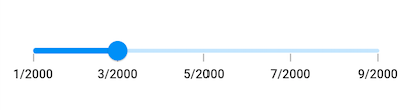

#### Vertical




import 'package:flutter/material.dart';
import 'package:intl/intl.dart';
import 'package:syncfusion_flutter_sliders/sliders.dart';

class VerticalMonthFormatPage extends StatefulWidget {
  @override
  _VerticalMonthFormatPageState createState() => _VerticalMonthFormatPageState();
}

class _VerticalMonthFormatPageState extends State<VerticalMonthFormatPage> {
  DateTime _value = DateTime(2000, 03, 01);

  @override
  Widget build(BuildContext context) {
    return MaterialApp(
        home: Scaffold(
            body: Center(
              child: SfSlider.vertical(
                min: DateTime(2000, 01, 01, 00),
                max: DateTime(2000, 09, 02, 00),
                value: _value,
                interval: 2,
                showLabels: true,
                showTicks: true,
                dateFormat: DateFormat.yM(),
                dateIntervalType: DateIntervalType.months,
                onChanged: (DateTime newValue) {
                  setState(() {
                    _value = newValue;
                  });
                },
              ),
            )
        )
    );
  }
}




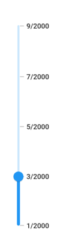

### Hour format
#### Horizontal




import 'package:flutter/material.dart';
import 'package:intl/intl.dart';
import 'package:syncfusion_flutter_sliders/sliders.dart';

class HourFormatPage extends StatefulWidget {
  @override
  _HourFormatPageState createState() => _HourFormatPageState();
}

class _HourFormatPageState extends State<HourFormatPage> {
  DateTime _value = DateTime(2000, 01, 01, 12, 00, 00);

  @override
  Widget build(BuildContext context) {
    return MaterialApp(
        home: Scaffold(
            body: Center(
              child: SfSlider(
                min: DateTime(2000, 01, 01, 02, 00, 00),
                max: DateTime(2000, 01, 01, 22, 00, 00),
                value: _value,
                interval: 5,
                showLabels: true,
                showTicks: true,
                dateFormat: DateFormat('h:mm a'),
                dateIntervalType: DateIntervalType.hours,
                onChanged: (DateTime newValue) {
                  setState(() {
                    _value = newValue;
                  });
                },
              ),
            )
        )
    );
  }
}




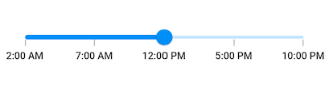

#### Vertical




import 'package:flutter/material.dart';
import 'package:intl/intl.dart';
import 'package:syncfusion_flutter_sliders/sliders.dart';

class VerticalHourFormatPage extends StatefulWidget {
  @override
  _VerticalHourFormatPageState createState() => _VerticalHourFormatPageState();
}

class _VerticalHourFormatPageState extends State<VerticalHourFormatPage> {
  DateTime _value = DateTime(2000, 01, 01, 12, 00, 00);

  @override
  Widget build(BuildContext context) {
    return MaterialApp(
        home: Scaffold(
            body: Center(
              child: SfSlider.vertical(
                min: DateTime(2000, 01, 01, 02, 00, 00),
                max: DateTime(2000, 01, 01, 22, 00, 00),
                value: _value,
                interval: 5,
                showLabels: true,
                showTicks: true,
                dateFormat: DateFormat('h:mm a'),
                dateIntervalType: DateIntervalType.hours,
                onChanged: (DateTime newValue) {
                  setState(() {
                    _value = newValue;
                  });
                },
              ),
            )
        )
    );
  }
}




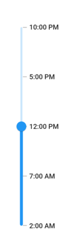

N> Refer the [`DateFormat`](https://pub.dev/documentation/intl/latest/intl/DateFormat-class.html) class for other date format.

## Label placement

The [`labelPlacement`](https://pub.dev/documentation/syncfusion_flutter_sliders/latest/sliders/SfSlider/labelPlacement.html) property is used to place the labels either between the major ticks or on the major ticks. The default value of the [`labelPlacement`](https://pub.dev/documentation/syncfusion_flutter_sliders/latest/sliders/SfSlider/labelPlacement.html) property is `LabelPlacement.onTicks`.

### Horizontal




import 'package:flutter/material.dart';
import 'package:intl/intl.dart';
import 'package:syncfusion_flutter_sliders/sliders.dart';

class LabelPlacementPage extends StatefulWidget {
  @override
  _LabelPlacementPageState createState() => _LabelPlacementPageState();
}

class _LabelPlacementPageState extends State<LabelPlacementPage> {
  DateTime _value = DateTime(2002, 01, 01);

  @override
  Widget build(BuildContext context) {
    return MaterialApp(
        home: Scaffold(
            body: Center(
              child: SfSlider(
                min: DateTime(2000, 01, 01, 00),
                max: DateTime(2004, 12, 31, 24),
                value: _value,
                interval: 1,
                showLabels: true,
                showTicks: true,
                labelPlacement: LabelPlacement.betweenTicks,
                dateFormat: DateFormat.y(),
                dateIntervalType: DateIntervalType.years,
                onChanged: (DateTime newValue) {
                  setState(() {
                    _value = newValue;
                  });
                },
              ),
            )
        )
    );
  }
}




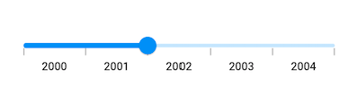

### Vertical




import 'package:flutter/material.dart';
import 'package:intl/intl.dart';
import 'package:syncfusion_flutter_sliders/sliders.dart';

class VerticalLabelPlacementPage extends StatefulWidget {
  @override
  _VerticalLabelPlacementPageState createState() => _VerticalLabelPlacementPageState();
}

class _VerticalLabelPlacementPageState extends State<VerticalLabelPlacementPage> {
  DateTime _value = DateTime(2002, 01, 01);

  @override
  Widget build(BuildContext context) {
    return MaterialApp(
        home: Scaffold(
            body: Center(
              child: SfSlider.vertical(
                min: DateTime(2000, 01, 01, 00),
                max: DateTime(2004, 12, 31, 24),
                value: _value,
                interval: 1,
                showLabels: true,
                showTicks: true,
                labelPlacement: LabelPlacement.betweenTicks,
                dateFormat: DateFormat.y(),
                dateIntervalType: DateIntervalType.years,
                onChanged: (DateTime newValue) {
                  setState(() {
                    _value = newValue;
                  });
                },
              ),
            )
        )
    );
  }
}




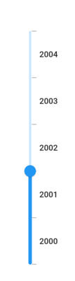

## Edge label placement

The [`edgeLabelPlacement`](https://pub.dev/documentation/syncfusion_flutter_sliders/latest/sliders/SfSlider/edgeLabelPlacement.html) property determines how the edge (first and last) labels are positioned on the slider. This property allows the edge labels to be placed either inside the major ticks or directly on the major ticks. 

The default value of the [`edgeLabelPlacement`](https://pub.dev/documentation/syncfusion_flutter_sliders/latest/sliders/SfSlider/edgeLabelPlacement.html) property is `EdgeLabelPlacement.auto`.

### Horizontal




import 'package:flutter/material.dart';
import 'package:intl/intl.dart';
import 'package:syncfusion_flutter_sliders/sliders.dart';

class EdgeLabelPlacementPage extends StatefulWidget {
  @override
  _EdgeLabelPlacementPageState createState() => _EdgeLabelPlacementPageState();
}

class _EdgeLabelPlacementPageState extends State<EdgeLabelPlacementPage> {
  DateTime _value = DateTime(2002, 01, 01);

  @override
  Widget build(BuildContext context) {
    return MaterialApp(
        home: Scaffold(
            body: Center(
              child: SfSlider(
                min: DateTime(2000, 01, 01, 00),
                max: DateTime(2004, 12, 31, 24),
                value: _value,
                interval: 1,
                showLabels: true,
                showTicks: true,
                edgeLabelPlacement: EdgeLabelPlacement.inside,
                dateFormat: DateFormat.y(),
                dateIntervalType: DateIntervalType.years,
                onChanged: (DateTime newValue) {
                  setState(() {
                    _value = newValue;
                  });
                },
              ),
            )
        )
    );
  }
}




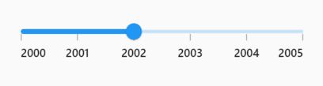

### Vertical




import 'package:flutter/material.dart';
import 'package:intl/intl.dart';
import 'package:syncfusion_flutter_sliders/sliders.dart';

class VerticalEdgeLabelPlacementPage extends StatefulWidget {
  @override
  _VerticalEdgeLabelPlacementPageState createState() => _VerticalEdgeLabelPlacementPageState();
}

class _VerticalEdgeLabelPlacementPageState extends State<VerticalEdgeLabelPlacementPage> {
  DateTime _value = DateTime(2002, 01, 01);

  @override
  Widget build(BuildContext context) {
    return MaterialApp(
        home: Scaffold(
            body: Center(
              child: SfSlider.vertical(
                min: DateTime(2000, 01, 01, 00),
                max: DateTime(2004, 12, 31, 24),
                value: _value,
                interval: 1,
                showLabels: true,
                showTicks: true,
                edgeLabelPlacement: EdgeLabelPlacement.inside,
                dateFormat: DateFormat.y(),
                dateIntervalType: DateIntervalType.years,
                onChanged: (DateTime newValue) {
                  setState(() {
                    _value = newValue;
                  });
                },
              ),
            )
        )
    );
  }
}




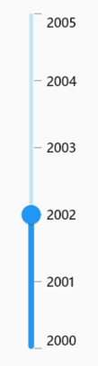

## Customize label text

You can format or change the whole numeric or date label text using the [`labelFormatterCallback`](https://pub.dev/documentation/syncfusion_flutter_sliders/latest/sliders/SfSlider/labelFormatterCallback.html). Its arguments are,

* actualValue – either `DateTime` or `double` based on given [`value`](https://pub.dev/documentation/syncfusion_flutter_sliders/latest/sliders/SfSlider/value.html).
* formattedText – If the actual value is `double`, it is formatted by [`numberFormat`](https://pub.dev/documentation/syncfusion_flutter_sliders/latest/sliders/SfSlider/numberFormat.html) and if the actual value is `DateTime`, it is formatted by [`dateFormat`](https://pub.dev/documentation/syncfusion_flutter_sliders/latest/sliders/SfSlider/dateFormat.html).

>**NOTE**
* [`labelFormatterCallback`](https://pub.dev/documentation/syncfusion_flutter_sliders/latest/sliders/SfSlider/labelFormatterCallback.html) has been deprecated, you can use [`onLabelCreated`](https://pub.dev/documentation/syncfusion_flutter_sliders/latest/sliders/SfSlider/onLabelCreated.html) callback to customize both the text and text style of the label.

### Horizontal




import 'package:flutter/material.dart';
import 'package:syncfusion_flutter_sliders/sliders.dart';

class LabelFormatterPage extends StatefulWidget {
  @override
  _LabelFormatterPageState createState() => _LabelFormatterPageState();
}

class _LabelFormatterPageState extends State<LabelFormatterPage> {
  double _value = 9900.0;

  @override
  Widget build(BuildContext context) {
    return MaterialApp(
        home: Scaffold(
            body: Center(
              child: SfSlider(
                min: 100.0,
                max: 10000.0,
                value: _value,
                showLabels: true,
                interval: 9900,
                labelFormatterCallback: (dynamic actualValue, String formattedText) {
                  return actualValue == 10000 ? '\$ $formattedText+' : '\$ $formattedText';
                },
                onChanged: (double newValue) {
                  setState(() {
                    _value = newValue;
                  });
                },
              ),
            )
        )
    );
  }
}




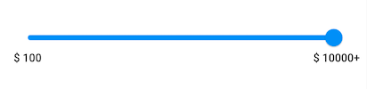

### Vertical




import 'package:flutter/material.dart';
import 'package:syncfusion_flutter_sliders/sliders.dart';

class VerticalLabelFormatterPage extends StatefulWidget {
  @override
  _VerticalLabelFormatterPageState createState() => _VerticalLabelFormatterPageState();
}

class _VerticalLabelFormatterPageState extends State<VerticalLabelFormatterPage> {
  double _value = 9900.0;

  @override
  Widget build(BuildContext context) {
    return MaterialApp(
        home: Scaffold(
            body: Center(
              child: SfSlider.vertical(
                min: 100.0,
                max: 10000.0,
                value: _value,
                showLabels: true,
                interval: 9900,
                labelFormatterCallback: (dynamic actualValue, String formattedText) {
                  return actualValue == 10000 ? '\$ $formattedText+' : '\$ $formattedText';
                },
                onChanged: (double newValue) {
                  setState(() {
                    _value = newValue;
                  });
                },
              ),
            )
        )
    );
  }
}




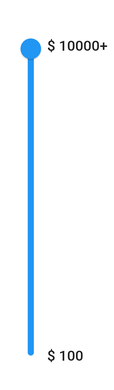

## Label style

You can change the active and inactive label appearance of the slider using the [`activeLabelStyle`](https://pub.dev/documentation/syncfusion_flutter_core/latest/theme/SfSliderThemeData/activeLabelStyle.html) and [`inactiveLabelStyle`](https://pub.dev/documentation/syncfusion_flutter_core/latest/theme/SfSliderThemeData/inactiveLabelStyle.html) properties respectively.

The active side of the slider is between the [`min`](https://pub.dev/documentation/syncfusion_flutter_sliders/latest/sliders/SfSlider/min.html) value and the thumb.

The inactive side of the slider is between the thumb and the [`max`](https://pub.dev/documentation/syncfusion_flutter_sliders/latest/sliders/SfSlider/max.html) value.

### Horizontal




import 'package:flutter/material.dart';
import 'package:syncfusion_flutter_core/theme.dart';
import 'package:syncfusion_flutter_sliders/sliders.dart';

class LabelStylePage extends StatefulWidget {
  @override
  _LabelStylePageState createState() => _LabelStylePageState();
}

class _LabelStylePageState extends State<LabelStylePage> {
  double _value = 6.0;

  @override
  Widget build(BuildContext context) {
    return MaterialApp(
        home: Scaffold(
            body: Center(
                child: SfSliderTheme(
                  data: SfSliderThemeData(
                    activeLabelStyle: TextStyle(color: Colors.red, fontSize: 12, fontStyle: FontStyle.italic),
                    inactiveLabelStyle: TextStyle(color: Colors.red[200], fontSize: 12, fontStyle: FontStyle.italic),
                  ),
                  child:  SfSlider(
                    min: 2.0,
                    max: 10.0,
                    value: _value,
                    interval: 1,
                    showLabels: true,
                    showTicks: true,
                    onChanged: (double newValue){
                      setState(() {
                        _value = newValue;
                      });
                    },
                  ),
                )
            )
        )
    );
  }
}




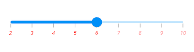

### Vertical




import 'package:flutter/material.dart';
import 'package:syncfusion_flutter_core/theme.dart';
import 'package:syncfusion_flutter_sliders/sliders.dart';

class VerticalLabelStylePage extends StatefulWidget {
  @override
  _VerticalLabelStylePageState createState() => _VerticalLabelStylePageState();
}

class _VerticalLabelStylePageState extends State<VerticalLabelStylePage> {
  double _value = 6.0;

  @override
  Widget build(BuildContext context) {
    return MaterialApp(
        home: Scaffold(
            body: Center(
                child: SfSliderTheme(
                  data: SfSliderThemeData(
                    activeLabelStyle: TextStyle(color: Colors.red, fontSize: 12, fontStyle: FontStyle.italic),
                    inactiveLabelStyle: TextStyle(color: Colors.red[200], fontSize: 12, fontStyle: FontStyle.italic),
                  ),
                  child:  SfSlider.vertical(
                    min: 2.0,
                    max: 10.0,
                    value: _value,
                    interval: 1,
                    showLabels: true,
                    showTicks: true,
                    onChanged: (double newValue){
                      setState(() {
                        _value = newValue;
                      });
                    },
                  ),
                )
            )
        )
    );
  }
}




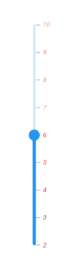

## Individual label style

You can customize the appearance of each label on the [`SfSlider`](https://pub.dev/documentation/syncfusion_flutter_sliders/latest/sliders/SfSlider-class.html) individually by using the [`onLabelCreated`](https://pub.dev/documentation/syncfusion_flutter_sliders/latest/sliders/SfSlider/onLabelCreated.html) callback. This callback allows you to have complete control over the text and text style for each label.

### Horizontal




import 'package:flutter/material.dart';
import 'package:syncfusion_flutter_sliders/sliders.dart';

class IndividualLabelPage extends StatefulWidget {
  @override
  _IndividualLabelPageState createState() => _IndividualLabelPageState();
}

class _IndividualLabelPageState extends State<IndividualLabelPage> {
  double _value = 6.0;

  @override
  Widget build(BuildContext context) {
    return Scaffold(
      body: Center(
        child: SfSlider(
          min: 2.0,
          max: 10.0,
          value: _value,
          interval: 1,
          showLabels: true,
          showTicks: true,
          onChanged: (double value) {
            setState(() {
              _value = value;
            });
          },
          onLabelCreated: (
            dynamic actualValue,
            String text,
            TextStyle labelTextStyle,
          ) {
            return SliderLabel(
              text: text,
              textStyle:
                  actualValue == _value.toInt()
                      ? const TextStyle(
                        color: Colors.blue,
                        fontSize: 14,
                      )
                      : TextStyle(
                        color: Colors.red[200],
                        fontSize: 10,
                      ),
            );
          },
        ),
      ),
    );
  }
}




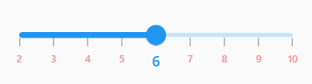

### Vertical




import 'package:flutter/material.dart';
import 'package:syncfusion_flutter_sliders/sliders.dart';

class VerticalIndividualLabelsPage extends StatefulWidget {
  @override
  _VerticalIndividualLabelsPageState createState() => _VerticalIndividualLabelsPageState();
}

class _VerticalIndividualLabelsPageState extends State<VerticalIndividualLabelsPage> {
  double _value = 6.0;

  @override
  Widget build(BuildContext context) {
    return Scaffold(
      body: Center(
        child: SfSlider.vertical(
          min: 2.0,
          max: 10.0,
          value: _value,
          interval: 1,
          showLabels: true,
          showTicks: true,
          onChanged: (double value) {
            setState(() {
              _value = value;
            });
          },
          onLabelCreated: (
            dynamic actualValue,
            String text,
            TextStyle labelTextStyle,
          ) {
            return SliderLabel(
              text: text,
              textStyle:
                  actualValue == _value.toInt()
                      ? const TextStyle(
                        color: Colors.blue,
                        fontSize: 14,
                      )
                      : TextStyle(
                        color: Colors.red[200],
                        fontSize: 10,
                      ),
            );
          },
        ),
      ),
    );
  }
}




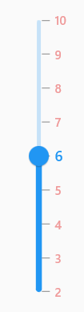

## Label offset

You can adjust the space between ticks and labels of the slider using the [`labelOffset`](https://pub.dev/documentation/syncfusion_flutter_core/latest/theme/SfSliderThemeData/labelOffset.html) property.

### Horizontal

The default value of [`labelOffset`](https://pub.dev/documentation/syncfusion_flutter_core/latest/theme/SfSliderThemeData/labelOffset.html) property is `Offset(0.0, 13.0)` if the [`showTicks`](https://pub.dev/documentation/syncfusion_flutter_sliders/latest/sliders/SfSlider/showTicks.html) property is `false`.
The default value of [`labelOffset`](https://pub.dev/documentation/syncfusion_flutter_core/latest/theme/SfSliderThemeData/labelOffset.html) property is `Offset(0.0, 5.0)` if the [`showTicks`](https://pub.dev/documentation/syncfusion_flutter_sliders/latest/sliders/SfSlider/showTicks.html) property is `true`.




import 'package:flutter/material.dart';
import 'package:syncfusion_flutter_core/theme.dart';
import 'package:syncfusion_flutter_sliders/sliders.dart';

class LabelOffsetPage extends StatefulWidget {
  @override
  _LabelOffsetPageState createState() => _LabelOffsetPageState();
}

class _LabelOffsetPageState extends State<LabelOffsetPage> {
  double _value = 6.0;

  @override
  Widget build(BuildContext context) {
    return MaterialApp(
        home: Scaffold(
            body: Center(
                child: SfSliderTheme(
                  data: SfSliderThemeData(
                    labelOffset: Offset(0.0, 10.0),
                  ),
                  child:  SfSlider(
                    min: 2.0,
                    max: 10.0,
                    value: _value,
                    interval: 2,
                    showTicks: true,
                    showLabels: true,
                    onChanged: (double newValue){
                      setState(() {
                        _value = newValue;
                      });
                    },
                  ),
                )
            )
        )
    );
  }
}




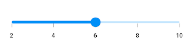

### Vertical

The default value of [`labelOffset`](https://pub.dev/documentation/syncfusion_flutter_core/latest/theme/SfSliderThemeData/labelOffset.html) property is `Offset(13.0, 0.0)` if the [`showTicks`](https://pub.dev/documentation/syncfusion_flutter_sliders/latest/sliders/SfSlider/showTicks.html) property is `false`.
The default value of [`labelOffset`](https://pub.dev/documentation/syncfusion_flutter_core/latest/theme/SfSliderThemeData/labelOffset.html) property is `Offset(5.0, 0.0)` if the [`showTicks`](https://pub.dev/documentation/syncfusion_flutter_sliders/latest/sliders/SfSlider/showTicks.html) property is `true`.




import 'package:flutter/material.dart';
import 'package:syncfusion_flutter_core/theme.dart';
import 'package:syncfusion_flutter_sliders/sliders.dart';

class VerticalLabelOffsetPage extends StatefulWidget {
  @override
  _VerticalLabelOffsetPageState createState() => _VerticalLabelOffsetPageState();
}

class _VerticalLabelOffsetPageState extends State<VerticalLabelOffsetPage> {
  double _value = 6.0;

  @override
  Widget build(BuildContext context) {
    return MaterialApp(
        home: Scaffold(
            body: Center(
                child: SfSliderTheme(
                  data: SfSliderThemeData(
                    labelOffset: Offset(10.0, 0.0),
                  ),
                  child:  SfSlider.vertical(
                    min: 2.0,
                    max: 10.0,
                    value: _value,
                    interval: 2,
                    showTicks: true,
                    showLabels: true,
                    onChanged: (double newValue){
                      setState(() {
                        _value = newValue;
                      });
                    },
                  ),
                )
            )
        )
    );
  }
}




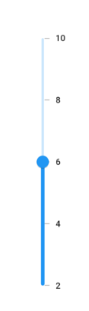

## Show dividers

The [`showDividers`](https://pub.dev/documentation/syncfusion_flutter_sliders/latest/sliders/SfSlider/showDividers.html) property is used to render the dividers on the track. The default value of the [`showDividers`](https://pub.dev/documentation/syncfusion_flutter_sliders/latest/sliders/SfSlider/showDividers.html) property is `false`. It is a shape which is used to represent the major interval points of the track.

For example, if [`min`](https://pub.dev/documentation/syncfusion_flutter_sliders/latest/sliders/SfSlider/min.html) is 0.0 and [`max`](https://pub.dev/documentation/syncfusion_flutter_sliders/latest/sliders/SfSlider/max.html) is 10.0 and [`interval`](https://pub.dev/documentation/syncfusion_flutter_sliders/latest/sliders/SfSlider/interval.html) is 2.0, the slider will render the dividers at 0.0, 2.0, 4.0 and so on.

### Horizontal




import 'package:flutter/material.dart';
import 'package:syncfusion_flutter_core/theme.dart';
import 'package:syncfusion_flutter_sliders/sliders.dart';

class ShowDividersPage extends StatefulWidget {
  @override
  _ShowDividersPageState createState() => _ShowDividersPageState();
}

class _ShowDividersPageState extends State<ShowDividersPage> {
  double _value = 6.0;

  @override
  Widget build(BuildContext context) {
    return MaterialApp(
        home: Scaffold(
            body: Center(
              child: SfSliderTheme(
                data: SfSliderThemeData(
                  activeTrackHeight: 5,
                  inactiveTrackHeight: 5,
                ),
                child: SfSlider(
                  min: 0.0,
                  max: 10.0,
                  interval: 2,
                  showDividers: true,
                  value: _value,
                  onChanged: (double newValue) {
                    setState(() {
                      _value = newValue;
                    });
                  },
                ),
              ),
            )
        )
    );
  }
}




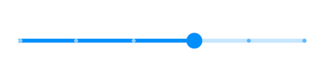

### Vertical




import 'package:flutter/material.dart';
import 'package:syncfusion_flutter_core/theme.dart';
import 'package:syncfusion_flutter_sliders/sliders.dart';

class VerticalShowDividersPage extends StatefulWidget {
  @override
  _VerticalShowDividersPageState createState() => _VerticalShowDividersPageState();
}

class _VerticalShowDividersPageState extends State<VerticalShowDividersPage> {
  double _value = 6.0;

  @override
  Widget build(BuildContext context) {
    return MaterialApp(
        home: Scaffold(
            body: Center(
              child: SfSliderTheme(
                data: SfSliderThemeData(
                  activeTrackHeight: 5,
                  inactiveTrackHeight: 5,
                ),
                child: SfSlider.vertical(
                  min: 0.0,
                  max: 10.0,
                  interval: 2,
                  showDividers: true,
                  value: _value,
                  onChanged: (double newValue) {
                    setState(() {
                      _value = newValue;
                    });
                  },
                ),
              ),
            )
        )
    );
  }
}




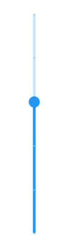

## Divider radius

You can change the active and inactive divider radius of the slider using the [`activeDividerRadius`](https://pub.dev/documentation/syncfusion_flutter_core/latest/theme/SfSliderThemeData/activeDividerRadius.html) and the [`inactiveDividerRadius`](https://pub.dev/documentation/syncfusion_flutter_core/latest/theme/SfSliderThemeData/inactiveDividerRadius.html) properties respectively.

### Horizontal




import 'package:flutter/material.dart';
import 'package:syncfusion_flutter_core/theme.dart';
import 'package:syncfusion_flutter_sliders/sliders.dart';

class DividerRadiusPage extends StatefulWidget {
  @override
  _DividerRadiusPageState createState() => _DividerRadiusPageState();
}

class _DividerRadiusPageState extends State<DividerRadiusPage> {
  double _value = 6.0;

  @override
  Widget build(BuildContext context) {
    return MaterialApp(
        home: Scaffold(
            body: Center(
                child: SfSliderTheme(
                    data: SfSliderThemeData(
                      activeTrackHeight: 10,
                      inactiveTrackHeight: 10,
                      activeDividerRadius: 5,
                      inactiveDividerRadius: 5,
                    ),
                    child: SfSlider(
                      min: 2.0,
                      max: 10.0,
                      interval: 1,
                      showDividers: true,
                      value: _value,
                      onChanged: (double newValue){
                        setState(() {
                          _value = newValue;
                        });
                      },
                    )
                )
            )
        )
    );
  }
}




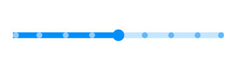

### Vertical




import 'package:flutter/material.dart';
import 'package:syncfusion_flutter_core/theme.dart';
import 'package:syncfusion_flutter_sliders/sliders.dart';

class VerticalDividerRadiusPage extends StatefulWidget {
  @override
  _VerticalDividerRadiusPageState createState() => _VerticalDividerRadiusPageState();
}

class _VerticalDividerRadiusPageState extends State<VerticalDividerRadiusPage> {
  double _value = 6.0;

  @override
  Widget build(BuildContext context) {
    return MaterialApp(
        home: Scaffold(
            body: Center(
                child: SfSliderTheme(
                    data: SfSliderThemeData(
                      activeTrackHeight: 10,
                      inactiveTrackHeight: 10,
                      activeDividerRadius: 5,
                      inactiveDividerRadius: 5,
                    ),
                    child: SfSlider.vertical(
                      min: 2.0,
                      max: 10.0,
                      interval: 1,
                      showDividers: true,
                      value: _value,
                      onChanged: (double newValue){
                        setState(() {
                          _value = newValue;
                        });
                      },
                    )
                )
            )
        )
    );
  }
}




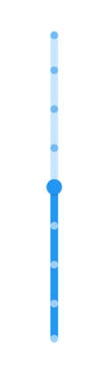

## Divider stroke width and stroke color

You can change the active and inactive divider stroke width of the slider using the [`activeDividerStrokeWidth`](https://pub.dev/documentation/syncfusion_flutter_core/latest/theme/SfSliderThemeData/activeDividerStrokeWidth.html) and the [`inactiveDividerStrokeWidth`](https://pub.dev/documentation/syncfusion_flutter_core/latest/theme/SfSliderThemeData/inactiveDividerStrokeWidth.html) properties respectively.

Also, you can change the active and inactive divider stroke color of the slider using the [`activeDividerStrokeColor`](https://pub.dev/documentation/syncfusion_flutter_core/latest/theme/SfSliderThemeData/activeDividerStrokeColor.html) and the [`inactiveDividerStrokeColor`](https://pub.dev/documentation/syncfusion_flutter_core/latest/theme/SfSliderThemeData/inactiveDividerStrokeColor.html) properties respectively.

### Horizontal




import 'package:flutter/material.dart';
import 'package:syncfusion_flutter_core/theme.dart';
import 'package:syncfusion_flutter_sliders/sliders.dart';

class DividerStrokePage extends StatefulWidget {
  @override
  _DividerStrokePageState createState() => _DividerStrokePageState();
}

class _DividerStrokePageState extends State<DividerStrokePage> {
  double _value = 6.0;

  @override
  Widget build(BuildContext context) {
    return MaterialApp(
        home: Scaffold(
            body: Center(
                child: SfSliderTheme(
                    data: SfSliderThemeData(
                      activeTrackHeight: 10,
                      inactiveTrackHeight: 10,
                      activeDividerStrokeColor: Colors.red,
                      activeDividerStrokeWidth: 2,
                      inactiveDividerStrokeWidth: 2,
                      inactiveDividerStrokeColor: Colors.red,
                    ),
                    child: SfSlider(
                      min: 2.0,
                      max: 10.0,
                      interval: 1,
                      showDividers: true,
                      value: _value,
                      onChanged: (double newValue){
                        setState(() {
                          _value = newValue;
                        });
                      },
                    )
                )
            )
        )
    );
  }
}




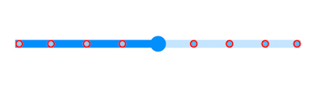

### Vertical




import 'package:flutter/material.dart';
import 'package:syncfusion_flutter_core/theme.dart';
import 'package:syncfusion_flutter_sliders/sliders.dart';

class VerticalDividerStrokePage extends StatefulWidget {
  @override
  _VerticalDividerStrokePageState createState() => _VerticalDividerStrokePageState();
}

class _VerticalDividerStrokePageState extends State<VerticalDividerStrokePage> {
  double _value = 6.0;

  @override
  Widget build(BuildContext context) {
    return MaterialApp(
        home: Scaffold(
            body: Center(
                child: SfSliderTheme(
                    data: SfSliderThemeData(
                      activeTrackHeight: 10,
                      inactiveTrackHeight: 10,
                      activeDividerStrokeColor: Colors.red,
                      activeDividerStrokeWidth: 2,
                      inactiveDividerStrokeWidth: 2,
                      inactiveDividerStrokeColor: Colors.red,
                    ),
                    child: SfSlider.vertical(
                      min: 2.0,
                      max: 10.0,
                      interval: 1,
                      showDividers: true,
                      value: _value,
                      onChanged: (double newValue){
                        setState(() {
                          _value = newValue;
                        });
                      },
                    )
                )
            )
        )
    );
  }
}




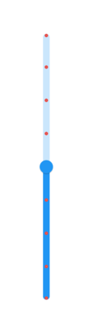

## Divider color

You can change the active and inactive divider color of the slider using the [`activeDividerColor`](https://pub.dev/documentation/syncfusion_flutter_core/latest/theme/SfSliderThemeData/activeDividerColor.html) and [`inactiveDividerColor`](https://pub.dev/documentation/syncfusion_flutter_core/latest/theme/SfSliderThemeData/inactiveDividerColor.html) properties respectively.

### Horizontal




import 'package:flutter/material.dart';
import 'package:syncfusion_flutter_core/theme.dart';
import 'package:syncfusion_flutter_sliders/sliders.dart';

class DividerColorPage extends StatefulWidget {
  @override
  _DividerColorPageState createState() => _DividerColorPageState();
}

class _DividerColorPageState extends State<DividerColorPage> {
  double _value = 6.0;

  @override
  Widget build(BuildContext context) {
    return MaterialApp(
        home: Scaffold(
            body: Center(
                child: SfSliderTheme(
                    data: SfSliderThemeData(
                      activeTrackHeight: 5,
                      inactiveTrackHeight: 5,
                      activeDividerColor: Colors.red,
                      inactiveDividerColor: Colors.red[200],
                    ),
                    child: SfSlider(
                      min: 2.0,
                      max: 10.0,
                      interval: 1,
                      showDividers: true,
                      value: _value,
                      onChanged: (double newValue){
                        setState(() {
                          _value = newValue;
                        });
                      },
                    )
                )
            )
        )
    );
  }
}




### Vertical




import 'package:flutter/material.dart';
import 'package:syncfusion_flutter_core/theme.dart';
import 'package:syncfusion_flutter_sliders/sliders.dart';

class VerticalDividerColorPage extends StatefulWidget {
  @override
  _VerticalDividerColorPageState createState() => _VerticalDividerColorPageState();
}

class _VerticalDividerColorPageState extends State<VerticalDividerColorPage> {
  double _value = 6.0;

  @override
  Widget build(BuildContext context) {
    return MaterialApp(
        home: Scaffold(
            body: Center(
                child: SfSliderTheme(
                    data: SfSliderThemeData(
                      activeTrackHeight: 5,
                      inactiveTrackHeight: 5,
                      activeDividerColor: Colors.red,
                      inactiveDividerColor: Colors.red[200],
                    ),
                    child: SfSlider.vertical(
                      min: 2.0,
                      max: 10.0,
                      interval: 1,
                      showDividers: true,
                      value: _value,
                      onChanged: (double newValue){
                        setState(() {
                          _value = newValue;
                        });
                      },
                    )
                )
            )
        )
    );
  }
}




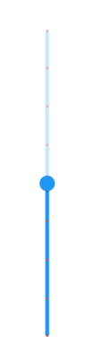
