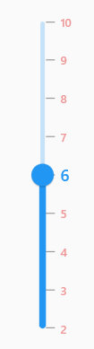

# Labels and Dividers in Flutter Slider (SfSlider)
This section explains about how to add the labels and dividers in the slider.

## Show labels

The [`showLabels`](https://pub.dev/documentation/syncfusion_flutter_sliders/latest/sliders/SfSlider/showLabels.html) property is used to render the labels on given interval. The default value of [`showLabels`](https://pub.dev/documentation/syncfusion_flutter_sliders/latest/sliders/SfSlider/showLabels.html) property is `false`.

### Horizontal




double _value = 6.0;

@override
Widget build(BuildContext context) {
  return MaterialApp(
      home: Scaffold(
          body: Center(
            child: SfSlider(
              min: 0.0,
              max: 10.0,
              interval: 2,
              showLabels: true,
              showTicks: true,
              value: _value,
              onChanged: (dynamic newValue) {
                setState(() {
                  _value = newValue;
                });
              },
            ),
          )
      )
  );
}




### Vertical




double _value = 6.0;

@override
Widget build(BuildContext context) {
  return MaterialApp(
      home: Scaffold(
          body: Center(
            child: SfSlider.vertical(
              min: 0.0,
              max: 10.0,
              interval: 2,
              showLabels: true,
              showTicks: true,
              value: _value,
              onChanged: (dynamic newValue) {
                setState(() {
                  _value = newValue;
                });
              },
            ),
          )
      )
  );
}




N>
* Refer the [`numberFormat`](https://pub.dev/documentation/syncfusion_flutter_sliders/latest/sliders/SfSlider/numberFormat.html) and [`dateFormat`](https://pub.dev/documentation/syncfusion_flutter_sliders/latest/sliders/SfSlider/dateFormat.html) for formatting the numeric and date labels respectively.
* Refer the [`SfSliderThemeData`](https://pub.dev/documentation/syncfusion_flutter_core/latest/theme/SfSliderThemeData-class.html) for customizing the appearance of the labels.

## Number format

The [`numberFormat`](https://pub.dev/documentation/syncfusion_flutter_sliders/latest/sliders/SfSlider/numberFormat.html) property is used to format the numeric labels. The default value of [`numberFormat`](https://pub.dev/documentation/syncfusion_flutter_sliders/latest/sliders/SfSlider/numberFormat.html) property is `null`.

N> You must import [`intl`](https://pub.dev/packages/intl) package for formatting numeric slider using the [`NumberFormat`](https://pub.dev/documentation/intl/latest/intl/NumberFormat-class.html) class.

### Horizontal




double _value = 6.0;

@override
Widget build(BuildContext context) {
  return MaterialApp(
      home: Scaffold(
          body: Center(
            child: SfSlider(
              min: 0.0,
              max: 10.0,
              value: _value,
              interval: 2,
              showTicks: true,
              showLabels: true,
              numberFormat: NumberFormat("\$"),
              onChanged: (dynamic newValue) {
                setState(() {
                  _value = newValue;
                });
              },
            ),
          )
      )
  );
}




### Vertical




double _value = 6.0;

@override
Widget build(BuildContext context) {
  return MaterialApp(
      home: Scaffold(
          body: Center(
            child: SfSlider.vertical(
              min: 0.0,
              max: 10.0,
              value: _value,
              interval: 2,
              showTicks: true,
              showLabels: true,
              numberFormat: NumberFormat("\$"),
              onChanged: (dynamic newValue) {
                setState(() {
                  _value = newValue;
                });
              },
            ),
          )
      )
  );
}




## Date format

The [`dateFormat`](https://pub.dev/documentation/syncfusion_flutter_sliders/latest/sliders/SfSlider/dateFormat.html) property is used to format the date labels. It is mandatory for date [`SfSlider`](https://pub.dev/documentation/syncfusion_flutter_sliders/latest/sliders/SfSlider-class.html). For date values, the slider does not have auto interval support. So, it is mandatory to set [`interval`](https://pub.dev/documentation/syncfusion_flutter_sliders/latest/sliders/SfSlider/interval.html), [`dateIntervalType`](https://pub.dev/documentation/syncfusion_flutter_sliders/latest/sliders/SfSlider/dateIntervalType.html), and [`dateFormat`](https://pub.dev/documentation/syncfusion_flutter_sliders/latest/sliders/SfSlider/dateFormat.html) for date values. The default value of [`dateFormat`](https://pub.dev/documentation/syncfusion_flutter_sliders/latest/sliders/SfSlider/dateFormat.html) property is `null`.

N> You must import [`intl`](https://pub.dev/packages/intl) package for formatting date slider using the [`DateFormat`](https://pub.dev/documentation/intl/latest/intl/DateFormat-class.html) class.

### Year format
#### Horizontal




DateTime _value = DateTime(2002, 01, 01);

@override
Widget build(BuildContext context) {
  return MaterialApp(
      home: Scaffold(
          body: Center(
            child: SfSlider(
              min: DateTime(2000, 01, 01, 00),
              max: DateTime(2004, 12, 31, 24),
              value: _value,
              interval: 1,
              showLabels: true,
              showTicks: true,
              dateFormat: DateFormat.y(),
              dateIntervalType: DateIntervalType.years,
              onChanged: (dynamic newValue) {
                setState(() {
                  _value = newValue;
                });
              },
            ),
          )
      )
  );
}




#### Vertical




DateTime _value = DateTime(2002, 01, 01);

@override
Widget build(BuildContext context) {
  return MaterialApp(
      home: Scaffold(
          body: Center(
            child: SfSlider.vertical(
              min: DateTime(2000, 01, 01, 00),
              max: DateTime(2004, 12, 31, 24),
              value: _value,
              interval: 1,
              showLabels: true,
              showTicks: true,
              dateFormat: DateFormat.y(),
              dateIntervalType: DateIntervalType.years,
              onChanged: (dynamic newValue) {
                setState(() {
                  _value = newValue;
                });
              },
            ),
          )
      )
  );
}




### Month format
#### Horizontal




DateTime _value = DateTime(2000, 03, 01);

@override
Widget build(BuildContext context) {
  return MaterialApp(
      home: Scaffold(
          body: Center(
            child: SfSlider(
              min: DateTime(2000, 01, 01, 00),
              max: DateTime(2000, 09, 01, 24),
              value: _value,
              interval: 2,
              showLabels: true,
              showTicks: true,
              dateFormat: DateFormat.yM(),
              dateIntervalType: DateIntervalType.months,
              onChanged: (dynamic newValue) {
                setState(() {
                  _value = newValue;
                });
              },
            ),
          )
      )
  );
}




#### Vertical




DateTime _value = DateTime(2000, 03, 01);

@override
Widget build(BuildContext context) {
  return MaterialApp(
      home: Scaffold(
          body: Center(
            child: SfSlider.vertical(
              min: DateTime(2000, 01, 01, 00),
              max: DateTime(2000, 09, 01, 24),
              value: _value,
              interval: 2,
              showLabels: true,
              showTicks: true,
              dateFormat: DateFormat.yM(),
              dateIntervalType: DateIntervalType.months,
              onChanged: (dynamic newValue) {
                setState(() {
                  _value = newValue;
                });
              },
            ),
          )
      )
  );
}




### Hour format
#### Horizontal




DateTime _value = DateTime(2000, 01, 01, 12, 00, 00);

@override
Widget build(BuildContext context) {
  return MaterialApp(
      home: Scaffold(
          body: Center(
            child: SfSlider(
              min: DateTime(2000, 01, 01, 02, 00, 00),
              max: DateTime(2000, 01, 01, 22, 00, 00),
              value: _value,
              interval: 5,
              showLabels: true,
              showTicks: true,
              dateFormat: DateFormat('h:mm a'),
              dateIntervalType: DateIntervalType.hours,
              onChanged: (dynamic newValue) {
                setState(() {
                  _value = newValue;
                });
              },
            ),
          )
      )
  );
}




#### Vertical




DateTime _value = DateTime(2000, 01, 01, 12, 00, 00);

@override
Widget build(BuildContext context) {
  return MaterialApp(
      home: Scaffold(
          body: Center(
            child: SfSlider.vertical(
              min: DateTime(2000, 01, 01, 02, 00, 00),
              max: DateTime(2000, 01, 01, 22, 00, 00),
              value: _value,
              interval: 5,
              showLabels: true,
              showTicks: true,
              dateFormat: DateFormat('h:mm a'),
              dateIntervalType: DateIntervalType.hours,
              onChanged: (dynamic newValue) {
                setState(() {
                  _value = newValue;
                });
              },
            ),
          )
      )
  );
}




N> Refer the [`DateFormat`](https://api.flutter.dev/flutter/intl/DateFormat-class.html) class for other date format.

## Label placement

The [`labelPlacement`](https://pub.dev/documentation/syncfusion_flutter_sliders/latest/sliders/SfSlider/labelPlacement.html) property is used to place the labels either between the major ticks or on the major ticks. The default value of the [`labelPlacement`](https://pub.dev/documentation/syncfusion_flutter_sliders/latest/sliders/SfSlider/labelPlacement.html) property is `LabelPlacement.onTicks`.

### Horizontal




DateTime _value = DateTime(2002, 01, 01);

@override
Widget build(BuildContext context) {
  return MaterialApp(
      home: Scaffold(
          body: Center(
            child: SfSlider(
              min: DateTime(2000, 01, 01, 00),
              max: DateTime(2004, 12, 31, 24),
              value: _value,
              interval: 1,
              showLabels: true,
              showTicks: true,
              labelPlacement: LabelPlacement.betweenTicks,
              dateFormat: DateFormat.y(),
              dateIntervalType: DateIntervalType.years,
              onChanged: (dynamic newValue) {
                setState(() {
                  _value = newValue;
                });
              },
            ),
          )
      )
  );
}




### Vertical




DateTime _value = DateTime(2002, 01, 01);

@override
Widget build(BuildContext context) {
  return MaterialApp(
      home: Scaffold(
          body: Center(
            child: SfSlider.vertical(
              min: DateTime(2000, 01, 01, 00),
              max: DateTime(2004, 12, 31, 24),
              value: _value,
              interval: 1,
              showLabels: true,
              showTicks: true,
              labelPlacement: LabelPlacement.betweenTicks,
              dateFormat: DateFormat.y(),
              dateIntervalType: DateIntervalType.years,
              onChanged: (dynamic newValue) {
                setState(() {
                  _value = newValue;
                });
              },
            ),
          )
      )
  );
}




## Customize label text

You can format or change the whole numeric or date label text using the [`labelFormatterCallback`](https://pub.dev/documentation/syncfusion_flutter_sliders/latest/sliders/SfSlider/labelFormatterCallback.html). Its arguments are,

* actualValue – either `DateTime` or `double` based on given [`value`](https://pub.dev/documentation/syncfusion_flutter_sliders/latest/sliders/SfSlider/value.html).
* formattedText – If the actual value is `double`, it is formatted by [`numberFormat`](https://pub.dev/documentation/syncfusion_flutter_sliders/latest/sliders/SfSlider/numberFormat.html) and if the actual value is `DateTime`, it is formatted by [`dateFormat`](https://pub.dev/documentation/syncfusion_flutter_sliders/latest/sliders/SfSlider/dateFormat.html).

### Horizontal




double _value = 9900.0;

@override
Widget build(BuildContext context) {
  return MaterialApp(
      home: Scaffold(
          body: Center(
            child: SfSlider(
              min: 100.0,
              max: 10000.0,
              value: _value,
              showLabels: true,
              interval: 9900,
              labelFormatterCallback: (dynamic actualValue, String formattedText) {
                return actualValue == 10000 ? '\$ $formattedText+' : '\$ $formattedText';
              },
              onChanged: (dynamic newValue) {
                setState(() {
                  _value = newValue;
                });
              },
            ),
          )
      )
  );
}




### Vertical




double _value = 9900.0;

@override
Widget build(BuildContext context) {
  return MaterialApp(
      home: Scaffold(
          body: Center(
            child: SfSlider.vertical(
              min: 100.0,
              max: 10000.0,
              value: _value,
              showLabels: true,
              interval: 9900,
              labelFormatterCallback: (dynamic actualValue, String formattedText) {
                return actualValue == 10000 ? '\$ $formattedText+' : '\$ $formattedText';
              },
              onChanged: (dynamic newValue) {
                setState(() {
                  _value = newValue;
                });
              },
            ),
          )
      )
  );
}




## Label style

You can change the active and inactive label appearance of the slider using the [`activeLabelStyle`](https://pub.dev/documentation/syncfusion_flutter_core/latest/theme/SfSliderThemeData/activeLabelStyle.html) and [`inactiveLabelStyle`](https://pub.dev/documentation/syncfusion_flutter_core/latest/theme/SfSliderThemeData/inactiveLabelStyle.html) properties respectively.

The active side of the slider is between the [`min`](https://pub.dev/documentation/syncfusion_flutter_sliders/latest/sliders/SfSlider/min.html) value and the thumb.

The inactive side of the slider is between the thumb and the [`max`](https://pub.dev/documentation/syncfusion_flutter_sliders/latest/sliders/SfSlider/max.html) value.

N> You must import the `theme.dart` library from the [`Core`](https://pub.dev/packages/syncfusion_flutter_core) package to use [`SfSliderTheme`](https://pub.dev/documentation/syncfusion_flutter_core/latest/theme/SfSliderTheme-class.html).

### Horizontal




double _value = 6.0;

@override
Widget build(BuildContext context) {
  return MaterialApp(
      home: Scaffold(
          body: Center(
              child: SfSliderTheme(
                data: SfSliderThemeData(
                  activeLabelStyle: TextStyle(color: Colors.red, fontSize: 12, fontStyle: FontStyle.italic),
                  inactiveLabelStyle: TextStyle(color: Colors.red[200], fontSize: 12, fontStyle: FontStyle.italic),
                ),
                child:  SfSlider(
                  min: 2.0,
                  max: 10.0,
                  value: _value,
                  interval: 1,
                  showLabels: true,
                  showTicks: true,
                  onChanged: (dynamic newValue){
                    setState(() {
                      _value = newValue;
                    });
                  },
                ),
              )
          )
      )
  );
}




### Vertical




double _value = 6.0;

@override
Widget build(BuildContext context) {
  return MaterialApp(
      home: Scaffold(
          body: Center(
              child: SfSliderTheme(
                data: SfSliderThemeData(
                  activeLabelStyle: TextStyle(color: Colors.red, fontSize: 12, fontStyle: FontStyle.italic),
                  inactiveLabelStyle: TextStyle(color: Colors.red[200], fontSize: 12, fontStyle: FontStyle.italic),
                ),
                child:  SfSlider.vertical(
                  min: 2.0,
                  max: 10.0,
                  value: _value,
                  interval: 1,
                  showLabels: true,
                  showTicks: true,
                  onChanged: (dynamic newValue){
                    setState(() {
                      _value = newValue;
                    });
                  },
                ),
              )
          )
      )
  );
}




## Individual label style

You can customize the appearance of each label on the [`SfSlider`](https://pub.dev/documentation/syncfusion_flutter_sliders/latest/sliders/SfSlider-class.html) individually by using the [`onLabelCreated`] callback. This callback gives you full control over the text and the TextStyle for each label.

### Horizontal




  double _value = 6.0;

  @override
  Widget build(BuildContext context) {
    return Scaffold(
      body: Center(
        child: SfSlider(
          min: 2.0,
          max: 10.0,
          value: _value,
          interval: 1,
          showLabels: true,
          showTicks: true,
          onChanged: (dynamic value) {
            setState(() {
              _value = value;
            });
          },
          onLabelCreated: (
            dynamic actualValue,
            String text,
            TextStyle labelTextStyle,
          ) {
            return SliderLabel(
              text: text,
              textStyle:
                  actualValue == _value.toInt()
                      ? const TextStyle(
                        color: Colors.blue,
                        fontSize: 12,
                        fontStyle: FontStyle.italic,
                      )
                      : TextStyle(
                        color: Colors.red[200],
                        fontSize: 12,
                        fontStyle: FontStyle.italic,
                      ),
            );
          },
        ),
      ),
    );
  }




### Vertical




  double _value = 6.0;

  @override
  Widget build(BuildContext context) {
    return Scaffold(
      body: Center(
        child: SfSlider.vertical(
          min: 2.0,
          max: 10.0,
          value: _value,
          interval: 1,
          showLabels: true,
          showTicks: true,
          onChanged: (dynamic value) {
            setState(() {
              _value = value;
            });
          },
          onLabelCreated: (
            dynamic actualValue,
            String text,
            TextStyle labelTextStyle,
          ) {
            return SliderLabel(
              text: text,
              textStyle:
                  actualValue == _value.toInt()
                      ? const TextStyle(
                        color: Colors.blue,
                        fontSize: 12,
                        fontStyle: FontStyle.italic,
                      )
                      : TextStyle(
                        color: Colors.red[200],
                        fontSize: 12,
                        fontStyle: FontStyle.italic,
                      ),
            );
          },
        ),
      ),
    );
  }




## Label offset

You can adjust the space between ticks and labels of the slider using the [`labelOffset`](https://pub.dev/documentation/syncfusion_flutter_core/latest/theme/SfSliderThemeData/labelOffset.html) property.

N> You must import the `theme.dart` library from the [`Core`](https://pub.dev/packages/syncfusion_flutter_core) package to use [`SfSliderTheme`](https://pub.dev/documentation/syncfusion_flutter_core/latest/theme/SfSliderTheme-class.html).

### Horizontal

The default value of [`labelOffset`](https://pub.dev/documentation/syncfusion_flutter_core/latest/theme/SfSliderThemeData/labelOffset.html) property is `Offset(0.0, 13.0)` if the [`showTicks`](https://pub.dev/documentation/syncfusion_flutter_sliders/latest/sliders/SfSlider/showTicks.html) property is `false`.
The default value of [`labelOffset`](https://pub.dev/documentation/syncfusion_flutter_core/latest/theme/SfSliderThemeData/labelOffset.html) property is `Offset(0.0, 5.0)` if the [`showTicks`](https://pub.dev/documentation/syncfusion_flutter_sliders/latest/sliders/SfSlider/showTicks.html) property is `true`.




double _value = 6.0;

@override
Widget build(BuildContext context) {
  return MaterialApp(
      home: Scaffold(
          body: Center(
              child: SfSliderTheme(
                data: SfSliderThemeData(
                  labelOffset: Offset(0.0, 10.0),
                ),
                child:  SfSlider(
                  min: 2.0,
                  max: 10.0,
                  value: _value,
                  interval: 2,
                  showTicks: true,
                  showLabels: true,
                  onChanged: (dynamic newValue){
                    setState(() {
                      _value = newValue;
                    });
                  },
                ),
              )
          )
      )
  );
}




### Vertical

The default value of [`labelOffset`](https://pub.dev/documentation/syncfusion_flutter_core/latest/theme/SfSliderThemeData/labelOffset.html) property is `Offset(13.0, 0.0)` if the [`showTicks`](https://pub.dev/documentation/syncfusion_flutter_sliders/latest/sliders/SfSlider/showTicks.html) property is `false`.
The default value of [`labelOffset`](https://pub.dev/documentation/syncfusion_flutter_core/latest/theme/SfSliderThemeData/labelOffset.html) property is `Offset(5.0, 0.0)` if the [`showTicks`](https://pub.dev/documentation/syncfusion_flutter_sliders/latest/sliders/SfSlider/showTicks.html) property is `true`.




double _value = 6.0;

@override
Widget build(BuildContext context) {
  return MaterialApp(
      home: Scaffold(
          body: Center(
              child: SfSliderTheme(
                data: SfSliderThemeData(
                  labelOffset: Offset(10.0, 0.0),
                ),
                child:  SfSlider.vertical(
                  min: 2.0,
                  max: 10.0,
                  value: _value,
                  interval: 2,
                  showTicks: true,
                  showLabels: true,
                  onChanged: (dynamic newValue){
                    setState(() {
                      _value = newValue;
                    });
                  },
                ),
              )
          )
      )
  );
}




## Show dividers

The `showDividers` property is used to render the dividers on the track. The default value of the `showDividers` property is `false`. It is a shape which is used to represent the major interval points of the track.

For example, if [`min`](https://pub.dev/documentation/syncfusion_flutter_sliders/latest/sliders/SfSlider/min.html) is 0.0 and [`max`](https://pub.dev/documentation/syncfusion_flutter_sliders/latest/sliders/SfSlider/max.html) is 10.0 and [`interval`](https://pub.dev/documentation/syncfusion_flutter_sliders/latest/sliders/SfSlider/interval.html) is 2.0, the slider will render the dividers at 0.0, 2.0, 4.0 and so on.

### Horizontal




double _value = 6.0;

@override
Widget build(BuildContext context) {
  return MaterialApp(
      home: Scaffold(
          body: Center(
            child: SfSliderTheme(
              data: SfSliderThemeData(
                activeTrackHeight: 5,
                inactiveTrackHeight: 5,
              ),
              child: SfSlider(
                min: 0.0,
                max: 10.0,
                interval: 2,
                showDividers: true,
                value: _value,
                onChanged: (dynamic newValue) {
                  setState(() {
                    _value = newValue;
                  });
                },
              ),
            ),
          )
      )
  );
}




### Vertical




double _value = 6.0;

@override
Widget build(BuildContext context) {
  return MaterialApp(
      home: Scaffold(
          body: Center(
            child: SfSliderTheme(
              data: SfSliderThemeData(
                activeTrackHeight: 5,
                inactiveTrackHeight: 5,
              ),
              child: SfSlider.vertical(
                min: 0.0,
                max: 10.0,
                interval: 2,
                showDividers: true,
                value: _value,
                onChanged: (dynamic newValue) {
                  setState(() {
                    _value = newValue;
                  });
                },
              ),
            ),
          )
      )
  );
}




## Divider radius

You can change the active and inactive divider radius of the slider using the `activeDividerRadius` and the `inactiveDividerRadius` properties respectively.

N> You must import the `theme.dart` library from the [`Core`](https://pub.dev/packages/syncfusion_flutter_core) package to use [`SfSliderTheme`](https://pub.dev/documentation/syncfusion_flutter_core/latest/theme/SfSliderTheme-class.html).

### Horizontal




double _value = 6.0;

@override
Widget build(BuildContext context) {
  return MaterialApp(
      home: Scaffold(
          body: Center(
              child: SfSliderTheme(
                  data: SfSliderThemeData(
                    activeTrackHeight: 10,
                    inactiveTrackHeight: 10,
                    activeDividerRadius: 5,
                    inactiveDividerRadius: 5,
                  ),
                  child: SfSlider(
                    min: 2.0,
                    max: 10.0,
                    interval: 1,
                    showDividers: true,
                    value: _value,
                    onChanged: (dynamic newValue){
                      setState(() {
                        _value = newValue;
                      });
                    },
                  )
              )
          )
      )
  );
}




### Vertical




double _value = 6.0;

@override
Widget build(BuildContext context) {
  return MaterialApp(
      home: Scaffold(
          body: Center(
              child: SfSliderTheme(
                  data: SfSliderThemeData(
                    activeTrackHeight: 10,
                    inactiveTrackHeight: 10,
                    activeDividerRadius: 5,
                    inactiveDividerRadius: 5,
                  ),
                  child: SfSlider.vertical(
                    min: 2.0,
                    max: 10.0,
                    interval: 1,
                    showDividers: true,
                    value: _value,
                    onChanged: (dynamic newValue){
                      setState(() {
                        _value = newValue;
                      });
                    },
                  )
              )
          )
      )
  );
}




## Divider stroke width and stroke color

You can change the active and inactive divider stroke width of the slider using the `activeDividerStrokeWidth` and the `inactiveDividerStrokeWidth` properties respectively.

Also, you can change the active and inactive divider stroke color of the slider using the `activeDividerStrokeColor` and the `inactiveDividerStrokeColor` properties respectively.

N> You must import the `theme.dart` library from the [`Core`](https://pub.dev/packages/syncfusion_flutter_core) package to use [`SfSliderTheme`](https://pub.dev/documentation/syncfusion_flutter_core/latest/theme/SfSliderTheme-class.html).

### Horizontal




double _value = 6.0;

@override
Widget build(BuildContext context) {
  return MaterialApp(
      home: Scaffold(
          body: Center(
              child: SfSliderTheme(
                  data: SfSliderThemeData(
                    activeTrackHeight: 10,
                    inactiveTrackHeight: 10,
                    activeDividerStrokeColor: Colors.red,
                    activeDividerStrokeWidth: 2,
                    inactiveDividerStrokeWidth: 2,
                    inactiveDividerStrokeColor: Colors.red,
                  ),
                  child: SfSlider(
                    min: 2.0,
                    max: 10.0,
                    interval: 1,
                    showDividers: true,
                    value: _value,
                    onChanged: (dynamic newValue){
                      setState(() {
                        _value = newValue;
                      });
                    },
                  )
              )
          )
      )
  );
}




### Vertical




double _value = 6.0;

@override
Widget build(BuildContext context) {
  return MaterialApp(
      home: Scaffold(
          body: Center(
              child: SfSliderTheme(
                  data: SfSliderThemeData(
                    activeTrackHeight: 10,
                    inactiveTrackHeight: 10,
                    activeDividerStrokeColor: Colors.red,
                    activeDividerStrokeWidth: 2,
                    inactiveDividerStrokeWidth: 2,
                    inactiveDividerStrokeColor: Colors.red,
                  ),
                  child: SfSlider.vertical(
                    min: 2.0,
                    max: 10.0,
                    interval: 1,
                    showDividers: true,
                    value: _value,
                    onChanged: (dynamic newValue){
                      setState(() {
                        _value = newValue;
                      });
                    },
                  )
              )
          )
      )
  );
}




## Divider color

You can change the active and inactive divider color of the slider using the `activeDividerColor` and `inactiveDividerColor` properties respectively.

N> You must import the `theme.dart` library from the [`Core`](https://pub.dev/packages/syncfusion_flutter_core) package to use [`SfSliderTheme`](https://pub.dev/documentation/syncfusion_flutter_core/latest/theme/SfSliderTheme-class.html).

### Horizontal




double _value = 6.0;

@override
Widget build(BuildContext context) {
  return MaterialApp(
      home: Scaffold(
          body: Center(
              child: SfSliderTheme(
                  data: SfSliderThemeData(
                    activeTrackHeight: 5,
                    inactiveTrackHeight: 5,
                    activeDividerColor: Colors.red,
                    inactiveDividerColor: Colors.red[200],
                  ),
                  child: SfSlider(
                    min: 2.0,
                    max: 10.0,
                    interval: 1,
                    showDividers: true,
                    value: _value,
                    onChanged: (dynamic newValue){
                      setState(() {
                        _value = newValue;
                      });
                    },
                  )
              )
          )
      )
  );
}




### Vertical




double _value = 6.0;

@override
Widget build(BuildContext context) {
  return MaterialApp(
      home: Scaffold(
          body: Center(
              child: SfSliderTheme(
                  data: SfSliderThemeData(
                    activeTrackHeight: 5,
                    inactiveTrackHeight: 5,
                    activeDividerColor: Colors.red,
                    inactiveDividerColor: Colors.red[200],
                  ),
                  child: SfSlider.vertical(
                    min: 2.0,
                    max: 10.0,
                    interval: 1,
                    showDividers: true,
                    value: _value,
                    onChanged: (dynamic newValue){
                      setState(() {
                        _value = newValue;
                      });
                    },
                  )
              )
          )
      )
  );
}




