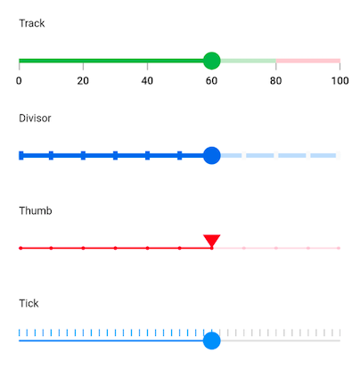

# Flutter Slider (SfSlider) Overview

Syncfusion&reg; Flutter Slider is a highly interactive UI widget, allowing users to select a single value from a range of values. It provides rich features, such as numeric and date values, labels, ticks, dividers, and tooltip.

## Features

* **Numeric and date support** - Provides functionality for selecting numeric and date values. For dates, support is provided up to the seconds interval.

* **Labels** - Render labels for date and numeric values with the option to customize their formats based on your requirements.

* **Ticks and dividers** - Provides the option to show ticks and dividers based on the slider interval. Also, minor ticks can be enabled to indicate the values between each interval. These options present the selected value in a more intuitive way for end users.

* **Thumb icon support** - Accepts custom widgets like icon or text inside the thumb.

* **Tooltip** - Render a tooltip to show the selected value clearly. You can also customize the format of the text shown in the tooltip.

* **Highly customizable** - In addition to the rich set of built-in features, the control is fully customizable through its wide range options.

* **Orientation** - Supports both horizontal and vertical orientations.
