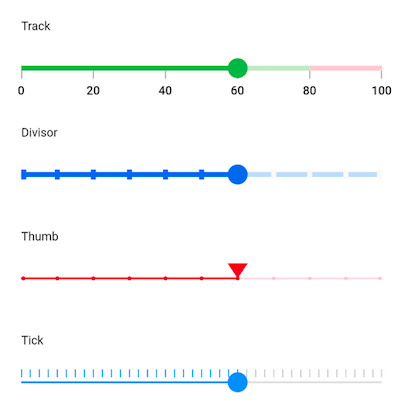

# Flutter Slider (SfSlider) Overview

Syncfusion&reg; Flutter Slider is a highly interactive UI widget, allowing users to select a single value from a range of values. It provides rich features, such as numeric and date values, labels, ticks, dividers, and tooltip.

## Features

* **Numeric and date support** - Provides functionality for selecting numeric and date values. For dates, support is provided up to the seconds interval. For more details, refer to the Set numeric value and Set date value documentation.

* **Labels** - Render labels for date and numeric values with the option to customize their formats based on your requirements. For more details, refer to the [Labels and dividers](https://help.syncfusion.com/flutter/slider/labels-and-divider) documentation.

* **Ticks and dividers** - Provides the option to show ticks and dividers based on the slider interval. Also, minor ticks can be enabled to indicate the values between each interval. These options present the selected value in a more intuitive way for end users. For more details, refer to the [Ticks and dividers](https://help.syncfusion.com/flutter/slider/ticks) documentation.

* **Thumb icon support** - Accepts custom widgets like icons or text inside the thumb. For more details, refer to the [Thumb icon](https://help.syncfusion.com/flutter/slider/thumb-and-overlay#thumb-icon) documentation.

* **Tooltip** - Render a tooltip to show the selected value clearly. You can also customize the format of the text shown in the tooltip. For more details, refer to the [Tooltip](https://help.syncfusion.com/flutter/slider/tooltip) documentation.

* **Highly customizable** - In addition to the rich set of built-in features, the control is fully customizable through its wide range of options. For more details, refer to the [Customization](https://help.syncfusion.com/flutter/slider/enabled-and-disabled-state) documentation.

* **Orientation** - Supports both horizontal and vertical orientations. For more details, refer to the [Orientation](https://pub.dev/documentation/syncfusion_flutter_sliders/latest/sliders/SfSlider/SfSlider.vertical.html) documentation.
