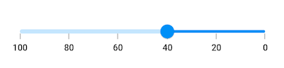

# Right to Left (RTL) in Flutter Slider (SfSlider)

## RTL rendering ways

Right to left rendering can be achieved in the following ways:

### Wrapping the SfSlider with Directionality widget

The slider can be wrapped inside the [`Directionality`](https://api.flutter.dev/flutter/widgets/Directionality-class.html) widget and you can set the [`textDirection`](https://api.flutter.dev/flutter/widgets/Directionality/textDirection.html) property to `rtl`.




@override
Widget build(BuildContext context) {
  return MaterialApp(
      home: Scaffold(
        body: Directionality(
            textDirection: TextDirection.rtl,
            child: Center(
              child: SfSlider(
                min: 0.0,
                max: 100.0,
                value: _value,
                interval: 20,
                showTicks: true,
                showLabels: true,
                onChanged: (dynamic newValue){
                  setState(() {
                    _value = newValue;
                  });
                },
              ),
            )
        ),
      )
  );
}




### Changing the locale to RTL languages

The slider will render in right to left direction if the locale belongs to RTL languages such as (Arabic, Persian, Hebrew, Pashto, Urdu). It can be achieved by specifying the MaterialApp properties such as `localizationsDelegates`, `supportedLocales`, `locale` and adding the flutter_localizations package to your pubspec.yaml file.




dependencies:
  flutter_localizations:
    sdk: flutter







double _value = 40.0;

@override
Widget build(BuildContext context) {
  return MaterialApp(
    localizationsDelegates: [
      GlobalMaterialLocalizations.delegate,
      GlobalWidgetsLocalizations.delegate,
    ],
    supportedLocales: [
      Locale("fa", "IR"),
    ],
    locale: Locale("fa", "IR"),
    home: Scaffold(
      backgroundColor: Colors.white,
      body: SfSlider(
        min: 0.0,
        max: 100.0,
        value: _value,
        interval: 20,
        showLabels: true,
        showTicks: true,
        onChanged: (dynamic newValue) {
          setState(() {
            _value = newValue;
          });
        },
      ),
    ),
  );
}




N> RTL is not applicable for vertical orientation of the slider.

