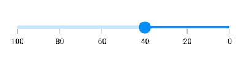

# Right to Left (RTL) in Flutter Slider (SfSlider)

## RTL rendering ways

Right-to-left rendering can be achieved in the following ways:

### Wrapping the SfSlider with Directionality widget

The slider can be wrapped inside the [`Directionality`](https://api.flutter.dev/flutter/widgets/Directionality-class.html) widget and you can set the [`textDirection`](https://api.flutter.dev/flutter/widgets/Directionality/textDirection.html) property to `rtl`.




import 'package:flutter/material.dart';
import 'package:syncfusion_flutter_sliders/sliders.dart';

class RTLDirectionalityPage extends StatefulWidget {
  @override
  _RTLDirectionalityPageState createState() => _RTLDirectionalityPageState();
}

class _RTLDirectionalityPageState extends State<RTLDirectionalityPage> {
  double _value = 40.0;

  @override
  Widget build(BuildContext context) {
    return MaterialApp(
        home: Scaffold(
          body: Directionality(
              textDirection: TextDirection.rtl,
              child: Center(
                child: SfSlider(
                  min: 0.0,
                  max: 100.0,
                  value: _value,
                  interval: 20,
                  showTicks: true,
                  showLabels: true,
                  onChanged: (double newValue){
                    setState(() {
                      _value = newValue;
                    });
                  },
                ),
              )
          ),
        )
    );
  }
}




### Changing the locale to RTL languages

The slider will render in right to left direction if the locale belongs to RTL languages such as (Arabic, Persian, Hebrew, Pashto, Urdu). It can be achieved by specifying the MaterialApp properties such as `localizationsDelegates`, `supportedLocales`, `locale` and adding the flutter_localizations package to your pubspec.yaml file.

N> The Persian (Farsi) locale `Locale("fa", "IR")` is used in the example below. Replace it with your desired RTL locale (e.g., `Locale("ar")` for Arabic, `Locale("he")` for Hebrew, `Locale("ps")` for Pashto, or `Locale("ur")` for Urdu).

**Add the flutter_localizations dependency**

Add the `flutter_localizations` package to your pubspec.yaml file.




dependencies:
  flutter_localizations:
    sdk: flutter




N> Add the `flutter_localizations` package to your pubspec.yaml and run `flutter pub get` to fetch it.




import 'package:flutter/material.dart';
import 'package:flutter_localizations/flutter_localizations.dart';
import 'package:syncfusion_flutter_sliders/sliders.dart';

class RTLLocalePage extends StatefulWidget {
  @override
  _RTLLocalePageState createState() => _RTLLocalePageState();
}

class _RTLLocalePageState extends State<RTLLocalePage> {
  double _value = 40.0;

  @override
  Widget build(BuildContext context) {
    return MaterialApp(
      localizationsDelegates: [
        GlobalMaterialLocalizations.delegate,
        GlobalWidgetsLocalizations.delegate,
      ],
      supportedLocales: [
        Locale("fa", "IR"),
      ],
      locale: Locale("fa", "IR"),
      home: Scaffold(
        backgroundColor: Colors.white,
        body: SfSlider(
          min: 0.0,
          max: 100.0,
          value: _value,
          interval: 20,
          showLabels: true,
          showTicks: true,
          onChanged: (double newValue) {
            setState(() {
              _value = newValue;
            });
          },
        ),
      ),
    );
  }
}




N> RTL is not applicable for vertical orientation of the slider.

