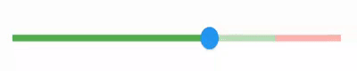
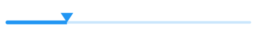
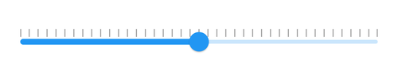

# Shapes in Flutter Slider (SfSlider)

This section helps to learn about how to customize the shapes of the slider elements.

## Track shape

You can change the size and shape of the track using the [`trackShape`](https://pub.dev/documentation/syncfusion_flutter_sliders/latest/sliders/SfSlider/trackShape.html) property in the `SfSlider`.

* getPreferredSize() - Returns the size based on the values passed to it.
* paint() - Used to change the track shape.




double _min = 0.0;
double _max = 10.0;
double _value = 6.0;

@override
Widget build(BuildContext context) {
  return Scaffold(
     body: SfSlider(
        min: _min,
        max: _max,
        value: _value,
        trackShape: _SfTrackShape(_min, _max),
        onChanged: (dynamic newValue) {
          setState(() {
            _value = newValue;
          });
        },
      ),
   );
}

class _SfTrackShape extends SfTrackShape {
  _SfTrackShape(dynamic min, dynamic max) {
    this.min = min.runtimeType == DateTime
        ? min.millisecondsSinceEpoch.toDouble()
        : min;
    this.max = max.runtimeType == DateTime
        ? max.millisecondsSinceEpoch.toDouble()
        : max;
  }

  late double min;
  late double max;
  double? trackIntermediatePos;

  @override
  void paint(PaintingContext context, Offset offset, Offset? thumbCenter,
      Offset? startThumbCenter, Offset? endThumbCenter,
      {required RenderBox parentBox,
      required SfSliderThemeData themeData,
      SfRangeValues? currentValues,
      dynamic currentValue,
      required Animation<double> enableAnimation,
      required Paint? inactivePaint,
      required Paint? activePaint,
      required TextDirection textDirection}) {
    final Rect trackRect = getPreferredRect(parentBox, themeData, offset);
    final double actualValue = currentValue.runtimeType == DateTime
        ? currentValue.millisecondsSinceEpoch.toDouble()
        : currentValue;
    final double actualValueInPercent =
        ((actualValue - min) * 100) / (max - min);
    trackIntermediatePos = _getTrackIntermediatePosition(trackRect);

    // low volume track.
    final Paint trackPaint = Paint();
    trackPaint.color = actualValueInPercent <= 80.0 ? Colors.green : Colors.red;
    final Rect lowVolumeRect = Rect.fromLTRB(
        trackRect.left, trackRect.top, thumbCenter!.dx, trackRect.bottom);
    context.canvas.drawRect(lowVolumeRect, trackPaint);

    if (actualValueInPercent <= 80.0) {
      trackPaint.color = Colors.green.withOpacity(0.40);
      final Rect lowVolumeRectWithLessOpacity = Rect.fromLTRB(thumbCenter.dx,
          trackRect.top, trackIntermediatePos!, trackRect.bottom);
      context.canvas.drawRect(lowVolumeRectWithLessOpacity, trackPaint);
    }

    trackPaint.color = Colors.red.withOpacity(0.40);
    final double highTrackLeft =
        actualValueInPercent >= 80.0 ? thumbCenter.dx : trackIntermediatePos!;
    final Rect highVolumeRectWithLessOpacity = Rect.fromLTRB(highTrackLeft,
        trackRect.top, trackRect.width + trackRect.left, trackRect.bottom);
    context.canvas.drawRect(highVolumeRectWithLessOpacity, trackPaint);
  }

  double _getTrackIntermediatePosition(Rect trackRect) {
    final double actualValue = ((80 * (max - min)) + min) / 100;
    return (((actualValue - min) / (max - min)) * trackRect.width) +
        trackRect.left;
  }
}




## Thumb shape

You can change the size and shape of the thumb using the [`thumbShape`](https://pub.dev/documentation/syncfusion_flutter_sliders/latest/sliders/SfSlider/thumbShape.html) property in the `SfSlider`.

* getPreferredSize() - Returns the size based on the values passed to it.
* paint() - Used to change the thumb shape.




double _value = 4.0;

@override
Widget build(BuildContext context) {
  return Scaffold(
     body: Center(
        child: SfSliderTheme(
          data: SfSliderThemeData(overlayRadius: 0),
          child: SfSlider(
            min: 2.0,
            max: 10.0,
            value: _value,
            thumbShape: _SfThumbShape(),
            onChanged: (dynamic newValue) {
              setState(() {
                _value = newValue;
              });
            },
          ),
        ),
      ),
   );
}

class _SfThumbShape extends SfThumbShape {
  @override
  void paint(PaintingContext context, Offset center,
      {required RenderBox parentBox,
      required RenderBox? child,
      required SfSliderThemeData themeData,
      SfRangeValues? currentValues,
      dynamic currentValue,
      required Paint? paint,
      required Animation<double> enableAnimation,
      required TextDirection textDirection,
      required SfThumb? thumb}) {
      final Path path = Path();

      path.moveTo(center.dx, center.dy);
      path.lineTo(center.dx + 10, center.dy - 15);
      path.lineTo(center.dx - 10, center.dy - 15);
      path.close();
      context.canvas.drawPath(
          path,
          Paint()
            ..color = themeData.activeTrackColor!
            ..style = PaintingStyle.fill
            ..strokeWidth = 2);
  }
}




## Divider shape

You can change the size and shape of the divider using the [`dividerShape`](https://pub.dev/documentation/syncfusion_flutter_sliders/latest/sliders/SfSlider/dividerShape.html) property in the `SfSlider`.

* getPreferredSize() - Returns the size based on the values passed to it.
* paint() - Used to change the divider shape.




double _value = 6.0;

@override
Widget build(BuildContext context) {
  return Scaffold(
     body: SfSlider(
        min: 2.0,
        max: 10.0,
        value: _value,
        interval: 1,
        showDividers: true,
        dividerShape: _DividerShape(),
        onChanged: (dynamic newValue) {
          setState(() {
            _value = newValue;
          });
        },
      ),
   );
}

class _DividerShape extends SfDividerShape {
  @override
  void paint(PaintingContext context, Offset center, Offset? thumbCenter,
      Offset? startThumbCenter, Offset? endThumbCenter,
      {required RenderBox parentBox,
      required SfSliderThemeData themeData,
      SfRangeValues? currentValues,
      dynamic currentValue,
      required Paint? paint,
      required Animation<double> enableAnimation,
      required TextDirection textDirection}) {
    bool isActive;

    switch (textDirection) {
      case TextDirection.ltr:
        isActive = center.dx <= thumbCenter!.dx;
        break;
      case TextDirection.rtl:
        isActive = center.dx >= thumbCenter!.dx;
        break;
    }

    context.canvas.drawRect(
        Rect.fromCenter(center: center, width: 5.0, height: 10.0),
        Paint()
          ..isAntiAlias = true
          ..style = PaintingStyle.fill
          ..color = isActive ? themeData.activeTrackColor! : Colors.white);
  }
}




## Major and minor ticks shapes

You can change the size and shape of the major and minor ticks using the [`tickShape`](https://pub.dev/documentation/syncfusion_flutter_sliders/latest/sliders/SfSlider/tickShape.html) and [`minorTickShape`](https://pub.dev/documentation/syncfusion_flutter_sliders/latest/sliders/SfSlider/minorTickShape.html) properties in the `SfSlider`.

* getPreferredSize() - Returns the size based on the values passed to it.
* paint() - Used to change the ticks shape.




double _value = 5.0;

@override
Widget build(BuildContext context) {
  return Scaffold(
     body: SfSlider(
        min: 0.0,
        max: 10.0,
        value: _value,
        interval: 1,
        showTicks: true,
        minorTicksPerInterval: 3,
        tickShape: _SfTickShape(),
        minorTickShape: _SfMinorTickShape(),
        onChanged: (dynamic newValue) {
          setState(() {
            _value = newValue;
          });
        },
      ),
   );
}

class _SfTickShape extends SfTickShape {
  @override
  void paint(PaintingContext context, Offset offset, Offset? thumbCenter,
      Offset? startThumbCenter, Offset? endThumbCenter,
      {required RenderBox parentBox,
      required SfSliderThemeData themeData,
      SfRangeValues? currentValues,
      dynamic currentValue,
      required Animation<double> enableAnimation,
      required TextDirection textDirection}) {
    final Size tickSize = getPreferredSize(themeData);
    final bool isTickRightOfThumb = offset.dx > thumbCenter!.dx;
    final Color begin = isTickRightOfThumb
        ? themeData.disabledInactiveTickColor
        : themeData.disabledActiveTickColor;
    final Color end = isTickRightOfThumb
        ? themeData.inactiveTickColor
        : themeData.activeTickColor;
    final Paint paint = Paint()
      ..isAntiAlias = true
      ..strokeWidth = tickSize.width
      ..color = ColorTween(begin: begin, end: end).evaluate(enableAnimation)!;

    context.canvas.drawLine(
        Offset(
            offset.dx,
            offset.dy -
                2 -
                math.max(themeData.activeTrackHeight,
                    themeData.inactiveTrackHeight)),
        Offset(
            offset.dx,
            offset.dy -
                2 -
                math.max(themeData.activeTrackHeight,
                    themeData.inactiveTrackHeight) -
                tickSize.height),
        paint);
  }
}

class _SfMinorTickShape extends SfTickShape {
  @override
  void paint(PaintingContext context, Offset offset, Offset? thumbCenter,
      Offset? startThumbCenter, Offset? endThumbCenter,
      {required RenderBox parentBox,
      required SfSliderThemeData themeData,
      SfRangeValues? currentValues,
      dynamic currentValue,
      required Animation<double> enableAnimation,
      required TextDirection textDirection}) {
    final Size minorTickSize = getPreferredSize(themeData);
    final bool isMinorTickRightOfThumb = offset.dx > thumbCenter!.dx;

    final Color begin = isMinorTickRightOfThumb
        ? themeData.disabledInactiveMinorTickColor
        : themeData.disabledActiveMinorTickColor;
    final Color end = isMinorTickRightOfThumb
        ? themeData.inactiveMinorTickColor
        : themeData.activeMinorTickColor;
    final Paint paint = Paint()
      ..isAntiAlias = true
      ..strokeWidth = minorTickSize.width
      ..color = ColorTween(begin: begin, end: end).evaluate(enableAnimation)!;

    context.canvas.drawLine(
        Offset(
            offset.dx,
            offset.dy -
                2 -
                math.max(themeData.activeTrackHeight,
                    themeData.inactiveTrackHeight)),
        Offset(
            offset.dx,
            offset.dy -
                2 -
                math.max(themeData.activeTrackHeight,
                    themeData.inactiveTrackHeight) -
                minorTickSize.height),
        paint);
  }
}




