# Flutter Slider Thumb and Thumb Overlay (SfSlider)

This section explains how to customize the thumb and thumb overlay in the slider.

* Thumb - It is one of the elements of slider which can be used to drag and change the selected value of the slider.
* Thumb overlay - It is rendered around the thumb while interacting with it.

N> You must import the `theme.dart` library from the [`Core`](https://pub.dev/packages/syncfusion_flutter_core) package to use [`SfSliderTheme`](https://pub.dev/documentation/syncfusion_flutter_core/latest/theme/SfSliderTheme-class.html) in all the examples shown below.

## Thumb size

You can change the size of the thumb in the slider using the [`thumbRadius`](https://pub.dev/documentation/syncfusion_flutter_core/latest/theme/SfSliderThemeData/thumbRadius.html) property.

### Horizontal




import 'package:flutter/material.dart';
import 'package:syncfusion_flutter_core/theme.dart';
import 'package:syncfusion_flutter_sliders/sliders.dart';

class ThumbSizePage extends StatefulWidget {
  @override
  _ThumbSizePageState createState() => _ThumbSizePageState();
}

class _ThumbSizePageState extends State<ThumbSizePage> {
  double _value = 6.0;

  @override
  Widget build(BuildContext context) {
    return MaterialApp(
        home: Scaffold(
            body: Center(
                child: SfSliderTheme(
                  data: SfSliderThemeData(
                    thumbRadius: 13,
                  ),
                  child: SfSlider(
                    min: 2.0,
                    max: 10.0,
                    interval: 1,
                    showTicks: true,
                    showLabels: true,
                    value: _value,
                    onChanged: (double newValue){
                      setState(() {
                        _value = newValue;
                      });
                    },
                  ),
                )
            )
        )
    );
  }
}




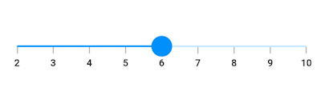

### Vertical




import 'package:flutter/material.dart';
import 'package:syncfusion_flutter_core/theme.dart';
import 'package:syncfusion_flutter_sliders/sliders.dart';

class VerticalThumbSizePage extends StatefulWidget {
  @override
  _VerticalThumbSizePageState createState() => _VerticalThumbSizePageState();
}

class _VerticalThumbSizePageState extends State<VerticalThumbSizePage> {
  double _value = 6.0;

  @override
  Widget build(BuildContext context) {
    return MaterialApp(
        home: Scaffold(
            body: Center(
                child: SfSliderTheme(
                  data: SfSliderThemeData(
                    thumbRadius: 13,
                  ),
                  child: SfSlider.vertical(
                    min: 2.0,
                    max: 10.0,
                    interval: 1,
                    showTicks: true,
                    showLabels: true,
                    value: _value,
                    onChanged: (double newValue){
                      setState(() {
                        _value = newValue;
                      });
                    },
                  ),
                )
            )
        )
    );
  }
}




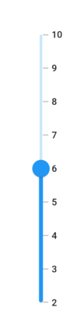

## Thumb color

You can change the color of the thumb in the slider using the [`thumbColor`](https://pub.dev/documentation/syncfusion_flutter_core/latest/theme/SfSliderThemeData/thumbColor.html) property.

### Horizontal




import 'package:flutter/material.dart';
import 'package:syncfusion_flutter_core/theme.dart';
import 'package:syncfusion_flutter_sliders/sliders.dart';

class ThumbColorPage extends StatefulWidget {
  @override
  _ThumbColorPageState createState() => _ThumbColorPageState();
}

class _ThumbColorPageState extends State<ThumbColorPage> {
  double _value = 6.0;

  @override
  Widget build(BuildContext context) {
    return MaterialApp(
        home: Scaffold(
             body: Center(
                child: SfSliderTheme(
                  data: SfSliderThemeData(
                    thumbColor: Colors.red,
                  ),
                  child: SfSlider(
                    min: 2.0,
                    max: 10.0,
                    interval: 1,
                    showTicks: true,
                    showLabels: true,
                    value: _value,
                    onChanged: (double newValue){
                      setState(() {
                        _value = newValue;
                      });
                    },
                  ),
                )
            )
        )
    );
  }
}




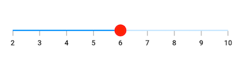

### Vertical




import 'package:flutter/material.dart';
import 'package:syncfusion_flutter_core/theme.dart';
import 'package:syncfusion_flutter_sliders/sliders.dart';

class VerticalThumbColorPage extends StatefulWidget {
  @override
  _VerticalThumbColorPageState createState() => _VerticalThumbColorPageState();
}

class _VerticalThumbColorPageState extends State<VerticalThumbColorPage> {
  double _value = 6.0;

  @override
  Widget build(BuildContext context) {
    return MaterialApp(
        home: Scaffold(
             body: Center(
                child: SfSliderTheme(
                  data: SfSliderThemeData(
                    thumbColor: Colors.red,
                  ),
                  child: SfSlider.vertical(
                    min: 2.0,
                    max: 10.0,
                    interval: 1,
                    showTicks: true,
                    showLabels: true,
                    value: _value,
                    onChanged: (double newValue){
                      setState(() {
                        _value = newValue;
                      });
                    },
                  ),
                )
            )
        )
    );
  }
}




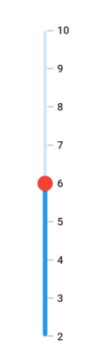

## Thumb stroke width and stroke color

You can change the thumb stroke width using the [`thumbStrokeWidth`](https://pub.dev/documentation/syncfusion_flutter_core/latest/theme/SfSliderThemeData/thumbStrokeWidth.html) property and thumb stroke color using the [`thumbStrokeColor`](https://pub.dev/documentation/syncfusion_flutter_core/latest/theme/SfSliderThemeData/thumbStrokeColor.html) property.

### Horizontal




import 'package:flutter/material.dart';
import 'package:syncfusion_flutter_core/theme.dart';
import 'package:syncfusion_flutter_sliders/sliders.dart';

class ThumbStrokePage extends StatefulWidget {
  @override
  _ThumbStrokePageState createState() => _ThumbStrokePageState();
}

class _ThumbStrokePageState extends State<ThumbStrokePage> {
  double _value = 6.0;

  @override
  Widget build(BuildContext context) {
    return MaterialApp(
        home: Scaffold(
            body: Center(
                child: SfSliderTheme(
                  data: SfSliderThemeData(
                      thumbStrokeWidth: 3,
                      thumbStrokeColor: Colors.red
                  ),
                  child: SfSlider(
                    min: 2.0,
                    max: 10.0,
                    interval: 1,
                    showTicks: true,
                    showLabels: true,
                    value: _value,
                    onChanged: (double newValue){
                      setState(() {
                        _value = newValue;
                      });
                    },
                  ),
                )
            )
        )
    );
  }
}




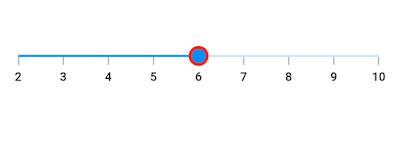

### Vertical




import 'package:flutter/material.dart';
import 'package:syncfusion_flutter_core/theme.dart';
import 'package:syncfusion_flutter_sliders/sliders.dart';

class VerticalThumbStrokePage extends StatefulWidget {
  @override
  _VerticalThumbStrokePageState createState() => _VerticalThumbStrokePageState();
}

class _VerticalThumbStrokePageState extends State<VerticalThumbStrokePage> {
  double _value = 6.0;

  @override
  Widget build(BuildContext context) {
    return MaterialApp(
        home: Scaffold(
            body: Center(
                child: SfSliderTheme(
                  data: SfSliderThemeData(
                      thumbStrokeWidth: 3,
                      thumbStrokeColor: Colors.red
                  ),
                  child: SfSlider.vertical(
                    min: 2.0,
                    max: 10.0,
                    interval: 1,
                    showTicks: true,
                    showLabels: true,
                    value: _value,
                    onChanged: (double newValue){
                      setState(() {
                        _value = newValue;
                      });
                    },
                  ),
                )
            )
        )
    );
  }
}




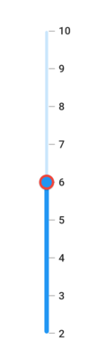

## Thumb icon

You can show the custom widgets like icon or text inside the thumb using the [`thumbIcon`](https://pub.dev/documentation/syncfusion_flutter_sliders/latest/sliders/SfSlider/thumbIcon.html) property. The `thumbIcon` widget is rendered inside the thumb.

### Horizontal




import 'package:flutter/material.dart';
import 'package:syncfusion_flutter_core/theme.dart';
import 'package:syncfusion_flutter_sliders/sliders.dart';

class ThumbIconPage extends StatefulWidget {
  @override
  _ThumbIconPageState createState() => _ThumbIconPageState();
}

class _ThumbIconPageState extends State<ThumbIconPage> {
  double _value = 6.0;

  @override
  Widget build(BuildContext context) {
    return MaterialApp(
        home: Scaffold(
            body: SfSliderTheme(
              data: SfSliderThemeData(
                thumbColor: Colors.white,
                thumbRadius: 15,
                thumbStrokeWidth: 2,
                thumbStrokeColor: Colors.blue
              ),
              child: Center(
                child: SfSlider(
                  min: 2.0,
                  max: 10.0,
                  interval: 1,
                  thumbIcon: const Icon(
                      Icons.arrow_forward_ios,
                      color: Colors.blue,
                      size: 20.0),
                  showLabels: true,
                  value: _value,
                  onChanged: (double newValue) {
                    setState(() {
                      _value = newValue;
                    });
                  },
                ),
              ),
            )
        )
    );
  }
}




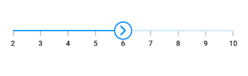

### Vertical




import 'package:flutter/material.dart';
import 'package:syncfusion_flutter_core/theme.dart';
import 'package:syncfusion_flutter_sliders/sliders.dart';

class VerticalThumbIconPage extends StatefulWidget {
  @override
  _VerticalThumbIconPageState createState() => _VerticalThumbIconPageState();
}

class _VerticalThumbIconPageState extends State<VerticalThumbIconPage> {
  double _value = 6.0;

  @override
  Widget build(BuildContext context) {
    return MaterialApp(
        home: Scaffold(
            body: SfSliderTheme(
              data: SfSliderThemeData(
                thumbColor: Colors.white,
                thumbRadius: 15,
                thumbStrokeWidth: 2,
                thumbStrokeColor: Colors.blue
              ),
              child: Center(
                child: SfSlider.vertical(
                  min: 2.0,
                  max: 10.0,
                  interval: 1,
                  thumbIcon: const Icon(
                      Icons.keyboard_arrow_up_outlined,
                      color: Colors.blue,
                      size: 20.0),
                  showLabels: true,
                  value: _value,
                  onChanged: (double newValue) {
                    setState(() {
                      _value = newValue;
                    });
                  },
                ),
              ),
            )
        )
    );
  }
}




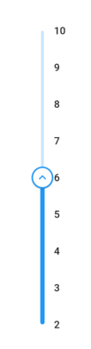

## Thumb overlay size

You can change the size of the thumb overlay in the slider using the [`overlayRadius`](https://pub.dev/documentation/syncfusion_flutter_core/latest/theme/SfSliderThemeData/overlayRadius.html) property.

### Horizontal




import 'package:flutter/material.dart';
import 'package:syncfusion_flutter_core/theme.dart';
import 'package:syncfusion_flutter_sliders/sliders.dart';

class OverlaySizePage extends StatefulWidget {
  @override
  _OverlaySizePageState createState() => _OverlaySizePageState();
}

class _OverlaySizePageState extends State<OverlaySizePage> {
  double _value = 6.0;

  @override
  Widget build(BuildContext context) {
    return MaterialApp(
        home: Scaffold(
            body: Center(
                child: SfSliderTheme(
                  data: SfSliderThemeData(
                    overlayRadius: 30,
                  ),
                  child:  SfSlider(
                    min: 2.0,
                    max: 10.0,
                    interval: 1,
                    showTicks: true,
                    showLabels: true,
                    value: _value,
                    onChanged: (double newValue){
                      setState(() {
                        _value = newValue;
                      });
                    },
                  ),
                )
            )
        )
    );
  }
}




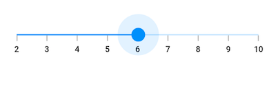

### Vertical




import 'package:flutter/material.dart';
import 'package:syncfusion_flutter_core/theme.dart';
import 'package:syncfusion_flutter_sliders/sliders.dart';

class VerticalOverlaySizePage extends StatefulWidget {
  @override
  _VerticalOverlaySizePageState createState() => _VerticalOverlaySizePageState();
}

class _VerticalOverlaySizePageState extends State<VerticalOverlaySizePage> {
  double _value = 6.0;

  @override
  Widget build(BuildContext context) {
    return MaterialApp(
        home: Scaffold(
            body: Center(
                child: SfSliderTheme(
                  data: SfSliderThemeData(
                    overlayRadius: 30,
                  ),
                  child:  SfSlider.vertical(
                    min: 2.0,
                    max: 10.0,
                    interval: 1,
                    showTicks: true,
                    showLabels: true,
                    value: _value,
                    onChanged: (double newValue){
                      setState(() {
                        _value = newValue;
                      });
                    },
                  ),
                )
            )
        )
    );
  }
}




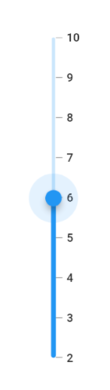

## Thumb overlay color

You can change the color of the thumb overlay in the slider using the [`overlayColor`](https://pub.dev/documentation/syncfusion_flutter_core/latest/theme/SfSliderThemeData/overlayColor.html) property.

### Horizontal




import 'package:flutter/material.dart';
import 'package:syncfusion_flutter_core/theme.dart';
import 'package:syncfusion_flutter_sliders/sliders.dart';

class OverlayColorPage extends StatefulWidget {
  @override
  _OverlayColorPageState createState() => _OverlayColorPageState();
}

class _OverlayColorPageState extends State<OverlayColorPage> {
  double _value = 6.0;

  @override
  Widget build(BuildContext context) {
    return MaterialApp(
        home: Scaffold(
            body: Center(
                child: SfSliderTheme(
                  data: SfSliderThemeData(
                    overlayColor: Colors.red[50],
                  ),
                  child:  SfSlider(
                    min: 2.0,
                    max: 10.0,
                    interval: 1,
                    showTicks: true,
                    showLabels: true,
                    value: _value,
                    onChanged: (double newValue){
                      setState(() {
                        _value = newValue;
                      });
                    },
                  ),
                )
            )
        )
    );
  }
}




### Vertical




import 'package:flutter/material.dart';
import 'package:syncfusion_flutter_core/theme.dart';
import 'package:syncfusion_flutter_sliders/sliders.dart';

class VerticalOverlayColorPage extends StatefulWidget {
  @override
  _VerticalOverlayColorPageState createState() => _VerticalOverlayColorPageState();
}

class _VerticalOverlayColorPageState extends State<VerticalOverlayColorPage> {
  double _value = 6.0;

  @override
  Widget build(BuildContext context) {
    return MaterialApp(
        home: Scaffold(
            body: Center(
                child: SfSliderTheme(
                  data: SfSliderThemeData(
                    overlayColor: Colors.red[50],
                  ),
                  child:  SfSlider.vertical(
                    min: 2.0,
                    max: 10.0,
                    interval: 1,
                    showTicks: true,
                    showLabels: true,
                    value: _value,
                    onChanged: (double newValue){
                      setState(() {
                        _value = newValue;
                      });
                    },
                  ),
                )
            )
        )
    );
  }
}




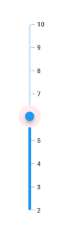
