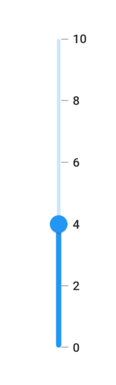
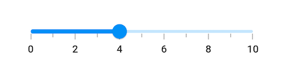
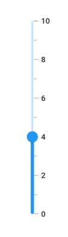
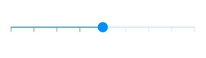
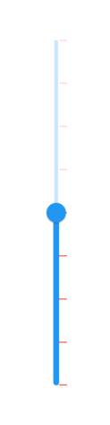
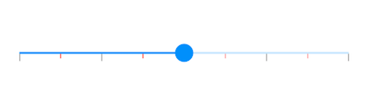
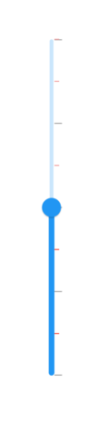
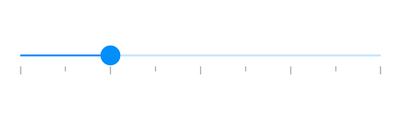
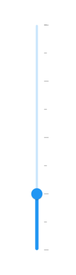

# Tick in Flutter Slider (SfSlider)

This section helps to learn about how to add major and minor ticks in the slider.

## Show major ticks

You can enable the major ticks on the track. It is a shape which is used to represent the major interval points of the track. The default value of [`showTicks`](https://pub.dev/documentation/syncfusion_flutter_sliders/latest/sliders/SfSlider/showTicks.html) property is `false`.

For example, if [`min`](https://pub.dev/documentation/syncfusion_flutter_sliders/latest/sliders/SfSlider/min.html) is 0.0 and [`max`](https://pub.dev/documentation/syncfusion_flutter_sliders/latest/sliders/SfSlider/max.html) is 10.0 and [`interval`](https://pub.dev/documentation/syncfusion_flutter_sliders/latest/sliders/SfSlider/interval.html) is 2.0, the slider will render the major ticks at 0.0, 2.0, 4.0 and so on.

### Horizontal




double _value = 4.0;

@override
Widget build(BuildContext context) {
  return MaterialApp(
      home: Scaffold(
          body: Center(
            child: SfSlider(
              min: 0.0,
              max: 10.0,
              interval: 2,
              showTicks: true,
              showLabels: true,
              value: _value,
              onChanged: (dynamic newValue) {
                setState(() {
                  _value = newValue;
                });
              },
            ),
          )
      )
  );
}




### Vertical




double _value = 4.0;

@override
Widget build(BuildContext context) {
  return MaterialApp(
      home: Scaffold(
          body: Center(
            child: SfSlider.vertical(
              min: 0.0,
              max: 10.0,
              interval: 2,
              showTicks: true,
              showLabels: true,
              value: _value,
              onChanged: (dynamic newValue) {
                setState(() {
                  _value = newValue;
                });
              },
            ),
          )
      )
  );
}




N> Refer the [`tickShape`](https://pub.dev/documentation/syncfusion_flutter_sliders/latest/sliders/SfSlider/tickShape.html) and [`SfSliderThemeData`](https://pub.dev/documentation/syncfusion_flutter_core/latest/theme/SfSliderThemeData-class.html) for customizing the major tick's visual appearance.

## Show minor ticks

It is used to represent the number of smaller ticks between two major ticks. For example, if [`min`](https://pub.dev/documentation/syncfusion_flutter_sliders/latest/sliders/SfSlider/min.html) is 0.0 and [`max`](https://pub.dev/documentation/syncfusion_flutter_sliders/latest/sliders/SfSlider/max.html) is 10.0 and [`interval`](https://pub.dev/documentation/syncfusion_flutter_sliders/latest/sliders/SfSlider/interval.html) is 2.0, the slider will render the major ticks at 0.0, 2.0, 4.0 and so on. If [`minorTicksPerInterval`](https://pub.dev/documentation/syncfusion_flutter_sliders/latest/sliders/SfSlider/minorTicksPerInterval.html) is 1, then smaller ticks will be rendered on 1.0 and 3.0 and so on.

I> The default value of [`minorTicksPerInterval`](https://pub.dev/documentation/syncfusion_flutter_sliders/latest/sliders/SfSlider/minorTicksPerInterval.html) property is null and it must be greater than 0.

### Horizontal




double _value = 4.0;

@override
Widget build(BuildContext context) {
  return MaterialApp(
      home: Scaffold(
          body: Center(
            child: SfSlider(
              min: 0.0,
              max: 10.0,
              interval: 2,
              showTicks: true,
              minorTicksPerInterval: 1,
              showLabels: true,
              value: _value,
              onChanged: (dynamic newValue) {
                setState(() {
                  _value = newValue;
                });
              },
            ),
          )
      )
  );
}




### Vertical




double _value = 4.0;

@override
Widget build(BuildContext context) {
  return MaterialApp(
      home: Scaffold(
          body: Center(
            child: SfSlider.vertical(
              min: 0.0,
              max: 10.0,
              interval: 2,
              showTicks: true,
              minorTicksPerInterval: 1,
              showLabels: true,
              value: _value,
              onChanged: (dynamic newValue) {
                setState(() {
                  _value = newValue;
                });
              },
            ),
          )
      )
  );
}




N>
* Refer the [`showTicks`](https://pub.dev/documentation/syncfusion_flutter_sliders/latest/sliders/SfSlider/showTicks.html) to know about the rendering major ticks at given interval.
* Refer the [`minorTickShape`](https://pub.dev/documentation/syncfusion_flutter_sliders/latest/sliders/SfSlider/minorTickShape.html) and [`SfSliderThemeData`](https://pub.dev/documentation/syncfusion_flutter_core/latest/theme/SfSliderThemeData-class.html) for customizing the minor tick's visual appearance.

## Major ticks color

You can change the active and inactive major ticks color of the slider using the [`activeTickColor`](https://pub.dev/documentation/syncfusion_flutter_core/latest/theme/SfSliderThemeData/activeTickColor.html) and [`inactiveTickColor`](https://pub.dev/documentation/syncfusion_flutter_core/latest/theme/SfSliderThemeData/inactiveTickColor.html) properties respectively.

The active side of the slider is between the [`min`](https://pub.dev/documentation/syncfusion_flutter_sliders/latest/sliders/SfSlider/min.html) and the thumb.

The inactive side of the slider is between the thumb and the [`max`](https://pub.dev/documentation/syncfusion_flutter_sliders/latest/sliders/SfSlider/max.html) value.

N> You must import the `theme.dart` library from the [`Core`](https://pub.dev/packages/syncfusion_flutter_core) package to use [`SfSliderTheme`](https://pub.dev/documentation/syncfusion_flutter_core/latest/theme/SfSliderTheme-class.html).

### Horizontal




double _value = 6.0;

@override
Widget build(BuildContext context) {
  return MaterialApp(
      home: Scaffold(
          body: Center(
              child: SfSliderTheme(
                data: SfSliderThemeData(
                  activeTickColor: Colors.red,
                  inactiveTickColor: Colors.red[100],
                ),
                child: SfSlider(
                  min: 2.0,
                  max: 10.0,
                  value: _value,
                  interval: 1,
                  showTicks: true,
                  onChanged: (dynamic newValue){
                    setState(() {
                      _value = newValue;
                    });
                  },
                ),
              )
          )
      )
  );
}




### Vertical




double _value = 6.0;

@override
Widget build(BuildContext context) {
  return MaterialApp(
      home: Scaffold(
          body: Center(
              child: SfSliderTheme(
                data: SfSliderThemeData(
                  activeTickColor: Colors.red,
                  inactiveTickColor: Colors.red[100],
                ),
                child: SfSlider.vertical(
                  min: 2.0,
                  max: 10.0,
                  value: _value,
                  interval: 1,
                  showTicks: true,
                  onChanged: (dynamic newValue){
                    setState(() {
                      _value = newValue;
                    });
                  },
                ),
              )
          )
      )
  );
}




## Minor ticks color

You can change the active and inactive minor ticks color of the slider using the [`activeMinorTickColor`](https://pub.dev/documentation/syncfusion_flutter_core/latest/theme/SfSliderThemeData/activeMinorTickColor.html) and [`inactiveMinorTickColor`](https://pub.dev/documentation/syncfusion_flutter_core/latest/theme/SfSliderThemeData/inactiveMinorTickColor.html) properties respectively.

The active side of the slider is between the [`min`](https://pub.dev/documentation/syncfusion_flutter_sliders/latest/sliders/SfSlider/min.html) and the thumb.

The inactive side of the slider is between the thumb and the [`max`](https://pub.dev/documentation/syncfusion_flutter_sliders/latest/sliders/SfSlider/max.html) value.

N> You must import the `theme.dart` library from the [`Core`](https://pub.dev/packages/syncfusion_flutter_core) package to use [`SfSliderTheme`](https://pub.dev/documentation/syncfusion_flutter_core/latest/theme/SfSliderTheme-class.html).

### Horizontal




double _value = 6.0;

@override
Widget build(BuildContext context) {
  return MaterialApp(
      home: Scaffold(
          body: Center(
              child: SfSliderTheme(
                data: SfSliderThemeData(
                  activeMinorTickColor: Colors.red,
                  inactiveMinorTickColor: Colors.red[200],
                ),
                child: SfSlider(
                  min: 2.0,
                  max: 10.0,
                  value: _value,
                  interval: 2,
                  minorTicksPerInterval: 1,
                  showTicks: true,
                  onChanged: (dynamic newValue){
                    setState(() {
                      _value = newValue;
                    });
                  },
                ),
              )
          )
      )
  );
}




### Vertical




double _value = 6.0;

@override
Widget build(BuildContext context) {
  return MaterialApp(
      home: Scaffold(
          body: Center(
              child: SfSliderTheme(
                data: SfSliderThemeData(
                  activeMinorTickColor: Colors.red,
                  inactiveMinorTickColor: Colors.red[200],
                ),
                child: SfSlider.vertical(
                  min: 2.0,
                  max: 10.0,
                  value: _value,
                  interval: 2,
                  minorTicksPerInterval: 1,
                  showTicks: true,
                  onChanged: (dynamic newValue){
                    setState(() {
                      _value = newValue;
                    });
                  },
                ),
              )
          )
      )
  );
}




## Ticks size

N> You must import the `theme.dart` library from the [`Core`](https://pub.dev/packages/syncfusion_flutter_core) package to use [`SfSliderTheme`](https://pub.dev/documentation/syncfusion_flutter_core/latest/theme/SfSliderTheme-class.html).

### Horizontal

You can change the major and minor ticks size of the slider using the [`tickSize`](https://pub.dev/documentation/syncfusion_flutter_core/latest/theme/SfSliderThemeData/tickSize.html) and [`minorTickSize`](https://pub.dev/documentation/syncfusion_flutter_core/latest/theme/SfSliderThemeData/minorTickSize.html) properties respectively. The default value of the [`tickSize`](https://pub.dev/documentation/syncfusion_flutter_core/latest/theme/SfSliderThemeData/tickSize.html) property is `Size(1.0, 8.0)` and [`minorTickSize`](https://pub.dev/documentation/syncfusion_flutter_core/latest/theme/SfSliderThemeData/minorTickSize.html) property is `Size(1.0, 5.0)`.




double _value = 6.0;

@override
Widget build(BuildContext context) {
  return MaterialApp(
      home: Scaffold(
          body: Center(
              child: SfSliderTheme(
                data: SfSliderThemeData(
                  tickSize: Size(3.0, 12.0),
                  minorTickSize: Size(3.0, 8.0),
                ),
                child: SfSlider(
                  min: 2.0,
                  max: 10.0,
                  interval: 2,
                  minorTicksPerInterval: 1,
                  showTicks: true,
                  value: _value,
                  onChanged: (dynamic newValue){
                    setState(() {
                      _value = newValue;
                    });
                  },
                ),
              )
          )
      )
  );
}




### Vertical

You can change the major and minor ticks size of the slider using the [`tickSize`](https://pub.dev/documentation/syncfusion_flutter_core/latest/theme/SfSliderThemeData/tickSize.html) and [`minorTickSize`](https://pub.dev/documentation/syncfusion_flutter_core/latest/theme/SfSliderThemeData/minorTickSize.html) properties respectively. The default value of the [`tickSize`](https://pub.dev/documentation/syncfusion_flutter_core/latest/theme/SfSliderThemeData/tickSize.html) property is `Size(1.0, 8.0)` and [`minorTickSize`](https://pub.dev/documentation/syncfusion_flutter_core/latest/theme/SfSliderThemeData/minorTickSize.html) property is `Size(5.0, 1.0)`.




double _value = 6.0;

@override
Widget build(BuildContext context) {
  return MaterialApp(
      home: Scaffold(
          body: Center(
              child: SfSliderTheme(
                data: SfSliderThemeData(
                  tickSize: Size(12.0, 3.0),
                  minorTickSize: Size(8.0, 3.0),
                ),
                child: SfSlider.vertical(
                  min: 2.0,
                  max: 10.0,
                  interval: 2,
                  minorTicksPerInterval: 1,
                  showTicks: true,
                  value: _value,
                  onChanged: (dynamic newValue){
                    setState(() {
                      _value = newValue;
                    });
                  },
                ),
              )
          )
      )
  );
}




## Ticks offset

You can adjust the space between track and ticks of the slider using the [`tickOffset`](https://pub.dev/documentation/syncfusion_flutter_core/latest/theme/SfSliderThemeData/tickOffset.html) property in the [`SfSliderThemeData`](https://pub.dev/documentation/syncfusion_flutter_core/latest/theme/SfSliderThemeData-class.html). The default value of the [`tickOffset`](https://pub.dev/documentation/syncfusion_flutter_core/latest/theme/SfSliderThemeData/tickOffset.html) property is `null`.

N> You must import the `theme.dart` library from the [`Core`](https://pub.dev/packages/syncfusion_flutter_core) package to use [`SfSliderTheme`](https://pub.dev/documentation/syncfusion_flutter_core/latest/theme/SfSliderTheme-class.html).

### Horizontal




double _value = 4.0;

@override
Widget build(BuildContext context) {
  return MaterialApp(
      home: Scaffold(
          body: Center(
              child: SfSliderTheme(
                data: SfSliderThemeData(
                  tickOffset: Offset(0.0, 10.0),
                ),
                child: SfSlider(
                  min: 2.0,
                  max: 10.0,
                  interval: 2,
                  minorTicksPerInterval: 1,
                  showTicks: true,
                  value: _value,
                  onChanged: (dynamic newValue){
                    setState(() {
                      _value = newValue;
                    });
                  },
                ),
              )
          )
      )
  );
}




### Vertical




double _value = 4.0;

@override
Widget build(BuildContext context) {
  return MaterialApp(
      home: Scaffold(
          body: Center(
              child: SfSliderTheme(
                data: SfSliderThemeData(
                  tickOffset: Offset(0.0, 10.0),
                ),
                child: SfSlider.vertical(
                  min: 2.0,
                  max: 10.0,
                  interval: 2,
                  minorTicksPerInterval: 1,
                  showTicks: true,
                  value: _value,
                  onChanged: (dynamic newValue){
                    setState(() {
                      _value = newValue;
                    });
                  },
                ),
              )
          )
      )
  );
}




