# Tick in Flutter Slider (SfSlider)

This section explains how to add major and minor ticks in the slider.

N> You must import the `theme.dart` library from the [`Core`](https://pub.dev/packages/syncfusion_flutter_core) package to use [`SfSliderTheme`](https://pub.dev/documentation/syncfusion_flutter_core/latest/theme/SfSliderTheme-class.html) for customizing tick colors, sizes, and offsets shown in the examples below.

## Show major ticks

You can enable the major ticks on the track. It is a shape which is used to represent the points at each major interval on the track. The default value of [`showTicks`](https://pub.dev/documentation/syncfusion_flutter_sliders/latest/sliders/SfSlider/showTicks.html) property is `false`.

For example, if [`min`](https://pub.dev/documentation/syncfusion_flutter_sliders/latest/sliders/SfSlider/min.html) is 0.0 and [`max`](https://pub.dev/documentation/syncfusion_flutter_sliders/latest/sliders/SfSlider/max.html) is 10.0 and [`interval`](https://pub.dev/documentation/syncfusion_flutter_sliders/latest/sliders/SfSlider/interval.html) is 2.0, the slider will render the major ticks at 0.0, 2.0, 4.0 and so on.

### Horizontal




import 'package:flutter/material.dart';
import 'package:syncfusion_flutter_sliders/sliders.dart';

class MajorTicksPage extends StatefulWidget {
  @override
  _MajorTicksPageState createState() => _MajorTicksPageState();
}

class _MajorTicksPageState extends State<MajorTicksPage> {
  double _value = 4.0;

  @override
  Widget build(BuildContext context) {
    return MaterialApp(
        home: Scaffold(
            body: Center(
              child: SfSlider(
                min: 0.0,
                max: 10.0,
                interval: 2,
                showTicks: true,
                showLabels: true,
                value: _value,
                onChanged: (double newValue) {
                  setState(() {
                    _value = newValue;
                  });
                },
              ),
            )
        )
    );
  }
}




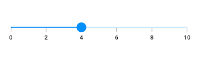

### Vertical




import 'package:flutter/material.dart';
import 'package:syncfusion_flutter_sliders/sliders.dart';

class VerticalMajorTicksPage extends StatefulWidget {
  @override
  _VerticalMajorTicksPageState createState() => _VerticalMajorTicksPageState();
}

class _VerticalMajorTicksPageState extends State<VerticalMajorTicksPage> {
  double _value = 4.0;

  @override
  Widget build(BuildContext context) {
    return MaterialApp(
        home: Scaffold(
            body: Center(
              child: SfSlider.vertical(
                min: 0.0,
                max: 10.0,
                interval: 2,
                showTicks: true,
                showLabels: true,
                value: _value,
                onChanged: (double newValue) {
                  setState(() {
                    _value = newValue;
                  });
                },
              ),
            )
        )
    );
  }
}




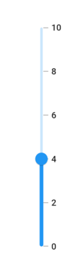

N> Refer the [`tickShape`](https://pub.dev/documentation/syncfusion_flutter_sliders/latest/sliders/SfSlider/tickShape.html) and [`SfSliderThemeData`](https://pub.dev/documentation/syncfusion_flutter_core/latest/theme/SfSliderThemeData-class.html) for customizing the major tick's visual appearance.

## Show minor ticks

It is used to represent the number of smaller ticks between two major ticks. For example, if [`min`](https://pub.dev/documentation/syncfusion_flutter_sliders/latest/sliders/SfSlider/min.html) is 0.0 and [`max`](https://pub.dev/documentation/syncfusion_flutter_sliders/latest/sliders/SfSlider/max.html) is 10.0 and [`interval`](https://pub.dev/documentation/syncfusion_flutter_sliders/latest/sliders/SfSlider/interval.html) is 2.0, the slider will render the major ticks at 0.0, 2.0, 4.0 and so on. If [`minorTicksPerInterval`](https://pub.dev/documentation/syncfusion_flutter_sliders/latest/sliders/SfSlider/minorTicksPerInterval.html) is 1, then smaller ticks will be rendered on 1.0 and 3.0 and so on.

I> The default value of [`minorTicksPerInterval`](https://pub.dev/documentation/syncfusion_flutter_sliders/latest/sliders/SfSlider/minorTicksPerInterval.html) property is null and it must be greater than 0. When null, no minor ticks are rendered.

### Horizontal




import 'package:flutter/material.dart';
import 'package:syncfusion_flutter_sliders/sliders.dart';

class MinorTicksPage extends StatefulWidget {
  @override
  _MinorTicksPageState createState() => _MinorTicksPageState();
}

class _MinorTicksPageState extends State<MinorTicksPage> {
  double _value = 4.0;

  @override
  Widget build(BuildContext context) {
    return MaterialApp(
        home: Scaffold(
            body: Center(
              child: SfSlider(
                min: 0.0,
                max: 10.0,
                interval: 2,
                showTicks: true,
                minorTicksPerInterval: 1,
                showLabels: true,
                value: _value,
                onChanged: (double newValue) {
                  setState(() {
                    _value = newValue;
                  });
                },
              ),
            )
        )
    );
  }
}




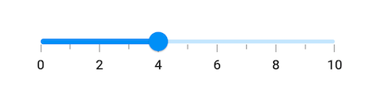

### Vertical




import 'package:flutter/material.dart';
import 'package:syncfusion_flutter_sliders/sliders.dart';

class VerticalMinorTicksPage extends StatefulWidget {
  @override
  _VerticalMinorTicksPageState createState() => _VerticalMinorTicksPageState();
}

class _VerticalMinorTicksPageState extends State<VerticalMinorTicksPage> {
  double _value = 4.0;

  @override
  Widget build(BuildContext context) {
    return MaterialApp(
        home: Scaffold(
            body: Center(
              child: SfSlider.vertical(
                min: 0.0,
                max: 10.0,
                interval: 2,
                showTicks: true,
                minorTicksPerInterval: 1,
                showLabels: true,
                value: _value,
                onChanged: (double newValue) {
                  setState(() {
                    _value = newValue;
                  });
                },
              ),
            )
        )
    );
  }
}




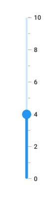

N>
* Refer the [`showTicks`](https://pub.dev/documentation/syncfusion_flutter_sliders/latest/sliders/SfSlider/showTicks.html) to know about the rendering major ticks at given interval.
* Refer the [`minorTickShape`](https://pub.dev/documentation/syncfusion_flutter_sliders/latest/sliders/SfSlider/minorTickShape.html) and [`SfSliderThemeData`](https://pub.dev/documentation/syncfusion_flutter_core/latest/theme/SfSliderThemeData-class.html) for customizing the minor tick's visual appearance.

## Major ticks color

You can change the active and inactive major ticks color of the slider using the [`activeTickColor`](https://pub.dev/documentation/syncfusion_flutter_core/latest/theme/SfSliderThemeData/activeTickColor.html) and [`inactiveTickColor`](https://pub.dev/documentation/syncfusion_flutter_core/latest/theme/SfSliderThemeData/inactiveTickColor.html) properties respectively.

The active side of the slider is between the [`min`](https://pub.dev/documentation/syncfusion_flutter_sliders/latest/sliders/SfSlider/min.html) and the thumb.

The inactive side of the slider is between the thumb and the [`max`](https://pub.dev/documentation/syncfusion_flutter_sliders/latest/sliders/SfSlider/max.html) value.

### Horizontal




import 'package:flutter/material.dart';
import 'package:syncfusion_flutter_core/theme.dart';
import 'package:syncfusion_flutter_sliders/sliders.dart';

class MajorTicksColorPage extends StatefulWidget {
  @override
  _MajorTicksColorPageState createState() => _MajorTicksColorPageState();
}

class _MajorTicksColorPageState extends State<MajorTicksColorPage> {
  double _value = 6.0;

  @override
  Widget build(BuildContext context) {
    return MaterialApp(
        home: Scaffold(
            body: Center(
                child: SfSliderTheme(
                  data: SfSliderThemeData(
                    activeTickColor: Colors.red,
                    inactiveTickColor: Colors.red[100],
                  ),
                  child: SfSlider(
                    min: 2.0,
                    max: 10.0,
                    value: _value,
                    interval: 1,
                    showTicks: true,
                    onChanged: (double newValue){
                      setState(() {
                        _value = newValue;
                      });
                    },
                  ),
                )
            )
        )
    );
  }
}




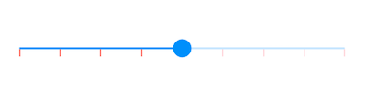

### Vertical




import 'package:flutter/material.dart';
import 'package:syncfusion_flutter_core/theme.dart';
import 'package:syncfusion_flutter_sliders/sliders.dart';

class VerticalMajorTicksColorPage extends StatefulWidget {
  @override
  _VerticalMajorTicksColorPageState createState() => _VerticalMajorTicksColorPageState();
}

class _VerticalMajorTicksColorPageState extends State<VerticalMajorTicksColorPage> {
  double _value = 6.0;

  @override
  Widget build(BuildContext context) {
    return MaterialApp(
        home: Scaffold(
            body: Center(
                child: SfSliderTheme(
                  data: SfSliderThemeData(
                    activeTickColor: Colors.red,
                    inactiveTickColor: Colors.red[100],
                  ),
                  child: SfSlider.vertical(
                    min: 2.0,
                    max: 10.0,
                    value: _value,
                    interval: 1,
                    showTicks: true,
                    onChanged: (double newValue){
                      setState(() {
                        _value = newValue;
                      });
                    },
                  ),
                )
            )
        )
    );
  }
}




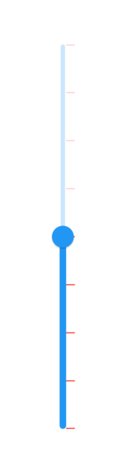

## Minor ticks color

You can change the active and inactive minor ticks color of the slider using the [`activeMinorTickColor`](https://pub.dev/documentation/syncfusion_flutter_core/latest/theme/SfSliderThemeData/activeMinorTickColor.html) and [`inactiveMinorTickColor`](https://pub.dev/documentation/syncfusion_flutter_core/latest/theme/SfSliderThemeData/inactiveMinorTickColor.html) properties respectively.

The active side of the slider is between the [`min`](https://pub.dev/documentation/syncfusion_flutter_sliders/latest/sliders/SfSlider/min.html) and the thumb.

The inactive side of the slider is between the thumb and the [`max`](https://pub.dev/documentation/syncfusion_flutter_sliders/latest/sliders/SfSlider/max.html) value.

### Horizontal




import 'package:flutter/material.dart';
import 'package:syncfusion_flutter_core/theme.dart';
import 'package:syncfusion_flutter_sliders/sliders.dart';

class MinorTicksColorPage extends StatefulWidget {
  @override
  _MinorTicksColorPageState createState() => _MinorTicksColorPageState();
}

class _MinorTicksColorPageState extends State<MinorTicksColorPage> {
  double _value = 6.0;

  @override
  Widget build(BuildContext context) {
    return MaterialApp(
        home: Scaffold(
            body: Center(
                child: SfSliderTheme(
                  data: SfSliderThemeData(
                    activeMinorTickColor: Colors.red,
                    inactiveMinorTickColor: Colors.red[200],
                  ),
                  child: SfSlider(
                    min: 2.0,
                    max: 10.0,
                    value: _value,
                    interval: 2,
                    minorTicksPerInterval: 1,
                    showTicks: true,
                    onChanged: (double newValue){
                      setState(() {
                        _value = newValue;
                      });
                    },
                  ),
                )
            )
        )
    );
  }
}




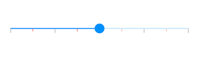

### Vertical




import 'package:flutter/material.dart';
import 'package:syncfusion_flutter_core/theme.dart';
import 'package:syncfusion_flutter_sliders/sliders.dart';

class VerticalMinorTicksColorPage extends StatefulWidget {
  @override
  _VerticalMinorTicksColorPageState createState() => _VerticalMinorTicksColorPageState();
}

class _VerticalMinorTicksColorPageState extends State<VerticalMinorTicksColorPage> {
  double _value = 6.0;

  @override
  Widget build(BuildContext context) {
    return MaterialApp(
        home: Scaffold(
            body: Center(
                child: SfSliderTheme(
                  data: SfSliderThemeData(
                    activeMinorTickColor: Colors.red,
                    inactiveMinorTickColor: Colors.red[200],
                  ),
                  child: SfSlider.vertical(
                    min: 2.0,
                    max: 10.0,
                    value: _value,
                    interval: 2,
                    minorTicksPerInterval: 1,
                    showTicks: true,
                    onChanged: (double newValue){
                      setState(() {
                        _value = newValue;
                      });
                    },
                  ),
                )
            )
        )
    );
  }
}




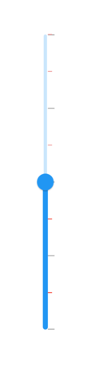

## Tick size

You can change the major and minor ticks size of the slider using the [`tickSize`](https://pub.dev/documentation/syncfusion_flutter_core/latest/theme/SfSliderThemeData/tickSize.html) and [`minorTickSize`](https://pub.dev/documentation/syncfusion_flutter_core/latest/theme/SfSliderThemeData/minorTickSize.html) properties respectively.

### Horizontal

The default value of the [`tickSize`](https://pub.dev/documentation/syncfusion_flutter_core/latest/theme/SfSliderThemeData/tickSize.html) property is `Size(1.0, 8.0)` and [`minorTickSize`](https://pub.dev/documentation/syncfusion_flutter_core/latest/theme/SfSliderThemeData/minorTickSize.html) property is `Size(1.0, 5.0)`.




import 'package:flutter/material.dart';
import 'package:syncfusion_flutter_core/theme.dart';
import 'package:syncfusion_flutter_sliders/sliders.dart';

class TickSizePage extends StatefulWidget {
  @override
  _TickSizePageState createState() => _TickSizePageState();
}

class _TickSizePageState extends State<TickSizePage> {
  double _value = 6.0;

  @override
  Widget build(BuildContext context) {
    return MaterialApp(
        home: Scaffold(
            body: Center(
                child: SfSliderTheme(
                  data: SfSliderThemeData(
                    tickSize: Size(3.0, 12.0),
                    minorTickSize: Size(3.0, 8.0),
                  ),
                  child: SfSlider(
                    min: 2.0,
                    max: 10.0,
                    interval: 2,
                    minorTicksPerInterval: 1,
                    showTicks: true,
                    value: _value,
                    onChanged: (double newValue){
                      setState(() {
                        _value = newValue;
                      });
                    },
                  ),
                )
            )
        )
    );
  }
}




### Vertical

The default value of the [`tickSize`](https://pub.dev/documentation/syncfusion_flutter_core/latest/theme/SfSliderThemeData/tickSize.html) property is `Size(8.0, 1.0)` and [`minorTickSize`](https://pub.dev/documentation/syncfusion_flutter_core/latest/theme/SfSliderThemeData/minorTickSize.html) property is `Size(5.0, 1.0)`.




import 'package:flutter/material.dart';
import 'package:syncfusion_flutter_core/theme.dart';
import 'package:syncfusion_flutter_sliders/sliders.dart';

class VerticalTickSizePage extends StatefulWidget {
  @override
  _VerticalTickSizePageState createState() => _VerticalTickSizePageState();
}

class _VerticalTickSizePageState extends State<VerticalTickSizePage> {
  double _value = 6.0;

  @override
  Widget build(BuildContext context) {
    return MaterialApp(
        home: Scaffold(
            body: Center(
                child: SfSliderTheme(
                  data: SfSliderThemeData(
                    tickSize: Size(12.0, 3.0),
                    minorTickSize: Size(8.0, 3.0),
                  ),
                  child: SfSlider.vertical(
                    min: 2.0,
                    max: 10.0,
                    interval: 2,
                    minorTicksPerInterval: 1,
                    showTicks: true,
                    value: _value,
                    onChanged: (double newValue){
                      setState(() {
                        _value = newValue;
                      });
                    },
                  ),
                )
            )
        )
    );
  }
}




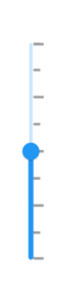

## Ticks offset

You can adjust the space between track and ticks of the slider using the [`tickOffset`](https://pub.dev/documentation/syncfusion_flutter_core/latest/theme/SfSliderThemeData/tickOffset.html) property in the [`SfSliderThemeData`](https://pub.dev/documentation/syncfusion_flutter_core/latest/theme/SfSliderThemeData-class.html). The default value of the [`tickOffset`](https://pub.dev/documentation/syncfusion_flutter_core/latest/theme/SfSliderThemeData/tickOffset.html) property is `null`.

### Horizontal




import 'package:flutter/material.dart';
import 'package:syncfusion_flutter_core/theme.dart';
import 'package:syncfusion_flutter_sliders/sliders.dart';

class TicksOffsetPage extends StatefulWidget {
  @override
  _TicksOffsetPageState createState() => _TicksOffsetPageState();
}

class _TicksOffsetPageState extends State<TicksOffsetPage> {
  double _value = 4.0;

  @override
  Widget build(BuildContext context) {
    return MaterialApp(
        home: Scaffold(
            body: Center(
                child: SfSliderTheme(
                  data: SfSliderThemeData(
                    tickOffset: Offset(0.0, 10.0),
                  ),
                  child: SfSlider(
                    min: 2.0,
                    max: 10.0,
                    interval: 2,
                    minorTicksPerInterval: 1,
                    showTicks: true,
                    value: _value,
                    onChanged: (double newValue){
                      setState(() {
                        _value = newValue;
                      });
                    },
                  ),
                )
            )
        )
    );
  }
}




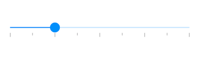

### Vertical




import 'package:flutter/material.dart';
import 'package:syncfusion_flutter_core/theme.dart';
import 'package:syncfusion_flutter_sliders/sliders.dart';

class VerticalTicksOffsetPage extends StatefulWidget {
  @override
  _VerticalTicksOffsetPageState createState() => _VerticalTicksOffsetPageState();
}

class _VerticalTicksOffsetPageState extends State<VerticalTicksOffsetPage> {
  double _value = 4.0;

  @override
  Widget build(BuildContext context) {
    return MaterialApp(
        home: Scaffold(
            body: Center(
                child: SfSliderTheme(
                  data: SfSliderThemeData(
                    tickOffset: Offset(0.0, 10.0),
                  ),
                  child: SfSlider.vertical(
                    min: 2.0,
                    max: 10.0,
                    interval: 2,
                    minorTicksPerInterval: 1,
                    showTicks: true,
                    value: _value,
                    onChanged: (double newValue){
                      setState(() {
                        _value = newValue;
                      });
                    },
                  ),
                )
            )
        )
    );
  }
}




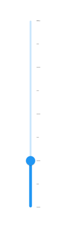