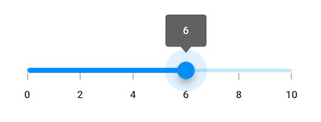
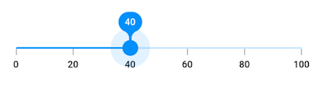
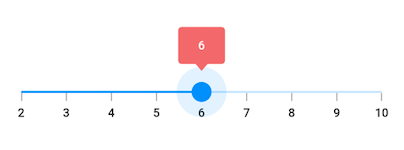
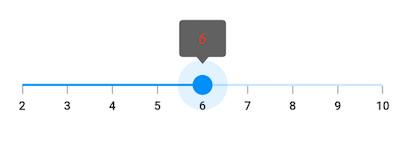

# Tooltip features in Flutter slider

This section helps to learn about how to add tooltip in the slider.

## Show tooltip

You can enable tooltip for the thumb. It is used to clearly indicate the current selection of the value during interaction. By default, tooltip text is formatted with either [`numberFormat`](https://pub.dev/documentation/syncfusion_flutter_sliders/latest/sliders/SfSlider/numberFormat.html) or [`dateFormat`](https://pub.dev/documentation/syncfusion_flutter_sliders/latest/sliders/SfSlider/dateFormat.html).




double _value = 6.0;

@override
Widget build(BuildContext context) {
  return MaterialApp(
      home: Scaffold(
          body: Center(
            child: SfSlider(
              min: 0.0,
              max: 10.0,
              interval: 2,
              showTicks: true,
              showLabels: true,
              showTooltip: true,
              value: _value,
              onChanged: (dynamic newValue) {
                setState(() {
                  _value = newValue;
                });
              },
            ),
          )
      )
  );
}




N>
* Refer the [`tooltipTextFormatterCallback`](https://pub.dev/documentation/syncfusion_flutter_sliders/latest/sliders/SfSlider/tooltipTextFormatterCallback.html) for changing the default tooltip text.
* Refer the [`SfSliderThemeData`](https://pub.dev/documentation/syncfusion_flutter_core/latest/theme/SfSliderThemeData-class.html) for customizing the appearance of the tooltip text.

## Tooltip shape

You can show tooltip in rectangular or paddle shape using the [`tooltipShape`](https://pub.dev/documentation/syncfusion_flutter_sliders/latest/sliders/SfSlider/tooltipShape.html) property. The default value of the [`tooltipShape`](https://pub.dev/documentation/syncfusion_flutter_sliders/latest/sliders/SfSlider/tooltipShape.html) property is `SfRectangularTooltipShape`.




double _value = 40.0;

@override
Widget build(BuildContext context) {
  return MaterialApp(
      home: Scaffold(
          body: Center(
            child: SfSlider(
              min: 0.0,
              max: 100.0,
              interval: 20,
              showTicks: true,
              showLabels: true,
              showTooltip: true,
              tooltipShape: SfPaddleTooltipShape(),
              value: _value,
              onChanged: (dynamic newValue) {
                setState(() {
                   _value = newValue;
                });
              },
            ),
          )
      )
  );
}




## Tooltip text format

By default it is formatted based on [`numberFormat`](https://pub.dev/documentation/syncfusion_flutter_sliders/latest/sliders/SfSlider/numberFormat.html) property and [`dateFormat`](https://pub.dev/documentation/syncfusion_flutter_sliders/latest/sliders/SfSlider/dateFormat.html) property based on whether it is date type [`SfSlider`](https://help.syncfusion.com/flutter/slider/getting-started#set-date-value) or numeric [`SfSlider`](https://help.syncfusion.com/flutter/slider/getting-started#set-numeric-value).

You can format or change the whole tooltip label text using the [`tooltipTextFormatterCallback`](https://pub.dev/documentation/syncfusion_flutter_sliders/latest/sliders/SfRangeSlider/tooltipTextFormatterCallback.html). Its arguments are,

* actualValue – either `DateTime` or `double` based on given [`value`](https://pub.dev/documentation/syncfusion_flutter_sliders/latest/sliders/SfSlider/value.html).
* formattedText – If the actual value is `double`, it is formatted by [`numberFormat`](https://pub.dev/documentation/syncfusion_flutter_sliders/latest/sliders/SfSlider/numberFormat.html) and if the actual value is `DateTime`, it is formatted by [`dateFormat`](https://pub.dev/documentation/syncfusion_flutter_sliders/latest/sliders/SfSlider/dateFormat.html).




DateTime _value = DateTime(2010, 01, 01, 15, 00, 00);

@override
Widget build(BuildContext context) {
  return MaterialApp(
      home: Scaffold(
          body: Center(
            child: SfSlider(
              min: DateTime(2010, 01, 01, 9, 00, 00),
              max: DateTime(2010, 01, 01, 21, 05, 00),
              value: _value,
              interval: 3,
              showTicks: true,
              showLabels: true,
              showTooltip: true,
              dateFormat: DateFormat('h:mm'),
              dateIntervalType: DateIntervalType.hours,
              tooltipTextFormatterCallback: (dynamic actualValue, String formattedText) {
                return DateFormat('h:mm a').format(actualValue);
              },
              onChanged: (dynamic newValue) {
                setState(() {
                  _value = newValue;
                });
              },
            ),
          )
      )
  );
}




## Tooltip color

You can change the background color of the tooltip in the slider using the [`tooltipBackgroundColor`](https://pub.dev/documentation/syncfusion_flutter_core/latest/theme/SfSliderThemeData/tooltipBackgroundColor.html) property.

N> You must import the `theme.dart` library from the [`Core`](https://pub.dev/packages/syncfusion_flutter_core) package to use [`SfSliderTheme`](https://pub.dev/documentation/syncfusion_flutter_core/latest/theme/SfSliderTheme-class.html).




double _value = 6.0;

@override
Widget build(BuildContext context) {
  return MaterialApp(
      home: Scaffold(
          body: Center(
              child: SfSliderTheme(
                data: SfSliderThemeData(
                  tooltipBackgroundColor: Colors.red[300],
                ),
                child: SfSlider(
                  min: 2.0,
                  max: 10.0,
                  interval: 1,
                  showTicks: true,
                  showLabels: true,
                  showTooltip: true,
                  value: _value,
                  onChanged: (dynamic newValue){
                    setState(() {
                      _value = newValue;
                    });
                  },
                ),
              )
          )
      )
  );
}




## Tooltip label style

You can change the appearance of the tooltip text in the slider using the [`tooltipTextStyle`](https://pub.dev/documentation/syncfusion_flutter_core/latest/theme/SfSliderThemeData/tooltipTextStyle.html) property.

N> You must import the `theme.dart` library from the [`Core`](https://pub.dev/packages/syncfusion_flutter_core) package to use [`SfSliderTheme`](https://pub.dev/documentation/syncfusion_flutter_core/latest/theme/SfSliderTheme-class.html).




double _value = 6.0;

@override
Widget build(BuildContext context) {
  return MaterialApp(
      home: Scaffold(
          body: Center(
              child: SfSliderTheme(
                data: SfSliderThemeData(
                  tooltipTextStyle: TextStyle(color: Colors.red, fontSize: 16, fontStyle: FontStyle.italic),
                ),
                child: SfSlider(
                  min: 2.0,
                  max: 10.0,
                  interval: 1,
                  showTicks: true,
                  showLabels: true,
                  showTooltip: true,
                  value: _value,
                  onChanged: (dynamic newValue){
                    setState(() {
                      _value = newValue;
                    });
                  },
                ),
              )
          )
      )
  );
}




