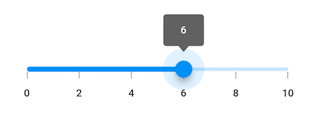
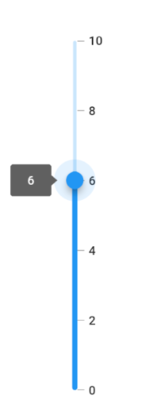
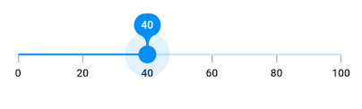
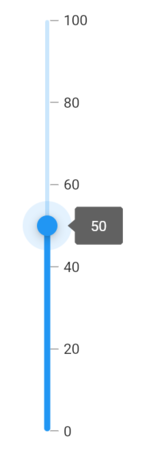
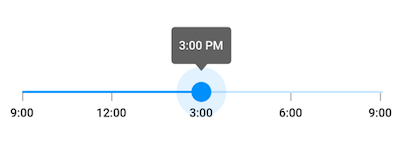
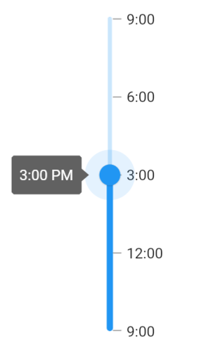
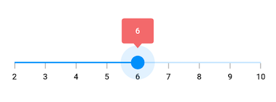
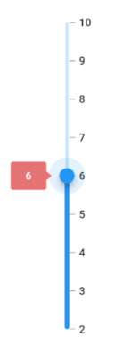
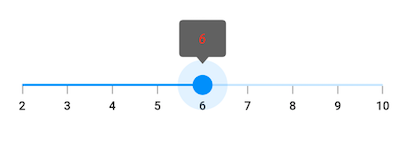
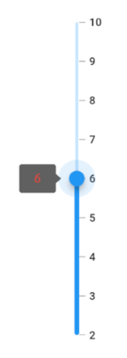

# Flutter Slider Tooltip (SfSlider)

This section explains how to add a tooltip in the slider.

## Enable tooltip

You can enable a tooltip for the thumb using the [`enableTooltip`](https://pub.dev/documentation/syncfusion_flutter_sliders/latest/sliders/SfSlider/enableTooltip.html) property. It is used to clearly indicate the current selection of the value during interaction. By default, tooltip text is formatted with either [`numberFormat`](https://pub.dev/documentation/syncfusion_flutter_sliders/latest/sliders/SfSlider/numberFormat.html) or [`dateFormat`](https://pub.dev/documentation/syncfusion_flutter_sliders/latest/sliders/SfSlider/dateFormat.html).

I> By setting the value of [`shouldAlwaysShowTooltip`](https://pub.dev/documentation/syncfusion_flutter_sliders/latest/sliders/SfSlider/shouldAlwaysShowTooltip.html) to true, you can always show a tooltip without having to interact with the slider thumb. The default value is `false` and it works independent of the [`enableTooltip`](https://pub.dev/documentation/syncfusion_flutter_sliders/latest/sliders/SfSlider/enableTooltip.html) behavior.

### Horizontal




import 'package:flutter/material.dart';
import 'package:syncfusion_flutter_sliders/sliders.dart';

class EnableTooltipPage extends StatefulWidget {
  @override
  _EnableTooltipPageState createState() => _EnableTooltipPageState();
}

class _EnableTooltipPageState extends State<EnableTooltipPage> {
  double _value = 6.0;

  @override
  Widget build(BuildContext context) {
    return MaterialApp(
        home: Scaffold(
            body: Center(
              child: SfSlider(
                min: 0.0,
                max: 10.0,
                interval: 2,
                showTicks: true,
                showLabels: true,
                enableTooltip: true,
                value: _value,
                onChanged: (double newValue) {
                  setState(() {
                    _value = newValue;
                  });
                },
              ),
            )
        )
    );
  }
}




### Vertical




import 'package:flutter/material.dart';
import 'package:syncfusion_flutter_sliders/sliders.dart';

class VerticalEnableTooltipPage extends StatefulWidget {
  @override
  _VerticalEnableTooltipPageState createState() => _VerticalEnableTooltipPageState();
}

class _VerticalEnableTooltipPageState extends State<VerticalEnableTooltipPage> {
  double _value = 6.0;

  @override
  Widget build(BuildContext context) {
    return MaterialApp(
        home: Scaffold(
            body: Center(
              child: SfSlider.vertical(
                min: 0.0,
                max: 10.0,
                interval: 2,
                showTicks: true,
                showLabels: true,
                enableTooltip: true,
                value: _value,
                onChanged: (double newValue) {
                  setState(() {
                    _value = newValue;
                  });
                },
              ),
            )
        )
    );
  }
}




N>
* Refer the [`tooltipTextFormatterCallback`](https://pub.dev/documentation/syncfusion_flutter_sliders/latest/sliders/SfSlider/tooltipTextFormatterCallback.html) for changing the default tooltip text.
* Refer the [`SfSliderThemeData`](https://pub.dev/documentation/syncfusion_flutter_core/latest/theme/SfSliderThemeData-class.html) for customizing the appearance of the tooltip text.

## Tooltip shape

You can show tooltip in rectangular or paddle shape using the [`tooltipShape`](https://pub.dev/documentation/syncfusion_flutter_sliders/latest/sliders/SfSlider/tooltipShape.html) property. The default value of the [`tooltipShape`](https://pub.dev/documentation/syncfusion_flutter_sliders/latest/sliders/SfSlider/tooltipShape.html) property is [`SfRectangularTooltipShape`](https://pub.dev/documentation/syncfusion_flutter_sliders/latest/sliders/SfRectangularTooltipShape-class.html).

N> The paddle tooltip shape is not applicable for vertical orientation of the sliders.




import 'package:flutter/material.dart';
import 'package:syncfusion_flutter_sliders/sliders.dart';

class TooltipShapePage extends StatefulWidget {
  @override
  _TooltipShapePageState createState() => _TooltipShapePageState();
}

class _TooltipShapePageState extends State<TooltipShapePage> {
  double _value = 40.0;

  @override
  Widget build(BuildContext context) {
    return MaterialApp(
        home: Scaffold(
            body: Center(
              child: SfSlider(
                min: 0.0,
                max: 100.0,
                interval: 20,
                showTicks: true,
                showLabels: true,
                enableTooltip: true,
                tooltipShape: SfPaddleTooltipShape(),
                value: _value,
                onChanged: (double newValue) {
                  setState(() {
                     _value = newValue;
                  });
                },
              ),
            )
        )
    );
  }
}




## Tooltip position

N> This is only applicable for vertical orientation of the sliders.

You can show tooltip in left or right positions using the [`tooltipPosition`](https://pub.dev/documentation/syncfusion_flutter_sliders/latest/sliders/SliderTooltipPosition.html) property. The default value of the [`tooltipPosition`](https://pub.dev/documentation/syncfusion_flutter_sliders/latest/sliders/SliderTooltipPosition.html) property is `SliderTooltipPosition.left`.




import 'package:flutter/material.dart';
import 'package:syncfusion_flutter_sliders/sliders.dart';

class TooltipPositionPage extends StatefulWidget {
  @override
  _TooltipPositionPageState createState() => _TooltipPositionPageState();
}

class _TooltipPositionPageState extends State<TooltipPositionPage> {
  double _value = 40.0;

  @override
  Widget build(BuildContext context) {
    return MaterialApp(
        home: Scaffold(
            body: Center(
              child: SfSlider.vertical(
                min: 0.0,
                max: 100.0,
                interval: 20,
                showTicks: true,
                showLabels: true,
                tooltipPosition: SliderTooltipPosition.right,
                enableTooltip: true,
                value: _value,
                onChanged: (double newValue) {
                  setState(() {
                     _value = newValue;
                  });
                },
              ),
            )
        )
    );
  }
}




## Tooltip text format

By default it is formatted based on [`numberFormat`](https://pub.dev/documentation/syncfusion_flutter_sliders/latest/sliders/SfSlider/numberFormat.html) property and [`dateFormat`](https://pub.dev/documentation/syncfusion_flutter_sliders/latest/sliders/SfSlider/dateFormat.html) property based on whether it is date type [`SfSlider`](https://help.syncfusion.com/flutter/slider/getting-started#set-date-value) or numeric [`SfSlider`](https://help.syncfusion.com/flutter/slider/getting-started#set-numeric-value).

You can format or change the whole tooltip label text using the [`tooltipTextFormatterCallback`](https://pub.dev/documentation/syncfusion_flutter_sliders/latest/sliders/SfSlider/tooltipTextFormatterCallback.html). Its arguments are,

* actualValue – either `DateTime` or `double` based on given [`value`](https://pub.dev/documentation/syncfusion_flutter_sliders/latest/sliders/SfSlider/value.html).
* formattedText – If the actual value is `double`, it is formatted by [`numberFormat`](https://pub.dev/documentation/syncfusion_flutter_sliders/latest/sliders/SfSlider/numberFormat.html) and if the actual value is `DateTime`, it is formatted by [`dateFormat`](https://pub.dev/documentation/syncfusion_flutter_sliders/latest/sliders/SfSlider/dateFormat.html).

### Horizontal




import 'package:flutter/material.dart';
import 'package:intl/intl.dart';
import 'package:syncfusion_flutter_sliders/sliders.dart';

class TooltipTextFormatPage extends StatefulWidget {
  @override
  _TooltipTextFormatPageState createState() => _TooltipTextFormatPageState();
}

class _TooltipTextFormatPageState extends State<TooltipTextFormatPage> {
  DateTime _value = DateTime(2010, 01, 01, 15, 00, 00);

  @override
  Widget build(BuildContext context) {
    return MaterialApp(
        home: Scaffold(
            body: Center(
              child: SfSlider(
                min: DateTime(2010, 01, 01, 9, 00, 00),
                max: DateTime(2010, 01, 01, 21, 05, 00),
                value: _value,
                interval: 3,
                showTicks: true,
                showLabels: true,
                enableTooltip: true,
                dateFormat: DateFormat('h:mm'),
                dateIntervalType: DateIntervalType.hours,
                tooltipTextFormatterCallback: (dynamic actualValue, String formattedText) {
                  return DateFormat('h:mm a').format(actualValue);
                },
                onChanged: (DateTime newValue) {
                  setState(() {
                    _value = newValue;
                  });
                },
              ),
            )
        )
    );
  }
}




### Vertical




import 'package:flutter/material.dart';
import 'package:intl/intl.dart';
import 'package:syncfusion_flutter_sliders/sliders.dart';

class VerticalTooltipTextFormatPage extends StatefulWidget {
  @override
  _VerticalTooltipTextFormatPageState createState() => _VerticalTooltipTextFormatPageState();
}

class _VerticalTooltipTextFormatPageState extends State<VerticalTooltipTextFormatPage> {
  DateTime _value = DateTime(2010, 01, 01, 15, 00, 00);

  @override
  Widget build(BuildContext context) {
    return MaterialApp(
        home: Scaffold(
            body: Center(
              child: SfSlider.vertical(
                min: DateTime(2010, 01, 01, 9, 00, 00),
                max: DateTime(2010, 01, 01, 21, 05, 00),
                value: _value,
                interval: 3,
                showTicks: true,
                showLabels: true,
                enableTooltip: true,
                dateFormat: DateFormat('h:mm'),
                dateIntervalType: DateIntervalType.hours,
                tooltipTextFormatterCallback: (dynamic actualValue, String formattedText) {
                  return DateFormat('h:mm a').format(actualValue);
                },
                onChanged: (DateTime newValue) {
                  setState(() {
                    _value = newValue;
                  });
                },
              ),
            )
        )
    );
  }
}




## Tooltip color

You can change the background color of the tooltip in the slider using the [`tooltipBackgroundColor`](https://pub.dev/documentation/syncfusion_flutter_core/latest/theme/SfSliderThemeData/tooltipBackgroundColor.html) property.

### Horizontal




import 'package:flutter/material.dart';
import 'package:syncfusion_flutter_core/theme.dart';
import 'package:syncfusion_flutter_sliders/sliders.dart';

class TooltipColorPage extends StatefulWidget {
  @override
  _TooltipColorPageState createState() => _TooltipColorPageState();
}

class _TooltipColorPageState extends State<TooltipColorPage> {
  double _value = 6.0;

  @override
  Widget build(BuildContext context) {
    return MaterialApp(
        home: Scaffold(
            body: Center(
                child: SfSliderTheme(
                  data: SfSliderThemeData(
                    tooltipBackgroundColor: Colors.red[300],
                  ),
                  child: SfSlider(
                    min: 2.0,
                    max: 10.0,
                    interval: 1,
                    showTicks: true,
                    showLabels: true,
                    enableTooltip: true,
                    value: _value,
                    onChanged: (double newValue){
                      setState(() {
                        _value = newValue;
                      });
                    },
                  ),
                )
            )
        )
    );
  }
}




### Vertical




import 'package:flutter/material.dart';
import 'package:syncfusion_flutter_core/theme.dart';
import 'package:syncfusion_flutter_sliders/sliders.dart';

class VerticalTooltipColorPage extends StatefulWidget {
  @override
  _VerticalTooltipColorPageState createState() => _VerticalTooltipColorPageState();
}

class _VerticalTooltipColorPageState extends State<VerticalTooltipColorPage> {
  double _value = 6.0;

  @override
  Widget build(BuildContext context) {
    return MaterialApp(
        home: Scaffold(
            body: Center(
                child: SfSliderTheme(
                  data: SfSliderThemeData(
                    tooltipBackgroundColor: Colors.red[300],
                  ),
                  child: SfSlider.vertical(
                    min: 2.0,
                    max: 10.0,
                    interval: 1,
                    showTicks: true,
                    showLabels: true,
                    enableTooltip: true,
                    value: _value,
                    onChanged: (double newValue){
                      setState(() {
                        _value = newValue;
                      });
                    },
                  ),
                )
            )
        )
    );
  }
}




## Tooltip label style

You can change the appearance of the tooltip text in the slider using the [`tooltipTextStyle`](https://pub.dev/documentation/syncfusion_flutter_core/latest/theme/SfSliderThemeData/tooltipTextStyle.html) property.

### Horizontal




import 'package:flutter/material.dart';
import 'package:syncfusion_flutter_core/theme.dart';
import 'package:syncfusion_flutter_sliders/sliders.dart';

class TooltipLabelStylePage extends StatefulWidget {
  @override
  _TooltipLabelStylePageState createState() => _TooltipLabelStylePageState();
}

class _TooltipLabelStylePageState extends State<TooltipLabelStylePage> {
  double _value = 6.0;

  @override
  Widget build(BuildContext context) {
    return MaterialApp(
        home: Scaffold(
            body: Center(
                child: SfSliderTheme(
                  data: SfSliderThemeData(
                    tooltipTextStyle: TextStyle(color: Colors.red, fontSize: 16, fontStyle: FontStyle.italic),
                  ),
                  child: SfSlider(
                    min: 2.0,
                    max: 10.0,
                    interval: 1,
                    showTicks: true,
                    showLabels: true,
                    enableTooltip: true,
                    value: _value,
                    onChanged: (double newValue){
                      setState(() {
                        _value = newValue;
                      });
                    },
                  ),
                )
            )
        )
    );
  }
}




### Vertical




import 'package:flutter/material.dart';
import 'package:syncfusion_flutter_core/theme.dart';
import 'package:syncfusion_flutter_sliders/sliders.dart';

class VerticalTooltipLabelStylePage extends StatefulWidget {
  @override
  _VerticalTooltipLabelStylePageState createState() => _VerticalTooltipLabelStylePageState();
}

class _VerticalTooltipLabelStylePageState extends State<VerticalTooltipLabelStylePage> {
  double _value = 6.0;

  @override
  Widget build(BuildContext context) {
    return MaterialApp(
        home: Scaffold(
            body: Center(
                child: SfSliderTheme(
                  data: SfSliderThemeData(
                    tooltipTextStyle: TextStyle(color: Colors.red, fontSize: 16, fontStyle: FontStyle.italic),
                  ),
                  child: SfSlider.vertical(
                    min: 2.0,
                    max: 10.0,
                    interval: 1,
                    showTicks: true,
                    showLabels: true,
                    enableTooltip: true,
                    value: _value,
                    onChanged: (double newValue){
                      setState(() {
                        _value = newValue;
                      });
                    },
                  ),
                )
            )
        )
    );
  }
}




