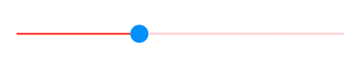
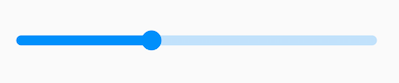

# Track features in Flutter slider

This section helps to learn about how to customize the track in the slider.

## Track color

You can change the active and inactive track color of the slider using the [`activeTrackColor`](https://pub.dev/documentation/syncfusion_flutter_core/latest/theme/SfSliderThemeData/activeTrackColor.html) and [`inactiveTrackColor`](https://pub.dev/documentation/syncfusion_flutter_core/latest/theme/SfSliderThemeData/inactiveTrackColor.html) properties respectively.

The active side of the slider is between the [`min`](https://pub.dev/documentation/syncfusion_flutter_sliders/latest/sliders/SfSlider/min.html) value and the thumb.

The inactive side of the slider is between the thumb and the [`max`](https://pub.dev/documentation/syncfusion_flutter_sliders/latest/sliders/SfSlider/max.html) value.

N> You must import the `theme.dart` library from the [`Core`](https://pub.dev/packages/syncfusion_flutter_core) package to use [`SfSliderTheme`](https://pub.dev/documentation/syncfusion_flutter_core/latest/theme/SfSliderTheme-class.html).




double _value = 5.0;

@override
Widget build(BuildContext context) {
  return MaterialApp(
      home: Scaffold(
          body: Center(
              child: SfSliderTheme(
                data: SfSliderThemeData(
                  activeTrackColor: Colors.red,
                  inactiveTrackColor: Colors.red[100],
                ),
                child:  SfSlider(
                  min: 2.0,
                  max: 10.0,
                  value: _value,
                  onChanged: (dynamic newValue){
                    setState(() {
                      _value = newValue;
                    });
                  },
                ),
              )
          )
      )
  );
}




## Track height

You can change the track height of the slider using the [`activeTrackHeight`](https://pub.dev/documentation/syncfusion_flutter_core/latest/theme/SfSliderThemeData/activeTrackHeight.html) and [`inactiveTrackHeight`](https://pub.dev/documentation/syncfusion_flutter_core/latest/theme/SfSliderThemeData/inactiveTrackHeight.html) properties. The default value of the [`activeTrackHeight`](https://pub.dev/documentation/syncfusion_flutter_core/latest/theme/SfSliderThemeData/activeTrackHeight.html) and the [`inactiveTrackHeight`](https://pub.dev/documentation/syncfusion_flutter_core/latest/theme/SfSliderThemeData/inactiveTrackHeight.html) properties are `6.0` and `4.0`.

N> You must import the `theme.dart` library from the [`Core`](https://pub.dev/packages/syncfusion_flutter_core) package to use [`SfSliderTheme`](https://pub.dev/documentation/syncfusion_flutter_core/latest/theme/SfSliderTheme-class.html).




double _value = 5.0;

@override
Widget build(BuildContext context) {
  return MaterialApp(
      home: Scaffold(
          body: Center(
              child: SfSliderTheme(
                data: SfSliderThemeData(
                  activeTrackHeight: 8,
                  inactiveTrackHeight: 8,
                ),
                child: SfSlider(
                  min: 2.0,
                  max: 10.0,
                  value: _value,
                  onChanged: (dynamic newValue){
                    setState(() {
                      _value = newValue;
                    });
                  },
                ),
              )
          )
      )
  );
}




## Track corner radius

You can change the corner of the track to be round in the slider using the [`trackCornerRadius`](https://pub.dev/documentation/syncfusion_flutter_core/latest/theme/SfSliderThemeData/trackCornerRadius.html) property. The default value of the [`trackCornerRadius`](https://pub.dev/documentation/syncfusion_flutter_core/latest/theme/SfSliderThemeData/trackCornerRadius.html) property is `1.0`.

N> You must import the `theme.dart` library from the [`Core`](https://pub.dev/packages/syncfusion_flutter_core) package to use [`SfSliderTheme`](https://pub.dev/documentation/syncfusion_flutter_core/latest/theme/SfSliderTheme-class.html).




double _value = 5.0;

@override
Widget build(BuildContext context) {
  return MaterialApp(
      home: Scaffold(
          body: Center(
              child: SfSliderTheme(
                data: SfSliderThemeData(
                  activeTrackHeight: 10,
                  inactiveTrackHeight: 10,
                  trackCornerRadius: 5,
                ),
                child: SfSlider(
                  min: 2.0,
                  max: 10.0,
                  value: _value,
                  onChanged: (dynamic newValue){
                    setState(() {
                      _value = newValue;
                    });
                  },
                ),
              )
          )
      )
  );
}




