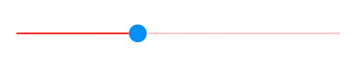
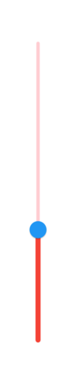
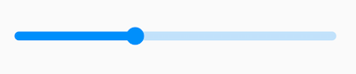
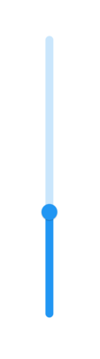

# Track in Flutter Slider (SfSlider)

This section explains how to customize the track in the slider.

N> You must import the `theme.dart` library from the [`Core`](https://pub.dev/packages/syncfusion_flutter_core) package to use [`SfSliderTheme`](https://pub.dev/documentation/syncfusion_flutter_core/latest/theme/SfSliderTheme-class.html) in all the examples shown below.

## Track color

You can change the active and inactive track color of the slider using the [`activeTrackColor`](https://pub.dev/documentation/syncfusion_flutter_core/latest/theme/SfSliderThemeData/activeTrackColor.html) and [`inactiveTrackColor`](https://pub.dev/documentation/syncfusion_flutter_core/latest/theme/SfSliderThemeData/inactiveTrackColor.html) properties respectively.

The active side of the slider is between the [`min`](https://pub.dev/documentation/syncfusion_flutter_sliders/latest/sliders/SfSlider/min.html) value and the thumb.

The inactive side of the slider is between the thumb and the [`max`](https://pub.dev/documentation/syncfusion_flutter_sliders/latest/sliders/SfSlider/max.html) value.

### Horizontal




import 'package:flutter/material.dart';
import 'package:syncfusion_flutter_core/theme.dart';
import 'package:syncfusion_flutter_sliders/sliders.dart';

class TrackColorPage extends StatefulWidget {
  @override
  _TrackColorPageState createState() => _TrackColorPageState();
}

class _TrackColorPageState extends State<TrackColorPage> {
  double _value = 5.0;

  @override
  Widget build(BuildContext context) {
    return MaterialApp(
        home: Scaffold(
            body: Center(
                child: SfSliderTheme(
                  data: SfSliderThemeData(
                    activeTrackColor: Colors.red,
                    inactiveTrackColor: Colors.red[100],
                  ),
                  child:  SfSlider(
                    min: 2.0,
                    max: 10.0,
                    value: _value,
                    onChanged: (double newValue){
                      setState(() {
                        _value = newValue;
                      });
                    },
                  ),
                )
            )
        )
    );
  }
}




### Vertical




import 'package:flutter/material.dart';
import 'package:syncfusion_flutter_core/theme.dart';
import 'package:syncfusion_flutter_sliders/sliders.dart';

class VerticalTrackColorPage extends StatefulWidget {
  @override
  _VerticalTrackColorPageState createState() => _VerticalTrackColorPageState();
}

class _VerticalTrackColorPageState extends State<VerticalTrackColorPage> {
  double _value = 5.0;

  @override
  Widget build(BuildContext context) {
    return MaterialApp(
        home: Scaffold(
            body: Center(
                child: SfSliderTheme(
                  data: SfSliderThemeData(
                    activeTrackColor: Colors.red,
                    inactiveTrackColor: Colors.red[100],
                  ),
                  child:  SfSlider.vertical(
                    min: 2.0,
                    max: 10.0,
                    value: _value,
                    onChanged: (double newValue){
                      setState(() {
                        _value = newValue;
                      });
                    },
                  ),
                )
            )
        )
    );
  }
}




## Track height

You can change the track height of the slider using the [`activeTrackHeight`](https://pub.dev/documentation/syncfusion_flutter_core/latest/theme/SfSliderThemeData/activeTrackHeight.html) and [`inactiveTrackHeight`](https://pub.dev/documentation/syncfusion_flutter_core/latest/theme/SfSliderThemeData/inactiveTrackHeight.html) properties. The default value of the [`activeTrackHeight`](https://pub.dev/documentation/syncfusion_flutter_core/latest/theme/SfSliderThemeData/activeTrackHeight.html) and the [`inactiveTrackHeight`](https://pub.dev/documentation/syncfusion_flutter_core/latest/theme/SfSliderThemeData/inactiveTrackHeight.html) properties are `6.0` and `4.0`.

### Horizontal




import 'package:flutter/material.dart';
import 'package:syncfusion_flutter_core/theme.dart';
import 'package:syncfusion_flutter_sliders/sliders.dart';

class TrackHeightPage extends StatefulWidget {
  @override
  _TrackHeightPageState createState() => _TrackHeightPageState();
}

class _TrackHeightPageState extends State<TrackHeightPage> {
  double _value = 5.0;

  @override
  Widget build(BuildContext context) {
    return MaterialApp(
        home: Scaffold(
            body: Center(
                child: SfSliderTheme(
                  data: SfSliderThemeData(
                    activeTrackHeight: 8,
                    inactiveTrackHeight: 8,
                  ),
                  child: SfSlider(
                    min: 2.0,
                    max: 10.0,
                    value: _value,
                    onChanged: (double newValue){
                      setState(() {
                        _value = newValue;
                      });
                    },
                  ),
                )
            )
        )
    );
  }
}




### Vertical




import 'package:flutter/material.dart';
import 'package:syncfusion_flutter_core/theme.dart';
import 'package:syncfusion_flutter_sliders/sliders.dart';

class VerticalTrackHeightPage extends StatefulWidget {
  @override
  _VerticalTrackHeightPageState createState() => _VerticalTrackHeightPageState();
}

class _VerticalTrackHeightPageState extends State<VerticalTrackHeightPage> {
  double _value = 5.0;

  @override
  Widget build(BuildContext context) {
    return MaterialApp(
        home: Scaffold(
            body: Center(
                child: SfSliderTheme(
                  data: SfSliderThemeData(
                    activeTrackHeight: 8,
                    inactiveTrackHeight: 8,
                  ),
                  child: SfSlider.vertical(
                    min: 2.0,
                    max: 10.0,
                    value: _value,
                    onChanged: (double newValue){
                      setState(() {
                        _value = newValue;
                      });
                    },
                  ),
                )
            )
        )
    );
  }
}




## Track corner radius

You can change the corner of the track to be round in the slider using the [`trackCornerRadius`](https://pub.dev/documentation/syncfusion_flutter_core/latest/theme/SfSliderThemeData/trackCornerRadius.html) property. The default value of the [`trackCornerRadius`](https://pub.dev/documentation/syncfusion_flutter_core/latest/theme/SfSliderThemeData/trackCornerRadius.html) property is `1.0`.

### Horizontal




import 'package:flutter/material.dart';
import 'package:syncfusion_flutter_core/theme.dart';
import 'package:syncfusion_flutter_sliders/sliders.dart';

class TrackCornerRadiusPage extends StatefulWidget {
  @override
  _TrackCornerRadiusPageState createState() => _TrackCornerRadiusPageState();
}

class _TrackCornerRadiusPageState extends State<TrackCornerRadiusPage> {
  double _value = 5.0;

  @override
  Widget build(BuildContext context) {
    return MaterialApp(
        home: Scaffold(
            body: Center(
                child: SfSliderTheme(
                  data: SfSliderThemeData(
                    // Track height is increased so that the rounded corners are clearly visible.
                    activeTrackHeight: 10,
                    inactiveTrackHeight: 10,
                    trackCornerRadius: 5,
                  ),
                  child: SfSlider(
                    min: 2.0,
                    max: 10.0,
                    value: _value,
                    onChanged: (double newValue){
                      setState(() {
                        _value = newValue;
                      });
                    },
                  ),
                )
            )
        )
    );
  }
}




### Vertical




import 'package:flutter/material.dart';
import 'package:syncfusion_flutter_core/theme.dart';
import 'package:syncfusion_flutter_sliders/sliders.dart';

class VerticalTrackCornerRadiusPage extends StatefulWidget {
  @override
  _VerticalTrackCornerRadiusPageState createState() => _VerticalTrackCornerRadiusPageState();
}

class _VerticalTrackCornerRadiusPageState extends State<VerticalTrackCornerRadiusPage> {
  double _value = 5.0;

  @override
  Widget build(BuildContext context) {
    return MaterialApp(
        home: Scaffold(
            body: Center(
                child: SfSliderTheme(
                  data: SfSliderThemeData(
                    // Track height is increased so that the rounded corners are clearly visible.
                    activeTrackHeight: 10,
                    inactiveTrackHeight: 10,
                    trackCornerRadius: 5,
                  ),
                  child: SfSlider.vertical(
                    min: 2.0,
                    max: 10.0,
                    value: _value,
                    onChanged: (double newValue){
                      setState(() {
                        _value = newValue;
                      });
                    },
                  ),
                )
            )
        )
    );
  }
}




