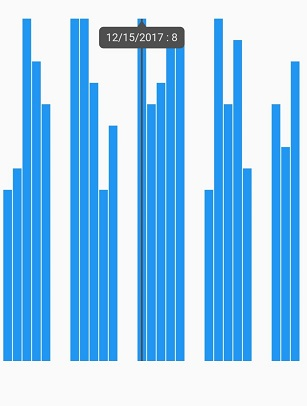
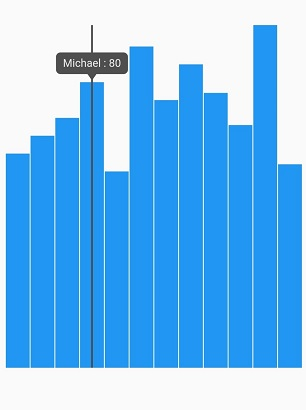
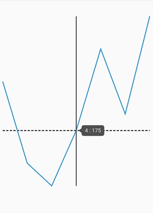

# Axis types in Flutter Spark Charts

Charts typically have two axes that are used to measure and categorize data: a vertical (Y) axis, and a horizontal (X) axis.

Vertical(Y) axis always uses numerical scale. Horizontal(X) axis supports the following types of scale:

* Category
* Numeric
* Date-time

## Numeric axis

To use the numeric values or to bind the custom data source use the [`SfSparkBarChart.custom()`](https://pub.dev/documentation/syncfusion_flutter_charts/latest/sparkcharts/SfSparkBarChart/SfSparkBarChart.custom.html) method and map the x, y values to [`xValueMapper`](https://pub.dev/documentation/syncfusion_flutter_charts/latest/sparkcharts/SparkChartIndexedValueMapper.html) and [`yValueMapper`](https://pub.dev/documentation/syncfusion_flutter_charts/latest/sparkcharts/SparkChartIndexedValueMapper.html) respectively. Here you have to specify the length of the data using [`dataCount`](https://pub.dev/documentation/syncfusion_flutter_charts/latest/sparkcharts/SfSparkLineChart/SfSparkLineChart.custom.html) property.

 

    @override
    Widget build(BuildContext context) {
      return Scaffold(
        body: Padding(
          padding: EdgeInsets.all(5),
          child: SfSparkBarChart.custom(
            axisLineWidth: 0,
            dataCount: 7,
            xValueMapper: (index) => data[index].year,
            yValueMapper: (index) => data[index].sales,  
          )
        ),
      );
    }
  
    final List<SalesData> data = [
      SalesData(1, 190),
      SalesData(2, 165),
      SalesData(3, 158),
      SalesData(4, 175),
      SalesData(5, 200),
      SalesData(6, 180),
      SalesData(7, 210),
    ];
 
    class SalesData {
      SalesData(this.year, this.sales);
      final double year;
      final double sales;
    }



## Date-time axis

To use the date-time values i.e to bind the custom data source use the [`SfSparkBarChart.custom()`](https://pub.dev/documentation/syncfusion_flutter_charts/latest/sparkcharts/SfSparkBarChart/SfSparkBarChart.custom.html) method and map the x, y values to [`xValueMapper`](https://pub.dev/documentation/syncfusion_flutter_charts/latest/sparkcharts/SparkChartIndexedValueMapper.html) and [`yValueMapper`](https://pub.dev/documentation/syncfusion_flutter_charts/latest/sparkcharts/SparkChartIndexedValueMapper.html) respectively. Here you have to specify the length of the data using [`dataCount`](https://pub.dev/documentation/syncfusion_flutter_charts/latest/sparkcharts/SfSparkBarChart/SfSparkBarChart.custom.html) property.

 

    @override
    Widget build(BuildContext context) {
      return Scaffold(
        body: Padding(
          padding: EdgeInsets.all(5),
          child: SfSparkBarChart.custom(
            axisLineWidth: 0,
            dataCount: 23,
            xValueMapper: (index) => data[index].year,
            yValueMapper: (index) => data[index].sales, 
          )
        ),
      );
    }

    final List<SalesData> data = [
      SalesData(DateTime(2018, 0, 1), 4),
      SalesData(DateTime(2018, 0, 2), 4.5),
      SalesData(DateTime(2018, 0, 3), 8),
      SalesData(DateTime(2018, 0, 4), 7),
      SalesData(DateTime(2018, 0, 5), 6),
      SalesData(DateTime(2018, 0, 8), 8),
      SalesData(DateTime(2018, 0, 9), 8),
      SalesData(DateTime(2018, 0, 10), 6.5),
      SalesData(DateTime(2018, 0, 11), 4),
      SalesData(DateTime(2018, 0, 12), 5.5),
      SalesData(DateTime(2018, 0, 15), 8),
      SalesData(DateTime(2018, 0, 16), 6),
      SalesData(DateTime(2018, 0, 17), 6.5),
      SalesData(DateTime(2018, 0, 18), 7.5),
      SalesData(DateTime(2018, 0, 19), 7.5),
      SalesData(DateTime(2018, 0, 22), 4),
      SalesData(DateTime(2018, 0, 23), 8),
      SalesData(DateTime(2018, 0, 24), 6),
      SalesData(DateTime(2018, 0, 25), 7.5),
      SalesData(DateTime(2018, 0, 26), 4.5),
      SalesData(DateTime(2018, 0, 29), 6),
      SalesData(DateTime(2018, 0, 30), 5),
      SalesData(DateTime(2018, 0, 31), 7),
    ];
 
    class SalesData {
      SalesData(this.year, this.sales);
      final DateTime year;
      final double sales;
    }



## Category Axis

To use the category values i.e to bind the custom data source use the [`SfSparkBarChart.custom()`](https://pub.dev/documentation/syncfusion_flutter_charts/latest/sparkcharts/SfSparkBarChart/SfSparkBarChart.custom.html) method and map the x, y values to [`xValueMapper`](https://pub.dev/documentation/syncfusion_flutter_charts/latest/sparkcharts/SparkChartIndexedValueMapper.html) and [`yValueMapper`](https://pub.dev/documentation/syncfusion_flutter_charts/latest/sparkcharts/SparkChartIndexedValueMapper.html) respectively. Here you have to specify the length of the data using [`dataCount`](https://pub.dev/documentation/syncfusion_flutter_charts/latest/sparkcharts/SfSparkBarChart/SfSparkBarChart.custom.html) property.

 

    @override
    Widget build(BuildContext context) {
      return Scaffold(
        body: Padding(
          padding: EdgeInsets.all(5),
          child: SfSparkLineChart.custom(
            axisLineWidth: 0,
            dataCount: 12,
            xValueMapper: (index) => data[index].year,
            yValueMapper: (index) => data[index].sales,
          )
        ),
      );
    }
    final List<SalesData> data = [
      SalesData('Robert', 60),
      SalesData('Andrew', 65),
      SalesData('Suyama', 70),
      SalesData('Michael', 80),
      SalesData('Janet', 55),
      SalesData('Davolio', 90),
      SalesData('Fuller', 75),
      SalesData('Nancy', 85),
      SalesData('Margaret', 77),
      SalesData('Steven', 68),
      SalesData('Laura', 96),
      SalesData('Elizabeth', 57)
    ];  
 
    class SalesData {
      SalesData(this.year, this.sales);
      final String year;
      final double sales;
    }



### Axis line customization

Axis line of the spark charts can be customized using the following properties.

* [`axisCrossesAt`](https://pub.dev/documentation/syncfusion_flutter_charts/latest/sparkcharts/SfSparkLineChart/axisCrossesAt.html) - Specifies the horizontal axis line position. The default value is `0`.
* [`axisLineColor`](https://pub.dev/documentation/syncfusion_flutter_charts/latest/sparkcharts/SfSparkLineChart/axisLineColor.html) - Specifies the color of the axis line.
* [`axisLineWidth`](https://pub.dev/documentation/syncfusion_flutter_charts/latest/sparkcharts/SfSparkLineChart/axisLineWidth.html) - Specifies the width of the axis line.
* [`axisLineDashArray`](https://pub.dev/documentation/syncfusion_flutter_charts/latest/sparkcharts/SfSparkLineChart/axisLineDashArray.html) - Specifies the axis line dash array.

 

    @override
    Widget build(BuildContext context) {
      return Scaffold(
        body: Padding(
          padding: EdgeInsets.all(5),
          child: SfSparkLineChart.custom(
            axisLineWidth: 2,
            axisLineDashArray: <double>[5,3],
            axisCrossesAt: 174,
            dataCount: 7,
            xValueMapper: (index) => data[index].year,
            yValueMapper: (index) => data[index].sales, 
          )
        ),
      );
    }

    final List<SalesData> data = [
      SalesData(1, 190),
      SalesData(2, 165),
      SalesData(3, 158),
      SalesData(4, 175),
      SalesData(5, 200),
      SalesData(6, 180),
      SalesData(7, 210),
    ]; 

    class SalesData {
      SalesData(this.year, this.sales);
      final int year;
      final double sales;
    }



