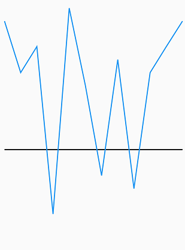
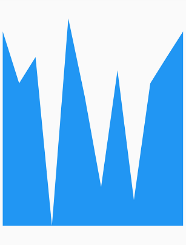
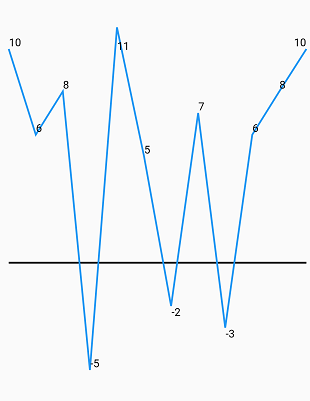
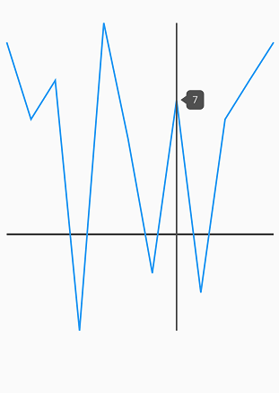

# Getting Started with Flutter Spark Chart

This section explains the steps required to populate the spark charts with data, data labels, and trackball. It covers only the minimal features needed to get started with spark charts.

## Add Flutter Spark charts to an application

Create a new Flutter project by following the instructions in the [Getting Started with your first Flutter app](https://docs.flutter.dev/get-started/test-drive#choose-your-ide) documentation.

**Add dependency**

Add the Syncfusion&reg; Flutter Charts package dependency to your pubspec.yaml file.


 

    dependencies:

    syncfusion_flutter_charts: ^xx.x.xx




> **NOTE** 
Here **xx.x.xx** denotes the current version of [`Syncfusion® Flutter Charts`](https://pub.dev/packages/syncfusion_flutter_charts/versions) package.

**Get packages**

Run the following command to get the required packages.


 

    $ flutter pub get




**Import package**

Import the following package in your Dart code.


 

    import 'package:syncfusion_flutter_charts/sparkcharts.dart';




## Initialize spark charts

Once the package has been imported, place the spark chart as a child of any widget. Here, as we are rendering a line chart, initialize [`SfSparkLineChart`](https://pub.dev/documentation/syncfusion_flutter_charts/latest/sparkcharts/SfSparkLineChart-class.html) as a child of the `Container` widget.


 

    @override
    Widget build(BuildContext context) {
        return Scaffold(
            body: Center(
                child: Container(
                    //Initialize the spark charts
                    child: SfSparkLineChart()
                )
            )
        );
    }




## Bind data source

Use the `data` property to bind data to the spark charts. This property accepts a list of numeric values.


 

    @override
    Widget build(BuildContext context) {
        return Scaffold(
            body: Center(
                child: Container(
                    //Initialize the spark line chart
                    child: SfSparkLineChart(
                        data: <double>[
                            10, 6, 8, -5, 11, 5, -2, 7, -3, 6, 8, 10
                        ]
                    )
                ),
            )
        );
    }




## Spark charts types

You can use the following widgets to create spark charts: [`SfSparkLineChart`](https://pub.dev/documentation/syncfusion_flutter_charts/latest/sparkcharts/SfSparkLineChart-class.html), [`SfSparkAreaChart`](https://pub.dev/documentation/syncfusion_flutter_charts/latest/sparkcharts/SfSparkAreaChart-class.html), [`SfSparkBarChart`](https://pub.dev/documentation/syncfusion_flutter_charts/latest/sparkcharts/SfSparkBarChart-class.html), or [`SfSparkWinLossChart`](https://pub.dev/documentation/syncfusion_flutter_charts/latest/sparkcharts/SfSparkWinLossChart-class.html).

In this example, the spark chart type is set to [`SfSparkAreaChart`](https://pub.dev/documentation/syncfusion_flutter_charts/latest/sparkcharts/SfSparkAreaChart-class.html).


 

    @override
    Widget build(BuildContext context) {
        return Scaffold(
            body: Center(
                child: Container(
                    //Initialize the spark area chart
                    child: SfSparkAreaChart(
                        axisLineWidth:0,
                         data: <double 0,
                        data: <double>[
                            10, 
                    )
                ),
            )
        );
    }




## Enable data labels

You can add data labels to improve chart readability by using the [`labelDisplayMode`](https://pub.dev/documentation/syncfusion_flutter_charts/latest/sparkcharts/SfSparkLineChart/labelDisplayMode.html) property.


 

    @override
    Widget build(BuildContext context) {
        return Scaffold(
            body: Center(
                child: Container(
                    //Initialize spark line chart
                    child: SfSparthe spark line chart
                    child: SfSparkLineChart(
                        //Enable data labels
                        labelDisplayMode: SparkChartLabelDisplayMode.all,
                        data: <double>[
                            10, 
                    )
                )
            )
        );
    }




## Enable trackball for spark chart

The spark charts display additional information through trackball when you tap a specific location in the chart area. You can enable the trackball by setting the [`trackball`](https://pub.dev/documentation/syncfusion_flutter_charts/latest/sparkcharts/SfSparkLineChart/trackball.html) property to [`SparkChartTrackball`](https://pub.dev/documentation/syncfusion_flutter_charts/latest/sparkcharts/SparkChartTrackball-class.html). Once it is activated, it appears in the UI and moves based on your touch movement until you stop touching the chart.

 

    @override
    Widget build(BuildContext context) {
        return Scaffold(
            body: Center(
                child: Container(
                    child: SfSparkLineChart(
                        //Enable trackball
                        trackball: SparkChartTrackball(
                            activationMode: SparkChartActivationMode.tap
                        ),
                        data: <double>[
                            10, 6, 8, -5, 11, 5, -2, 7, -3, 6, 8, 10
                        ]
                    )
                )
            )
        );
    }




