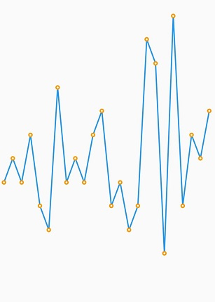
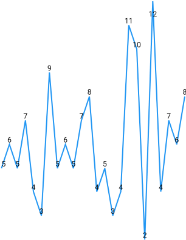

# Marker and data label in Flutter Spark Charts

## Marker

Markers are used to provide information about the exact point location. You can add a shape to adorn each data point. Using the [`marker`](https://pub.dev/documentation/syncfusion_flutter_charts/latest/sparkcharts/SparkChartMarker-class.html) property, add the markers to [`SfSparkLineChart`](https://pub.dev/documentation/syncfusion_flutter_charts/latest/sparkcharts/SfSparkLineChart-class.html), and [`SfSparkAreaChart`](https://pub.dev/documentation/syncfusion_flutter_charts/latest/sparkcharts/SfSparkAreaChart-class.html) widgets.

You can use the following properties to customize the appearance:

* [`displayMode`](https://pub.dev/documentation/syncfusion_flutter_charts/latest/sparkcharts/SparkChartMarker/displayMode.html) - Toggles the visibility of the marker. Defaults to [`SparkChartMarkerDisplayMode.none`](https://pub.dev/documentation/syncfusion_flutter_charts/latest/sparkcharts/SparkChartMarkerDisplayMode.html).
* [`borderWidth`](https://pub.dev/documentation/syncfusion_flutter_charts/latest/sparkcharts/SparkChartMarker/borderWidth.html) - Represents the border width of the marker.
* [`color`](https://pub.dev/documentation/syncfusion_flutter_charts/latest/sparkcharts/SparkChartMarker/color.html) - Represents the color of the marker.
* [`borderColor`](https://pub.dev/documentation/syncfusion_flutter_charts/latest/sparkcharts/SparkChartMarker/borderColor.html) - Represents the border color of the marker.


 

    @override
    Widget build(BuildContext context) {
      return Scaffold(
        body: Center(
          child: SfSparkLineChart(
            axisLineWidth: 0,
              marker: SparkChartMarker(
                borderColor: Colors.orange,
                borderWidth: 2,
                displayMode: SparkChartMarkerDisplayMode.all
              ),
              data: <double>[
                    5, 6, 5, 7, 4, 3, 9, 5, 6, 5, 7, 8, 4, 5, 3, 4, 11, 10, 2, 12, 4, 7, 6, 8
              ],
          )
        )
      );
    }



### Customizing marker shapes

Markers can be assigned with different shapes using the [`shape`](https://pub.dev/documentation/syncfusion_flutter_charts/latest/sparkcharts/SparkChartMarker/shape.html) property. By default, markers are rendered with circle shape. The shapes of markers are listed below.

* circle,
* diamond,
* square,
* triangle,
* invertedTriangle


 

    @override
    Widget build(BuildContext context) {
      return Scaffold(
        body: Center(
          child: SfSparkLineChart(
            axisLineWidth: 0,
            marker: SparkChartMarker(
              shape: SparkChartMarkerShape.square,
              displayMode: SparkChartMarkerDisplayMode.all
            ),
            data: <double>[
              5, 6, 5, 7, 4, 3, 9, 5, 6, 5, 7, 8, 4, 5, 3, 4, 11, 10, 2, 12, 4, 7, 6, 8
            ],
          )
        )
      );
    }



## Data label

Data labels are used to display values of data points to improve the readability.

### Enable data label

To enable data label for spark charts, use the [`labelDisplayMode`](https://pub.dev/documentation/syncfusion_flutter_charts/latest/sparkcharts/SfSparkLineChart/labelDisplayMode.html) property in spark charts widgets.

Following possible values are available in spark charts to render data label:

* [`SparkChartLabelDisplayMode.none`](https://pub.dev/documentation/syncfusion_flutter_charts/latest/sparkcharts/SparkChartLabelDisplayMode.html) - Does not allow to display data points on any side.
* [`SparkChartLabelDisplayMode.all`](https://pub.dev/documentation/syncfusion_flutter_charts/latest/sparkcharts/SparkChartLabelDisplayMode.html) - Allows to display data labels on all points.
* [`SparkChartLabelDisplayMode.high`](https://pub.dev/documentation/syncfusion_flutter_charts/latest/sparkcharts/SparkChartLabelDisplayMode.html) - Allows to display data labels on the high point.
* [`SparkChartLabelDisplayMode.low`](https://pub.dev/documentation/syncfusion_flutter_charts/latest/sparkcharts/SparkChartLabelDisplayMode.html) - Allows to display data labels on the low point.
* [`SparkChartLabelDisplayMode.last`](https://pub.dev/documentation/syncfusion_flutter_charts/latest/sparkcharts/SparkChartLabelDisplayMode.html) - Allows to display data labels on the last point.
* [`SparkChartLabelDisplayMode.first`](https://pub.dev/documentation/syncfusion_flutter_charts/latest/sparkcharts/SparkChartLabelDisplayMode.html) - Allows to display data labels on the first point.


 

    @override
    Widget build(BuildContext context) {
      return Scaffold(
        body: Center(
          child: SfSparkLineChart(
              axisLineWidth: 0,
              labelDisplayMode: SparkChartLabelDisplayMode.all,
              data: <double>[
                  5, 6, 5, 7, 4, 3, 9, 5, 6, 5, 7, 8, 4, 5, 3, 4, 11, 10, 2, 12, 4, 7, 6, 8
              ],
          )
        )
      );
    }



N> The [`SfSparkWinLossChart`](https://pub.dev/documentation/syncfusion_flutter_charts/latest/sparkcharts/SfSparkWinLossChart-class.html) widget doesn't provide data label support.