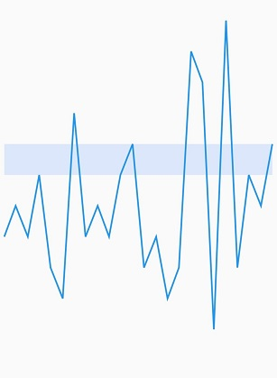

# Plot band in Flutter Spark Chart

This feature is used to highlight a particular region in spark charts along the Y axis.

The following properties are used to customize the appearance:
* [`start`](https://pub.dev/documentation/syncfusion_flutter_charts/latest/sparkcharts/SparkChartPlotBand/start.html) - Configures the start plot band value on the Y axis.
* [`end`](https://pub.dev/documentation/syncfusion_flutter_charts/latest/sparkcharts/SparkChartPlotBand/end.html) - Configures the end plot band value on the Y axis.
* [`color`](https://pub.dev/documentation/syncfusion_flutter_charts/latest/sparkcharts/SparkChartPlotBand/color.html) - Changes the plot band color.
* [`borderColor`](https://pub.dev/documentation/syncfusion_flutter_charts/latest/sparkcharts/SparkChartPlotBand/borderColor.html) - Changes the plot band border color.
* [`borderWidth`](https://pub.dev/documentation/syncfusion_flutter_charts/latest/sparkcharts/SparkChartPlotBand/borderWidth.html) - Changes the plot band border width.


 

    @override
    Widget build(BuildContext context) {
      return Scaffold(
        body: Center(
          child: SfSparkLineChart(
            axisLineWidth:0,
              plotBand: SparkChartPlotBand(start: 7, end: 8),
              data: <double>[
                  5, 6, 5, 7, 4, 3, 9, 5, 6, 5, 7, 8, 4, 5, 3, 4, 11, 10, 2, 12, 4, 7, 6, 8
              ],
          )
        )
      );
    }




