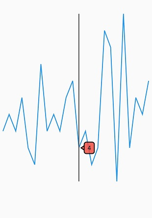

# Trackball in Flutter Spark Charts

Trackball feature displays the tooltip for the data points that are closer to the point where you touch on the chart area. This feature, especially can be used instead of data label feature when you cannot show data labels for all data points due to space constraint. This feature can be enabled using enable property of [`trackball`](https://pub.dev/documentation/syncfusion_flutter_charts/latest/sparkcharts/SfSparkLineChart/trackball.html). Trackball will be activated using [`activationMode`](https://pub.dev/documentation/syncfusion_flutter_charts/latest/sparkcharts/SparkChartTrackball/activationMode.html) property. Once it is activated, it will appear in the UI and move based on your touch movement until you stop touching on the chart.

You can use the following properties to customize the appearance:

* [`borderWidth`](https://pub.dev/documentation/syncfusion_flutter_charts/latest/sparkcharts/SparkChartTrackball/borderWidth.html) - Represent the border width.
* [`borderColor`](https://pub.dev/documentation/syncfusion_flutter_charts/latest/sparkcharts/SparkChartTrackball/borderColor.html) - Represent the border color.
* [`backgroundColor`](https://pub.dev/documentation/syncfusion_flutter_charts/latest/sparkcharts/SparkChartTrackball/backgroundColor.html) - Represent the background color for trackball.
* [`width`](https://pub.dev/documentation/syncfusion_flutter_charts/latest/sparkcharts/SparkChartTrackball/width.html) - Represent the width of trackball line.
* [`color`](https://pub.dev/documentation/syncfusion_flutter_charts/latest/sparkcharts/SparkChartTrackball/color.html) - Represent the color of trackball line.


 

    @override
    Widget build(BuildContext context) {
      return Scaffold(
        body: Center(
          child: SfSparkLineChart(
            axisLineWidth: 0,
            trackball: SparkChartTrackball(
              backgroundColor: Colors.red.withOpacity(0.8),
              borderColor: Colors.red.withOpacity(0.8),
              borderWidth: 2,
              color: Colors.red,
              labelStyle: TextStyle(color: Colors.black),
              activationMode: SparkChartActivationMode.tap
            ),
            marker: SparkChartMarker(
                      displayMode: SparkChartMarkerDisplayMode.all),
            data: <double>[
              5, 6, 5, 7, 4, 3, 9, 5, 6, 5, 7, 8, 4, 5, 3, 4, 11, 10, 2, 12, 4, 7, 6, 8
            ],
          )
        )
      );
    }




### Activation mode

The [`activationMode`](https://pub.dev/documentation/syncfusion_flutter_charts/latest/sparkcharts/SparkChartTrackball/activationMode.html) property is used to restrict the visibility of trackball based on the touch actions. The default value of this property is [`ActivationMode.tap`](https://pub.dev/documentation/syncfusion_flutter_charts/latest/sparkcharts/SparkChartActivationMode.html).

* [`ActivationMode.longPress`](https://pub.dev/documentation/syncfusion_flutter_charts/latest/sparkcharts/SparkChartActivationMode.html) - Activates trackball only when performing the long press action.
* [`ActivationMode.tap`](https://pub.dev/documentation/syncfusion_flutter_charts/latest/sparkcharts/SparkChartActivationMode.html) - Activates trackball only when performing tap action.
* [`ActivationMode.doubleTap`](https://pub.dev/documentation/syncfusion_flutter_charts/latest/sparkcharts/SparkChartActivationMode.html) - Activates trackball only when performing double tap action.


 

    @override
    Widget build(BuildContext context) {
      return Scaffold(
        body: Center(
          child: SfSparkAreaChart(
            trackball: SparkChartTrackball(
              activationMode: SparkChartActivationMode.doubleTap
            ),
            data: <double>[
              5, 6, 5, 7, 4, 3, 9, 5, 6, 5, 7, 8, 4, 5, 3, 4, 11, 10, 2, 12, 4, 7, 6, 8
            ],
          )
        )
      );
    }


