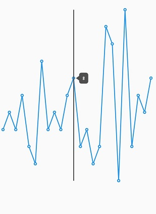

# Trackball in Flutter Spark Charts

Trackball displays tooltips for data points near the point where you touch the chart area. It can be used instead of data labels when you cannot show labels for all data points because of space constraints. This feature can be enabled using the [`trackball`](https://pub.dev/documentation/syncfusion_flutter_charts/latest/sparkcharts/SfSparkLineChart/trackball.html) property. Trackball is activated using the [`activationMode`](https://pub.dev/documentation/syncfusion_flutter_charts/latest/sparkcharts/SparkChartTrackball/activationMode.html) property. Once it is activated, it appears in the UI and moves based on your touch movement until you stop touching the chart.

You can use the following properties to customize the appearance:

* [`borderWidth`](https://pub.dev/documentation/syncfusion_flutter_charts/latest/sparkcharts/SparkChartTrackball/borderWidth.html) - Represents the border width.
* [`borderColor`](https://pub.dev/documentation/syncfusion_flutter_charts/latest/sparkcharts/SparkChartTrackball/borderColor.html) - Represents the border color.
* [`backgroundColor`](https://pub.dev/documentation/syncfusion_flutter_charts/latest/sparkcharts/SparkChartTrackball/backgroundColor.html) - Represents the background color for trackball.
* [`width`](https://pub.dev/documentation/syncfusion_flutter_charts/latest/sparkcharts/SparkChartTrackball/width.html) - Represents the width of trackball line.
* [`color`](https://pub.dev/documentation/syncfusion_flutter_charts/latest/sparkcharts/SparkChartTrackball/color.html) - Represents the color of trackball line.


 

    @override
    Widget build(BuildContext context) {
      return Scaffold(
        body: Center(
          child: SfSparkLineChart(
            axisLineWidth: 0,
            trackball: SparkChartTrackball(
              backgroundColor: Colors.red.withOpacity(0.8),
              borderColor: Colors.red.withOpacity(0.8),
              borderWidth: 2,
              color: Colors.red,
              labelStyle: TextStyle(color: Colors.black),
              activationMode: SparkChartActivationMode.tap
            ),
            marker: SparkChartMarker(
                      displayMode: SparkChartMarkerDisplayMode.all),
            data: <double>[
              5, 6, 5, 7, 4, 3, 9, 5, 6, 5, 7, 8, 4, 5, 3, 4, 11, 10, 2, 12, 4, 7, 6, 8
            ],
          )
        )
      );
    }




### Activation mode

The [`activationMode`](https://pub.dev/documentation/syncfusion_flutter_charts/latest/sparkcharts/SparkChartTrackball/activationMode.html) property is used to restrict the visibility of trackball based on the touch actions. The default value of this property is [`ActivationMode.tap`](https://pub.dev/documentation/syncfusion_flutter_charts/latest/sparkcharts/SparkChartActivationMode.html).

* [`ActivationMode.longPress`](https://pub.dev/documentation/syncfusion_flutter_charts/latest/sparkcharts/SparkChartActivationMode.html) - Activates trackball only when performing the long press action.
* [`ActivationMode.tap`](https://pub.dev/documentation/syncfusion_flutter_charts/latest/sparkcharts/SparkChartActivationMode.html) - Activates trackball only when performing tap action.
* [`ActivationMode.doubleTap`](https://pub.dev/documentation/syncfusion_flutter_charts/latest/sparkcharts/SparkChartActivationMode.html) - Activates trackball only when performing double tap action.


 

    @override
    Widget build(BuildContext context) {
      return Scaffold(
        body: Center(
          child: SfSparkAreaChart(
            trackball: SparkChartTrackball(
              activationMode: SparkChartActivationMode.doubleTap
            ),
            data: <double>[
              5, 6, 5, 7, 4, 3, 9, 5, 6, 5, 7, 8, 4, 5, 3, 4, 11, 10, 2, 12, 4, 7, 6, 8
            ],
          )
        )
      );
    }


