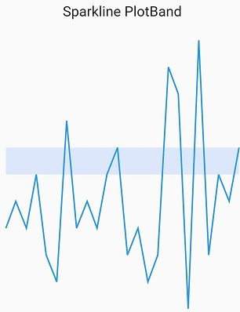

# Syncfusion Flutter Sparkline Plot Band 

This feature is used to highlight a particular region in the sparkline along Y axis.

The following properties are used to customize the appearances:
* [`start`]() - used to configure the start plot band value in Y axis.
* [`end`]() - used to configure the end plot band values in Y axis.
* [`color`]() - used to change the color for plot band.
* [`borderColor`]() - used to change the border color of plot band.
* [`borderWidth`]() - used to change the border width of plot band.

 

    @override
    Widget build(BuildContext context) {
      return Scaffold(
        body: Center(
          child:  SfSparkAreaChart(
                    plotBand: SparkChartPlotBand(start: 15, end: 25, borderColor: Colors.black,
                   borderWidth: 2),
                   data: <double>[10,6,8,-5,11,5,-2,7,-3,6,8,10],
               )
             )
           );
         }

    class SalesData {
    SalesData(this.month, this.sales);
    final String month;
    final double sales;
    }



